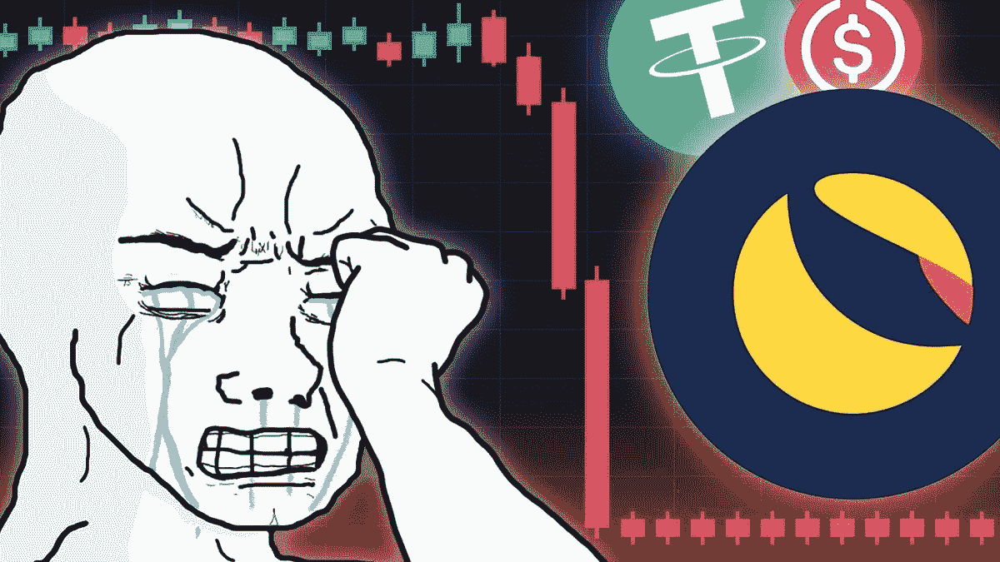
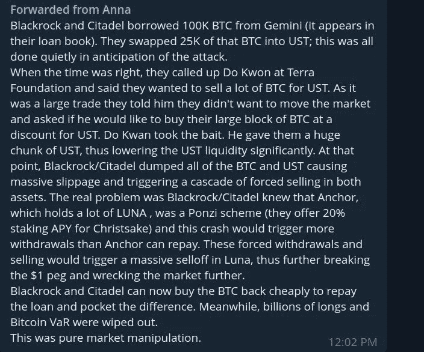
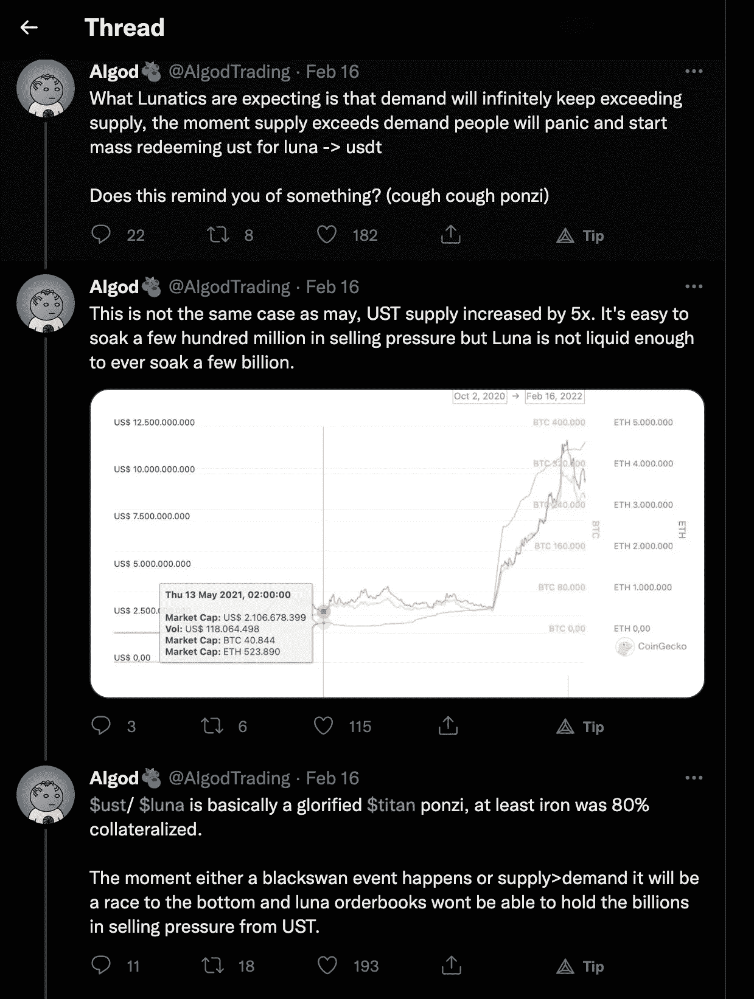
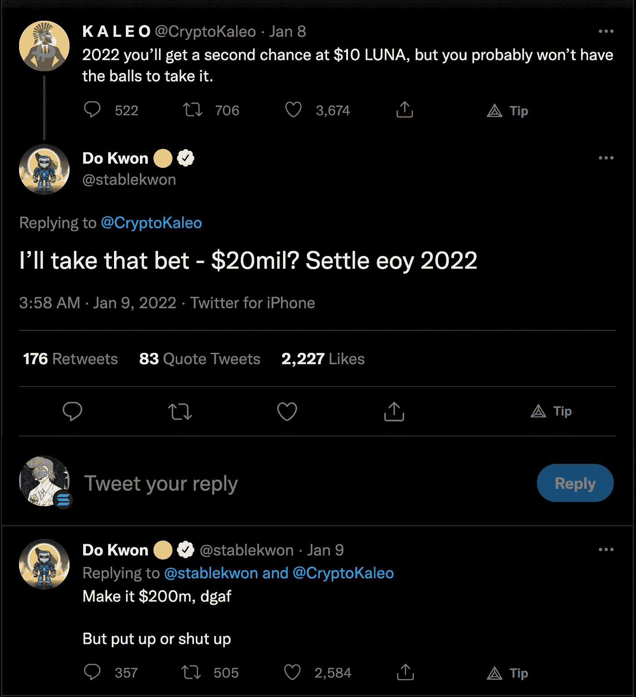

# 月神的恐怖&五月大屠杀。

> 原文：<https://medium.com/coinmonks/lunas-terror-the-massacre-of-may-ffa45d1d0757?source=collection_archive---------36----------------------->

我将把这作为一次令人清醒的市场经历的回顾。该死的考试。

在过去的一周里，Crypto 和 DeFi 驱逐了“游客”, LUNA 的数十亿市值被删除，Crypto 行业的恐惧指标创下了历史纪录。

我们先来看看:

刚刚发生了什么事？

一个本地的象征卢娜，居住着一个非常活跃的区块链基础设施生态系统爆炸了，可能已经死了。

**死因？**

还没有人知道，尽管有一些惊人的故事指向:

1.  Citadel…是的 *Citadel* (华尔街赌注的敌人/对冲基金)。
2.  黑石(对于某些故事来说，与 Citadel 合作……口碑就是这么做的)。
3.  一个做空的交易者，嗅到了机会。
4.  他们的创始人*道权*狂妄*。他真的敢让任何有数百万闲钱的人尝试打破 Twitter 上的钉住机制！*

我不觉得这个故事有趣，它破坏了生活，摧毁了一个伟大的项目，但它客观上很有趣。

**露娜和 UST，她们是什么？**

卢娜是另类硬币购买者的宠儿，这是有充分理由的。核心理念是革命性和狡猾。

作为卢娜和 UST 的结果，Terra 让每个人都能获得等值的美元——无论国籍、制裁或国内经济动荡。

作为一家公司，他们可以免受监管压力——因为他们持有 0 美元资产。

金钱在算法上逃脱了垄断控制。
私生子！

那么，Terra 是如何实现这一目标的呢？

他们用本地令牌 LUNA 建立了一个前 10 大市值和充满活力的 L1 生态系统。这种代币还有进一步的用途，作为与美元挂钩的稳定货币 UST 的抵押品。

**然后数学奇迹发生了:**

**A)** 如果 1 UST= 0.95 美元的价格，你可以向 Terra Smart 合约发送 1 UST，以从 LUNA 获得 1 美元。这*减少了*TerraSDR 的供应量，使其价值与美元持平。

**B)** 和预期一样，当 1 个 UST 的价格= 1.1 美元时，你可以向 Terra 的智能合约发送 1 个 UST 来接收 1.1 美元。这*增加了*UST 的供应量，从而将其价值稀释回与美元的平价。

在 Luna 及其生态系统的支持下，通过重新设计与美元的动态挂钩作为套利机会，Terra 可以保持与美元挂钩的稳定硬币价格*，而无需实际持有这些资产作为储备。*

这是一项了不起的工程，但一如既往，它被一个庞氏骗局毁掉了。

**庞氏元素。**

UST 需要领养来工作。如果没有足够多的投机者来固定联系汇率，它就会滑落，持有者会对他们的稳定硬币不稳定感到恐慌，并增加抛售压力。

因此，它承诺 20%的 APY 将硬币押在一个叫锚的协议上。

所以第一个问题来了。

如果他们减少赌注回报，大量持有人也可能会增加抛售压力，打破盯住汇率制度。

这个问题被道权认识到了。

**第二个问题。**

UST 的锚被支付 20%的 APY 作为 UST 的象征。如果 LUNA 的总市值相对于 UST 的总流通供应量下降，这就成了一个问题，这为银行挤兑创造了条件(因为不是每个人都可以为 LUNA 兑现他们的 UST)。

这个问题也是道权认识到的。

**他的回应:**

他购买了一种相对不稳定的资产——比特币作为储备——以在挂钩汇率下滑时推高挂钩汇率。俗话说，比特币打个喷嚏，所有的加密技术都会生病，结合他接下来的行动，这就是混乱发生的地方。

**第三个问题。**

不幸的是，他在推特上发布了这一措施…以及 BTC 持有的确切数量。道权有效地策划了抓捕 UST 所需的精确数量的弹药。

**胜负……**

宏观市场抛售后，BTC 抛售股票，道权在 BTC 的头寸损失了数百万。

卢娜更努力地跟进这次抛售(就像另类硬币一样)，聪明的钱和 UST 和卢娜的普遍抛售紧随其后。

随着对 BTC 和 UST 的做空兴趣削弱了跆拳道捍卫联系汇率的能力(相关资产比市场、BTC 和卢娜抛售得更厉害)，UST 最终崩溃，恐慌开始蔓延。

跆拳道通过焚烧 ust 增加了卢娜的供应量，疯狂地试图再次重新平衡联系汇率，但这除了使卢娜进一步贬值以外没有任何作用，因为信任在网络中消失了，逃离 UST 打破了它对 1 美元的控制。

**那么……有触发器吗？**

这里有一些我最喜欢的关于是什么导致了崩溃(熊市之外)的理论。

***“F * CK 你华尔街”理论:***

有趣的一个。

有趣的是，美国监管机构寻求推进稳定的硬币监管讨论的速度。

老实说，在这件事发生后看到耶伦的脸让我很不安。

Citadel 发表了一份公开声明，否认曾在 BTC 获得贷款，声称没有从事此类活动。

***跆拳道的狂妄***

显然这不是道权的第一个稳定币项目，最后一个以失败告终。

他在系绳的可持续性受到质疑期间的行为。

谣传 BTC 被用来帮助露娜鲸鱼以 1 美元的价格离开 UST。如果是真的，CZ 可能就是其中之一(币安 CEO)。

He deserves a follow folks.

If you had the balls to buy at 10…$0.00014 is your 10 dollars.

**结论**

1.  我认为 DeFi 收益率和赌注收益率的时代已经结束了。
2.  我认为美国的稳定硬币面临着严重的风险。监管环境是有害的，并且口头上想要比建设性更进一步。
3.  瑞士法郎？新加坡元？我认为 USDC 和中性货币将取代他们的位置，成为最常用的货币。
4.  哦，算法稳定-硬币可能不会在这里一段时间。

总之，这里有首诗！

*用密码皮条客——一巴掌打在了周身上，
又被耶伦这个偷袭者慢慢捅了一刀。*

*独自一人&楼惶然，
她无声地咆哮着！*

当丧钟响起的时候，她抬起头，她哭了。

*我请求你们，
年轻勇敢的小伙子们，
装备着人类的战略。*

还有比黑月更好的时机来伸出机会之手吗？

> 加入 Coinmonks [电报频道](https://t.me/coincodecap)和 [Youtube 频道](https://www.youtube.com/c/coinmonks/videos)了解加密交易和投资

# 另外，阅读

*   [折叠 App 回顾](https://coincodecap.com/fold-app-review) | [LocalBitcoins 回顾](/coinmonks/localbitcoins-review-6cc001c6ed56) | [Bybit vs 币安](https://coincodecap.com/bybit-binance-moonxbt)
*   [加密保证金交易交易所](/coinmonks/crypto-margin-trading-exchanges-428b1f7ad108) | [赚取比特币](/coinmonks/earn-bitcoin-6e8bd3c592d9) | [Mudrex 投资](https://coincodecap.com/mudrex-invest-review-the-best-way-to-invest-in-crypto)
*   [WazirX vs CoinDCX vs bit bns](/coinmonks/wazirx-vs-coindcx-vs-bitbns-149f4f19a2f1)|[block fi vs coin loan vs Nexo](/coinmonks/blockfi-vs-coinloan-vs-nexo-cb624635230d)
*   [比斯勒评论](https://coincodecap.com/bitsler-review)|[WazirX vs coin switch vs coin dcx](https://coincodecap.com/wazirx-vs-coinswitch-vs-coindcx)
*   [7 大副本交易平台](https://coincodecap.com/copy-trading-platforms) | [BuyCoins 审核](https://coincodecap.com/buycoins-review)
*   XT.COM 评论 | [币安评论](https://coincodecap.com/xt-com-review)