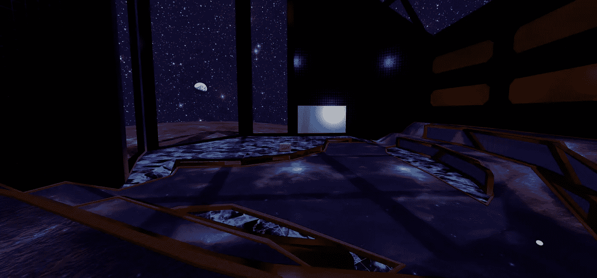

# Lunifty 发布

> 原文：<https://medium.com/coinmonks/lunifty-launches-83152887d578?source=collection_archive---------61----------------------->

## 但这并不意味着你必须等待。我们的画廊已经准备好探索。

Lunifty 是一个与艺术家和收藏家交流、参加活动或只是在月球上第一个虚拟美术馆闲逛的地方。

## 任务

建立一个在线虚拟艺术画廊，通过它我们将:

**教育**

**支持艺人**和

**主办赛事**

## 为什么是 NFTS？

NFTs 是一个价值数十亿美元的行业，在过去几年才开始在区块链行业之外受到欢迎。

**据估计，到 2021 年，NFT 产业将超过 410 亿美元**

**票房最高的 NFT 卖出了 9300 万英镑**

尽管 NFT 的业务有了巨大的增长，但对它们是什么以及它们如何工作的知识一直缺乏，特别是在北美，据估计大约 70%的美国人没有听说过非可替代代币或者不知道它们是什么。

在能够描述 NFT 的人群中，大部分人持否定态度，近 60%的人认为它们只是用于诈骗和洗钱。

## 我们这些艺术家却不这么认为。

我们利用 NFTS 在全球市场上销售我们的艺术品，而不用担心货币兑换、地区税费或运费。对我们来说，非技术创新提供了一种支持我们自己和我们持续创造力的必要途径。

自从不可替换的令牌出现以来，我们已经看到它们的多功能性迅速增加，从单纯的图像到:

**体育赛事和音乐会门票**

**元宇宙资产**

**数字艺术**

**书籍**

**摄影**

**音乐**

知名艺术家们正以 NFTS 的名义发行他们的专辑，以利用这个高度安全和开放的平台。

## **我们做了什么…**

NFTs 可以把你的艺术送到世界任何地方，但是文化呢？艺术展和活动是艺术和音乐文化的重要组成部分。它们是社区认识和了解他们所支持的人的一种方式，也是艺术家相互分享和学习的一种方式。

所以我们这样做了。我们建立了一个 3D 画廊，可以从世界上任何地方方便地访问，在那里我们展示艺术，播放音乐和举办活动。

## 我们是怎么做到的？

第一步是确保我们可以建造画廊。为此，在 [**Metahood**](http://metahood.ca/) 的 worldbuilders 提出了最好的建议:用 [**Mozilla Hubs**](https://hubs.mozilla.com/) 构建——这是一个开放的平台，捍卫隐私，并支持一个由艺术家、3D 建设者和用户组成的庞大社区，他们拥有令人难以置信的多功能技术。

在那里，3D 艺术家经过几个月的测试和反馈建立了画廊。最后，我们有了一个虚拟画廊，它针对最低的硬件和网络要求进行了优化。它很容易接近，而且看起来很棒。

50，000 个多边形可以满足超过一半的互联网用户的需求，他们将其减少到 23，000 个。他们继续尝试压缩和技术升级，以确保 Lunifty Gallery 始终尽可能对我们的社区开放。

## 接下来，艺术

在 Lunifty，我们认为每个艺术家都应该对他们的表现方式有发言权，因此每个委托和收购都是公开讨论的，并尊重创作过程。

我们发现，许多艺术家希望参与 NFTs，但教育障碍很大，如果你还没有加密货币，在世界许多地方都很难获得加密货币。

这是我们所代表的大多数艺术家的故事，他们都从自己的工作中获得了相当的报酬，获得了一部分销售额，并在创建自己的 NFT 个人资料方面获得了支持。这就是我们如何让 NFTS 变得更容易接近，并鼓励整个社区的发展。

## 我们能为你做些什么？

想探索吗？我们平台是免费的。你可以在 [Lunifty.io](http://www.lunifty.io/#page-welcome) 查看

想了解更多？我们的不和之门永远是敞开的。提出问题，分享您的想法，了解我们下一步的计划。

想用我们的空间吗？让我们知道。无论是活动、会议、集会还是举办您自己的艺术展，我们都很高兴与您合作。

你是一个想进入 NFTS 的艺术家吗？这就是我们在这里的目的。欢迎加入不和或在社交媒体上给我们发短信，我们会回答你可能有的任何问题。

## 未来

我们刚刚发射了月球，但这并不意味着我们的计划就此结束，我们已经在努力让我们的画廊进入 metaverses，并建立我们自己的 NFT 平台。

[**推特**](https://twitter.com/lunifty)[**不和**](https://discord.gg/PT3AYre37J)[**insta gram**](https://www.instagram.com/luniftyart/)