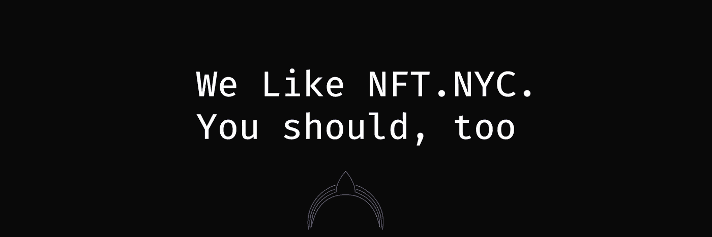

# 卢尼提❤ NFT。纽约市

> 原文：<https://medium.com/coinmonks/lunifty-nft-nyc-7cd624928bf2?source=collection_archive---------83----------------------->

# NFT 已经走了多远。

如果你在 NFT 空间，或者只是想了解更多；你需要去看看 NFT。今年六月在纽约举行的纽约会议。

NFT 是一种新的令人兴奋的方式来支持艺术家，购买门票，分享音乐和炫耀令人恶心的财富。

NFT。纽约是世界的灯塔，尽管有大量的负面报道，**“你可以截图的图片，哈哈”**在这里停留。

今年六月，社区成员将聚集在纽约参加第四版 NFT。纽约讨论所有不可替代的东西。与会者将有机会听到艺术家的声音，参加研讨会，并找出这个多头行业的发展方向。

这次会议与我们的心息息相关，因为他们的目标之一是“给社区一个声音”这也是我们想要的，在震耳欲聋的**“投资 NFTS”声中，我们不断呼喊着:**“NFT 的支持者”**相反，投资于人，投资于你的社区，投资于自主权。**

尽管我们想营造出良好的氛围，但地毯、哄抬价格和低质量高滞销的 NFT 的相关性将在 NFT 展出。因为教育很重要，所以纽约要平衡炒作的天平。被遗忘的历史将会重演。

重要的是这发生在北美，在那里我们需要尽快坐上加密列车。NFT 是一个价值数十亿美元的产业的一部分，该产业正在快速增长、传播并找到更多融入我们日常生活的方式。然而，北美正在落后，因为当其他国家监管加密货币并使其易于与国家货币整合时，我们却难以领先。我们的政府正在脱离一个可以为艺术家、音乐家和创作者提供更多财富和机会的行业。它们并没有完全阻挡我们，但是它们确实造成了使用上的障碍，导航起来很困难也很费时。

有一个数十亿美元的产业，但在 2021 年，大多数美国人无法描述一个 NFT，这是一个问题，我们希望 NFT。纽约市将帮助解决。

如果你有兴趣了解更多关于区块链的艺术或使用数字资产，那么请访问 NFT。今年六月在纽约市。他们支持艺术家，推出媒体，分享我们需要参与的技术教育。

了解 Lunifty 如何支持 NFT 地区的艺术家、教育和社区。

## [推特](https://twitter.com/lunifty)

## [不和谐](https://discord.gg/gAhRtjkAR3)

## [Instagram](https://www.instagram.com/luniftyart/)

[https://ca . news . Yahoo . com/only-20 of Americans-family-with-nf-ts-400 万-have-used-survey-165016231 . html](https://ca.news.yahoo.com/only-20-of-americans-familiar-with-nf-ts-4-million-have-used-survey-165016231.html)

【https://fortunly.com/statistics/nft-statistics/#gref 

[https://today . yougov . com/topics/technology/articles-reports/2021/03/18/theres-lot-NFT-hype-how-number-Americans-understand-](https://today.yougov.com/topics/technology/articles-reports/2021/03/18/theres-lot-nft-hype-how-many-americans-understand-)