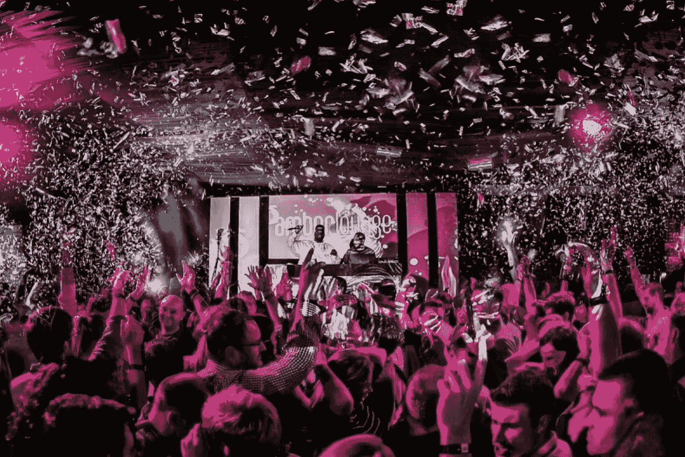

# 奢华生活品牌 Amber Lounge 对 NFTs 有了新的看法

> 原文：<https://medium.com/coinmonks/luxe-lifestyle-brand-amber-lounge-has-a-new-approach-to-nfts-ba925b6d7f89?source=collection_archive---------60----------------------->

NFT 已经成为加密货币行业最热门的高价趋势之一，吸引了来自著名运动员、音乐家和演员的广泛关注。随着高净值个人(HNWI)拥有超过 80 万亿美元的全球财富，对越来越多的精英产品的需求不断上升，这是快速发展的密码行业迅速涌入并抓住的机会。甚至像宝格丽、卡地亚、路易威登和普拉达这样的奢侈时尚品牌也开始涉足 NFT 市场，推出独特的收藏品。

一个高调的奢侈生活方式品牌正在将 NFTs 推向一个新的高度。 [Amber Lounge](https://amber-lounge.com/) 是一家标志性的豪华活动公司，因其在一级方程式赛车世界及其周边的迷人体验而闻名于世，该公司推出了专享的“Amber X”NFT VIP 会员资格，可终身参加世界各地的 Amber signature 活动。

> 交易新手？尝试[加密交易机器人](/coinmonks/crypto-trading-bot-c2ffce8acb2a)或[复制交易](/coinmonks/top-10-crypto-copy-trading-platforms-for-beginners-d0c37c7d698c)

Amber X NFTs 是第一个使用 NFT 代表贵宾会员资格的知名奢侈品牌。随着奢侈品市场价值超过 2428 亿美元，企业奢侈品活动市场现在价值 1525 亿美元，预计到 2030 年将达到 5261 亿美元，这显然是一个会员专属 VIP 俱乐部的健康市场，尤其是当现代创新可以增加附加值时。

**新 NFT 精英体验**

虽然 NFT 通常只代表区块链的数字图像所有权收据，但 Amber X NFTs 代表与只有受邀才能参加的独家俱乐部的终身联系，该俱乐部只有 1，888 个会员资格可供出售。NFT 持有者有机会参加一系列国际贵宾派对、时装秀和弹出式活动，与名人、亿万富翁和其他经常参加 Amber Lounge 活动的喷气式飞机乘客等有影响力的人接触——一些过去的“Amber 之友”包括名人理查德·布兰森、戈丹·拉姆齐、贾斯汀比伯、金·卡戴珊、帕米拉·安德森和凯莉·米洛，以及 F1 赛车手刘易斯·汉密尔顿和尼科·罗斯伯格，以及超模娜奥米·坎贝尔、约瑟芬·斯基弗、佩特拉·恩姆科瓦和维多利亚·希斯特德。

事实上，由于会员资格只接受邀请，NFT 持有者可以确信，参加聚会的将是他们可能想与之共饮的有影响力的人。

> Amber X 会员是引领潮流的个人专属俱乐部的一员。Amber Lounge 首席执行官 Cher Ng 表示:“NFT 代表会员身份的证明，永久存储在区块链上，会员可以高枕无忧，因为他们非常有价值的购买始终是安全的、可验证的和可检索的。“终身会员资格也可以很容易地、可验证地在以后赠予或交易给朋友。”

在可供出售的 1，888 个 NFT 会员资格中，只有 30 个“顶级”NFT 可以在琥珀活动中获得价值高达 3 万美元的 VIP 席位，以及 VIP 社交活动和私人晚宴的独家邀请。限量版设计师艺术香槟盒集也将提供给顶级会员，因为 NFT 下降琥珀休息室活动。

Amber Lounge 团队还为特殊赠品和影响者促销活动预留了 112 个 NFT。

Amber X NFTs 对刚接触加密领域的人也很友好。该平台设计有一个用户友好的界面，接受信用卡购买，并随时提供有用的指导。

Amber X 不仅仅是 NFT 会员:“我们很快就会在我们的活动中支持加密支付。我们还在安排与一些主要品牌和艺术家合作拍摄 NFT 宣传片，”ng 说。“我们坚信，NFT 技术将是奢华娱乐领域的未来，我们正在引领所有人的前进方向。”

自 2022 年以来，Amber Lounge 的主要股东现在是 [Catcha Group](https://www.catchagroup.com/) ，这是一家专注于媒体和技术领域成长型亚洲公司的国际投资公司。Catcha Group 此前曾帮助四家公司成功上市，还投资了其他私人控股的互联网初创公司。

[*来源*](https://techbullion.com/luxe-lifestyle-brand-amber-lounge-has-a-new-approach-to-nfts/)

> 加入 Coinmonks [电报频道](https://t.me/coincodecap)和 [Youtube 频道](https://www.youtube.com/c/coinmonks/videos)了解加密交易和投资

# 另外，阅读

*   [阿联酋 5 大最佳加密交易所](https://coincodecap.com/best-crypto-exchanges-in-uae) | [SimpleSwap 评论](https://coincodecap.com/simpleswap-review)
*   [购买 Dogecoin 的 7 种最佳方式](https://coincodecap.com/ways-to-buy-dogecoin) | [ZebPay 评论](https://coincodecap.com/zebpay-review)
*   [最佳期货交易信号](https://coincodecap.com/futures-trading-signals) | [流动性交易所评论](https://coincodecap.com/liquid-exchange-review)
*   [火币的加密交易信号](https://coincodecap.com/huobi-crypto-trading-signals) | [Swapzone 审查](/coinmonks/swapzone-review-crypto-exchange-data-aggregator-e0ad78e55ed7)
*   [最佳加密交易机器人](/coinmonks/crypto-trading-bot-c2ffce8acb2a) | [购买索拉纳](https://coincodecap.com/buy-solana) | [矩阵导出评论](https://coincodecap.com/matrixport-review)