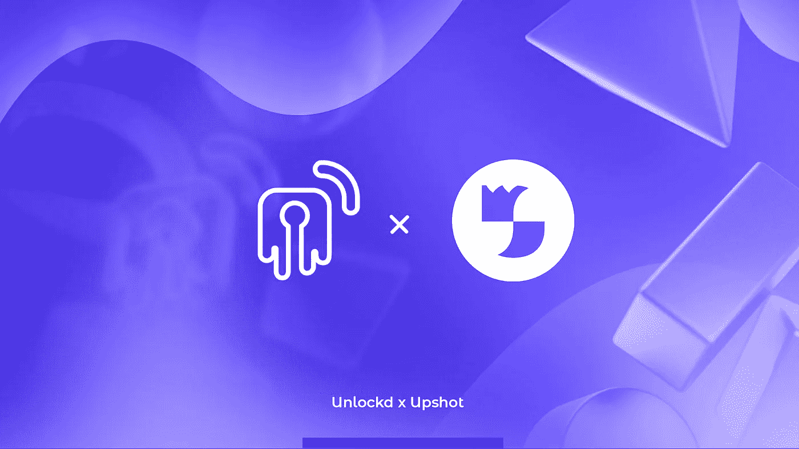

# 解锁 x 结果:NFT 抵押品的机器学习评估。

> 原文：<https://medium.com/coinmonks/machine-learning-appraisal-for-nft-collaterals-db5201ce705b?source=collection_archive---------14----------------------->

NFT 金融化的世界仍是未知领域，NFT 定价的发现将与 unlockded 等借贷市场的成功密切相关。

**Upshot 提供了对 NFT 市场的深刻见解**:他们的机器学习模型吸收历史销售数据和 NFT 元数据，根据这些信息构建特征，以生成准确、可靠的资产定价。他们通过检查未在训练过程中使用的数据的准确性来验证预测，并通过将他们的预测与实际销售价格进行比较来获得误差界限。

预测价格和误差范围为解锁的协议系统提供了关键信息，因为我们正在 NFT 经济之上建立一个 NFT 支持的借贷解决方案。

# 解锁 x 结果:我们评估的第一个算法部分

在申请 NFT 支持的贷款时，Unlockd 将把结果解决方案整合到资产的**评估流程中。它还将被整合到系统的永久数据馈送中，以便**跟踪抵押品的价格**，并计算其在任何给定时刻对借款人健康因素的影响。**

通过这种合作关系，Unlockd 开辟了一个新的信息渠道，使其评估系统更加强大，该系统已经包括来自 [Abacus(我们最近宣布的合作伙伴)](https://unlockd-finance.medium.com/unlockd-x-abacus-a-partnership-to-unlock-efficiency-in-nft-backed-loans-e944afa47bd7)的众包数据。在协议的整个开发过程中，Unlockd 将继续纳入来自 NFT 估价行业可靠和领先合作伙伴的数据源。

通过始终考虑多个评估师的不同定价，我们能够设计一个稳健的系统，最大限度地减少单点故障的发生。此外，随着价格数据不断更新并输入解锁的智能合约，我们的贷款可以按需即时提供。

为了执行这种算法，Unlockd 在得出最终资产定价时会考虑由 Upshot 和其他合作伙伴提供的**误差界限**。如果您对我们如何设计这一机制感兴趣，请继续关注— **即将发布的深入博客文章**。

Upshot 的系统已经过改进，以实现非常低的错误率，并具有很高的统计意义。这意味着所获得的评估来自大量的数据，并且通常是高度可靠的。得益于此，我们可以大幅提高我们的贷款价值比，尤其是蓝筹股收藏— **最大限度地提高收藏家、公会和 DeFi 用户的流动性**。

我们之前已经评论过[需要停止对 NFT 估值使用底价](https://unlockd-finance.medium.com/why-we-should-stop-using-floor-prices-to-appraise-nft-collections-3494de3d4d99)。Upshot 与这一理念高度一致，致力于为用户的 NFT 提供合理的价值。Unlockd 团队建立在对 NFT 文化和生态系统的坚定承诺之上，我们认为，正如 Upshot 所建议的那样，能够根据 traits 数据分析公平地评估 NFTs 是至关重要的。

# 探索 NFT 金融化模式的伙伴关系

Upshot 的估价方法与艺术或房地产估价在现实世界中的工作方式非常相似。传统市场通常依赖于更简单的线性模型，这些模型带有一组已知的预测变量，是通过几十年的研究和观察建立起来的——但我们没有加密的数据。

Upshot 将其大量研究工作集中在构建不同的预测变量上，使用自动化方法来揭示最重要的变量，并迭代以获得一个精简但强大的模型。

在解锁，我们分享这种方法:**研究，尝试，改进，重复**。

在这一开拓性领域的合作将使双方能够分享知识和对市场动态的见解。Unlockd 和 Upshot 认为，该行业的未来在很大程度上取决于评估市场并将其转化为可操作数据的有效而可靠的工具，因此 Unlockd 生态系统为收集反馈提供了完美的实时、大容量环境。

为此，Upshot 评论说，信息透明导致市场活动增加。在传统艺术界，根据 Artsy 的一份[报告:](http://files.artsy.net/documents/artsy_2019_onlineartcollectorreport.pdf)

> “当收藏家试图购买艺术品时，无法获得艺术品的价格是他们最常提到的障碍。”

Unlockd 坚信这同样适用于 NFT 市场，尤其是借贷市场，因此我们的愿景是建立一个稳健、透明的生态系统。

能够通过 Upshot 这样的协议分享我们的进展并学习他们的专业知识是了解市场并为贷款人和借款人设计**高效、安全的解决方案**的关键。

敬请关注两个社区即将推出的联合内容和活动！

**关于解锁**

Unlockd 是一个分散的跨链协议，为艺术、DeFi、元宇宙、现实世界和游戏提供民主化的 NFT 流动性和效用。

Unlockd 提供即时贷款，并实现无缝的跨链借贷，Unlockd 借款人可以通过 NFT 支持的贷款增加他们的财富，同时保持 100%的所有权津贴。

[**网站**](https://unlockd.finance/) **|** [**推特**](https://twitter.com/Unlockd_Finance) **|** [**不和**](http://discord.gg/unlockd) **|** [**电报**](http://t.me/unlockd_finance) **|** [**博客**](https://unlockd-finance.medium.com/)

> 加入 coin monks[Telegram group](https://t.me/joinchat/Trz8jaxd6xEsBI4p)学习加密交易和投资

**关于结果**

Upshot 是一个深入洞察 NFT 市场的平台，通过机器学习和众包评估开启了一波奇异的新定义可能性。

结果机器学习模型摄取历史销售数据和 NFT 元数据，根据这些信息构建特征，以生成准确、可靠的定价。

[**网站**](https://upshot.xyz/) **|** [**推特**](https://twitter.com/UpshotHQ) **|** [**不和**](https://discord.com/invite/upshot)**|****博客**