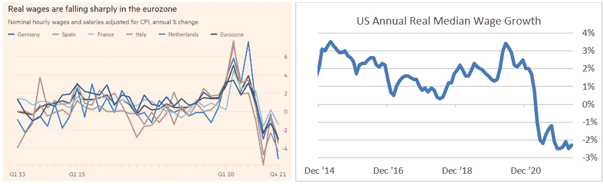

# 宏观思维和对加密的影响

> 原文：<https://medium.com/coinmonks/macro-thoughts-impact-on-crypto-2195d1b1670b?source=collection_archive---------3----------------------->

*我们在哪里，我们是如何到达这里的，我们下一步要去哪里*

通货膨胀。用一个词来定义过去 12 个月的市场反应，以及未来 12 年每个人都会关注的一个词。像日本这样的国家已经向往了 30 多年。近十年来，欧洲一直将它作为经济增长乏力的一个指标。然而，在 2022 年，这似乎是市场不可或缺的一件事。

我们经历了由 COVID 引起的供应冲击，而半导体、原材料和食品的全球短缺进一步加剧了这一冲击。我们之所以走到这一步，是因为货币和财政政策创造了需求增长，同时转向了 ESG，这导致了被压抑的储蓄、更高的工资以及全球基础设施的推动。在供应短缺和需求压力导致的通胀环境中，难怪杰罗姆·鲍威尔(Jerome Powell)在去年 8 月提出暂时性通胀时，我们许多人都不同意他的观点。难怪三个月后鲍威尔放弃“暂时”一词时，我们中的许多人都认为美联储落后于形势。但是伤害已经造成了。美联储行动太晚，市场开始失去信心，现在，在央行持续刺激造成的急剧通胀和二战以来欧洲最严重的大陆内部冲突之间，政策失误的可能性比以往任何时候都大。因此，下一次衰退的准备工作也是如此。我们必须记住，在发达经济体中，通常不是通胀导致衰退，而是央行政策失误。

那么，我们的政策立场如何？央行在过去几个季度变得更加鹰派，甚至在俄乌战争开始前就开始了。如今，在美国 8.3%、欧元区 7.4%、英国 9.0%的总体通胀背景下，央行比以往任何时候都更有压力减缓过去几年涌入市场的流动性之海。美联储的反应是在 3 月加息 25 个基点，5 月加息 50 个基点，并暗示在年底前再加息 100 个基点。欧洲央行已确认疫情紧急购买计划(PEEP)和资产购买计划(APP)的结束日期，并确认了今年晚些时候加息的预期。BOE 在过去两个季度已经四次加息，并承诺“确保长期通胀预期保持稳定”。

*Source: Bloomberg WIRP model as of 30/05/2022 *Model results should be used to determine directionality*

在这种背景下，市场做出了相应的反应。虽然风险资产在温和的通胀环境中表现良好，但在剧烈通胀时期往往表现不佳。虽然风险市场通常可以忍受加息环境，但当面对如此高的前端收益率预期时，它们不会做得很好。再加上战争，我们就有了一个表现不佳的风险市场，发达市场股票和全球高收益(未对冲)分别下跌了 12.6%和 10.1%，而大宗商品和实物房地产却出现了反弹——这是传统宏观剧本中的一页。

相应地，鉴于对加密领域的机构投资增加，我们已经看到许多加密市场出现了类似的情况。最近几个月，比特币和以太坊与纳斯达克 100 指数之间的相关性有所加强，大型加密技术之间的相关性也有所加强，很明显，加密技术目前的交易就像传统的风险资产一样，因为 macro 为相对表现奠定了基础。

*Source: Bloomberg, data as of 30/05/2022*

那么这对未来 crypto 的性能意味着什么呢？很难说。相对于不同时间点的传统资产，加密作为一种资产类别遵循双峰分布属性。所有这些都是说，有时它像一个宏观资产一样交易，有时它受基本面驱动，有时它只是想怎么交易就怎么交易。传统的加密货币链上分析(或者人们可以称之为“技术”)被视为周期评估的黄金标准，直到去年秋天它们被打破。随着我们进入一个 macro 占据领先地位、以太坊合并再次被推迟的市场环境，不难相信 cryptos 将继续像传统风险资产一样交易。因此，要理解近期的价格走势，人们必须关注传统风险市场，在那里，强劲的基本面和过高的估值之间正在展开一场战斗。

*Source: Bloomberg as of 30/05/2022\. Earnings and multiples are based on next twelve months, ex-dividends.*

“下一步是什么”，这是每个人心中的十亿美元的问题。通货膨胀、战争和中央银行政策会发生什么？有短期观点，也有长期观点。

短期而言，我希望美国和欧元区实际工资的负增长能够导致全球经济的自然通缩。更高价格的治疗方法通常是更高的价格，而当前的工资增长(不管名义增长有多高)实际上无法跟上通货膨胀。

*Source: FT, Eurostat, Refinitive, Bloomberg, Atlanta Fed*

随着实际工资持续下降并保持负值，以及随着消费者储蓄减少到低于趋势水平，消费者支出开始出现明显放缓。这还不包括 COVID 目前对中国零售活动的影响。

*Source: BLS, Bloomberg as of 30/05/2022*

随着需求侧通胀的减弱，不难看到核心供给侧通胀随着时间的推移而下降(这很重要，因为央行对供给侧通胀几乎没有控制力)。鉴于俄乌战争以及供应链上新的和挥之不去的中断，食品和能源行业将出现波动，但美联储的关注点更倾向于核心通胀(准确地说是 PCE 核心通胀)。看看 4 月份的 PCE 核心数据，我们已经可以看到一个缓慢的展期(主要由商品驱动)，并且自疫情开始以来的首次美国 GDP 负增长已经在册，我仍然希望美联储将在今年晚些时候暂停，以重新评估经济环境，并给通胀动力时间进行自我纠正。我们必须记住，尽管点阵图受到市场的关注，但美联储并不受其约束，将它们视为隐含的指导往往会将投资者引入歧途。

*Source: Bloomberg, Bureau of Labor Economics, Hanlon Research, FRED as of 30/05/2022*

尽管美联储的评论并没有描绘出软着陆的希望之光，但只要有足够的实用主义、耐心和精确性，美联储就可以驾驭软着陆。在这种情况下，风险资产将会反弹——在几个月的严重表现不佳后，对风险投资者来说是一个缓刑。

当然，这并不是市场和联邦基金期货所预期的情景。市场预计，到明年 2 月，联邦基金利率将再次上调 175 个基点，从现在起到那时，将多次加息 50 个基点，这表明风险资产将继续看跌，并可能以美联储主导的衰退告终。虽然我同意衰退风险很高，但时间会告诉我们最终会发生什么。然而，对于那些押注市场预期会实现的人来说，重要的是要记住，在加息的道路上，市场很少是正确的。

*Source: FRB, Bloomberg Finance LP, Deutsche Bank. Data as of 2020 — for historical illustrative purposes only.*

事实上，鉴于美联储最近的评论，我们已经看到较长期联邦基金目标范围的概率向下转移:

尽管如此，尽管我们需要考虑宏观环境中的积极因素，以及这对风险资产意味着什么，但我们也需要注意可能出现的问题。请继续关注下一篇关于我刚刚描述的场景会出什么问题以及从长远来看这对 crypto 最终意味着什么的文章。

> 加入 Coinmonks [电报频道](https://t.me/coincodecap)和 [Youtube 频道](https://www.youtube.com/c/coinmonks/videos)了解加密交易和投资

# 另外，阅读

*   [Blockfi vs 比特币基地](https://coincodecap.com/blockfi-vs-coinbase) | [BitKan 点评](https://coincodecap.com/bitkan-review) | [Bexplus 点评](https://coincodecap.com/bexplus-review)
*   [南非的加密交易所](https://coincodecap.com/crypto-exchanges-in-south-africa) | [BitMEX 加密信号](https://coincodecap.com/bitmex-crypto-signals)
*   [MoonXBT 副本交易](https://coincodecap.com/moonxbt-copy-trading) | [阿联酋的加密钱包](https://coincodecap.com/crypto-wallets-in-uae)
*   [雷米塔诺审查](https://coincodecap.com/remitano-review)|[1 英寸协议指南](https://coincodecap.com/1inch)
*   [iTop VPN 审查](https://coincodecap.com/itop-vpn-review) | [曼陀罗交易所审查](https://coincodecap.com/mandala-exchange-review)
*   [40 个最佳电报频道](https://coincodecap.com/best-telegram-channels) | [喜美元评论](https://coincodecap.com/hi-dollar-review)