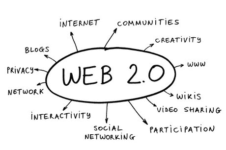

# Web2.0 和 Web3.0 的主要区别

> 原文：<https://medium.com/coinmonks/major-difference-between-web2-and-web3-c0eb3b848f02?source=collection_archive---------19----------------------->

在我开始之前，我想澄清一下，他们的互联网百科全书并没有得到全球技术研究所确认的 web 3.0 的实际定义。相反，我会给你一个关于什么是 web 1.0，什么是 web 2.0 的宽泛定义，然后解释一下很多人称为 web 3.0 的新现象。先说 Web 1.0。

# Web 1.0

蒂姆·伯纳斯·李开发了术语“Web 1.0”来指代“只读”网站。这是第一代万维网，从 1989 年持续到 2005 年。

互联网用户只是阅读提供给他们的材料。它不像我们今天所知的互联网那样生动活泼，参与性强。网站的基本目标是让每个人都可以获得材料，并建立一个在线存在。在这些时间里，没有登录或与帖子或视频互动，甚至没有观看指标。它就像一个巨大的维基百科，所有的链接都在一起。在这些时期，人们只使用互联网来消费信息。

以下是 Web 1.0 的主要特征:

*   他们只有只读材料。
*   建立网上形象，让任何人在任何时候都可以访问他们的信息。
*   它包含静态网页，并使用基本的超文本标记语言。

# Web 2.0

Web 2.0 始于 2004 年，延续至今。在这段时间里，网络发生了巨大的变化，但最重要的变化之一是互联网的交互性。

这意味着我们不仅从网上获取信息，而且网络也从我们这里获取信息。当我们使用脸书、YouTube、谷歌和其他集中化的公司时，他们开始收集我们的数据，以便提供更好的内容，这反过来使我们在他们的平台上停留更长时间，这意味着他们可以赚更多的钱。Web 2.0 是定向广告和缺乏用户隐私的时代。公平地说，我们自愿放弃我们的隐私来换取像脸书和推特这样的酷应用。因为页面取决于谁在查看它。在 web 2.0 中，你和我都可以访问[*【facebook.com】*](http://facebook.com)并看到两个非常不同的新闻源，这是 web 3 中的一个重要区别，我们稍后将讨论。当你查看你的 feed 上的内容时，该公司正在根据你知道你给了他们的信息对数据进行排序，例如喜欢和你看了多长时间的视频，但当你查看他们向你展示的广告时，他们正在根据你不知道你给了他们的信息对数据进行排序。例如，我记得我告诉一个朋友我想买一个手表，然后我打开 Instagram，我在我的 feed 上看到的第一个广告是一个销售手表的在线商店的广告。不管是什么情况，让一个集中的公司控制所有这些数据，不管我们是否希望，都是非常令人担忧的。

以下是 Web 2.0 的主要特征:

*   我们鼓励并邀请用户贡献内容，而不仅仅是阅读已经存在的内容。
*   大众分类法:一种对信息进行分类的方法，例如通过标记照片、网站或链接；标记允许用户以更有组织的方式查找信息。
*   用户的参与:有助于用户和网站所有者之间的信息流动(例如，维基百科允许用户创建新页面和编辑现有页面以保持信息最新)

# Web 3.0

正如我之前所说的，web 3.0 还没有完全实现，因此没有明确的定义。Web 3.0 渴望成为一个开放、智能和去中心化的互联网(也称为去中心化 Web)

Web 3.0 是互联网的下一次发展，它很可能使用区块链技术和去中心化工具。当你在 2.0 中浏览社交网络时，你是产品，但在 web 3.0 中，一些人认为你将是你的材料(你在网上发布的东西)的所有者。

这里有一个 web 3 如何成为现实的例子。Minds 是一家总部位于区块链的公司，是脸书的替代品。Minds 提供了与脸书相同的功能，例如创建博客、视频、频道和群组的能力，但没有审查制度。头脑没有广告；相反，该平台是在贡献的基础上运行的，以保持用户体验。Minds chat 是加密的，所以当局无法监听你的通信。与 Reddit 类似，你可以投票支持你想看的内容，投票反对你不想看的内容。整个网站免费使用。Minds 基于区块链技术，用户通过其在 BTC、以太坊和美元的追随者获得内容奖励。

想想尼日利亚的 Twitter 禁令:如果 Twitter 必须像 minds 一样成为一个去中心化的社交网络，政府将无法阻止或阻止人们使用该平台分享内容，因为内容不会托管在一台服务器上，而是托管在世界各地的数千台计算机上，从而确保区块链的社交网络不会被锁定或阻止。

专家预测，到 web 3.0，互联网将会发展到这样一个地步，即每个公司都由一个分散的团体管理，这个团体被称为分散自治组织(DAO)。阿道是没有 CEO 的公司。那些拥有最多代币的人决定公司如何改变，不受政府的限制。

# 最后

我相信 web 3.0 对我们的暗示是，在未来十年，你可以用 Metamask 和以太坊支付网飞订阅费，或者用你的秘密钱包之一匿名喜欢/评论一条推文；这不会一下子改变生活。它很可能是一个概念的集合，共同发展，直到像脸书和谷歌这样的集中式网络被立法机构拆除，并被分散、不受控制的 Dao 所取代。

有关如何构建真实世界的区块链应用程序的免费培训和实习，请参见下面列出的网站。

1.  https://blockgames.gg/他们提供为期 8 周的课程，在课程中，你将学习如何为最受欢迎的区块链进行创作，与他人竞争建设最好的项目，并获得解决问题的技能。
2.  https://nestcoin.com/[他们建造、运营和投资简单的产品，让加密货币更容易被大众接受。](https://nestcoin.com/)
3.  【https://zuri.team/】Zuri 团队在建立由高技能、知识渊博的员工组成的全球网络方面取得了巨大成功，这些员工可以帮助贵公司实现关键任务项目和目标。