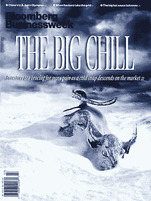
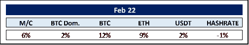
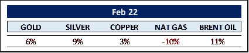
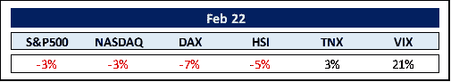
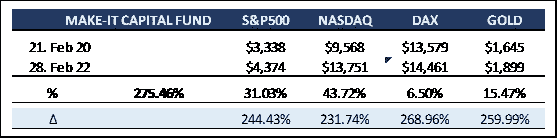

# Make-it 资本版#20

> 原文：<https://medium.com/coinmonks/make-it-capital-edition-20-76dfacd664d1?source=collection_archive---------82----------------------->

**我们在 2022 年 2 月看到的世界**

**加密货币的世界**

彭博出版社在俄国入侵乌克兰的大约一个月前将《冰冻的公牛》作为主角，这看起来很有先见之明。毕竟，任何残存的看涨情绪都会立即转化为冰，给全球股票和密码市场带来重大损失。

不过，这种连败至少在 2 月 28 日结束了，因为比特币每日 14.5%的涨幅帮助它在本月收盘时上涨了 12%，再次超过了以太坊(ETH)。

分析师认为，乌克兰和俄罗斯的短期挤压和需求增加是推动价格上涨的催化剂。

好像预见到了西方迫在眉睫的金融制裁，俄罗斯于 2 月 9 日选择将其作为一种货币形式进行监管，从而有效地使加密合法化。这是一个相当大的举动，因为俄罗斯居民(甚至是制裁实施前的*)拥有超过 1200 万个加密货币账户，总价值为 280 亿美元。而且，从哈希率来看，俄罗斯是世界第三大比特币开采国。乌克兰紧随其后，将加密货币合法化。鉴于当前和未来的地缘政治危机，比特币显然正被重新视为一种抗审查的资产类别。*

同样引起我们注意的是稳定的硬币越来越重要。总市值从一年前的 500 亿美元增至 1800 亿美元。我们注意到，曾经无处不在的稳定币绳(USDT)现在只占总价值的 50%。circle/比特币基地的 USDC 公司和 Pax OS/币安的 BUSD 公司的市场份额都在迅速增长，今年都增长了 25%。

最后但同样重要的是，Meta/脸书以 1 . 82 亿美元的价格将所有与其 stablecoin Diem 相关的技术和资产出售给了其合作伙伴 Silvergate Bank。看看 Silvergate，一家公开交易的加密第一银行，计划如何处理这次收购，将会很有趣。

**商品世界**

尽管美元货币指数走强，但黄金和白银都大幅升值。它们似乎正在重获各自作为避险资产类别的地位。

油价继续飙升，今年以来上涨了 26%。不过这可能会改变。目前，地球上一些最大的石油储备被切断。委内瑞拉是最大的石油供应国，由于美国的制裁，该国被禁止向海外运输石油。第四大石油供应国伊朗也遭遇了类似的命运。

为了抑制进一步的通货膨胀，白宫已经让伊朗政府重新参与核协议谈判。拜登政府最近恢复了对伊朗的制裁豁免，这将允许国际核合作项目。这些都是恢复 2015 年核协议的前兆。这一改变将允许伊朗再次向世界其他国家出售石油。

在新政权建立之前，委内瑞拉的形势不会改变。然而，自疫情经济低迷以来一直靠边站的美国钻井商，很可能会利用油价上涨的机会增加产量。

然而，天然气价格的下跌令人费解，再加上 1 月份 31%的飙升，每月 10%的下跌幅度可能只是部分获利回吐的原因。鉴于地缘政治紧张局势，我们预计近期/中期内天然气价格不会大幅下降。

**其余的……**

以恐惧指标 VIX 为代表的市场波动性再次大幅上升，在 2022 年的前两个月飙升了 75%。难怪所有主要股票指数都处于红色区域。今年 1 月，股市下跌主要是因为投资者担心，为了对抗并非短暂的通胀，中国将上调利率。二月增加了流氓和血腥的权力游戏。我们在这里不涉及政治，但是，我们想评论一下国际中央银行潜在的鹰派行为及其对股票市场的直接影响。

对于利率上升和股价下跌之间的直接关联，存在着巨大的误解。当研究之前的上涨时期及其对股市的直接影响时，人们只能得出这样的结论:即使在鹰派环境下，市场也表现良好。一旦央行停止加息，大崩盘就会发生。不惧雄鹰，警惕高原。这是我们在大碰撞前看到的。

就拿标准普尔 500 从 2000 年 9 月初到 2002 年 10 月底下跌 46%来说吧。面对汹涌的网络热潮，美联储在 1999 年年中开始加息约一年。尽管如此，标准普尔 500 指数还是在 2000 年 9 月创下新高——就在跌落众所周知的悬崖之前(*在美联储停止加息*之后)。同样，从 2007 年底到 2008 年底，标准普尔 500 指数下跌了一半。美联储从 2004 年年中到 2006 年年中提高了利率。然后，利率在当年下半年稳定下来。那一次，标准普尔 500 指数在进入螺旋式下降之前还有大约一年的时间。不过，它只是在达到利率平台后才下跌。

另一个关键指标是收益率曲线(10 年期和 2 年期国债之间的利差)。当短期债券利率高于长期债券利率时，通常会出现衰退。现在，我们还没有一个相反的情况。然而，收益率曲线明显变平*(利差从年初的 78 个基点下降到 40 个基点*)——这是由短期利率上升引起的，而不是长期利率下降。这种情况被称为**拍马屁者**。人们认为通胀将会上升，因此短期债券的集中反映了美联储的加息。

尽管如此，**穆罕默德·埃里安**认为俄罗斯的入侵完全取消了 3 月加息 50 个基点的设想。此外，今年也不会像预测的那样加息 9-10 次。所有这些对股票和密码市场来说应该是非常宽松的。

毕竟，有一句老话:“当 VIX 高企时，是买入的时候了”。

**MAKE-IT 资本基金(本基金)**

该基金由 Make-It Singapore 运营，由 Make-It New Zealand 管理。作为区块链/加密货币综合投资组合的独特对冲基金，该基金让投资者只需一项投资即可参与区块链世界的完整生态圈。该基金始终以精确的资产净值交易，并对机构投资者和合格投资者开放。

该基金的主要目标是通过降低风险和波动性来实现资本保全。这是通过采用我们专有的 5 支柱战略实现的。

该基金在 2 月份回归绿色牧场，此前面临一些更严峻的阻力，加密货币的价值在过去 3 至 4 个月内损失了 1.4 万亿美元。有助于缓解痛苦的是我们较低的波动性和持续的市场表现。

据**潘迪拉资本**称，最近的一些加密抛售压力可能只是与纳税义务有关。毕竟，去年创造了约 1.5 万亿美元的资本利得，为秘密投资者提供了意料之外的税单。

尽管仍缺乏监管框架，但加密世界已成为国际资本市场上吸引机构投资者的一股力量。因此，**贝莱德**将很快向其客户提供加密货币交易——其中包括公共养老金计划、捐赠基金和主权财富基金，总 AUM 为 10 万亿美元**。这项服务将通过公司的 Aladdin(“资产、负债、债务和衍生品投资网络”的简称)平台提供。此外，最近有消息称，Citadel**(*【2 万亿美元】*)和 State Street**(*管理着 3.9 万亿美元，托管和管理着 43.3 万亿美元*)即将介入。**

机构投资者正成为加密资产的最大投资者。根据《华尔街日报》的一份报告，2021 年，机构投资者在比特币基地的交易额为 1.14 万亿美元，而 2020 年仅为 1200 亿美元。在没有上述新发展的情况下，机构需求增长了近 10 倍。

除了这个好消息之外，随着更加用户友好的 web3 应用程序、NFT 爆炸和元宇宙及其所有影响的出现，采用率大幅增加。

总而言之，我们对整个加密生态系统，尤其是 Make-It 资本基金的未来仍然非常乐观。

感谢您的时间和关注。

真诚地

菲利普·冯·戈特伯格

> *加入 Coinmonks* [*电报频道*](https://t.me/coincodecap) *和* [*Youtube 频道*](https://www.youtube.com/c/coinmonks/videos) *了解加密交易和投资*

# 另外，阅读

*   [有哪些交易信号？](https://coincodecap.com/trading-signal) | [Bitstamp vs 比特币基地](https://coincodecap.com/bitstamp-coinbase) | [买索拉纳](https://coincodecap.com/buy-solana)
*   [ProfitFarmers 点评](https://coincodecap.com/profitfarmers-review) | [如何使用 Cornix 交易机器人](https://coincodecap.com/cornix-trading-bot)
*   [十大最佳加密货币博客](https://coincodecap.com/best-cryptocurrency-blogs) | [YouHodler 评论](https://coincodecap.com/youhodler-review)
*   [my constant Review](https://coincodecap.com/myconstant-review)|[8 款最佳摇摆交易机器人](https://coincodecap.com/best-swing-trading-bots)
*   [MXC 交易所评论](/coinmonks/mxc-exchange-review-3af0ec1cba8c) | [Pionex vs 币安](https://coincodecap.com/pionex-vs-binance) | [Pionex 套利机器人](https://coincodecap.com/pionex-arbitrage-bot)