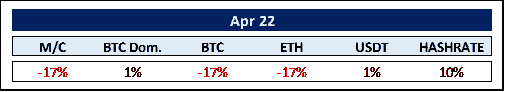
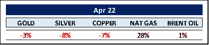
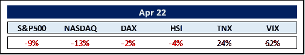
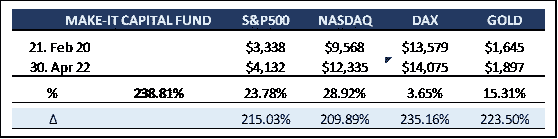

# Make-It 资本版#22

> 原文：<https://medium.com/coinmonks/make-it-capital-edition-22-ee223a8924f4?source=collection_archive---------61----------------------->

**我们在 2022 年 4 月看到的世界**

**加密货币的世界**

尽管比特币从 69，045 美元的历史高点下跌了 45%，但令人惊讶的是，它似乎仍处于积累阶段。图表触及更高的低点。此外，根据数字资产管理公司 **CoinShares** 的数据，尽管加密价格下降，今年比特币投资产品仍有 2 . 18 亿美元流入。此外，70%的比特币(1900 万中的 1350 万*)是长期持有的，即强手持有(6 个月)。谷歌趋势对比特币的最新查询已降至 17，为 2020 年年中以来的最低水平(*低于大约一年前的 70)*。看来，新的和经验不足的散户投资者可能已经离开舞台，为机构需求引领的下一轮上涨腾出空间。毕竟，套用 **Pomp** ，又名 **Anthony Pompliano** 的话，“比特币是解决 21 世纪问题的 21 世纪资产；是互联网的轻资产储备资产”。*

被称为下一代互联网的**元宇宙**通常指专注于社交联系的 3D 虚拟世界网络的概念。

最近在元宇宙举行的时装秀吸引了多达 10 万人参加，打破了之前 5 万人参加音乐会的记录。标志性品牌，如汤米·席尔菲格、帕科·拉巴尼、T21、杜尔西、加巴纳等都是这一历史事件的一部分。

元宇宙是一种时尚吗？在我们看来，肯定不是。相反，潘多拉的盒子似乎刚刚被打开。全球品牌都在急切地建立自己的虚拟形象。甚至**万事达卡**现在也加入了 **Visa** 和**美国运通**申请 15 个元宇宙和不可替代代币(NFTs)相关商标的行列。尽管仍处于非常早期的阶段，参与这个平行现实的诞生是最令人着迷的。

元宇宙是由非金融资产推动的，这些资产注定会自行演变成一种无所不在的资产类别，甚至在任何超金融资产之外。以全球企业资产负债表上持有的 65 万亿美元无形资产为例。现在想象一下，利用 NFT 将这些转化为有形资产。真令人兴奋。

**商品世界**

莫斯科兑现了停止向拒绝以卢布结算天然气供应的国家供应天然气的威胁，推动天然气价格今年上涨近两倍。首先受到冲击的国家是波兰和保加利亚。似乎主要源于俄罗斯入侵的能源波动将继续成为全球经济的担忧来源。

关于工业金属，一些人开始认为目前的状况是周期性的，类似于信贷危机后的反弹。从 2009 年初开始，商品价格在三年内从低迷的水平回升到新高。随后，随着美国和欧洲实施平衡预算措施，货币条件收紧。随着货币条件收紧，美元走强，大宗商品价格见顶，随后经历了接下来五年的熊市。支持这一观点的是铜价今年甚至一直在下跌。鉴于美元接近本周期的新高，我们会看到类似的发展吗？

更严重的问题似乎与全球食品供应有关。毕竟，俄罗斯和乌克兰生产了 32%的大麦、30%的小麦和 17%的玉米出口。这种供应不足可能会被“发达”世界吞噬，尽管价格上涨，但需求保证了供应。然而，较贫穷的国家已经严重感受到冲击。与 2004 年相比，联合国食品价格指数已经上涨了近 150%,仅在过去两年中，价格指数就上涨了约 60%。最糟糕的是，看不到快速适应的解决方案。

**其余的……**

受到 8.5%的官方通胀水平、各国央行宣布大幅提高利率的威胁以及东欧战争的打击，全球股指继续下跌，风险更高的资产跌幅最大。

说到通货膨胀；不相信官方数字，前**比特币基地**首席技术官**巴拉吉·斯里尼瓦桑**提出了一个 10 万美元的挑战，以建立一个抗审查的通货膨胀饲料。根据获胜者 **Truflation** 的说法，基于来自 oracle **Chainlink** 的实时数据，更准确的数字目前为 12.0% ( *略低于最高的 YTD 13.1%*)。

美联储(*连同其他央行*)正处于一个严重的困境。通常情况下，为了控制通货膨胀，它必须大幅提高利率。而这恰恰是被采纳的说辞。但如果是这样，股票、债券和住房市场都将崩溃。在 11 月 8 日美国中期选举之前，美联储会将它的威胁贯彻到底吗？在美国政府支持率创下新低的情况下，尽管美联储是“独立的”，但它真的会实施目前的说法吗？毕竟，套用**沃伦巴菲特**的话，“利率对于资产价格就像重力对于苹果一样”，更低的资产价格不会赢得选票。

美联储和我们其他人一样清楚，加息无助于增加石油供应、消除港口拥堵或提高农作物产量。此外，美国和欧洲的货币供应增长(*现金、硬币和银行存款余额*)都急剧放缓。货币增长放缓意味着通货膨胀会自动逐渐下降，不需要中央银行的强力挤压。

相反，美联储可能会通过支持**缩减**，即逆转量化宽松——出售而不是购买政府长期债务，来集中精力降低通货膨胀。然而，谁是潜在的购买者呢？俄罗斯、中国甚至沙特阿拉伯都不再购买了。

联邦债务总额现在是 GDP 的 123%。美国商业银行已经持有价值超过 4.5 万亿美元的美国国债，即政府债务。美联储会暂停商业银行的杠杆率，允许它们购买更多的政府债券吗？我们倾向于这样认为。这种暂停会给金融体系带来什么后果？外面一天比一天阴暗。

**MAKE-IT 资本基金(本基金)**

该基金由 Make-It Singapore 运营，由 Make-It New Zealand 管理。作为一个综合区块链/加密投资组合的独特对冲基金，该基金使投资者能够通过一次投资参与整个区块链生态圈。该基金始终以精确的资产净值( *NAV* )进行交易，并向机构投资者和合格投资者开放。

该基金的主要目标是在不牺牲业绩的情况下，通过降低固有的波动性来实现资本保全。这是通过采用其专有的 5 支柱战略实现的。

基金再次显示了其有利的风险状况，其衡量标准是最高提款权大大降低，同时仍优于市场。我们增加了市场中性收益率和套利策略的比例，以在这一漫长的“无聊的区间价格波动”阶段实现利润最大化。

让我们对中期未来充满信心的是对区块链/加密领域的风险资本分配的惊人增长。因此，仅在 Q1 2022 年，就有 125 亿美元的投资者基金在区块链找到了新家。这比 Q1 2021 年增加了 322%，比 Q1 2020 年增加了 1570%。这太神奇了。

作为进一步采用的标志， **Fidelity Investments** 计划允许投资者在其 401(k)计划中包括一个比特币账户，这是第一个这样做的主要退休计划提供商。不甘示弱，**高盛**宣布将接受比特币作为贷款抵押。

而**中非共和国**成为继**萨尔瓦多**之后第二个接受比特币作为法定货币的国家。人们可以猜测，还会有更多的人效仿。**巴西**有人吗？

我们生活在一个火热的环境中，然而，未来似乎是光明的。

感谢您的时间和关注。

真诚地

菲利普·冯·戈特伯格

> 加入 Coinmonks [电报频道](https://t.me/coincodecap)和 [Youtube 频道](https://www.youtube.com/c/coinmonks/videos)了解加密交易和投资

# 另外，阅读

*   [折叠 App 审核](https://coincodecap.com/fold-app-review) | [Kucoin 交易机器人](/coinmonks/kucoin-trading-bot-automate-your-trades-8cf0ca2138e0) | [Probit 审核](https://coincodecap.com/probit-review)
*   [如何匿名购买比特币](https://coincodecap.com/buy-bitcoin-anonymously) | [比特币现金钱包](https://coincodecap.com/bitcoin-cash-wallets)
*   [币安 vs FTX](https://coincodecap.com/binance-vs-ftx) | [最佳(索尔)索拉纳钱包](https://coincodecap.com/solana-wallets)
*   [比诺莫评论](https://coincodecap.com/binomo-review) | [斯多葛派 vs 3Commas vs TradeSanta](https://coincodecap.com/stoic-vs-3commas-vs-tradesanta)
*   [Capital.com 评论](https://coincodecap.com/capital-com-review) | [香港的加密借贷平台](https://coincodecap.com/crypto-lending-hong-kong)