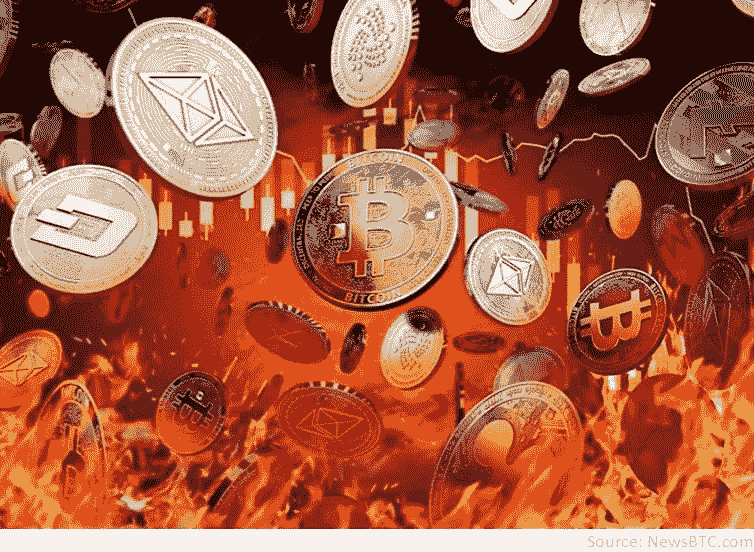
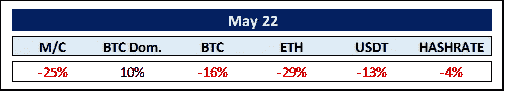
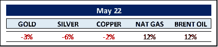
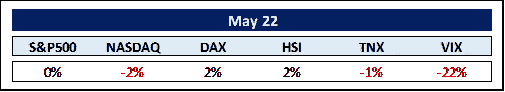
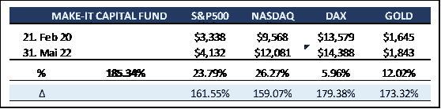

# Make-it 资本版#23

> 原文：<https://medium.com/coinmonks/make-it-capital-edition-23-a566cc8515b2?source=collection_archive---------72----------------------->

**我们在 2022 年 5 月看到的世界**

**加密货币的世界**

我们正处于一个隐秘的熊市吗？毕竟，以比特币为代表的市场已经从 2021 年 11 月 10 日的历史高点 69044.77 美元下跌了近 60%！这意味着比特币有史以来最长的连续 8 周连续下跌。此外，考虑到比特币在过去 5 年中再次出现 83%、62%、53%和 62%的贬值*(最近一次*)。

然而，如果一个人在 5 年前买了比特币，尽管有各种噪音，他仍然会上涨 1600%。在传统市场中，熊市通常指的是在普遍悲观和投资者情绪消极的情况下，股价从近期高点下跌 20%或更多。

然而，鉴于加密市场固有的波动性，我们需要应用不同的指标。也许我们可以从技术分析中得到线索。其中，熊市被描述为图表在不同的时间框架内触及更低的低点。作为对 Terra / Luna 惨败的反应，比特币图表刚刚显示了这一点——更低的低点。所以，回答我们的第一个问题:是的，crypto 正处于熊市。

然而，根据 **CoinShares** 的说法，尽管前景黯淡，加密市场仍处于积累阶段。因此，今年比特币投资产品的流入量为 1.65 亿美元，而所有加密资产的流入量为 3.1 亿美元。这些数字比 2022 年初有所下降，但保持得相对较好。

此外，当分析链上数据时，我们可以得出，老钱包和鲸鱼钱包，即强手，不是在卖，而是在买。出售是由更年轻的钱包，也许是第一次被严重烧伤。

虽然总市值在一个月内暴跌 25%或 4400 亿美元(*年初至今:-40%或 8650 亿美元*)，但比特币再次被视为最安全的资产。虽然当月减少了 16%，但比特币的市场主导地位又增加了 10%，达到 46%(ETH 主导地位下降了 4%)。5 月份，ETH 经历了一个糟糕的月份，损失了 29%或 940 亿美元。这似乎是因为在以太坊的信标链上检测到的一个问题(*从工作证明转移到利害关系证明的测试链*)，该问题可能会延迟合并*(最终通过取消采矿减少使用 99%的能源*)。发生了什么事？根据核心以太坊开发者 Preston Van Loon 的说法，测试网络遇到了“更新与过时客户端软件的不小的分割”。这吓坏了投资者，引发了 1.57 亿美元的强制平仓，给 ETH 价格水平带来了沉重负担。鉴于合并是加密市场即将到来的唯一一个大的牛市里程碑之一，延迟的前景已经拖累了整个加密市场。

最大的稳定币**系链** (USDT)见证了 USDT 对菲亚特美元、USDC 和 BUSD 的重大赎回，作为对 Terra 的算法稳定币 UST ( *在 5 月*损失了相当于 180 亿美元)内爆的反应。好消息是泰瑟毫不畏惧地度过了风暴。其流通供应量下降 13%相当于约 110 亿美元。

USDT 持有者似乎在自愿轮换成为监管确定性更高的稳定资本( ***圈的*** *USDC 和* ***帕克斯****【BUSD】*)，这一过程有可能(如果不太可能的话)继续下去。假设 Tether 有足够的美元让 USDT 持有者套现(*看起来是这样*，那么 USDT 的衰落将是一个缓慢的安全过渡，而不是银行挤兑。这对整个市场来说确实是个好消息。Tether 本身宣布，它打算减少公司债务抵押品，转而支持政府债务和美元。与此同时，Tehter 的首席技术官 Paolo Ardoino 宣布推出墨西哥比索支持的稳定币。

当被问及**墨西哥**采用比特币作为法定货币的前景时(*在一名墨西哥参议员提出根据萨尔瓦多的比特币法律*创建加密法规的想法后)，他断言他“看好许多国家迟早需要(接受)比特币的情况。”稍后会详细介绍。

**商品世界**

大宗商品领域最大的新闻显然是欧洲禁止进口 90%的俄罗斯石油。占供应量 10%的管道仍可使用。中国缓慢开放由 Covid 引发的关闭的大城市，增加了需求，从而导致能源价格的又一次飙升，这加强了这一点。今年以来，天然气和布伦特原油价格分别上涨了 118%和 55%。

在过去的几天里，原油期货跌破每桶 113 美元，此前沙特阿拉伯暗示，如果俄罗斯在欧盟制裁后产量下降，它准备增产。《金融时报》援引一位外交消息人士的话称，沙特阿拉伯和阿联酋正在讨论立即增加石油产量。

随着 2022 年煤炭价格上涨 240%，煤炭显然正在经历一场意想不到的复苏。在金属市场，明显的异常值是锂，年涨幅为 426%，而铁矿石下跌了约 31%。农产品价格继续飙升，小麦、棕榈油和燕麦价格分别上涨了 54%、55%和 62%。

黄金/白银比率已经达到 85，这是历史上非常高的。受近期美元疲软的提振，黄金走势良好。因此，要么黄金将不得不下跌，要么白银需要升值，以使这一广受关注的比率逆转至其历史均值。

世界各国央行持有的 12.1 万亿美元储备中，有 59%是美元。这比上世纪 90 年代的 71%有所下降。11 个国家使用美元作为官方货币，而超过 65 个国家的货币与美元挂钩。美元在世界经济产出中的份额从 1960 年的 40%下降到去年的 24%。然而，除了最近几周之外，美元一直受到追捧，被视为避险资产，对欧元升值了约 5.75%。这种趋势会持续下去吗？美元走强对黄金和比特币等“避险资产”产生了负面影响。

**其余的……**

标准普尔 500 迎来了自 1952 年以来第二糟糕的开局，该指数在短暂跌入熊市后下跌了 17.3%。好消息是，标准普尔 500 在接下来的 12 个月中值涨幅为 19.4%。

这是纳斯达克历史上第九次下跌 25%或更多，可追溯到 20 世纪 70 年代。目前，该指数已较去年 11 月的峰值下跌逾 27%。

市场仍然担心迄今难以想象的债务水平、飙升的通货膨胀、东欧战争和供应链问题的四重影响。

然而，正如波动性降低(*下跌 22%* )所显示的那样，市场可能正处于好转的转折点。与其他国家相反，中国甚至将 5 年期贷款最优惠利率下调至 4.45%。此外，副总理刘鹤最近表示，政府将支持数字经济公司的发展和上市。这可能标志着中国科技巨头的监管风险进一步减轻。

关于通货膨胀，美联储首选的通货膨胀指标，核心 PCE 价格指数(*不包括食品和能源价格)*，4 月份比一年前上涨了 4.9%。这一增长符合预期，反映出较 3 月份报告的 5.2%有所放缓，这是第二个月价格涨幅较低，并强化了通胀可能已经见顶的观点。

除此之外，公司创造的就业机会放缓至疫情时代复苏的最慢速度，私营部门就业人数本月仅增加 12.8 万人，远低于 29.9 万人的共识。就业创造的放缓可能会让美联储更加放心，并且符合美联储的“软着陆”情景，这对股市应该是积极的。市场似乎已经消化了今年 2 倍 50 个基点的加薪，任何不足之处都将产生积极影响。

我们仍然相信，美联储不会像前美联储主席保罗·沃尔克(Paul Volcker)在 20 世纪 70 年代末和 80 年代初将利率提高到创纪录水平那样，让美国经济面临“沃尔克时刻”。

以 30 年期固定抵押贷款利率为例，该利率在过去两周实际上大幅下降。美联储无法控制 30 年期固定利率，特别是当它停止购买抵押贷款支持证券时，所以这是令人鼓舞的。

尽管**收益率差**正在恢复，接近 2021 年 12 月的水平，但我们仍可能面临衰退。无论如何，自 1950 年以来，美国已经承受了 11 次此类经济收缩的冲击。其中八次持续时间不到一年，股市在此期间也不一定会暴跌，平均跌幅仅为 5%。

经济总是会起起落落。然而，衰退总会发生，投资者总是应该有长远的眼光。这对一个人的神经系统和底线更好(*见上面提到的比特币在过去 5 年里 1600%的收益*)。

**MAKE-IT 资本基金(本基金)**

该基金由 Make-It Singapore 运营，由 Make-It New Zealand 管理。作为区块链/加密货币综合投资组合的独特对冲基金，该基金让投资者只需一项投资即可参与区块链世界的完整生态圈。该基金始终以精确的资产净值交易，并对机构投资者和合格投资者开放。

该基金的主要目标是通过降低风险和波动性来实现资本保全。这是通过采用我们专有的 5 支柱战略实现的。

尽管显然没有完全摆脱加密市场的动荡，但在过去 12 个月里，该基金的表现仍超过基准比特币两位数的百分点，同时表现出明显更低的波动性。对冲和多样化之间存在微妙的界限，同时又不影响最终结果。一旦市场转向，过多的对冲和多样化会很快让你落后。我们在过去目睹了这种 180 度大转弯发生的速度有多快。尽管如此，基金管理团队仍然非常满意，因为我们再次锁定了两个世界的最佳状态:更低的波动性和更好的表现。

尽管已经进入熊市，但我们的长期前景好得不能再好了。

一方面，我们有越来越多的国家考虑让比特币成为各自生态系统中的法定货币。**萨尔瓦多**总统 **Nayib Bukele** 会见了来自 32 家中央银行和 12 家金融机构的代表，即匹配 44 名代表(与 1944 年**布雷顿森林**会议相同)讨论“金融包容性、数字经济、无银行账户者(*仍有 17 亿人或 22%的世界人口*)、比特币的推出及其好处”。记住，萨尔瓦多在 2021 年 6 月成为第一个接受比特币作为法定货币的国家。政府采用比特币是为了对抗恶性通货膨胀，减少对美元的依赖。有趣的是，**国际货币基金组织** (IMF)已经向萨尔瓦多提供了更多的信贷额度，然而，前提是它废除其比特币政策。嗯。

此外，瑞士央行**表示，未来可能会将比特币加入其资产负债表。**巴拉圭**打算成为比特币开采中心，如上所述，墨西哥也在考虑将比特币纳入其金融系统。因此，这似乎不是央行是否购买比特币的问题，而是央行何时购买比特币的问题。**

另一方面，我们不能不提到**a16z**(*安德森·霍洛维茨*)新的 45 亿美元大规模加密基金(继 2018 年的 3 亿美元、2020 年的 5.15 亿美元和 2021 年的 22 亿美元之后的第四次)。作为拥有自己全新的 5 亿美元基金的币安，a16z 将专注于 Web3.0 投资。你可能会问什么是 Web3.0？

嗯，Web1.0 是上世纪 90 年代由蒂姆·伯纳斯·李和 T21 等人开发的早期互联网。它也被称为只读的静态网页(引入了 HTML、URL 和 HTTP 的网页)。Web2.0 大约出现在 2005 年。这个网络版本改进为读写功能，也被称为**社交网络。它见证了脸书、Youtube、Twitter 等网站的崛起。相反，Web3.0 可以被称为读写自有网络。Tim Bernes-Lee 称之为语义网。Web3.0 的后端本质上应该是跨节点去中心化的，并且是无权限的，允许区块链强制个人拥有各自的私有数据。**

**Fabric Ventures** 提供了一个有用的定义:Web3.0 创造了一个未来，在这个未来，分布式用户和机器能够通过对等网络的底层与数据、价值和其他对等物进行交互，而不需要第三方。结果是:“下一波网络的可组合的以人为中心的隐私保护计算结构”。

总而言之，我们从一开始就对未来的机遇充满期待。例如，毕竟以太坊上的地址数量相当于 1995 年互联网用户的数量，而增长速度是互联网普及速度的两倍。如果我们用一段时间内互联网用户的趋势作为参考，区块链行业可以预计在这十年内用户数量至少会增长 100 倍。不是未来十年。

最后，我们想引用 **Philipp Rickenbacher，**瑞士**Julius br Group AG**(*瑞士第三大银行，仅次于* ***UBS*** *和* ***瑞士信贷银行*** ):“很可能就在此刻，我们正在见证一个密码行业的泡沫破裂时刻，我们都知道网络泡沫之后发生了什么它为一个确实改变了我们生活的新领域的出现铺平了道路；我相信数字资产和分散金融也有同样的潜力”。

我们完全同意。

感谢您的时间和关注。

真诚地

菲利普·冯·戈特伯格

> 加入 Coinmonks [电报频道](https://t.me/coincodecap)和 [Youtube 频道](https://www.youtube.com/c/coinmonks/videos)了解加密交易和投资

# 另外，阅读

*   [分散交易所](https://coincodecap.com/what-are-decentralized-exchanges) | [比特 FIP](https://coincodecap.com/bitbns-fip) | [宾邦评论](https://coincodecap.com/bingbon-review)
*   [用信用卡购买密码的 10 个最佳地点](https://coincodecap.com/buy-crypto-with-credit-card)
*   [加拿大最佳加密交易机器人](https://coincodecap.com/5-best-crypto-trading-bots-in-canada) | [Bybit vs 币安](https://coincodecap.com/bybit-binance-moonxbt)
*   [阿联酋 5 大最佳加密交易所](https://coincodecap.com/best-crypto-exchanges-in-uae) | [SimpleSwap 评论](https://coincodecap.com/simpleswap-review)
*   购买 Dogecoin 的 7 种最佳方式 | [ZebPay 评论](https://coincodecap.com/zebpay-review)
*   [最佳期货交易信号](https://coincodecap.com/futures-trading-signals) | [期交所评论](https://coincodecap.com/liquid-exchange-review)
*   [用于 Huobi 的加密交易信号](https://coincodecap.com/huobi-crypto-trading-signals) | [Swapzone 审查](/coinmonks/swapzone-review-crypto-exchange-data-aggregator-e0ad78e55ed7)