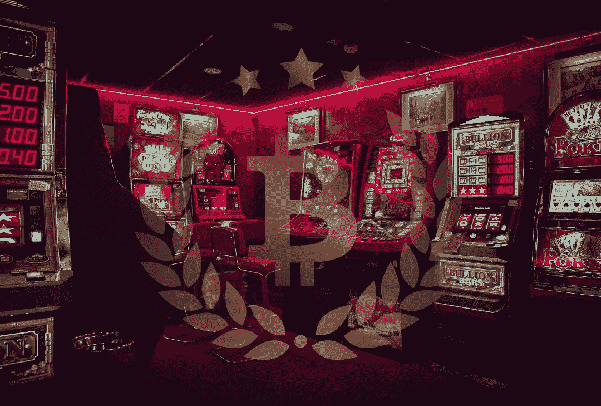

# 用 1000 美元获得 10 倍的加密收益，没有杠杆作用

> 原文：<https://medium.com/coinmonks/make-money-in-crypto-with-1000-and-no-leverage-4b369bd4a1d9?source=collection_archive---------2----------------------->

随着 DeFi 革命的到来，用密码赚钱不仅仅是交易或持有。现在你可以像银行一样赚钱了。

Image: PixTeller

> 被称为商业的赌博以严峻的冷眼看待被称为赌博的生意——比尔斯，A·

# 快速加密货币

我认为许多投资者将加密视为快速致富的途径。这很有可能。但是有可能吗？大概不会。数字对你不利。

大约有 17000 个加密项目在网上流传。每天都可能增加十几个。在这些项目中，可能有 1700 个是可行的。从那 1700，也许 80 到 90 有潜力让你变得富有。

这意味着你有大约 1/200 的机会找到赢家。更难的是当它起飞的时候你必须抓住它。听起来很容易，但由于所有的噪音、波动、错误信号、恐惧、贪婪、焦虑和其他一切，不可能预测。

尽管对许多人来说，这些可能性仍然很大。当然，比在汉堡王工作更有可能变得富有。但是如果你一开始就没有钱呢？

# 分散金融

我要坦率地说，我将要描述的是一个荒谬的[高风险](/coinmonks/crypto-risk-management-to-vc-or-not-to-vc-60dc3682a857)策略。我不是财务顾问，我绝对不建议你尝试这样做。你很容易失去你投资的每一分钱。我对此 100%认真。

如果你是一个真的很难在经济上获得成功的人，我在这里教的东西有望:

1.向你展示一种你*或许*能够打破这种循环的方式；和

2.向你展示富人如何利用资产赚钱

使这一战略成为可能的是加密分散金融(DeFi)的出现。我将在接下来的几周中更详细地介绍 DeFi。目前，简短的版本是:DeFi 是加密投资者获得半被动收入的一种方式。

让加密空间独一无二的是创新的速度。正如我之前提到的，有数以千计的加密项目。每天都有新的出现。它们的生存都依赖于一个至关重要的因素:流动性。

流动性如何运作以及风险在上面的链接文章中有详细介绍。我强烈建议您在开始投资 crypto 之前阅读这篇文章。然而，没有流动性，一个加密项目是死在水中。

一旦代币变得*缺乏流动性，它对持有者就没有价值了。只是某处电脑上的几行代码。如果流动性被耗尽，你仍然有你的代币，你只是不能在任何地方出售它们。*

*像以太坊和比特币这样的主要项目拥有大量的流动性。但新代币往往难以创造足够的交易流动性。为了激励人们提供流动性，这些项目提供奖励。*

*如果一个代币有很多流动性，回报通常很小，比如 3-4%的年收益率(APY)。但是如果一个项目真的很小，或者不为人知，这些回报会高得惊人。我见过有的项目收益率高达 3000%。*

*尽管这是一把双刃剑。大量的这些项目将利用这些高 APYs 来吸引投资者，然后窃取流动性。这就是所谓的[退出骗局](https://www.investopedia.com/tech/whats-cryptocurrency-exit-scam-how-spot-one/)，或[地毯拉](https://coinmarketcap.com/alexandria/glossary/rug-pull)。*

*甚至那些看起来合法并且已经存在了一段时间的项目也做了些手脚。最近的一些项目，像[乌贼游戏](https://www.bbc.com/news/business-59129466)很容易马上被发现是欺诈。其他像 SushiSwap 这样的就不太容易看到了。*

# *没有球，没有比特币*

*如果你有额外的 100，000 美元，你可以使用更安全的 DeFi 策略，这将给你带来相当可观的回报。我说的可靠，是指类似于你从投资股票中可能得到的东西。但是对于一些人来说，即使只有 1000 美元也是一场斗争。*

*如果你是那样的人，有时掷骰子是值得的。我在这里描述的肯定比在街角卖毒品安全。这也比每月将 100 美元存入 401k 账户风险更大。但是如果成功的话，你可能会比 401k 或者卖药的人赚更多的钱。*

*最终，目标应该是让你有足够的钱开始通过产生被动收入的低风险资产积累财富。到达那里需要:耐心、时间和储蓄；意外之财(如遗产)；或者冒险。*

*在我们开始之前，请注意，我将要讨论的项目和相关收益可能不会持续很长时间。如果你决定尝试这个，只要知道继续下去，迟早你会需要找到其他项目来赌一把。每一个新项目，风险只会增加。*

*提醒你一下，这不安全。你可能会失去你投入的每一分钱。不建议你尝试。如果你决定尝试，一定要做自己的研究，不要头脑发热。*

# *幽灵*

*Fantom 是一个区块链项目，我对此非常感兴趣，并进行投资。它的市值(mcap)对总价值锁定(TVL)是[真的很低](https://defillama.com/chain/Fantom)。对我来说，这是一个强有力的指标，因为大量资金正在流入，但市场似乎还没有反映在价格中。*

*Fantom 的一个真正好处是，有许多 DeFi 平台在流动性供应方面提供了非常惊人的回报。我将在这里讨论两个:[坟墓金融](https://tomb.com/)和[3mb 金融](https://3omb.finance/)。这两个都“住”在范顿区块链号上。*

*我真的很喜欢这一对，因为它在加密方面相当独特。坟墓背后的想法是它在算法上与 FTM 配对，所以它们的价格(理论上)应该一起移动。如果它继续像宣传的那样工作，这确实降低了[非永久性损失](/coinmonks/crypto-101-liquidity-pools-and-impermanent-loss-feb297ce5fba)的风险。*

*坟墓目前提供 94%的 APY，用于标记坟墓/FTM 对，但它以 TSHARES(坟墓财务治理令牌)支付。有了这些 TSHARE 奖励，你就可以转身下注，获得 1179%的 APY。可笑吧？*

*如果以每日复利计算，1000 美元的初始投资在一年后将价值 1940 美元，仅来自坟墓/FTM 对。如果你每天存入 TSHARE 奖励，除此之外你还有 6990 美元。你不会因此退休，但这是一个好的开始。*

*假设一年后这些收益仍然存在(它们可能不会存在了)，你再做一次，你会有:从 1000 美元的坟墓/FTM 对中再获得 940 美元，加上从复合 TSHARES 中获得 95，396 美元。这是假设 FTM 的价格保持不变，但我很有信心它今年会上涨。*

*关键是，我们现在谈论的是真正的钱。不幸的是，这些收益可能不会持续太久。正如我上面提到的，目前大量流动性正涌入 FTM。流动性多=(道)收益率少。*

*然而，如果你真的想提高风险/回报比，你可以试试 3mb。这是盗墓金融链条的一个分叉。需要澄清的是，坟墓的创始人在记录中称 3OMB 是一个骗局，是一场蓄谋已久的骗局。*

*两个项目也(显然)[接吻和好了](https://harryyeh.medium.com/accountability-in-defi-and-the-tomb-ecosystem-goes-both-ways-344238703b24)。我不确定该相信谁。似乎有一个非常强烈的负面情绪，从墓主人对该项目的电报饲料。3mb 很可能是一个地毯，但它会是一个超级公开的地毯，吸引了所有的注意力。*

*我提到它的原因是，如果你是一只特别的德根猿(或者真的绝望)，下注 3mb 的回报会让坟墓的回报看起来很小。因为它是一个分支，所以设置基本上是相同的，只是内容的名称略有不同。我个人不相信 3mb，但它可能会赚很多钱。*

*如果你想要详细了解如何一步一步来做这件事，YouTube[网站](https://www.youtube.com/watch?v=mZTQfDIb36A)上的这个孩子对这个过程有一个非常扎实的概述。我本来打算写一个循序渐进的，但我认为这个孩子比我做得更好。如果你看的话，我肯定还有其他视频。*

# *缓慢的金钱*

*就像我说的，这些都是非常冒险的游戏。该代码可能会被证明是错误的，坟墓可能会失去其与 FTM 挂钩。3OMB 可以很容易地成为地毯拉力。即使这些都不是真的，其余的 DeFi 人群迟早会涌入，收益率也会大幅下降。*

*虽然这种追逐收益率的 DeFi 策略可以获得巨大的回报，但也带来了巨大的风险。坟墓/FTM 很好，因为它的功能就像一个稳定的硬币，正如我所说的，它真的减少了非永久性损失的风险。但 FTM，尤其是坟墓，已经是投机资产。*

*问题是，这些相同的策略可以应用于更稳定的资产。有一吨的网站，你可以轻松赚取 3-6%的回报，提供流动性，以实际稳定的硬币，如系绳和戴。或者，你可以找到大量 10-20%的美元/密码组合回报，如 USDT/BNB 或 USDC/瑞士联邦理工学院。*

*后者有更高的非永久性损失的风险。但当市场不疯狂时，它们也能产生相当可观的回报。最终目标是让你的钱为你工作，而不是你为钱工作。*

*利息收入和利息复利可以让工薪阶层变得富有，也可以让富人变得更加富有。这些都是银行，信用卡公司，抵押贷款公司，等等用来赚钱的原则。有了 DeFi，你现在可以用同样的方式赚钱。*

*《古墓丽影》和《3mb》的电影太好了，不会长久。它们是暂时的现象。如果他们走了，另一个项目(或十个)会紧随其后取代他们的位置。这并不是说你应该继续追逐。我希望你从这里学到的是，除了等待登月，还有更多东西需要加密。*

*有一句关于加州淘金热的老话。勘探者来寻找黄金，但致富的人卖锅和铲子。有了 DeFi，你可以卖锅和铲子。*

*大多数秘密投资者都在挖金子。他们正在寻找能从 17000 个项目中脱颖而出的 80 或 90 个项目。但它们都需要流动性来挖掘金矿。为什么不给他们，在这个过程中赚点小钱呢？*

*如果你精明(并且幸运)，你可以慢慢地用相对稳定的加密资产装满你的袋子，并用它们来获得固定收入。如果你把这些回报复合起来，它们将会成倍增长。酷的是，这些资产中的一个可能会被发射到月球上，你会很高兴。*

*你也可以拿一点钱去投资这些超高风险的池。就像我说的，我不推荐。但是如果你愿意冒巨大的风险，它可能会加速你走向财务自由的道路。至于我，我不相信 3mb，但我不介意模仿一点，只是看看会发生什么。*

*直到下一次，安全，聪明，一定要[绑骆驼](https://www.oxfordreference.com/view/10.1093/acref/9780199539536.001.0001/acref-9780199539536-e-2318)。*

> *加入 Coinmonks [电报频道](https://t.me/coincodecap)和 [Youtube 频道](https://www.youtube.com/c/coinmonks/videos)了解加密交易和投资*

## *也阅读*

* [## 杠杆代币[多头代币]终极指南

### 杠杆化令牌是具有杠杆化风险敞口的 ERC20 令牌，不考虑保证金、要求、管理…

medium.com](/coinmonks/leveraged-token-3f5257808b22)  [## 最佳加密交易所| 2022 年十大加密货币交易所| CoinCodeCap

### 哪一个是最好的加密交换？在本文中，我们将根据多种加密货币列出 10 大加密货币交易所

coincodecap.com](https://coincodecap.com/crypto-exchange)  [## 2022 年最佳加密交换平台| CoinCodeCap

### 随着时间的推移，我们大多数人将转向 dex 以获得更好的安全性和隐私。因此。在这里，我们将讨论…

coincodecap.com](https://coincodecap.com/best-swap-platforms)  [## 10 大最佳在线赌场|赢得并赢取免费 BTC 2022 | CoinCodeCap

### 接收、支付和赚取加密货币| |有各种各样的最佳在线赌场可供选择，有可能…

coincodecap.com](https://coincodecap.com/best-online-casinos)  [## 2021 年最佳加密借贷平台| 6 大比特币借贷平台

### 获得比特币和其他加密货币的最佳贷款利率

medium.com](/coinmonks/top-5-crypto-lending-platforms-in-2020-that-you-need-to-know-a1b675cec3fa)  [## 2021 年 6 大最佳硬件钱包|顶级加密硬件钱包[更新]

### 最好的加密货币硬件钱包是绝对必要的。我们将在 NGRAVE、Ledger Nano X 和…

medium.com](/coinmonks/the-best-cryptocurrency-hardware-wallets-of-2020-e28b1c124069)  [## 加密交易机器人——19 款最佳免费加密交易机器人

### 2022 年币安、比特币基地、库币和其他密码交易所的最佳密码交易机器人。四进制，位间隙…

medium.com](/coinmonks/crypto-trading-bot-c2ffce8acb2a)  [## 最佳 4 个加密交易信号电报通道

### 这是乏味的找到正确的加密交易信号提供商。因此，在本文中，我们将讨论最好的…

medium.com](/coinmonks/best-crypto-signals-telegram-5785cdbc4b2b)  [## 2022 年 2 月将购买的五大加密技术| CoinCodeCap

### 加密货币是不受任何中央机构监管的数字货币，并且不稳定。有些日子…

coincodecap.com](https://coincodecap.com/top-5-crypto-to-buy-in-february-2022)  [## Bitsgap 评论-交易机器人加密信号和套利 2022

### 这篇文章的重点是 Bitsgap 审查，这是一个最终的交易解决方案，并提供交易机器人，信号…

coincodecap.com](https://coincodecap.com/bitsgap-review)  [## 40 个最佳电报频道，用于加密、电影、表演和演讲| CoinCodeCap

### 免费下载所有电影。德国免费加密信号。下载讲座。CoinCodeCap 经典，网飞电影等。是……

coincodecap.com](https://coincodecap.com/best-telegram-channels)*