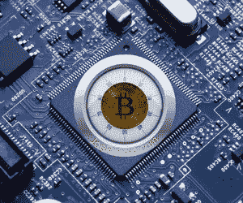

# 确保您的加密是安全的

> 原文：<https://medium.com/coinmonks/make-sure-your-crypto-is-safe-f1514b6a3d2a?source=collection_archive---------64----------------------->

加密货币是不受中央机构控制的分散式数字货币。与任何其他类型的数字资产一样，加密货币既有好处也有风险。如果你认真对待你的投资，你需要确保你的加密货币是安全的。存储令牌时，您希望在功能性和安全性之间找到恰当的平衡。

**始终认真对待安全问题**

处理任何数字资产时，您都应该格外重视安全性。毕竟你的加密货币也不例外。作为首要的经验法则，永远不要和任何人分享你的私钥。这样做会让你面临潜在的资金损失。例如，如果你将资金存放在你自己的加密货币钱包中，但暴露在公众可见的计算机中，其他人就可以拿走你的钱。

在定义保护密码安全的最佳策略之前，有必要了解一些概念，如热钱包、冷钱包、硬件钱包和软件钱包。

**热钱包 vs 冷钱包**

热钱包是一种连接到互联网并与对等网络交互的钱包。由于这是一个在线钱包，它更快，更容易交易或消费加密。但出于同样的原因，它也容易受到网上攻击，并可能损失资金。

冷钱包通常不与互联网连接，因此被黑客攻击的机会更少。然而，虽然更安全，但它不太方便交易和消费。

> ***专业提示*** *:如果你在网上储存了大量的加密组合作为交换，一定要研究你所使用的公司的声誉。*

JoeRobert.Com

**硬件钱包与软件钱包**

硬件钱包本质上是一个 USB 设备，用于存储加密货币。最受欢迎的两种金属钱包是纸质钱包和金属钱包。纸质钱包是印有私人密钥和公共地址的纸张，因此被认为是冷钱包。另一方面，金属钱包旨在安全地存储您的加密货币。受欢迎的硬件钱包品牌包括 [Ledger](https://www.ledger.com/) 和 [Trezor](https://trezor.io/) 。

软件钱包是下载到电脑或移动设备上的应用程序。它们的工作原理与硬件钱包相同，但主要区别在于它们通常连接到互联网(热钱包)，更容易受到黑客攻击和资金损失。最受欢迎的软件钱包是 [Exodus](https://www.exodus.com/) 和 [ZenGo](https://zengo.com/) 。此外，[比特币基地](https://www.coinbase.com/)和[双子星](https://www.gemini.com/)等密码交易所也有自己的软件钱包。

**如果你打算开车，就用一个硬件钱包**

“冷”钱包是指没有联网的钱包。因此，冷钱包不受热钱包带来的许多风险的影响。如果你不打算在很长一段时间内出售你的密码，那就值得把你的钱和精力投入到你的投资组合中你想 HODL 的部分的硬件钱包中。

**额外努力#1:** *保护您的桌面*

作为投资者，你的电脑是你最重要的工具之一，所以要确保它的安全:

*   避免安装未知来源的程序。如果一个程序未经您的允许试图在您的计算机上安装自己，您可能会看到一个安全警告
*   始终确保您的文件是加密的
*   存储敏感信息(如您的私钥或钱包地址)时，请将其存储在受密码保护的文件中；
*   使用加密驱动器。

**附加工作#2:** *设置双因素认证*

保护加密货币的最佳方式之一是使用双因素身份认证。它提供了一个额外的安全层，要求您提供除密码以外的其他信息来访问您的帐户。换句话说，如果有人获得了您的密码，他们将无法登录您的帐户。相反，在双因素身份验证的情况下，他们需要一部手机或 authenticator 应用程序来访问你的帐户。在了解了所有与你的资产安全相关的最佳实践之后，下一步就是要在你的投资组合策略上勤勤恳恳。清楚了解您的密码中有多少用于交易和 HODL，并回答这些试探性问题:

*   我打算多久交易一次密码？
*   我有 HODL 职位吗？
*   在安全方面，我的投资组合中有多少值得放入硬件/冷钱包？

在那之后，你会对你当前的投资组合有一个精确的场景，决定最佳组合将是一个简单的过程。

在罗伯特风险投资公司，我们坚信你可以掌控你的所有投资，无论是哪种投资。也就是说，尽最大努力确保你的资产安全是必须的。

Visit RobertVentures.com

[*乔·罗伯特*](https://joerobert.com/) *现任罗伯特风险投资公司首席执行官，拥有超过 20 年的资产管理经验。自创业以来，乔已经为投资者&合伙人创造了可预见的两位数回报。Joe 已经投资了股权和代币的种子轮，以及比特币、以太坊和其他顶级加密货币的投资组合。*

*如果您是合格投资者，并想了解更多关于我们产品的信息，请* [*联系我们。*](https://robertventures.com/)

> 加入 Coinmonks [电报频道](https://t.me/coincodecap)和 [Youtube 频道](https://www.youtube.com/c/coinmonks/videos)了解加密交易和投资

# 另外，阅读

*   [分散交易所](https://coincodecap.com/what-are-decentralized-exchanges) | [比特 FIP](https://coincodecap.com/bitbns-fip) | [宾邦评论](https://coincodecap.com/bingbon-review)
*   [用信用卡购买密码的 10 个最佳地点](https://coincodecap.com/buy-crypto-with-credit-card)
*   [加拿大最佳加密交易机器人](https://coincodecap.com/5-best-crypto-trading-bots-in-canada) | [Bybit vs 币安](https://coincodecap.com/bybit-binance-moonxbt)
*   [阿联酋 5 大最佳加密交易所](https://coincodecap.com/best-crypto-exchanges-in-uae) | [SimpleSwap 评论](https://coincodecap.com/simpleswap-review)
*   [购买 Dogecoin 的 7 种最佳方式](https://coincodecap.com/ways-to-buy-dogecoin) | [ZebPay 评论](https://coincodecap.com/zebpay-review)
*   [最佳期货交易信号](https://coincodecap.com/futures-trading-signals) | [流动性交易所评论](https://coincodecap.com/liquid-exchange-review)