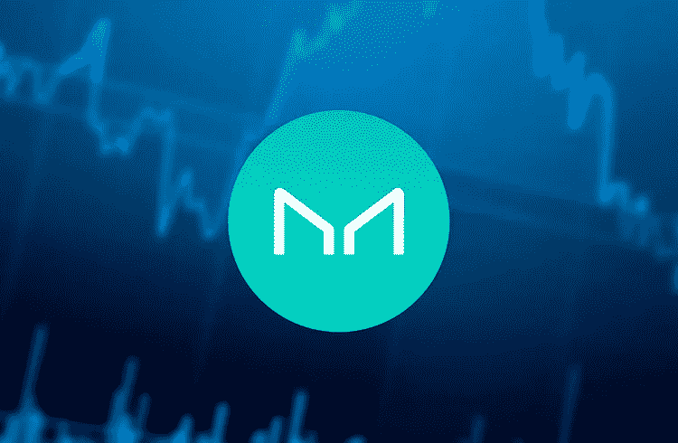

# 创客(MKR)无视低点，几个小时内暴涨近 65%；理解看涨走势

> 原文：<https://medium.com/coinmonks/maker-mkr-ignores-lows-and-jumps-nearly-65-in-a-few-hours-understand-the-bullish-move-c69a05d70dd5?source=collection_archive---------26----------------------->

周三(11 日)，加密货币市场仍然低迷，比特币(BTC)难以保持在 30，000 美元以上，Terra 生态系统(LUNA)的稳定币 UST 因未能保持与美元的平价而崩溃。

与此同时，的最大竞争对手戴使用的币在过去 24 小时内跃升两位数，从其他加密货币中脱颖而出。

周三，cryptoactive 的价格从 1203 美元飙升至当地高点 1976 美元。因此，这是一个在短短几个小时内几乎 65%的增长。

在撰写本文时，MKR 的价格已经回落到 1487 美元。就凭这一点，最近 24 小时，升值幅度也就 20%多一点。

鉴于整体熊市，MKR 令牌在市值最高的 100 种加密资产中实现了最高的日升值。

助长了的竞争对手，和戴之间的竞争可能助长了 token 的崛起。目前，价值 0.9994 美元(约 1 美元)的戴币市值排名第 15 位。

与此同时，TerraUSD (UST)的价格暴跌至 0.3839 美元，与美元价格脱离。因此，根据 CoinMarketCap 的数据，stablecoin 现在的市值排在第 18 位。

由于面临着严重的问题，戴脱颖而出，成为一个更安全稳定的选择。由此，MKR 获得了更高的估值。

关于创客— MKR —戴生态系统
如前所述，创客令牌为戴生态系统提供动力。更准确地说，MKR 是 MakerDAO 和 Maker Protocol 的治理令牌——分别是一个去中心化的组织和一个软件平台，两者都基于以太坊区块链。MakerDAO 和 Maker 协议允许用户发布和管理稳定的币 DAI。

用户可以锁定一些不稳定的资产，如比特币、以太币或其他协议中的流动性头寸，如 Curve，以生成 DAI stablecoins。所有 DAI 贷款都必须有超额抵押，抵押指数根据存款的不同而不同。

Maker 于 2015 年初步推出，于 2017 年 12 月全面推出，该项目的任务是运营 DAI stablecoin，这是一种社区管理的分散加密货币，其价值稳定，与美元挂钩。

在实践中，MKR 代币充当管理 DAI 的组织的一种投票份额。虽然它们不向其持有人支付股息，但它们给予持有人在制定 Maker 协议方面的投票权，并预计会随着 DAI 本身的成功而升值。

总体而言，创客生态系统是分散金融(DeFi)领域的首批项目之一。此外，它被认为是该领域最强有力的项目之一。毕竟，它允许用户释放流动性，同时保持对支持戴贷款的资产的敞口。

因此，如果戴继续提供稳定，的投资者可能会迁移到竞争对手，促进。