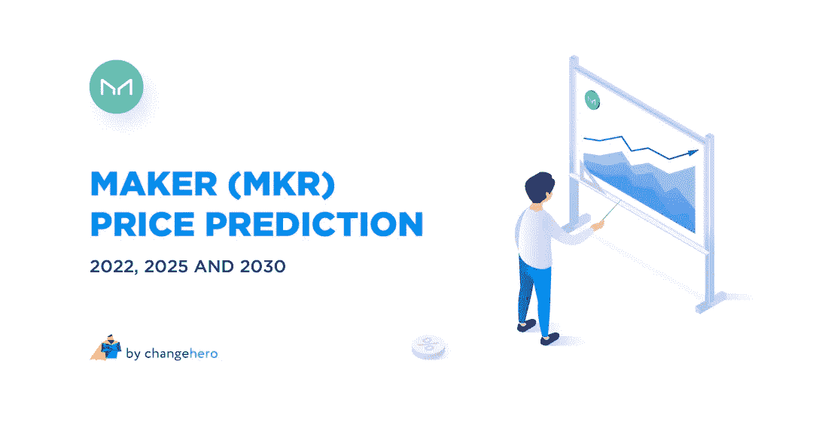
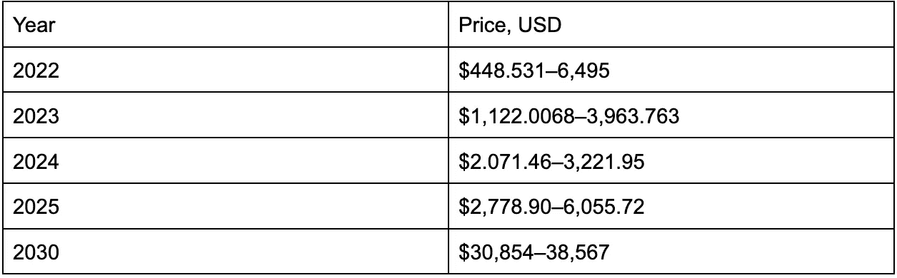
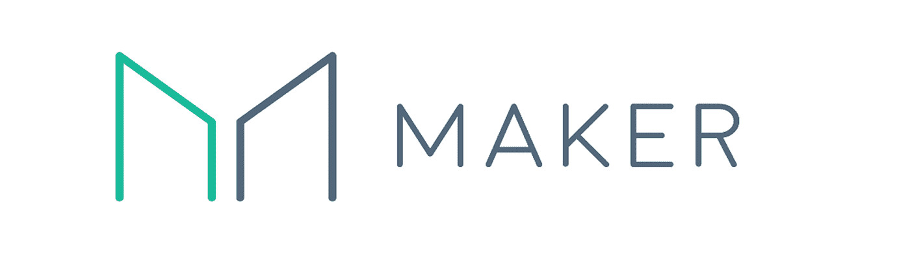
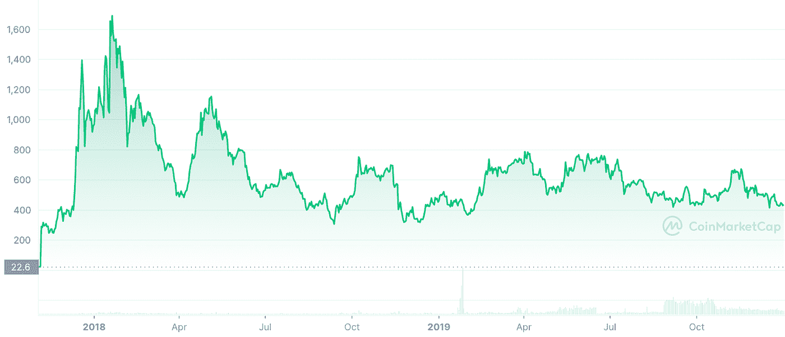
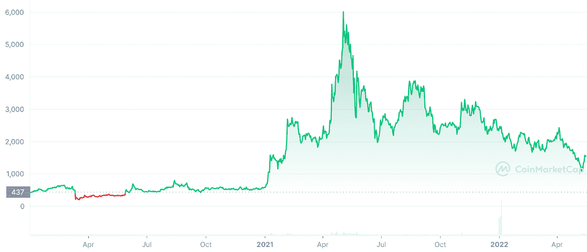

# 2022 年制造商价格预测:现在唯一的盈利密码

> 原文：<https://medium.com/coinmonks/maker-price-prediction-2022-2025-2030-bcc129a41848?source=collection_archive---------15----------------------->

Terra 崩溃不仅给加密市场带来了冲击波，也凸显了算法稳定性的漏洞。随着出局，道的代币再次成为市场上最成熟的算法稳定币，而代币是唯一的盈利资产。在本文中，我们的团队将根据其历史、新闻和基本面，对 2022 年和未来的创客价格进行预测。

# 2022-2030 年制造商价格预测

*   尽管 Maker 是唯一的绿色替代硬币，但并不是所有的预测都相信涨势会持续下去。根据来源的不同，制造商价格预测 2022 从 448 美元到新 ATH 不等；
*   对未来几年的预测甚至更不乐观。根据他们的说法，Maker token 在 2025 年后只会超过其 6339 美元的 the
*   然而，到 2030 年，MKR 预计将达到五位数的价格，超过 3 万美元。

# 刀客和是什么？

Source: MakerDAO on Medium

Maker 协议由 MakerDAO(分散自治组织)开发和维护。协议和 DAO 都管理算法稳定币 [DAI](https://changehero.io/blog/dai-a-unique-take-on-stablecoins/) ，由加密抵押品而不是法定准备金支持。

Maker (MKR)是这个平台的治理令牌的名称。MKR 持有者可以参与对协议变更的投票，甚至启动紧急措施以保持抵押品平衡。

MKR 可以出售以补充抵押品，因此持有者有动力负责任地做出改变。如果你需要更多关于它如何工作的信息，请花些时间阅读我们的[初学者指南！](https://changehero.io/blog/mkr-guide/)

# MKR 价格历史

## 2017-2019 年的制造商价格

Source: CoinMarketCap

MKR 代币于 2017 年 12 月推出。由于有一个工作协议，投资者在 2018 年 1 月 20 日对它的估价高达 1690.19 美元。然而之后，密码市场进入深度回调。

2018 年全年，MKR 在当地高点 500 美元至 1100 美元之间横盘整理。2019 年，开盘价为 448 美元，收于 430 美元，继续盘整。

## 2020-2022 年的制造商价格

Source: CoinMarketCap

2020 年以上升趋势开始，在 Q1 以 437 美元开盘，攀升至 635 美元。全球新冠肺炎疫情导致包括加密货币在内的所有市场崩溃，MKR 跌至 275 美元。

从那以后，它进入了第一次复苏，然后是长期上升趋势。2021 年初，MKR 从 586.96 美元开始，飙升至 1858 美元的第一个本地高点。

接下来，在 2 月初，它已经价值 2859 美元。在修正至约 2100 美元后，它在 2021 年 5 月 3 日巩固并飙升至当前的 ATH:6339 美元。

特别是在 MKR，在 2018 年的修正中观察到的相同模式在到达 ATH 后出现。在十几个月的时间里，它以紧缩的下跌趋势收盘，但在 2022 年 5 月，当整个市场暴跌时，MKR 成为唯一的赢家。

在本书出版时，MKR 价格为 1522.79 美元，在 [CoinMarketCap](https://coinmarketcap.com/currencies/maker/) 上排名第 42 位。Maker Protocol 根据 [DeFi Pulse](https://defipulse.com/) 锁定总价值 15.52 亿美元，排名第一。

# 是什么影响了 MKR 的价格？

## 提议和更新

三月，社区[提议](https://forum.makerdao.com/t/stkmkr-maker-staking-and-tokenomics-revision/13890/54)从头开始重新设计治理激励机制。他们提出的不是“回购和燃烧”机制，而是赌注，并使投票权取决于股份。

根据这个[设计](https://cointelegraph.com/news/makerdao-community-proposal-to-replace-mkr-governance-token)，桩 MKR 将变成 stkMKR，本质上是从液体供应中去除代币。该提案尚未正式确定和表决，但讨论仍在进行中。

之前的价格飙升与一项提案有关，该提案将使抵押品池多样化，并推出了备受瞩目的 NFT 系列。

## 竞争

在 2021 年和 2022 年的几个月里，算法稳定币 DAI 一直被它的竞争对手 Terra USD (UST)所掩盖。尽管这些协议存在显著差异(DAI 是过度杠杆化的加密支持的 stablecoin，而 Terra 的 stable coin 通过铸币税保持钉住)，Terra 成功地将自己定位为主要 stable coin 的分散替代方案。

也就是说，直到 2022 年 5 月 9 日，UST 与 1 美元严重脱钩，Luna Foundation Guard 的比特币储备注入的数百万美元都无法阻止其崩溃。相比之下，戴和周围的人气似乎有所增强。

这场 MKR 拉力赛可持续吗？锁定的总价值下降表明，这种飙升没有任何根本性的改善，因此这种飙升可能是短暂的。

## 以太坊的发展

虽然它不直接影响制造者令牌的价格，但以太坊网络的可用性和吞吐量肯定会影响它。共识层合并将标志着向股权证明的转变，据说将在 2022 年晚些时候到来(除非再次推迟)。

目前，从经济角度来看，DeFi 的前景不会发生重大变化。现有协议肯定会受益于改善的网络延迟和更低的天然气费用。

# 来自推特的 MKR 新闻

交易员尼科准确地指出了 MKR 股票开始形成趋势的确切时间。他还认为这是由于 UST 的失败。

有些人在 Terra 内爆后赢了。用户大叔在糟糕的数据旁边庆祝戴的时刻。

令牌终端团队记录了与激增相关的 MKR 活跃地址的上升。目前的数字不低于 8.4 万！

# 2022 年制造商价格预测

作者认为，制造商价格最终将在 2022 年打破跌势。MKR 的最低看涨目标是 4311 美元，绝对最高值甚至高于 ATH 6495 美元。

另一方面，[华尔街投资者](https://walletinvestor.com/forecast/maker-prediction-data)短期内看跌 MKR。预计到 2022 年底，油价将从 1930.45 美元的可能高点跌至 448.531 美元。

YouTuber Cilinix Crypto 对 MKR 的走势进行了快速更新，并预测看涨势头可以将其推高至 2，000 美元，但不会超过这一数字。为了达到这一目标，需要击败 1700 美元的阻力，如果从这一高点遭到拒绝，价格可能会跌至 1600 美元。

# 2023-2024 年制造商价格预测

[Gov.capital](https://gov.capital/crypto/maker/) 的预测并不是以 MKR 价格只会上涨为前提的。2023 年，抛开波动性不谈，MKR 价格将再上涨几千美元，最终收于 3963.763 美元。

DigitalCoinPrice 的另一个算法预测描绘了一幅类似的画面:即使有波动，价格也会上涨。特别是在 2024 年，预计高点为 3221.95 美元，低点为 2.071.46 美元。

# 2025 年制造商价格预测

根据 [Digital Coin](https://digitalcoinprice.com/forecast/maker/2025) 的预测，2025 年创客的平均价格将达到 2861.25 美元。预计最低月平均价格将在 2025 年 8 月达到 2778.90 美元，最高价格将在 7 月达到 3787.66 美元。

在 [CryptoNewsZ](https://www.cryptonewsz.com/forecast/maker-price-prediction/) 描述的最好情况下，如果 Maker 保持在 DeFi 的最前沿，并成为顶级加密货币，它可能会达到 4549.20 美元。五年后会有很多变化，所以我们必须等等看。

对 2025 年创客最乐观的预测来自 PricePrediction.net 的 T2。在一年的时间内，预计它将从 3441.51 美元至 3871.69 美元反弹至 4928.60 美元至 6055.72 美元。

# 2030 年制造商价格预测

很难说加密货币市场在十年后会走向何方。规则是什么，哪些项目留下，哪些项目离开？但是如果一切照常，[cryptocurrencypripestion](https://cryptocurrencypriceprediction.com/maker-price-prediction-2020-2021-2025-2030-mkr-future-forecast/)预计 MKR 可以继续增长到 30854 美元，甚至 38567 美元。

# 变革英雄制造商 MKR 价格预测

作为进入 DeFi 和 stablecoins 世界的一项冒险，Maker 协议可能是传统金融机构最感兴趣的加密工具之一。与此同时，它现在和以往一样权力下放，由社区管理。

Maker token 现在对协议的开发很有帮助，所以对它的需求只会越来越大。考虑到这一点，可以有把握地认为，MKR 仍被低估，可以在 5 年内轻松赚到 5000 美元。

至于 2022 年，我们将不得不看看反弹是否会持续，并将价格推至一个新的 ATH。

# 如何让 MKR 上 ChangeHero？

现在你知道了更多关于万物制造的知识，你仍然可以很容易地进入 ChangeHero！

1.  在主页上选择货币、金额和兑换类型。在下一步中提供您的钱包地址并检查金额；
2.  仔细检查所提供的信息，阅读并接受使用条款和隐私政策；
3.  在一次交易中发送您要兑换的加密货币的金额。固定利率交易有 15 分钟的限制；
4.  完成了吗？现在我们正在做所有的工作:检查传入的交易，并在交易到达时立即进行交换。最佳汇率交易将使用您的资金到达时的当前汇率。固定汇率将使用步骤 1 时的汇率；
5.  一旦兑换被处理，你的 MKR 就在去你钱包的路上了。

客户支持可随时随地通过网站聊天或电子邮件获得: [support@changehero.io](mailto:support@changehero.io) 。

# 结论

Maker Protocol 就是一个很好的例子，说明了 DeFi 是如何被访问的，以及如何忠实于加密的理想。既然 DAI 又有机会大放异彩，MKR 就是这个生态系统中最重要的资产。

我们希望你喜欢这篇文章，一定要从我们的[博客](https://changehero.medium.com/)中查看更多类似的文章！如果您想要每天更新，为什么不注册我们的[推特](https://twitter.com/Changehero_io)、[微博](https://www.reddit.com/r/ChangeHero/)、[脸书](https://www.facebook.com/Changehero.io/)和[电报](https://t.me/CHCryptoNews)？

## 常见问题

**什么是 MKR？**

Maker 是一个分散的金融借贷协议，它发行加密支持的 stablecoin DAI。它由一个分散的自治组织管理，MKR 是它的治理象征。

**Maker 是 2022 年的好投资吗？**

*对于 Maker 是否是一项能在短期和长期内带来利润回报的投资，专家们意见不一。对 Maker 的未来有悲观和乐观的观点。*

**2022 年，MKR 的价值是多少？**

*专家给出了 2022 年 MKR 价格的不同数字，从 448.531 美元*到 6495 美元*。*

**2025 年，MKR 的价值是多少？**

*根据预测，MKR 令牌的价值在 2778.90 美元至 6055.72 美元之间。*

**2030 年，MKR 的价值是多少？**

*看涨预测:2030 年，state Maker token 的市值将从 30，854 美元降至 38，567 美元。*

## 放弃

*本文不是财务建议。没有价格预测可以保证提供未来价格的准确信息。*

*处理密码货币时，请记住它们极易波动，因此是一项高风险投资。始终确保随时了解情况并意识到这些风险。只有在仔细考虑和分析之后，才考虑投资隐型货币，风险由您自己承担。*

> 加入 Coinmonks [电报频道](https://t.me/coincodecap)和 [Youtube 频道](https://www.youtube.com/c/coinmonks/videos)了解密码交易和投资

# 此外，请阅读

*   [3 商业评论](/coinmonks/3commas-review-an-excellent-crypto-trading-bot-2020-1313a58bec92) | [Pionex 评论](https://coincodecap.com/pionex-review-exchange-with-crypto-trading-bot) | [Coinrule 评论](/coinmonks/coinrule-review-2021-a-beginner-friendly-crypto-trading-bot-daf0504848ba)
*   [莱杰 vs n rave](/coinmonks/ledger-vs-ngrave-zero-7e40f0c1d694)|[莱杰 nano s vs x](/coinmonks/ledger-nano-s-vs-x-battery-hardware-price-storage-59a6663fe3b0) | [币安评论](/coinmonks/binance-review-ee10d3bf3b6e)
*   [Bybit Exchange 审查](/coinmonks/bybit-exchange-review-dbd570019b71) | [Bityard 审查](https://coincodecap.com/bityard-reivew) | [Jet-Bot 审查](https://coincodecap.com/jet-bot-review)
*   [3 commas vs crypto hopper](/coinmonks/3commas-vs-pionex-vs-cryptohopper-best-crypto-bot-6a98d2baa203)|[赚取加密利息](/coinmonks/earn-crypto-interest-b10b810fdda3)
*   最好的比特币[硬件钱包](/coinmonks/hardware-wallets-dfa1211730c6) | [BitBox02 回顾](/coinmonks/bitbox02-review-your-swiss-bitcoin-hardware-wallet-c36c88fff29)
*   [BlockFi vs 摄氏度](/coinmonks/blockfi-vs-celsius-vs-hodlnaut-8a1cc8c26630) | [Hodlnaut 审核](/coinmonks/hodlnaut-review-best-way-to-hodl-is-to-earn-interest-on-your-bitcoin-6658a8c19edf) | [KuCoin 审核](https://coincodecap.com/kucoin-review)