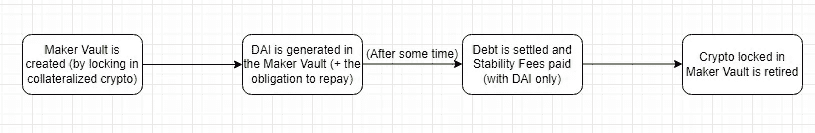
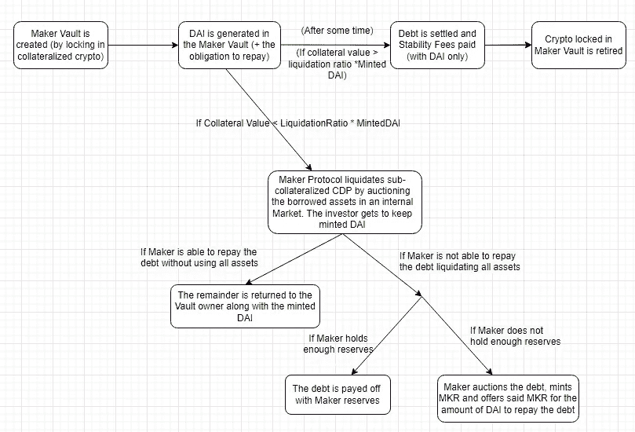

# Maker 协议入门&戴

> 原文：<https://medium.com/coinmonks/maker-protocol-dai-be3360afc124?source=collection_archive---------22----------------------->

让我从说服你为什么应该读这篇文章开始。首先，这太棒了。但最重要的是，MakerDAO 是 DeFi 生态系统的基础。

如果你是阿根廷人，你可能知道这一点。建立一个基于不稳定货币的金融体系是一个相当大的挑战。而且，正如*被称为*(是的，这是一个现成的参考)，加密货币一直是非常不稳定的资产。

既然 DeFi 没有监管，为什么要建立在不稳定资产之上呢？这毫无意义。这就是为什么稳定货币被创造出来，尤其是那些与美元挂钩的货币。USDT 美元和 USDC 美元就是这种情况，但它们有一些共同点:它们由一个中央机构管理。马可道创造了戴，**第一个美元挂钩分散稳定币**。

分散稳定币的机制背后是什么？*提示:很酷的东西和创新的机制。*下潜之前，我们来回顾一下:**戴是创客协议的产物，由创客道**管理。

# 戴&马克协议

Dai 由一系列智能合约产生，这些合约共同创建和管理 CDP(抵押债务头寸)。希望(在一级市场)收购 DAI 的投资者将存放 crypto 作为抵押品。为了保护稳定的货币免受市场波动的影响，制造商协议将要求存款被超额抵押。例如，如果您存入价值 150 美元的 ETH，您将最多(大约)收到价值 100 美元的 DAI。在这种情况下，我们说清算比例是 150%。

加密存款存放在“制造商金库”内。当用户打开一个 Maker 金库时，他们将他们的密码存放在金库中，作为回报获得 DAI，并且还有义务偿还铸造的 DAI +“稳定费”。这些可以随时撤回，部分或全部。

Investors interaction with Maker Protocol to Mint DAI. You can try it on [Oasis.app](https://oasis.app/)

但是请记住，加密是不稳定的。这种流动只是一种情况，在这种情况下，你存放的密码不会受到价格下跌(足够大)的影响。Maker 协议如何确定每项资产是否已经“足够”下降到被认为有风险？制造商在确定将这些资产存放在他们的金库中有风险时如何行动？

我之前提到过，在 150%的清算比率下，价值 150 美元的 ETH 可以获得(最多)价值 100 美元的 DAI。这一清算比率是每个 CDP 必须坚持的门槛。这意味着，在任何时候，对于 150%的清偿率，你借入的资产必须至少相当于 1.5 倍的铸币量。当这种关系成立时，流程将是前面提到的。

当 CDP 成为“次级抵押”(也就是你的抵押品已经“足够了”)时，Maker Protocol(通过智能合约)获得金库内资产的所有权，并签订债务合同(最初来自投资者)。最后，它开始拍卖过程来清算资产和偿还债务。Vault 的资产在内部市场拍卖。

如果为这些资产提供的价值足以(拍卖仅在 DAI 中进行)补偿所承包的债务，则制造商将试图保存尽可能多的抵押品，并将其返还给金库所有者。如果提供的价值不够好，那么这个赤字就违反了协议。如果 Maker Protocol 持有足够的储备(还记得支付“稳定费”吗？这是他们收入的来源，加上其他流)那么就用创客准备金结算。如果情况不是这样，那么制造者将拍卖掉债务，铸造$MKR(制造者道治理令牌)，并以其债务的价值提供这些令牌。

最令人惊讶的一个因素是，到目前为止，我所解释的一切都是完全由智能合同完成的(除了为每项资产设置清算比率的值，这是由 MakerDAO 聘请的外部风险团队提出的，后来由 MakerDAO 治理流程批准)

对投资者有什么好处？减少贷款听起来并不是最好的交易。但这允许投资者借入 ETH(或更多资产),并仍然间接接触该资产，同时还可以利用他们新创造的 Dai 在 DeFi 协议中获得更大的回报。

例子(*不是理财建议！*):你看好 ETH，开个金库(存 X ETH，以 U$D 计量)，拿到刚铸好的 DAIs(Y)；转过身来，投资于你感兴趣的任何 DeFi 协议，赢得 z。哦！与此同时，ETH 上涨了 20%。回到你的金库，支付 Y +稳定费，拿回 1.2*X ETH。这弥补了收益中 0.2*X + Z -稳定性费用。如果你持有联邦理工学院，那么你将失去赚取 Z-Stab 费用的机会

总之，这个世界从未停止让我惊讶。

更多信息:【https://makerdao.com/】[【https://makerdao.com/es/whitepaper/】](https://makerdao.com/es/)[https://www.youtube.com/watch?v=ztocQ7uq5No](https://www.youtube.com/watch?v=ztocQ7uq5No)

***免责声明*** :本分析所反映的内容仅供使用，且必须仅用于信息和教育目的。在根据自己的个人情况进行任何投资之前，做好自己的研究是非常重要的。

> *加入 Coinmonks* [*电报频道*](https://t.me/coincodecap) *和* [*Youtube 频道*](https://www.youtube.com/c/coinmonks/videos) *了解加密交易和投资*

# 另外，阅读

*   [3 商业评论](/coinmonks/3commas-review-an-excellent-crypto-trading-bot-2020-1313a58bec92) | [Pionex 评论](https://coincodecap.com/pionex-review-exchange-with-crypto-trading-bot) | [Coinrule 评论](/coinmonks/coinrule-review-2021-a-beginner-friendly-crypto-trading-bot-daf0504848ba)
*   [莱杰 vs n rave](/coinmonks/ledger-vs-ngrave-zero-7e40f0c1d694)|[莱杰 nano s vs x](/coinmonks/ledger-nano-s-vs-x-battery-hardware-price-storage-59a6663fe3b0) | [币安评论](/coinmonks/binance-review-ee10d3bf3b6e)
*   [Bybit Exchange 审查](/coinmonks/bybit-exchange-review-dbd570019b71) | [Bityard 审查](https://coincodecap.com/bityard-reivew) | [Jet-Bot 审查](https://coincodecap.com/jet-bot-review)
*   [3 commas vs crypto hopper](/coinmonks/3commas-vs-pionex-vs-cryptohopper-best-crypto-bot-6a98d2baa203)|[赚取加密利息](/coinmonks/earn-crypto-interest-b10b810fdda3)
*   最好的比特币[硬件钱包](/coinmonks/hardware-wallets-dfa1211730c6) | [BitBox02 回顾](/coinmonks/bitbox02-review-your-swiss-bitcoin-hardware-wallet-c36c88fff29)