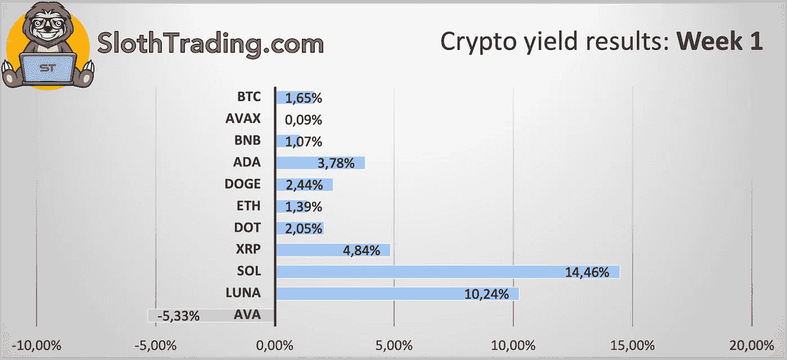

# 交易密码一周获利 3.33%

> 原文：<https://medium.com/coinmonks/making-3-33-profit-in-a-week-trading-crypto-2aecbfa34668?source=collection_archive---------5----------------------->

在这篇短文中，我将简要解释我的加密交易算法在过去一周的结果。所有呈现的结果都已经考虑了币安期货费用(0.06%的限价单开仓和市价单平仓)。

我目前只对 11 种加密货币进行跟踪和预测。有 11 个定制的神经网络，每个资产一个。

1 周时间框架预测的结果(迄今为止最准确的预测)如下:

BTC: 1.65%的利润。

AVAX: 0.09%利润。

BNB: 1.07%的利润。

阿达:3.78%的利润。

DOGE: 2.44%利润。

ETH: 1.39%利润。

点:2.05%利润。

XRP: 4.84%的利润。

SOL: 14.46%利润。

露娜:10.24%利润。

AVA:下跌了 5.33%。

考虑到交易费用，这意味着平均 3.33%的利润，一点也不差。所有这些信息都在[slot trading](https://slothtrading.com)发布并每小时更新一次。

每周我都会上传结果，如果你想查看更多数据，记得访问我的[网站](https://slothtrading.com)。

在[推特](https://twitter.com/SlothTradingCom)上关注我。

给我们一笔[捐款](https://ko-fi.com/slothtrading)来继续发展这个项目，我们将不胜感激:)。

> *加入 Coinmonks* [*电报频道*](https://t.me/coincodecap) *和* [*Youtube 频道*](https://www.youtube.com/c/coinmonks/videos) *了解加密交易和投资*

# 另外，阅读

*   [Bookmap 点评](https://coincodecap.com/bookmap-review-2021-best-trading-software) | [美国 5 大最佳加密交易所](https://coincodecap.com/crypto-exchange-usa)
*   最佳加密[硬件钱包](/coinmonks/hardware-wallets-dfa1211730c6) | [Bitbns 评论](/coinmonks/bitbns-review-38256a07e161)
*   [新加坡十大最佳加密交易所](https://coincodecap.com/crypto-exchange-in-singapore) | [购买 AXS](https://coincodecap.com/buy-axs-token)
*   [红狗赌场评论](https://coincodecap.com/red-dog-casino-review) | [Swyftx 评论](https://coincodecap.com/swyftx-review) | [造币厂评论](https://coincodecap.com/coingate-review)
*   [投资印度的最佳密码](https://coincodecap.com/best-crypto-to-invest-in-india-in-2021)|[WazirX P2P](https://coincodecap.com/wazirx-p2p)|[Hi Dollar Review](https://coincodecap.com/hi-dollar-review)