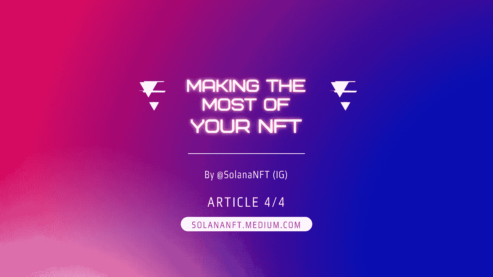
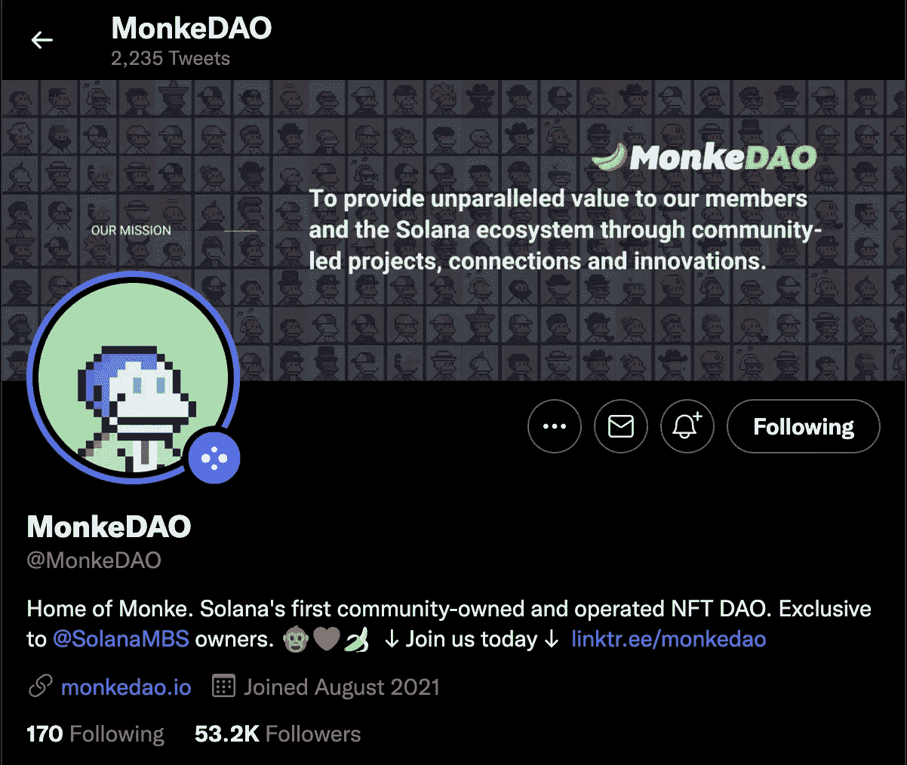

# 充分利用您的 NFT

> 原文：<https://medium.com/coinmonks/making-the-most-of-your-nft-77d5093a279a?source=collection_archive---------34----------------------->

在开始任何复杂的事情之前，如果你还没有加入你的收藏社区。过去，社区是 NFT 世界运转的动力——所有这些设施都不存在，你只想进入拥有最酷的人和最好的阿尔法的最强大的社区。然而，如今大多数 NFT 收藏都提供了某种用途——我们将对不同收藏能给你带来的不同好处做一个广泛的概述。

**社区&道**

您应该已经在 Discord 服务器上了(在第 1 篇文章的研究阶段)。现在是时候展示你的 NFT 了，去认识你的新兄弟姐妹吧！最好的 NFT 社区是强大的——我所说的强大是指忠诚、关心和可靠。我们看到这么多人在艰难时期从他们的社区得到安慰，这真的令人钦佩。

DAOs(去中心化自治组织)可能是所有投票和治理结构的未来。他们允许某些人访问信息，投票，等等。大多数 NFT 让您可以访问 DAO，在那里您可以对项目未来的某些方面进行投票，甚至可以更接近社区和项目创始人。也可能是只有道的事件，游戏，等等…[大声喊出来 [MonkeDAO](https://twitter.com/MonkeDAO) ，索拉纳的第一个社区拥有和运营的 NFT 道]

为此，你很可能需要使用 [Grape 协议](https://twitter.com/grapeprotocol)、 [Matrica Labs](https://twitter.com/MatricaLabs) 或类似的服务，并将你的钱包连接到你的 Discord 账户。这样，无论是葡萄或 Matrica 将能够看到你持有的 x NFT 在你的钱包，并给你进入道渠道和其他隐藏的渠道。

**游戏**

我们看到越来越多的非功能性体育赛事成为 P2E 奥运会的一部分。找到你的收藏在游戏开发中的位置，并检查你是否已经可以玩测试版。在后面的文章中，我们将介绍一些索拉纳·NFT 的项目，这些项目中的游戏已经开始运行了。大声喊出来，Cyrii & [$COPE](https://twitter.com/unlimitedcope) 在 Solana 上创造了有史以来第一个付费游戏！

COPE Shodown game: sourced from unlimitedcope.com

一个更近的索拉纳·NFT 游戏项目的例子是[BR1·元宇宙](https://twitter.com/BR1METAVERSE)，一个皇家战役第一人称射击游戏。

Screenshot from BR1 Metaverse Gameplay: sourced from BR1 Metaverse Twitter

**服务**

一些 NFT 收藏让您可以访问某些服务、网站和信息，如果没有 NFT，您将无法访问这些服务、网站和信息。其中一些服务包括 snipe 机器人、钱包仪表盘和市场折扣。我们还将在以后的文章中更深入地讨论这些——索拉纳有很多价值，你所需要做的就是在正确的地方寻找。一个例子是 Solluminati 导航工具，它可以帮助你根据稀有程度和价格来筛选 NFT。

Screenshot from Solluminati’s Navigator tool looking at the [Solana Monke Rejects](https://twitter.com/MonkeRejects) collection

**赌注&代币**

几个收藏现在有一个赌注功能，你可以锁定你的 NFT 接收令牌。有不同的赌注机制:对于一些你需要锁定你的 NFT 一段时间，对于另一些它是灵活的，对于少数你只需要把你的 NFT 放在你的钱包里接受代币。这里有一个[著名狐狸联盟](https://twitter.com/FamousFoxFed)的例子，你可以用$FOXY 来赌你的狐狸。

其他收集给你令牌分配或参与 IDO 的能力，没有赌注。将会有一个关于赌注和代币以及提供代币的不同集合的系列。

**元宇宙**

还记得我们提到的 NFT 系列的周期和趋势吗？元宇宙周期是最被炒作的周期之一，我们看到了太多(有些人甚至会说太多)元宇宙项目。当然，这些也有区别。有些给你一个房间或空间的入口，有些作为画廊，而有些是整个世界。这些都还在发展中，所以投资前做好自己的调研是非常重要的。Moduluc 正在利用虚幻引擎 4 构建一个非常真实的元宇宙，如下所示。

Sneak Peek of [Moduluc’s](https://twitter.com/Moduluc) Metaverse: sourced from Moduluc Discord

**收入分成&版税**

本文中我们将讨论的最后一种集合类型是收入共享和版税共享的 NFT 集合。收入共享集合本质上是提供产品或服务的公司，NFT 的销售有点像启动业务的融资轮。NFT 持有者从提供的产品或服务中获得一定比例的利润。Monkelabs 是收入分享商业计划的一个例子，NFT 持有者获得 launchpad 利润的 50%。

Screenshot from [monkelabs.io](http://www.monkelabs.io)

版税共享收取一定比例的交易版税给 NFT 持有者。每次你在二级市场上购买 NFT，都会有一定比例的销售额进入资金池，然后在 NFT 持有者之间分配。第一个索拉纳·NFT 项目是 Meerkat 百万富翁乡村俱乐部，那里 100%的二次销售版税返还给持有者。

现在你知道如何做自己的研究，购买你的第一个 NFT，并参与 NFT 收藏！您已经准备好深入更多的技术主题、项目概述和分析以及专栏文章。首先，我们会试着每周打印 3 篇文章，然后继续。我们希望您喜欢 Solana 上的 NFTs 介绍！

*在 Instagram 上关注@ SolanaNFT*

> 加入 Coinmonks [电报频道](https://t.me/coincodecap)和 [Youtube 频道](https://www.youtube.com/c/coinmonks/videos)了解加密交易和投资

# 另外，阅读

*   [比特币基地赌注](https://coincodecap.com/coinbase-staking) | [热点评论](/coinmonks/hotbit-review-cd5bec41dafb) | [库币评论](https://coincodecap.com/kucoin-review)
*   [购买 Dogecoin 的 7 种最佳方式](https://coincodecap.com/ways-to-buy-dogecoin) | [ZebPay 评论](https://coincodecap.com/zebpay-review)
*   [iTop VPN 审查](https://coincodecap.com/itop-vpn-review) | [曼陀罗交易所审查](https://coincodecap.com/mandala-exchange-review)
*   [比特币基地 vs 瓦济克斯](https://coincodecap.com/coinbase-vs-wazirx) | [比特鲁点评](https://coincodecap.com/bitrue-review) | [波洛涅克斯 vs 比特鲁](https://coincodecap.com/poloniex-vs-bittrex)
*   [美国最佳加密交易机器人](https://coincodecap.com/crypto-trading-bots-in-the-us) | [经常性回顾](https://coincodecap.com/changelly-review)