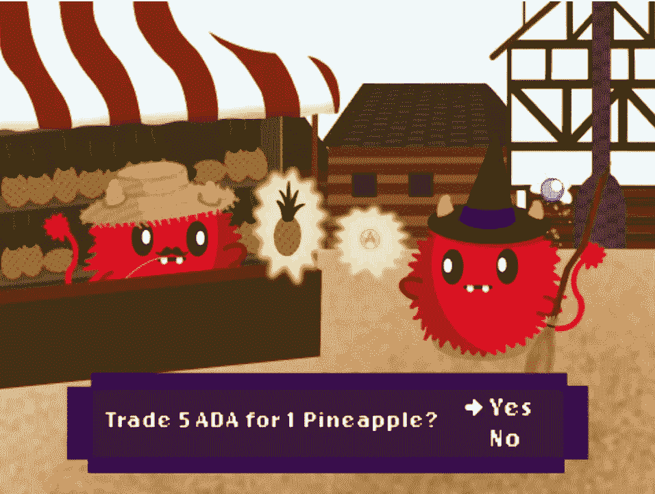
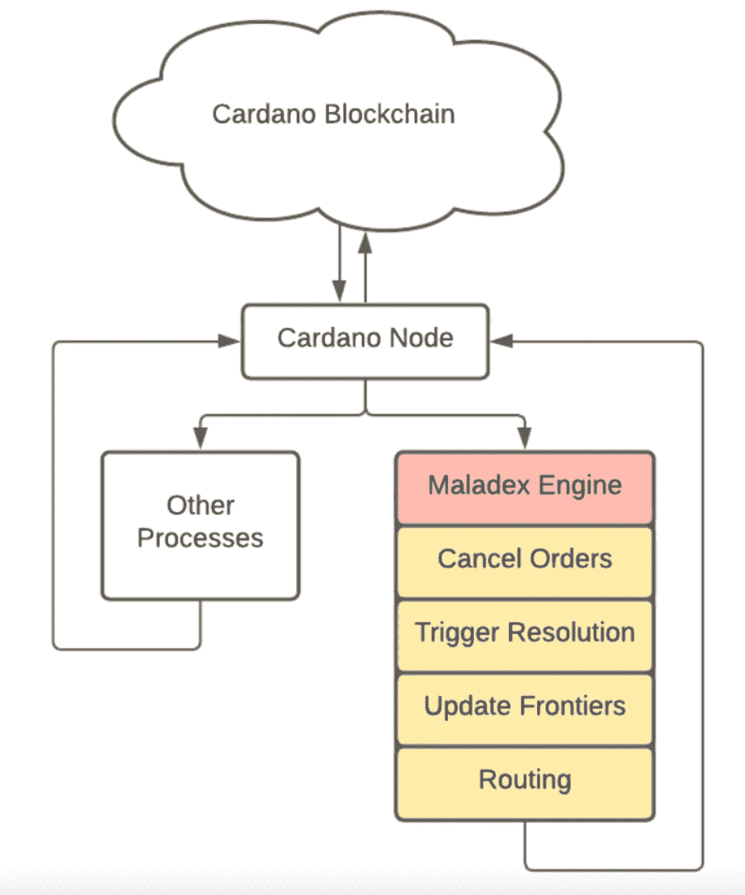

# maladex——Cardano 的下一代 dex

> 原文：<https://medium.com/coinmonks/maladex-the-next-generation-dex-on-cardano-23e465167d3d?source=collection_archive---------11----------------------->

具有坚实科学和数学基础的 [Cardano](https://twitter.com/search?q=%23Cardano) 的目的不是复制[以太坊](https://twitter.com/search?q=%23Ethereum)的“degen”DeFi 空间，而是将分散金融提升到一个全新的水平。

**Maladex 是 cardano 即将推出的一个项目，旨在实现这一期望。**

什么是 Maladex？Maladex 是 Cardano 上一个新颖的研究驱动的“交易平台”，旨在通过应用传统金融(TradFi)的研究严谨性和定量建模专业知识，彻底改变分散金融(DeFi)生态系统。

Maladex 给 DeFi 领域带来的核心创新是什么？截至目前，DeFi 饱受资本效率低下的困扰，如*、【非永久性损失(IL)】、*、*、【高滑动】、*。Maladex 引入了基于*“可编程交换”概念的革命性执行模式。*

让我们从基础开始:IL 是当基金在 AMMs 的流动性池中时，根据恒定公式做市商(CFMM)暴露的损失。这种损失通常是由于存款和取款之间的流动性池中的令牌比率的变化而发生的。

Uniswap V3 引入了“集中流动性”以减少“非永久性损失”。它是如何工作的？有限合伙人可以在被称为“区间指令”的特定价格区间分配他们的资本。提供流动性的费用只在这个价格范围内收取。

但是 Topaz blue 和 Bancor 进行的一项研究发现,“集中流动性”并不能解决流动性问题，但它会放大非永久性损失。

[news.coincu.com—“uni swap V3 的 50%的流动性提供商处于亏损状态](https://news.coincu.com/36274-liquidity-providers-uniswap-v3/)

为什么会这样？在 CFMM AMM，流动性平均分布在从 0 到无穷大的整个价格范围内。因此，流动性池中代币比率的变化发生在更广泛的价格区间。

但现在，由于集中的流动性，IL 不是在通向无穷大的路上发生，而是在通向配置流动性的价格区间末端的路上发生。由于价格波动，这导致了代币比率的巨大变化。

与他/她因向没有集中流动性准备金的 AMM 提供流动性而遭受的损失相比，这放大了 LP 的损失。基本上，如果你在交易，没有 IL 是不可能的。但是以一种极其聪明和负责任的方式来管理 IL 是可能的。

Maladex 带来了什么改变游戏规则的解决方案来最小化 IL？Maladex 从解决 IL 的来源——“令牌比率的变化”开始。为了将非永久性损失降至最低，做市商/有限合伙人必须确定他们的“理想资产比率”。

“理想资产比率”有助于维持做市商提供的流动性的总价值，Maladex 将“理想资产比率”的概念与*随机/算法自动做市商相结合，以保证几乎没有非永久性损失。*

Maladex 是如何实现这个目标的？ **Maladex 通过引入基于“可编程互换”概念的革命性执行模式实现了这一目标。**

可编程掉期不仅允许市价单、限价单及其高级子类型，还允许复杂的算法交易策略。更重要的是由可编程互换保证的公平、透明、反射性的执行。

可编程交换如何实现这一点？所有可编程互换通过铸造代表可编程互换的 NFT 提交到区块链上。在提交以 NFTs 的形式提交到区块链之后，它们进入执行池。

Maladex 的订单匹配引擎利用 E-UTxO 模型提供的链外计算，负责执行所有可编程的交换。制造 NFT 的过程可以完全并行进行，延迟的风险和排序的要求最小。

在执行阶段，多个 EUTxOs 可以通过有效的路由机制与许多其他 EUTxOs 进行匹配。Maladex 平台上的可编程互换将基于 DSL(特定领域语言),它们可以组合起来创建高级金融产品。

Maladex 可编程互换的可能产品包括:

*   被动投资，如加密指数；
*   金融衍生品；
*   可编程的交易策略；
*   保险产品；
*   选项；
*   合成材料；
*   连锁对冲基金；
*   链上投资组合经理。

*TL；DR-Maladex 是一个基于 Cardano 的新型研究驱动的“交易平台”，旨在通过使用可编程互换应用 TradFi 的研究严谨性和定量建模专业知识，彻底改变分散金融(DeFi)生态系统。*

原螺纹由 [Sooraj](https://twitter.com/Soorajksaju2) 完成。

> 加入 Coinmonks [电报频道](https://t.me/coincodecap)和 [Youtube 频道](https://www.youtube.com/c/coinmonks/videos)了解加密交易和投资

# 另外，阅读

*   [最佳期货交易信号](https://coincodecap.com/futures-trading-signals) | [期交所评论](https://coincodecap.com/liquid-exchange-review)
*   [南非的加密交易所](https://coincodecap.com/crypto-exchanges-in-south-africa) | [BitMEX 加密信号](https://coincodecap.com/bitmex-crypto-signals)
*   [MoonXBT 副本交易](https://coincodecap.com/moonxbt-copy-trading) | [阿联酋的加密钱包](https://coincodecap.com/crypto-wallets-in-uae)
*   [Remitano 审查](https://coincodecap.com/remitano-review)|[1 英寸协议指南](https://coincodecap.com/1inch) | [购买 Floki](https://coincodecap.com/buy-floki-inu-token)
*   [MoonXBT vs Bybit vs 币安](https://coincodecap.com/bybit-binance-moonxbt) | [Arbitrum:第二层解决方案](https://coincodecap.com/arbitrum)
*   [买 PancakeSwap(蛋糕)](https://coincodecap.com/buy-pancakeswap)|[matrix export Review](https://coincodecap.com/matrixport-review)