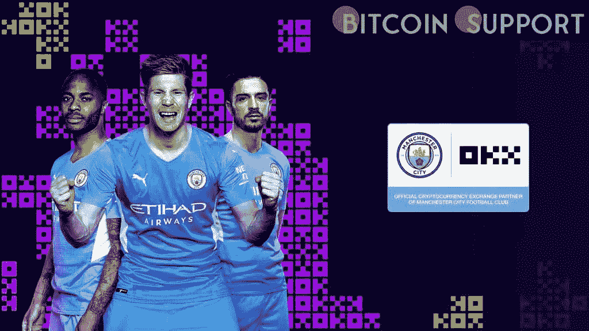

# 曼城足球俱乐部与加密货币交易所 OKX 达成协议

> 原文：<https://medium.com/coinmonks/manchester-city-football-club-inks-a-deal-with-okx-a-cryptocurrency-exchange-5313f7e31e35?source=collection_archive---------53----------------------->

**Visit our website:-** [**https://bitcoinsupports.com/**](https://bitcoinsupports.com/)

OKX 将在英格兰超级联赛冠军的主场阿提哈德体育场进行比赛。OKX，前身为 OKEx，宣布与英超冠军曼城队建立多年合作关系。该协议标志着 OKX 向体育赞助迈出了第一步，该交易所的标志将出现在曼城的主场阿提哈德体育场。OKX 周五表示，双方将在未来的项目上进行合作。协议的条款没有公开。当 CoinDesk 接近时，曼城没有回答，OKX 拒绝置评。

最近几个月，运动队或赛事与加密货币公司之间的赞助合作关系变得更加普遍。当地的竞争对手曼彻斯特联队在 2 月份获得了 Tezos 的赞助协议，据报道每年价值 2000 万英镑(2700 万美元)。

根据 CoinGecko 的数据，位于塞舌尔群岛的 OKX 在全球拥有 2000 多万客户，按现货交易量计算是世界第二大加密交易所。曼城目前在英超积分榜上排名第一，并且在欧洲冠军联赛和足总杯的最后几轮比赛中获胜，在之前的四个赛季中赢得了三场比赛。

**访问我们的网站:-**[**https://bitcoinsupports.com/**](https://bitcoinsupports.com/)

**免责声明:这些是作者的观点，不应被视为投资建议。读者应该自己做研究。**