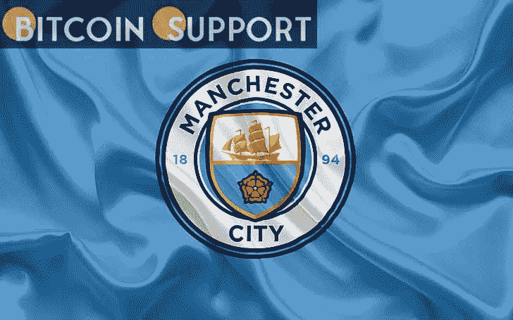

# 曼城正在建造元宇宙的第一个足球场

> 原文：<https://medium.com/coinmonks/manchester-city-is-creating-the-metaverses-first-football-stadium-903addb37f6b?source=collection_archive---------36----------------------->

[https://bitcoinsupports.com/](https://bitcoinsupports.com/)

在索尼虚拟现实(VR)专家的帮助下，目前的英超冠军曼城队已经开始在元宇宙建造世界上第一个足球场。根据 inews.co.uk 的独家报道，City 与索尼合作了一项为期三年的计划，虽然该项目仍处于早期阶段，但该公司的专家团队已经访问了阿提哈德体育场，对其进行了数字地图绘制，并构建了虚拟现实版本。

由于技术和娱乐巨头的子公司鹰眼开发的图像分析和骨骼追踪技术，曼城的体育场阿提哈德将在虚拟现实环境中转变为俱乐部的主要中心。参与该项目的曼城官员希望有一天虚拟的艾特哈德体育场能够爆满，让那些永远不会去曼彻斯特的支持者们可以在自己家里舒适地观看现场比赛，无论他们身在何处。

**对会见元宇宙队员的想法进行了讨论。粉丝们可能会在元宇宙遇到其他玩家，互相交流，购买现实世界中没有的产品，以及其他正在考虑的想法。城市足球集团的首席营销和球迷参与官 Nuria Tarre 说:

***“我们可以想象拥有一个元宇宙的全部意义在于，你可以重现一场比赛，你可以现场观看比赛，你可以通过不同的角度以不同的方式参与比赛，你可以随心所欲地填满体育场，因为它是无限的，完全是虚拟的。”***

***“我认为坐在沙发上看着屏幕的传统形象是我们无法想象的，即使在 10 年后，也许在 5 年后仍然会成为现实。事情发展的比我们想象的要快得多。如果足球在元宇宙风靡一时，它有可能改变电视转播权的分配方式。目前，它们作为整个英超联赛的一部分出售给广播公司，但各队正在考虑将来直接出售给球迷，也许是通过他们自己的 metaverses。

**免责声明:以上为作者观点，不应视为投资建议。读者应该自己做研究。*******

> 加入 Coinmonks [电报频道](https://t.me/coincodecap)和 [Youtube 频道](https://www.youtube.com/c/coinmonks/videos)了解加密交易和投资

# 另外，阅读

*   [Exness 回顾](https://coincodecap.com/exness-review)|[moon xbt Vs bit get Vs Bingbon](https://coincodecap.com/bingbon-vs-bitget-vs-moonxbt)
*   [如何开始用加密贷款赚取被动收入](https://coincodecap.com/passive-income-crypto-lending)
*   [BigONE 交易所评论](/coinmonks/bigone-exchange-review-64705d85a1d4) | [电网交易机器人](https://coincodecap.com/grid-trading)
*   [氹欞侊贸易评论](https://coincodecap.com/anny-trade-review) | [CoinSpot 评论](https://coincodecap.com/coinspot-review)
*   [新加坡十大最佳加密交易所](https://coincodecap.com/crypto-exchange-in-singapore) | [购买 AXS](https://coincodecap.com/buy-axs-token)
*   [投资印度的最佳加密软件](https://coincodecap.com/best-crypto-to-invest-in-india-in-2021) | [WazirX P2P](https://coincodecap.com/wazirx-p2p)
*   [7 个最佳零费用加密交易平台](https://coincodecap.com/zero-fee-crypto-exchanges)
*   [最佳网上赌场](https://coincodecap.com/best-online-casinos) | [期货交易机器人](/coinmonks/futures-trading-bots-5a282ccee3f5)