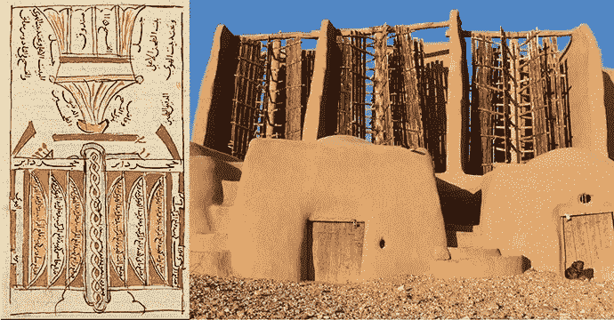

# 人类与能源——一种相互交织的关系

> 原文：<https://medium.com/coinmonks/mankind-and-energy-an-intertwined-relationship-d29e7602ca51?source=collection_archive---------30----------------------->

在希腊神话中，泰坦 ***普罗米修斯*** 从宙斯那里窃取火种给人类，人类因此在他的手中找到了比他的臂力更强大的能源。凡人将能够烹煮肉类、熔化金属、锻造工具、武器和珠宝，但他们也将很快发现管理这种天赋并不容易。

> “能源是唯一的通用货币，”

瓦茨拉夫·斯米尔(Vaclav Smil)在他的《能源与文明》一书中说道，他是马尼托巴大学(加拿大)的名誉教授，是发展模式的学者和技术历史学家。一个故事。

> 史前人类的进化和历史的进程都可以被看作是寻求以更加集中和多样的形式控制能量储存和流动的方法，将它们转化为热、光和运动。

因此，人类为了获得和产生那团火，经历了漫长的道路和努力，只有神话 ***中的普罗米修斯*** 给予了**。**

# **寻找能源**

****

**谈到能源，可用性、成本、易用性和效率是所有时代和文明的共同标准。**

## **在能源的选择上，可用性总是排在第一位:可用性降低了成本。**

**一旦开始开发一种能源，就努力提高其使用的方便性和能源效率。**

**1973 年的石油危机改变了这种思维方式。**

**自 20 世纪 70 年代以来，第一次，面对化石燃料(特别是石油)的有限性问题，人们开始寻求不仅仅是可获得性的解决方案。**

**有关于可持续性的讨论，尽管更多的是经济上的而不是环境上的。**

# ****转动方向盘……****

****

**古代的能源市场没有太多的变化。从公元前 7000 年开始，动物的肌肉被加入到人类的驱动力和火中。古人发现了**旋转运动**对帮助肌肉运动的重要性，并发明了第一台“简单机器”。**

**两个最重要的，允许理解机械原理，同时应用它们，是陶工的轮子和运输的轮子，大概在公元前 6000 年从美索不达米亚传播，尽管已知最古老的遗迹可以追溯到第四个千年。公元前**

**今天我们知道埃及金字塔是由雇佣工人操作的机器建造的。但是古代世界最普遍的劳动力是 T2 奴隶和 T4 动物**

> **两个整天用手动砂轮研磨的罗马奴隶(从公元前 3 世纪开始)每小时只能生产不到 7 公斤的面粉**

**说 Smil ***。*****

> **更有效率的是一头驴操作的 mola asinalis(由火山岩制成的“庞贝磨坊”)。但他们是奴隶，是古罗马大面包店搅拌器的能量来源:帝国的主食是以可怕的身体痛苦为代价生产的。**

**再次重申:**

> **没有中世纪的“ [***”卡尔坎蒂***](https://en.wikipedia.org/wiki/Treadwheel_crane) ”，没有转动大木轮移动建筑工地起重机的*仓鼠人*，我们就不会有哥特式教堂。**

****

**Source: wikipedia**

> **在 19 世纪的英国，女王陛下的监狱里的囚犯在平行的滚轴上行走数小时，为各种设备提供机械能。1823 年，德文郡监狱的主任评论道:“我不认为这是一份有辱人格的工作；相反，它使囚犯保持健康”。**

# ****自然力:利用水能和风能****

**古代的能量鸡尾酒包括水和风。罗马人知道水车，这是埃及和希腊发明的演变，但他们很少使用它。**

**公元二世纪，在法国普罗旺斯的巴尔贝克，他们建造了当时最大的磨坊综合体，有 16 个轮子为磨盘提供动力，然而水提供的能量还不到帝国能量的 1%。磨坊真正从中世纪晚期开始蔓延:在那之前，奴隶更便宜。**

**风的力量推动着希腊和罗马的船只，但是大部分工作是由划手的手臂完成的。在这里，也是过了几个世纪，航海技术的创新才使得船帆和船壳的效率足以允许 15 世纪的探险旅程。**

***风车，古代晚期波斯和阿富汗之间常见，9 世纪后出现在欧洲，也是拜阿拉伯人所赐，并为磨盘和水泵提供动力:正是由于风车，荷兰人在 17 世纪抽干了 [*圩田*](https://en.wikipedia.org/wiki/Polder#:~:text=A%20polder%20(Dutch%20pronunciation%3A%20%5B,a%20lake%20or%20the%20seabed) 。***

******

***Windmills in the Iranian region of Nishtafun Right***

***将今天最有前途的可再生能源，比如风能，与这些古老的先例相比较可能很有诱惑力，但是中世纪的风车和风力涡轮机的主要区别在于前者产生机械能，后者产生电能。***

****但是我们可以在这些资源的所有权上找到一个类比。****

***不像推动水车的河流所经过的土地，风不属于任何人；事实上，风车的传播减少了中世纪欧洲的冲突和社会紧张。如今，石油、天然气和煤都是从自有土地上开采的资源，而对于风能，只考虑安装叶片的地方的所有权，而不是能源本身的所有权。***

# ***第一次能源危机***

******

***Credit: National Geographic Society***

******还有普罗米修斯之火？******

***几千年来，我们用泥煤(T21)、干粪，尤其是木头来喂养它。***

> ***城市比木材更需要木炭***
> 
> ****说 Smil。****
> 
> ***"这是唯一一种前工业时代的燃料，产生的烟很少，因此是家庭取暖的首选。"***

***然而， [**木炭比从矿井中开采出来的化石煤**热量低:](https://world-nuclear.org/information-library/facts-and-figures/heat-values-of-various-fuels.aspx)***

> ***对于温带气候地区的大城市来说，需要至少 100 倍于其面积的木材丰富的区域来保证必要的燃料。十六世纪，对木材和木炭的渴求导致了欧洲第一次重大的能源危机。***

***人口增长和新大陆的殖民化导致大西洋这边的制造业活动增加，需要越来越多的燃料。这些巨大的需求与供应困难发生了冲突，这变成了一些人所说的“ [**木材危机**或“**森林砍伐危机**](https://timeline.com/american-settlers-climate-change-5b7b68bd9064)”:短缺会导致不断增加的**【通货膨胀】。*****

*****事实上，木材和木炭的高价格使得工业革命的合作伙伴煤的开采变得很有竞争力。*****

# *****能源 BOOMS*****

**********

*****工业化的每个阶段都有其能源来源。*****

*****第一次繁荣(*1787-1814*)与 **煤矿***两千年前中国人就已经使用*)的系统化**开采和**蒸汽机**的肯定相吻合。*******

***在 1769 年，先前尝试的改进导致了苏格兰人詹姆斯·瓦特的专利。为了计算他的蒸汽机产生能量的功率，瓦特用“*马力*”作为计量单位。***

***但是有一个条件。***

> ***“当时一匹活马产生的动力平均不到一马力，”***
> 
> *****Smil 解释道。*****
> 
> ***"瓦特夸大了预算，以赢得顾客，让他们用他的蒸汽机取代移动机器的动物。"***
> 
> ***这个想法奏效了，瓦特的创新获得了商业上的成功。***

***第三个膨胀周期(*1898–1924*)以**电**的名义发生。在为住宅和工业环境提供照明方面，这是一个伟大的进步，但最重要的是，这是在创造*高效机械*方面的突破:**电动机**进入工业领域，使生产更容易，它们可以更容易地与其他机械部件连接，它们的节奏可以校准，没有了以前用于传输运动的皮带——**一切都变得更快**。***

***电报、电话、收音机、家用电器……电气方面的突破就像普罗米修斯送给我们的一份新礼物。***

****但是有阴暗面:****

## ***大量燃烧化石燃料产生的日益增长的温室气体排放。***

******

# *****战争之风*****

******

***利用和控制能源一直是人类最重要的事情——但我们都知道这些资源在某种程度上是有限的。***

***不出所料，有限能源的竞争变成了冲突。事实上，在 ***普法战争***(*1870-71*)和第一次世界大战*(*1914-18*)中，赌注是鲁尔和萨尔的煤矿，它们为钢铁高炉提供燃料。相反，整整一个世纪过去了，在石油引发国际危机之前，在 1956 年的苏伊士运河危机中，英国和法国试图阻止埃及将中东原油流经的运河国有化，但没有成功。****

****在工业化前的世界，石油不过是一种好奇心，以里海沿岸的地面油田和中国开采的天然气而闻名。****

****1859 年 8 月 27 日*在宾夕法尼亚州的泰特斯维尔钻了第一口井，石油时代正式开始。*****

## *****但是直到 1886 年内燃机和汽车才把它变成了黑金。*****

*****从苏伊士运河危机到今天，原油战争的清单很长:中东、高加索、中亚、南美……英美石油公司、冷战的超级大国、寡头和亚洲独裁者相互对抗，中东紧张局势。*****

*****即使在今天，世界上大约 80%的一次能源来自化石燃料(石油、天然气和煤)，等待 1954 年开始的能源转换，这一年第一个光伏电池能够将阳光转化为电能。*****

# *****原子的力量*****

**********

*******核能** *值得单独讨论。******

****20 世纪 70 年代，在石油危机中，核能有望在 21 世纪初改变世界。相反，如今“仅” [**世界 10.3%的电力来自核电站。**](https://world-nuclear.org/information-library/current-and-future-generation/nuclear-power-in-the-world-today.aspx)****

********

****这是因为在三里岛事故(T1)(美国 T2，1979 年)、切尔诺贝利灾难(T5)(1986 年 T6)(T7)和 2011 年(T11)海啸后福岛反应堆爆炸(T8)之后，许多人已经放弃生产这种方便但被认为太危险的能源。****

****更不用说核废料这个从未解决的问题了。****

# ******权力的社会方面&能量******

****力量的概念可以用来分析人类与自然之间的相互依存关系，以**火**的驯化为例:当人类学会驯服火焰并获得**火力**时，人类与自然环境之间的关系发生了巨大的变化。****

****获得对这种重要能源的控制不仅让我们的物种得以生存，而且释放了与利用这种强大能源相关的巨大工程潜力，让人类在食物金字塔顶端向前迈出了一大步，成为地球上的主导物种。****

****能量以一种错综复杂的方式与我们周围发生的一切交织在一起。从一开始，大约三百万年前，直到今天，人类通过掌握和控制能量而进化和进步。****

****但是，随着“**强大的力量带来巨大的责任**”并且，随着当前改变能源需求模式的努力将目标人群定位为离散和孤立的个体，我们正在见证一种意识的觉醒，即需要一种更明智的方法来解决显然存在明显缺陷的系统问题。****

****不可否认的是，人类当前和未来的道路与我们如何发展利用和有效利用能源的专业知识和技能密切相关，所有这些都是为了更可持续地利用能源，促进人类的进步和进化，这就是为什么要确保我们人类的复原力。****

********

> ****额外资源:****

**** [## 2020 年全球能源评论-分析-国际能源机构

### 当前的新冠肺炎疫情首先是一场全球健康危机。截至 4 月 28 日，有 300 万…

www.iea.org](https://www.iea.org/reports/global-energy-review-2020)  [## 石油美元的兴衰——国际金融体系注定要失败吗？

### “石油美元”如何重新安排世界

medium.com](/the-capital/the-rise-and-fall-of-the-petrodollar-is-the-international-financial-system-doomed-493a4fb8c726)  [## 能源辩论——为什么我们不去改变当前的系统？

### 第一部分——资本主义、痴迷和浪费的故事

medium.com](/the-capital/the-energy-debate-why-we-dont-bother-changing-the-current-system-5a9c60a10a1d)  [## 比特币&能源之争

### 第二部分——比特币的地位如何？

medium.com](/the-capital/bitcoin-the-energy-debate-b25ca499d3e5)  [## 通货膨胀的幽灵

### 财富的“潜在”敌人——金融知识 101

medium.com](/the-capital/the-spectre-of-inflation-770f9ef8369d) 

> 加入 Coinmonks [电报频道](https://t.me/coincodecap)和 [Youtube 频道](https://www.youtube.com/c/coinmonks/videos)了解加密交易和投资

# 另外，阅读

*   《XT.COM 评论》|
*   [SmithBot 评论](https://coincodecap.com/smithbot-review) | [4 款最佳免费开源交易机器人](https://coincodecap.com/free-open-source-trading-bots)
*   [比特币基地僵尸工具](/coinmonks/coinbase-bots-ac6359e897f3) | [AscendEX 审查](/coinmonks/ascendex-review-53e829cf75fa) | [OKEx 交易僵尸工具](/coinmonks/okex-trading-bots-234920f61e60)
*   [如何在印度购买比特币？](/coinmonks/buy-bitcoin-in-india-feb50ddfef94) | [瓦济克斯评论](/coinmonks/wazirx-review-5c811b074f5b)
*   [隐翅虫替代品](/coinmonks/cryptohopper-alternatives-d67287b16d27) | [HitBTC 审查](/coinmonks/hitbtc-review-c5143c5d53c2)
*   [CBET 评论](https://coincodecap.com/cbet-casino-review) | [库科恩 vs 比特币基地](https://coincodecap.com/kucoin-vs-coinbase)****