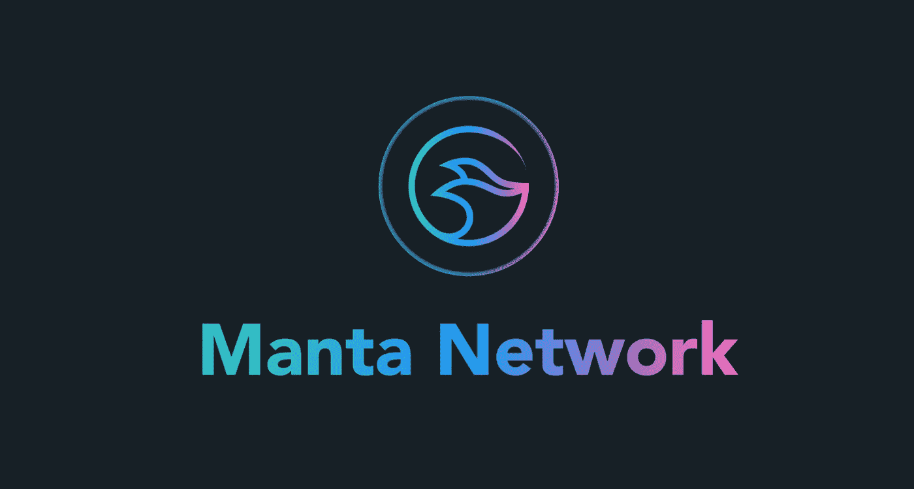

# 曼塔网 Web 3.0 革命是机密吗？

> 原文：<https://medium.com/coinmonks/manta-network-is-revolution-in-web-3-0-confidential-e44e0d0ac0ed?source=collection_archive---------43----------------------->

Photo by [DotMarketCap](https://www.dotmarketcap.com/)

现在每个人都在谈论 Web 3.0，它如何帮助人们拥有完全的行动自由。许多人谈论它，但没有人行动。对此，曼塔网络决定采取行动。

## Manta 网络功能

Manta Network 创造了一种独特的隐私技术，但它是在隐私实用程序的基础上创造的——这反过来使其他加密资产的私有化成为可能。该项目的独特性并不仅限于此，Manta Network 由零知识证明或 ZKR 提供支持，这项技术的性能远远高于其他基于数学原理的项目。这项技术让你超越加密货币，让你创造安全，如:元诗句，NFT，这是越来越受欢迎。

## 项目的可靠性如何，前景如何？

所有的项目都是好的，但不是每个人都能长命百岁，每个人都需要投资人的帮助。许多公司相信他们，如:币安实验室，CoinFund，CMS 和其他。这可能会使项目由于拥有资本而改进技术，而不会停止开发。

Manta Network 有一个很棒的 Web 3.0 隐私功能，得到了该项目的投资者和合作伙伴的支持，因此他们有一个非常光明的未来。

> 加入 Coinmonks [电报集团](https://t.me/joinchat/Trz8jaxd6xEsBI4p)，了解加密交易和投资

# MantaNetwork，# CalamariNetwork，#Prifi，#Polkadot