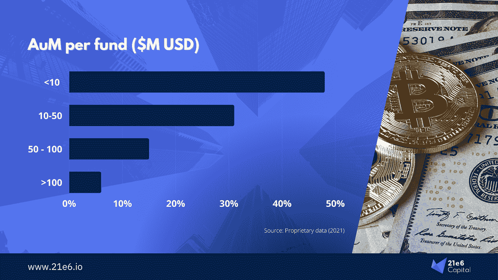

# 描绘出不断增长的加密基金世界

> 原文：<https://medium.com/coinmonks/mapping-out-the-growing-crypto-fund-universe-2ad7c25c25c9?source=collection_archive---------10----------------------->

加密基金是一种相对较新的投资工具，近年来发展迅猛。他们的目标是为专业和机构投资者填补加密投资的空白。通过这些新的加密基金，首次加密投资者的许多高准入门槛(如缺乏基础设施和知识)可以被克服。基金作为一个单一的访问点，它们是一个众所周知且容易投资的工具，由密码和资产管理专家团队策划和管理。2021 年，高净值个人(HNWIs)和家族理财室合计占所有专业加密投资者的 80%以上，家族理财室也表现出越来越大的兴趣[1]。他们大多通过秘密基金进行投资。普通大众接受度的提高，以及对数字资产总体上更加积极的看法，也在这种新型基金的增长中发挥了作用。本文将探索新生的加密基金领域，并提供对不同投资策略、首选住所和 AuM 增长的见解。
*作者:艾伯特·苏吉哈尔托、马克西米利安·布鲁克纳*

# 加密基金的数量持续增长

尽管与数量庞大的传统对冲基金相比，加密基金的规模仍然很小，但迄今为止，加密基金已经发展到 1000 多种不同的基金。所有这些都是在相对较短的时间内发生的，因为专业投资者已经开始对密码表现出兴趣[2]。如图 1 所示，到目前为止，2018 年的增长幅度最大，超过了以往所有年份的总和。不幸的是，这也是“加密冬天”的开始，这是一个加密市场长期高度波动和悲观情绪的时期。因此，自 2019 年以来，新推出的加密基金比 2018 年少。**尽管如此，随着越来越多的机构投资者寻求在他们的投资组合中加入加密技术，我们预计新推出的基金数量每年都会继续增长。新玩家进入市场的空间仍然很大。**

Figure 1: Inception year of crypto funds

随着加密基金数量的增长，它们的 AuM 总额也在增长。截至 2021 年底，加密基金累计 AuM 超过 690 亿美元。这是 2020 年同期金额(360 亿美元)的两倍多[3]。我们认为有两个因素促成了这一大幅增长。首先，市场上有一个共识，即 crypto 将继续存在。高资产净值人士和家族理财室是新投资工具的早期采用者，随着对通胀的担忧和接受度的上升，现在投资加密变得更加紧迫。其次，过去几年，加密基金的表现一直优于比特币。这是由于他们暴露于各种替代硬币，以及正确分散不同加密资产的能力。挑选合适的替代硬币需要专家研究。因此，拥有专家团队的基金是投资多元化加密货币篮子的绝佳方式。

# 预计大量资本将从传统对冲基金和机构流入

超过五分之一的机构投资者和四分之一的传统对冲基金正计划进一步增加对加密资产的敞口。**考虑到这些对冲基金中有三分之一管理着超过 100 亿美元的 AuM，未来几年流向 crypto 的资本将是巨大的** [4]。看看这些资金将如何在加密基金中分配将会很有趣。图 2 显示了每个基金的 AuM 的当前分布。考虑到大多数基金都是在 2018 年之后推出的，所以大多数基金仍然拥有 1000 万美元以下的 AuM 是有道理的。在 2018 年之前(有些是从 2013 年开始)的玩家通常拥有数十亿的 AuM 但他们很少。

Figure 2: Breaking down the crypto fund universe by AuM per fund

因此，尽管大部分资金高度集中在少数几只历史记录更长的基金和资产管理公司手中，**我们预计中等规模的基金将分得一大块新蛋糕。因此，管理 1000 万至 5000 万美元的加密基金的数量应该会逐渐减少，因为它们受益于对冲基金的流入资本。**这些基金拥有相当长的历史记录，而且规模仍然很小，足以让投资者与他们未来的加密资产管理公司建立联系。管理 1000 万美元及以下的基金数量应该保持相对稳定，因为新基金将取代那些超过 1000 万美元的基金。当然，机构投资者的目标是管理 1 亿美元及以上的基金。极少数加密基金目前管理着超过 10 亿英镑的资金；我们预计，随着机构进入游戏，这个群体的人数将会增加。

# 大多数秘密基金只是一种新的技术风险投资

并非所有的加密基金都是一样的。事实上，即使在这样一个年轻的宇宙中，我们也已经可以区分出许多策略。如图 3 所示，超过一半的加密基金是风险资本基金。这些基金与任何专注于科技的风险投资基金一样，只是它们只专注于区块链的初创公司。毫不奇怪，它们构成了加密基金的最大部分。基于股权的投资要简单得多，监管的不确定性也少得多，而且向初创公司“推销”投资也比代币容易得多。风险投资是大多数投资者已经熟悉的东西，以这种方式跳到区块链似乎更容易管理。然而，有趣的是，平均而言，这些基于风险投资的策略的回报小于自由决定的多头和多空策略。这些实际上产生最高的回报，其次是量化和/或套利[1]。

Figure 3: Different investment strategies of crypto funds.

其他策略基本上可以分为定向基金和市场中性基金，定向基金的数量远远超过那些追求市场中性策略的基金。定向基金倾向于追求主要围绕多头/空头定位的策略，而市场中性基金则从事套利和做市。这些通常是更具开创性的资产管理公司——他们专门投资代币，比他们的风投同行提供更好的流动性。

# 大多数加密基金位于开曼群岛和英属维尔京群岛

看到 43%的加密基金位于开曼群岛或英属维尔京群岛并不奇怪——它们的对冲基金大多位于类似的地方。然而，应区分法定住所和管理基金的经理所在地。**根据普华永道(PwC)2021 年的一项研究，大多数加密基金经理实际上把美国作为他们的家，其次是英国和香港[1]。此外，许多加密基金遵循分散劳动力的理念，很大程度上符合区块链社区其他成员的精神。**

Figure 4\. Crypto funds by legal domicile.

瑞士也占据了显著的位置，有 10%的加密基金位于瑞士。一个合乎逻辑的原因是友好的税收环境，以及相当清晰和先进的加密监管。区块链创业公司的热点城市 Crypto Valley 毕竟也在瑞士。

# 市场还有很大的空间

这个宇宙仍处于婴儿期。与传统对冲基金管理的规模相比，大多数加密基金都很小。随着这些对冲基金和机构寻求增加加密风险，加密基金市场应该会大幅增长。对不同工具的需求将会增加，我们预计随着对加密货币的直接投资增加，风险投资的主导地位将会有所下降。此外，我们预计对套利策略的需求将会增长，因为它们的提款和波动性较低。然而，要让所有这些真正成形，我们需要更多的监管确定性，特别是在美国。

# 评论

*请注意，本分析既不代表财务建议，也不应被理解或解释为买卖任何证券、硬币或代币的邀约。本文中表达的任何观点(如有更改，恕不另行通知)均为作者个人观点。作者不保证所提供的任何信息或分析的准确性或完整性。*

*如果你喜欢这篇文章，我们会很高兴你转发给你的同事或在社交网络上分享。如果你是这一领域的专家，并想批评或赞同这篇文章或其中的一些部分，请随时在这里或上下文中留下私人笔记，我们将尝试回应或解决同样的问题。*

# 大约 21e6

21e6 Capital 是一家瑞士投资顾问公司，为专业投资者提供最佳加密投资产品。21e6 Capital 已经分析了全球 1000 多只加密基金，并将其浓缩为一个精选，可以在最大限度降低下行风险的情况下产生加密风险。21e6 Capital 拥有一支经验丰富的加密和金融专家团队，他们在数字资产和 DLT 方面有着深入的知识，在此团队的支持下，21e 6 Capital 创建了一个独特的量化策略，旨在实现类似加密的回报，同时将全球股票水平的风险和波动性降至最低。21e6 资本团队建立在强大的学术基础之上，拥有领先的加密资产和分散金融出版物和研究的记录，确保为金融行业专业人士提供最先进的加密投资解决方案。

# 作者

Albert Sugiharto 是 21e6 Capital 的销售和营销助理。Albert 作为一名管理顾问积累了丰富的经验，专注于战略、组织和变革管理。他毕业于慕尼黑工业大学，并与 Philipp Sandner 教授一起对安全令牌产品进行了广泛的研究。艾伯特拥有精益六适马黄带认证。除了在 21e6 Capital 工作之外，他还参与了国际代币标准化协会的 ITC 工作组，该工作组每年对数百种代币进行研究和分类。他还在区块链创始人小组支持许多区块链初创公司。你可以通过 [albert.sugiharto@21e6.io](mailto:albert.sugiharto@21e6.io) 联系 Albert 了解关于这篇文章和 21e6 Capital 的更多信息。

**马克西米利安·布鲁克纳**是 [21e6 资本公司](https://assets.21e6.io/)的营销&销售主管。在此之前，他曾担任[国际令牌标准化协会(ITSA)](https://my.itsa.global/) 的执行董事，主要负责根据国际令牌分类(ITC)框架对加密资产进行研究和分类。他积极参与创建了世界上最大的令牌数据库，用于令牌的分类和识别数据(TOKENBASE)。马克西米利安毕业于法兰克福金融和管理学院，并在与菲利普·桑德纳教授的密切磋商下进行学术研究。您可以通过电子邮件联系 Maximilian，电子邮件地址为:Maximilian . bruckner @ 21e 6 . io，索取更多关于 21e6 Capital AG 的信息，或就本文提出任何问题。你也可以在 LinkedIn[上关注马克西米利安](https://www.linkedin.com/in/max-bruckner/)([https://www.linkedin.com/in/max-bruckner/](https://www.linkedin.com/in/max-bruckner/))来了解最新消息。

# 参考资料:

[1]普华永道—第三次全球加密对冲基金年度报告(2021)
【2】富达数字资产—机构投资者数字资产研究(2021)
【3】加密基金研究—2021 年第四季度报告(2021)
【4】EY—全球另类基金调查(2021)

> 加入 Coinmonks [电报频道](https://t.me/coincodecap)和 [Youtube 频道](https://www.youtube.com/c/coinmonks/videos)了解加密交易和投资

# 另外，阅读

*   [币安期货交易](https://coincodecap.com/binance-futures-trading)|[3 commas vs Mudrex vs eToro](https://coincodecap.com/mudrex-3commas-etoro)
*   [如何购买 Monero](https://coincodecap.com/buy-monero) | [IDEX 评论](https://coincodecap.com/idex-review) | [BitKan 交易机器人](https://coincodecap.com/bitkan-trading-bot)
*   [CoinDCX 评论](/coinmonks/coindcx-review-8444db3621a2) | [加密保证金交易交易所](https://coincodecap.com/crypto-margin-trading-exchanges)
*   [红狗赌场评论](https://coincodecap.com/red-dog-casino-review) | [Swyftx 评论](https://coincodecap.com/swyftx-review) | [CoinGate 评论](https://coincodecap.com/coingate-review)
*   [Bookmap 点评](https://coincodecap.com/bookmap-review-2021-best-trading-software) | [美国 5 大最佳加密交易所](https://coincodecap.com/crypto-exchange-usa)