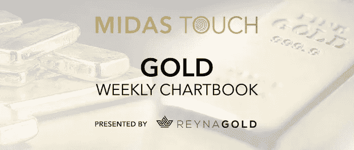
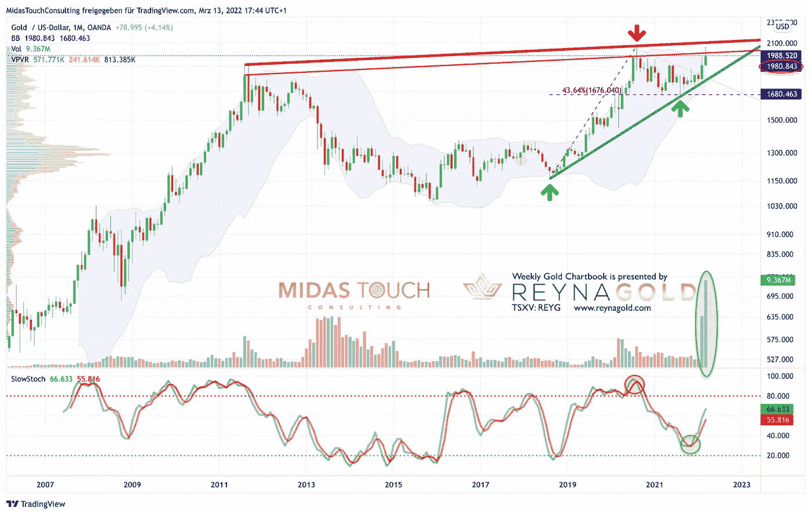
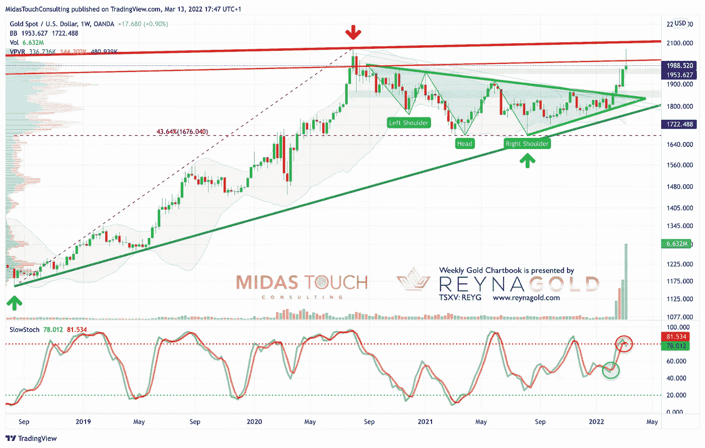
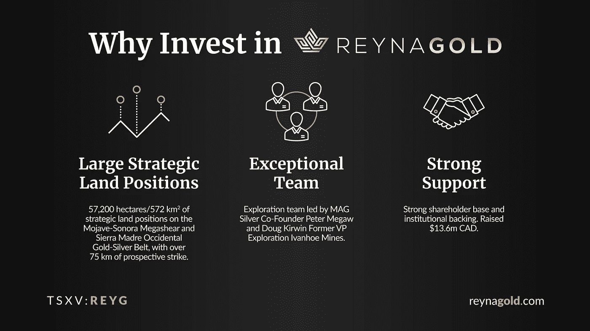
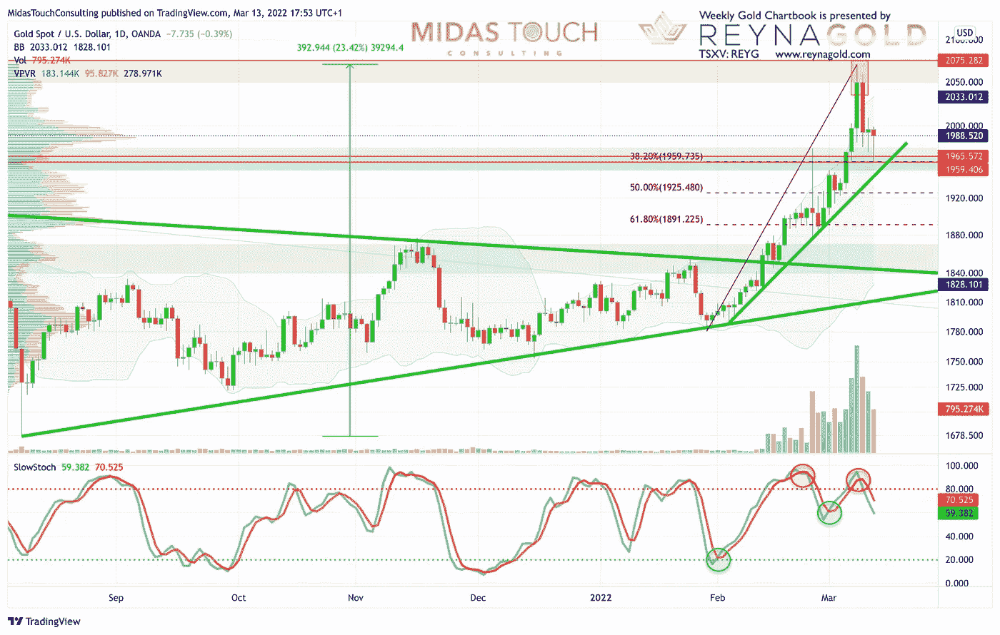
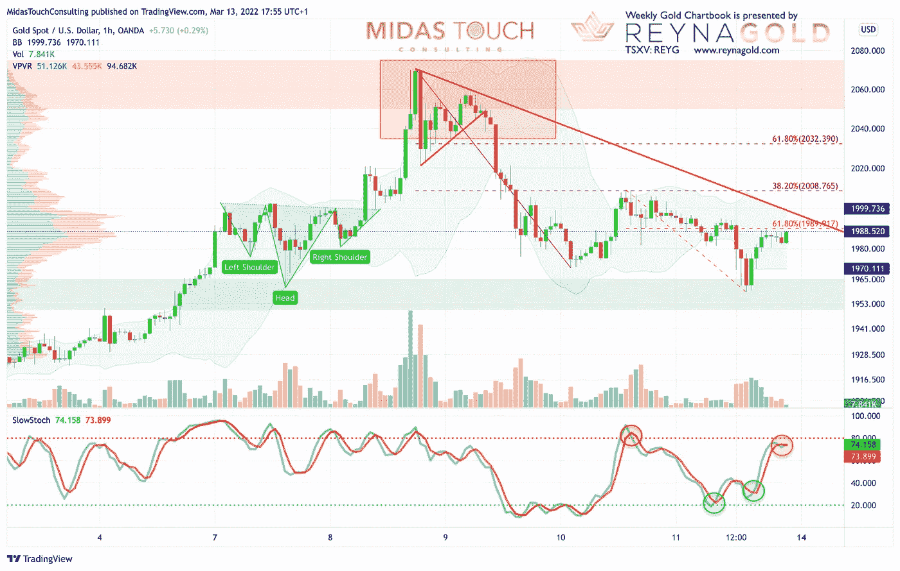
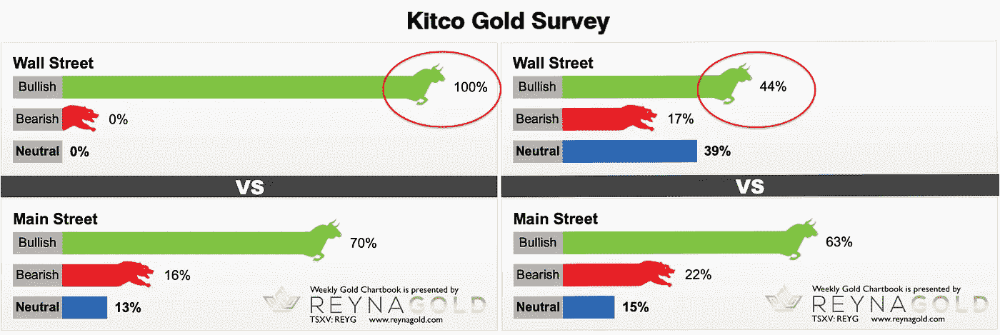

# 2022 年 3 月 13 日，黄金图表——春季调整还是进一步升级？

> 原文：<https://medium.com/coinmonks/march-13th-2022-gold-chartbook-spring-correction-or-further-escalation-456fdab75f37?source=collection_archive---------46----------------------->

当黄金在 2 月初开始突破其数月三角形时，我们认为 1975 美元是一个现实的目标。我们还指出，短期内冲向 2000 美元是有可能的。当时我们对过去六周发生的地缘政治动荡知之甚少。俄罗斯入侵以及随后的大规模制裁，推动大宗商品和黄金价格大幅上涨。尽管在遵循你预先计划的分析的同时保持一个开放的市场聆听者看起来非常具有挑战性，但我们现在看到一个黄金在短期内变得脆弱的格局。与此同时，基本面从来没有像现在这样看好黄金，再次向 2075 美元的历史高点发起冲击并不需要太多的上行空间。黄金——春季调整还是进一步升级？

让我们用自上而下的方法来考察黄金市场。

## 美元计价的黄金，截至 2022 年 3 月 13 日的月度图表。

*Gold in US-Dollar, monthly chart as of March 13th, 2022.*

自 2011 年 8 月以来，黄金一直在建立一个非常大的杯子和处理形成。目前最保守的价格线位于 2100 美元左右。你也可以说，1，900 美元至 2，100 美元之间的整个区域是颈线，一旦黄金突破该阻力区，天空将是极限。随机振荡指标在月图上给出了明确的买入信号，最近的交易量超过了过去 25 年的任何交易量。但是月布林线(1980 美元)到目前为止只允许一个短暂的上涨，并且是一个强大的阻力，因此任何回到 2000 美元以上的走势都需要多头的额外努力。

**总的来说，月图是看涨的，可以说突破已经全面展开。然而，同时图表显示在 1980 美元和 2100 美元之间有巨大的阻力。另一方面，自 2018 年 8 月以来，在 1，800 美元左右的上升趋势线下方回调似乎不太可能。因此，金价可能会在 1，800 美元至 2，100 美元之间盘整一段时间。**

## 美元计价黄金，截至 2022 年 3 月 13 日周线图。

*Gold in US-Dollar, weekly chart as of March 13th, 2022.*

在其周线图上，黄金已经连续第四周在周线布林线上方交易。通常，5 或 6 周是一个字符串趋势可以拉伸这些波段的最大值。因此，对公牛来说，空气变得越来越稀薄。同样，随机振荡指标发出了卖出信号。

显然，上升趋势仍然完好无损，但多头需要很快重新回到 2000 美元关口。否则，超买设置很容易引发更大的回调。回调到 1，840 美元左右的头肩形态的颈线需要一些时间，但并非不可能！

**总体来说，周线图是中性到轻微看涨，但上周的蜡烛线看起来像是反转。因此，警告信号正在增加。**

## 美元黄金，截至 2022 年 3 月 13 日日线图。

*Gold in US-Dollar, daily chart as of March 13th, 2022.*

在日线图上，自 2021 年 8 月本轮反弹开始以来，黄金已经上涨了 393 美元，涨幅为 23.4%。自 2022 年 1 月下旬以来的大幅上涨带来了 290 美元或 16.3%的收益。从上周三的一个大反转日开始的回调，到目前为止正好回撤了最近反弹的 38.2%。因此，上周五 1，958 美元的低点让买家重返市场。

总之，上周的价格走势有一种顶级的味道，随机振荡指标激活了一个新的卖出信号。因此，最近几周的强劲反弹有可能转化为黄金市场典型的春季顶部。跌破周五低点 1，958 美元将确认空头已经接管控制权。

## 黄金美元，截至 2022 年 3 月 13 日 1 小时图。

*Gold in US-Dollar, 1-hour chart as of March 13th, 2022.*

在这个关键时刻，我们将进一步关注价格走势。1 小时图显示了黄金市场过去 10 天的走势。在最初的反向头肩底形态之后，多头将金价推至接近历史高点(2075 美元)。但在短暂的三角形盘整后，空头终于重返市场，并设法在两波行情中将金价推低近 110 美元。第一次反弹在 2008 美元的 38.2%回撤处失败，而周五的抛售恢复了第二波下跌的近 61.8%(1990 美元)。

因此，如果黄金想要继续牛市，它必须尽快攻克 1990 美元和 2008 美元。在这两个目标之间，第一条下跌趋势线正在等待，也需要被打破。

**总的来说，1 小时图上的显微镜分析清楚地表明，黄金需要重新回到 2000 美元和 2030 美元，然后我们才能认为这波涨势尚未结束。**

## 情绪-建议谨慎

*Kitco Gold Survey as of March 4th, 2022 vs. Kitco Gold Survey as of March 11th, 2022.*

看看[最近的金拓黄金调查](https://www.kitco.com/news/2022-03-11/Market-sentiment-signals-gold-price-needs-to-consolidate-after-pushing-above-2-000.html)，散户资金仍然相当乐观。但专业人士在过去一周表现出了强烈的 180 度大转弯。你也知道，情绪分析是王道。你每年收到的极端信号很少——通常是两到三个。这需要极大的耐心。通常，只有敏锐的反向思维才能真正看到它们，更不用说根据这些罕见的信号采取行动了。

**显然，当前金拓黄金调查的读数和专业人士预期的变化为多头提供了强烈的警告信号！**

## 结论:春季回调还是进一步升级？

虽然令人不安的地缘政治发展在某种程度上打乱了我们的上行路线图，但整体价格走势符合我们的模板。从宏观经济角度来看，大规模前所未有的制裁以及由此导致的俄罗斯经济内爆肯定会导致通缩。然而，实物黄金需求应该仍然非常强劲，由于供应萎缩，大宗商品价格可能继续飙升。

**从技术角度来看，上周看起来像是趋势反转，但空头需要用低于 1958 美元的新低来支持他们的论点。否则，多头肯定会很快再次进攻。**

**另一个我们在上一期图表中已经提到的观察结果是，白银仍然没有出现在贵金属领域的持续派对上。黄金的小弟弟通常在顶峰前不久以强劲的表现出现，抛出一些热门唱片，然后彻底摧毁聚会。这种经典模式至今未被观察到。举例来说，如果白银价格在几天内逼近 30 美元，我们就会变得极其谨慎。这种典型的“顶部信号”目前还没有出现。**

尽管如此，如果你打算持有这些账面头寸几周或几个月，那么新的多头交易头寸的风险/回报比是相当不利的。但与此同时，最近的发展再次清楚地表明长期持有实物黄金和白银是多么重要！

**总而言之，黄金在 2030 美元上方看涨，在 1960 美元下方看跌。在这两个数字之间，很难得出一个强烈的偏见。**

*随时加入我们的* [*我们的免费电报频道*](https://www.midastouch-consulting.com/services/newsletter-telegram) *获取每日实时数据和一个伟大的社区。如果您喜欢定期了解我们的黄金模型、贵金属和加密货币，您还可以订阅我们的* [*免费简讯*](http://bit.ly/1EUdt2K) *。*

*披露:Midas Touch Consulting 和我们团队的成员都投资于 Reyna Gold Corp .这些声明旨在披露任何利益冲突。它们不应被误解为购买任何股票的建议。本文及其内容仅供参考，不包含投资建议或推荐。每一次投资和交易都有风险，读者在做决定时应该进行自己的研究。此处表达的观点、想法、看法，均为作者个人观点。它们不一定反映或代表 Midas Touch Consulting 的观点和意见。*

> *加入 Coinmonks* [*电报频道*](https://t.me/coincodecap) *和* [*Youtube 频道*](https://www.youtube.com/c/coinmonks/videos) *了解加密交易和投资*

# 另外，阅读

*   [Bookmap 评论](https://coincodecap.com/bookmap-review-2021-best-trading-software) | [美国 5 大最佳加密交易所](https://coincodecap.com/crypto-exchange-usa)
*   最佳加密[硬件钱包](/coinmonks/hardware-wallets-dfa1211730c6) | [Bitbns 评论](/coinmonks/bitbns-review-38256a07e161)
*   [新加坡十大最佳加密交易所](https://coincodecap.com/crypto-exchange-in-singapore) | [购买 AXS](https://coincodecap.com/buy-axs-token)
*   [红狗赌场评论](https://coincodecap.com/red-dog-casino-review) | [Swyftx 评论](https://coincodecap.com/swyftx-review) | [CoinGate 评论](https://coincodecap.com/coingate-review)
*   [投资印度的最佳密码](https://coincodecap.com/best-crypto-to-invest-in-india-in-2021)|[WazirX P2P](https://coincodecap.com/wazirx-p2p)|[Hi Dollar Review](https://coincodecap.com/hi-dollar-review)