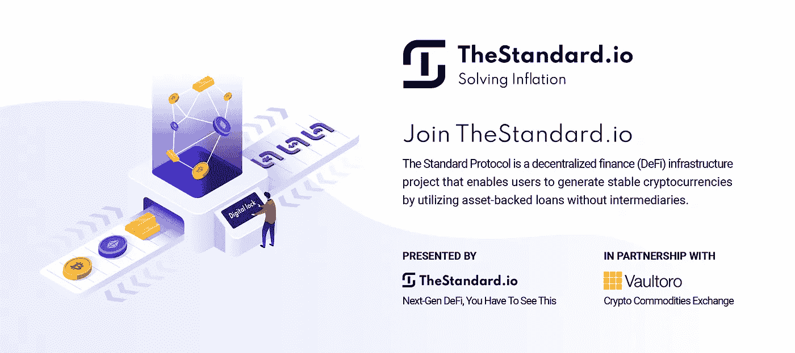
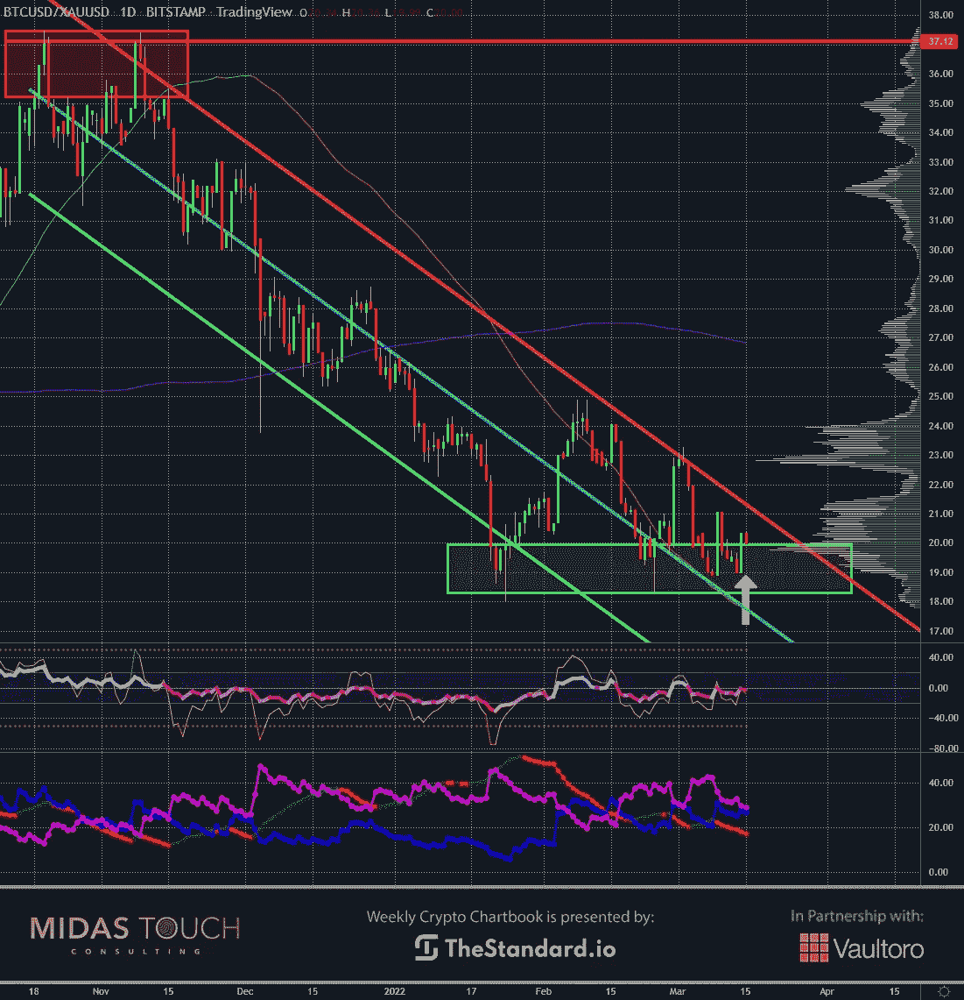
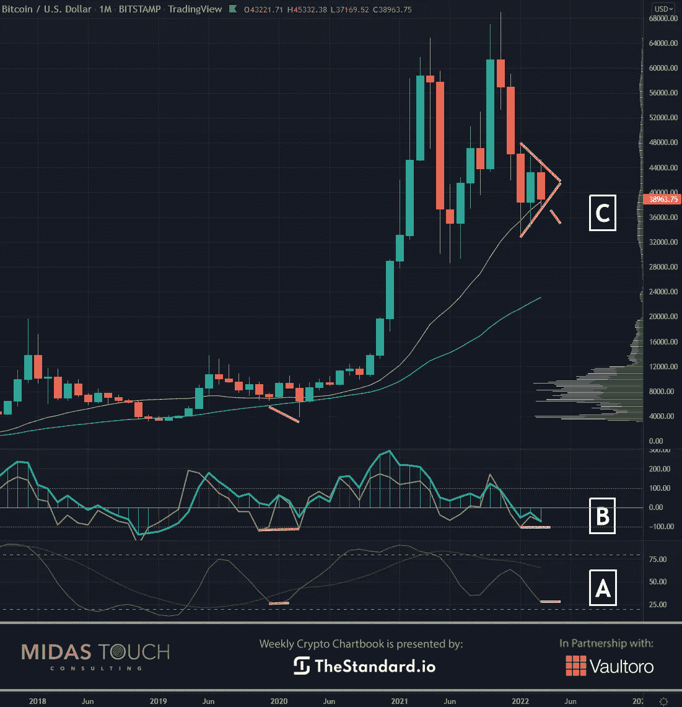
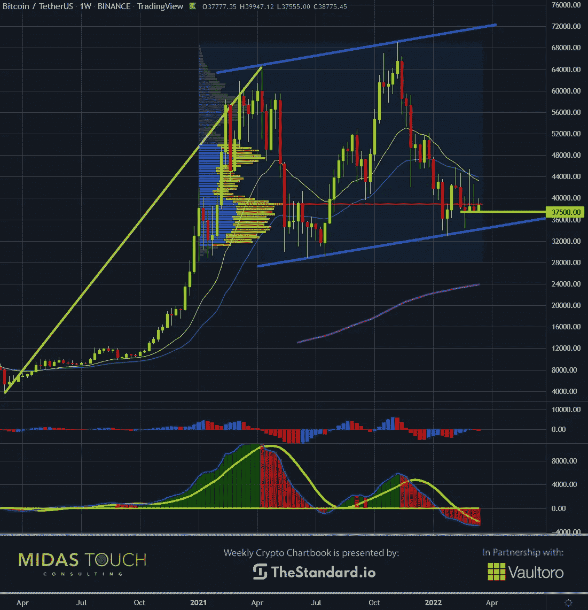
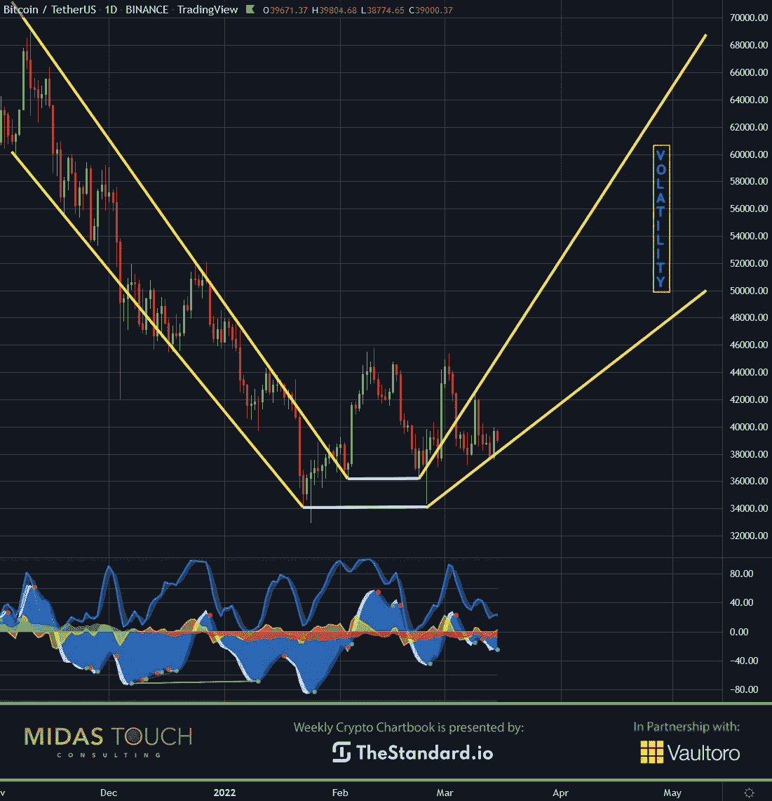

# 2022 年 3 月 15 日，密码本——需要比特币作为替代

> 原文：<https://medium.com/coinmonks/march-15th-2022-crypto-chartbook-bitcoin-is-needed-as-an-alternative-f3519672f460?source=collection_archive---------50----------------------->

最近的战争气候创造了对比特币的更高需求。比特币在财富保值方面的用途变得更加明显。还有一个方面可能会成为焦点。主要货币需要自由流动，以实现其作为交换手段的最高统治。一旦实施制裁，世界货币的价值就会下降。当然，竞争是为了创造一种可以用作支付方式的媒介。不同国家之间的竞争已经持续多年，以宣传他们的数字货币。然而，当前的政治环境凸显了这种紧迫性。**需要比特币作为替代**

疲软的美元和目前意想不到的气候似乎没有完全反映在比特币的价格中。因此，比特币价格可能会在不久的将来飙升。

## 比特币/黄金比率，日线图，底部建筑:

*Bitcoin/Gold-Ratio, daily chart as of March 15th, 2022.*

危机时期的一个现象是，个人寻找绝对或极端的方法来解决困难的情况。相反，我们提倡一种更加基于原则的解决问题的过程，一种选择的方法。关于财富保值，这将意味着黄金和白银与比特币齐名。

**比特币/黄金比率**的日线图显示了下跌趋势后的底部构建。目前，一个人可以用 20 盎司的黄金购买一个比特币。几乎是五个月前的一半。事实上，这是一个将持有的贵金属部分转换成廉价比特币的机会。

## 比特币，月图，处于等待位置:

*Bitcoin in USD, monthly chart as of March 15th, 2022.*

战争从本质上分裂了国家，这并不意味着仅仅局限于那些直接相互冲突的国家。此外，正是这种鸿沟加剧了各国竞相率先发行数字货币的竞争。受制裁国家获得美元的渠道有限。因此，他们非常想创造一种替代的支付方式。

月度图表没有显示比特币的基本面支撑。三角形的早期迹象表明，我们发现有可能向上突破。慢速随机指标读数(A)显示，上一次在这些水平附近，一个强有力的上涨随之而来。类似于黄色 CCI 涡轮增压线级读数(B)。在此之前，我们目睹了价格的快速下跌，这并不奇怪。

## 比特币，周线图，需要比特币作为替代品:

*Bitcoin in USD, weekly chart as of March 15th, 2022.*

放大到每周的时间框架，我们可以更详细地了解多头和空头之间的战斗。在过去的三周里，价格在 POC 之上被拒绝(控制点=高容量节点，其中我们的容量概况分析涵盖了过去 15 个月)。同样，价格行为也反映了战争气候的不确定性。与此同时，多头对空头试图将价格推低至 37，500 美元以下的任何企图都保持了稳定。因此，一旦交易从这种“磁铁交易”转向高交易量节点，我们应该会看到一个实质性的变化。

## 比特币，日线图，收益和波动性:

*Bitcoin in USD, daily chart as of March 15th, 2022.*

上面的比特币日线图描述了我们对未来的看法。我们预计价格将在下个月达到历史最高水平。不幸的是，比特币不是典型的摇摆交易方式。我们预计市场会出现波动。因此，短期和中期交易将具有挑战性。在时间框架内加快步伐是避免噪音的有效方法。

# 比特币需要作为一种选择:

**政府将试图保持他们的垄断和权力。然而，我们不认为大众接受数字美元会那么容易。我们发现在一个快速变化和许多挑战的高度过渡时期尤其如此。**

**通常，通过媒体的多重宣传浪潮已经弥合了这种怀疑，但可能已经失去了一些可信度。因此，比特币也很有可能被大规模采用。它已经有了一段历史，并带有人们可能比预期更渴望的自由的内在特征。**

*随时加入我们的* [*我们的免费电报频道*](https://www.midastouch-consulting.com/services/newsletter-telegram) *获取每日实时数据和一个伟大的社区。如果你喜欢获得贵金属和加密货币的定期更新，你也可以订阅我们的* [*免费简讯*](http://bit.ly/1EUdt2K) *。*

*声明:本文及其内容仅供参考，不包含投资建议或推荐。每一次投资和交易都有风险，读者在做决定时应该进行自己的研究。此处表达的观点、想法、看法，均为作者个人观点。它们不一定反映或代表 Midas Touch Consulting 的观点和意见。*

> 加入 Coinmonks [电报频道](https://t.me/coincodecap)和 [Youtube 频道](https://www.youtube.com/c/coinmonks/videos)了解加密交易和投资

# 另外，阅读

*   [火币的加密交易信号](https://coincodecap.com/huobi-crypto-trading-signals) | [HitBTC 审核](/coinmonks/hitbtc-review-c5143c5d53c2)
*   [如何在 FTX 交易所交易期货](https://coincodecap.com/ftx-futures-trading) | [OKEx vs 币安](https://coincodecap.com/okex-vs-binance)
*   [OKEx vs KuCoin](https://coincodecap.com/okex-kucoin) | [摄氏替代品](https://coincodecap.com/celsius-alternatives) | [如何购买 VeChain](https://coincodecap.com/buy-vechain)
*   [ProfitFarmers 点评](https://coincodecap.com/profitfarmers-review) | [如何使用 Cornix Trading Bot](https://coincodecap.com/cornix-trading-bot)
*   [如何匿名购买比特币](https://coincodecap.com/buy-bitcoin-anonymously) | [比特币现金钱包](https://coincodecap.com/bitcoin-cash-wallets)
*   [瓦济里克斯 NFT 评论](https://coincodecap.com/wazirx-nft-review)|[Bitsgap vs Pionex](https://coincodecap.com/bitsgap-vs-pionex)|[坦吉姆评论](https://coincodecap.com/tangem-wallet-review)