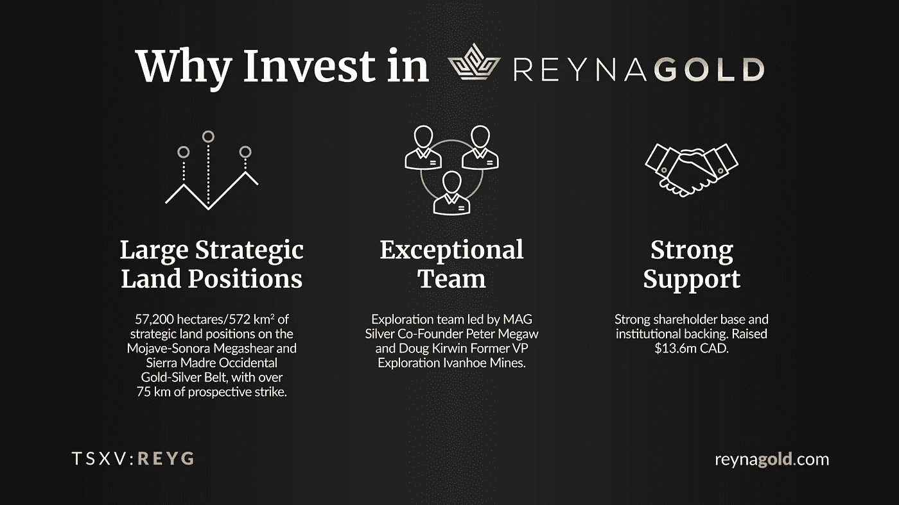

# 2022 年 3 月 19 日，黄金图表——潜在恢复到大约。2000 美元

> 原文：<https://medium.com/coinmonks/march-19th-2022-gold-chartbook-potential-recovery-to-approx-us-2-000-b2cff2837af5?source=collection_archive---------42----------------------->

受乌克兰地缘政治急剧升级以及对俄罗斯前所未有的严厉制裁(导致石油和大宗商品价格飙升)的推动，黄金市场经历了大幅飙升，随后在过去七周内出现了相当残酷的逆转。**黄金——潜在回收率约为。2000 美元。**

从 1 月 28 日 1，780 美元的低点开始，黄金在不到六周的时间里迅速上涨了 290 美元，达到 2070 美元的短期高点。然而，自 3 月 8 日的高点以来，黄金价格跌得更快了。在上周的 FOMC 会议之后，金价总共暴跌了 175 美元，至 1895 美元的低点。价格迅速反弹，回到约 1，950 美元，但周收盘价约为 1，920 美元，价格下跌。

这种反复无常的过山车真的不适合心脏虚弱的人。然而，黄金今年表现良好，尽管即将出现数月的调整，但它现在可能处于另一个向 2000 美元发起攻击的格局中。

## 美元黄金，截至 2022 年 3 月 19 日周线图。

*Gold in US-Dollar, weekly chart as of March 19th, 2022.*

在周线图上，黄金价格一直在以巨大的势头冲高。连续五周，多头能够向上弯曲布林带上轨(1963 美元)。然而，最终的绿色蜡烛线远在布林线之外，看起来像一个周线反转。因此，如果黄金现在已经跌入一个多月的调整，回撤至破碎三角形的颈线，在 1，820 美元至 1，850 美元范围内的反向头肩顶形态将是非常典型的，并且是可以预期的。在这个范围内，整个上涨(从 2021 年 8 月 9 日的低点 1，678 美元到最近的高点 2，070 美元)的经典 61.8%回撤位于 1，827.79 美元。周线随机振荡指标还没有翻转，但是周线动能超买且脆弱。

**总的来说，周线图显示了一个大反转，因此不再支持看涨的情况。然而，在潜在的调整获得动力之前，可能还需要一些时间。**

## 美元计价的黄金，截至 2022 年 3 月 19 日的日线图。

*Gold in US-Dollar, daily chart as of March 19th, 2022.*

虽然周线图可能只是一个多月调整的开始，但日线图上的超买设置已经被最近的大幅回调清除了。尽管周五收盘相当疲软，但黄金可能很快会再次上涨的可能性并不小。然而，黄金多头需要消除 1960 美元附近的支点阻力，才能在经济复苏的背景下打开更高的价格目标。潜在的斐波纳契回撤在 1，962 美元、2，003 美元和 2，028 美元处等待。因此，金价可能会反弹至大约。2000 美元，这是一个整数，因此是一个心理阻力。

另一方面，如果黄金未能回到周四高点 1，950 美元上方，弱势将立即明显加剧。在这种情况下，多头只能希望快速上涨的布林带下轨(1，861 美元)将抓住并限制更深的抛售。但由于随机振荡器已经达到超卖区，空头可能很难将金价大幅推低至 1900 美元以下。

总的来说，日线图略微超卖，黄金可能很快开始反弹。

## 结论:潜在恢复到大约。2000 美元

在强劲反弹和大幅回调之后，黄金市场可能正在重新排序。当周线时间框架指向修正时，超卖日线图指向立即反弹。鉴于这些相互矛盾的信号，投资者尤其是交易者最好在未来几天、几周和几个月保持耐心和谨慎。如果黄金已经进入了一个修正周期，那么在可持续的新上涨趋势出现之前，很可能需要等到初夏到仲夏。

## 替代超级看涨情景

或者，这当然仍然是一种可能的情况，从大的“杯子和把手”模式的突破才刚刚开始。在这种非常看涨的情况下，黄金正在突破 2100 美元上方，以最终完成非常大的“杯柄”格局，这一格局已经发展了 11 年！显然，天空将会是极限。

**总的来说，黄金回到 2030 美元上方真的很乐观。另一方面，在 1895 美元以下，空头将会控制局面。在这两个数字之间，有可能反弹至 1，960 美元或 2，000 美元。**

*随时加入我们的* [*我们的免费电报频道*](https://www.midastouch-consulting.com/services/newsletter-telegram) *获取每日实时数据和一个伟大的社区。如果您喜欢定期了解我们的黄金模型、贵金属和加密货币，您还可以订阅我们的* [*免费简讯*](http://bit.ly/1EUdt2K) *。*

*披露:Midas Touch Consulting 和我们团队的成员都投资于 Reyna Gold Corp .这些声明旨在披露任何利益冲突。它们不应被误解为购买任何股票的建议。本文及其内容仅供参考，不包含投资建议或推荐。每一次投资和交易都有风险，读者在做决定时应该进行自己的研究。此处表达的观点、想法、看法，均为作者个人观点。它们不一定反映或代表 Midas Touch Consulting 的观点和意见。*

> 加入 Coinmonks [电报频道](https://t.me/coincodecap)和 [Youtube 频道](https://www.youtube.com/c/coinmonks/videos)了解加密交易和投资

# 另外，阅读

*   [赢取注册奖金——10 大最佳加密平台](https://coincodecap.com/earn-sign-up-bonus)
*   [Blockfi vs 比特币基地](https://coincodecap.com/blockfi-vs-coinbase) | [BitKan 点评](https://coincodecap.com/bitkan-review) | [Bexplus 点评](https://coincodecap.com/bexplus-review)
*   [南非的加密交易所](https://coincodecap.com/crypto-exchanges-in-south-africa) | [BitMEX 加密信号](https://coincodecap.com/bitmex-crypto-signals)
*   [MoonXBT 副本交易](https://coincodecap.com/moonxbt-copy-trading) | [阿联酋的加密钱包](https://coincodecap.com/crypto-wallets-in-uae)
*   [雷米塔诺评论](https://coincodecap.com/remitano-review)|[1 英寸协议指南](https://coincodecap.com/1inch)
*   [iTop VPN 审查](https://coincodecap.com/itop-vpn-review) | [曼陀罗交易所审查](https://coincodecap.com/mandala-exchange-review)