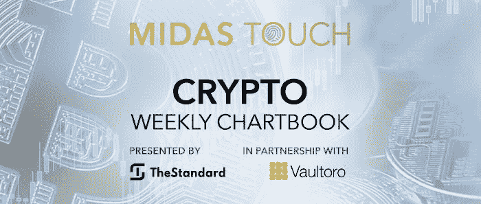
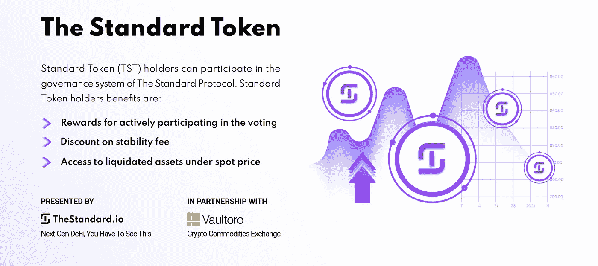

# 2022 年 3 月 1 日，密码本——比特币，买新闻

> 原文：<https://medium.com/coinmonks/march-1st-2022-crypto-chartbook-bitcoin-buy-the-news-590512438c77?source=collection_archive---------77----------------------->

“买入谣言，卖出消息”是上个世纪交易员使用的一个术语。当时，如果在收益发布消息前三周购买股票，这是有利可图的。一个更强有力的原则是从这句话中衍生出来的一个有价值的优势。专业人士知道新闻发布可以改变市场的方向。因此，这些可能是入口点或出口点。当业余爱好者等待新闻发布，并成为他们解读新闻数据的辩论过程的受害者时，专业人士只是把新闻发布作为他们预先计划的交易执行的计时工具。**比特币，买新闻。**

对于新闻，波动性通常会增加，交易量也会增加。对于业余爱好者来说，在动荡的市场环境中进行数据评估通常会导致执行的拖延，也就是说不交易或追逐交易。专业人士找到必要的流动性来退出交易，或利用波动性来降低进场风险。

上周入侵乌克兰也不例外。只有那些有计划的人才能在比特币中找到自己的位置。

## 比特币，日线图，赠品:

*Crypto markets, daily charts as of February 28th, 2022.*

一个赠品是遍布整个加密领域的一个更大的供应区(上面日线图上的绿色水平线)，加密领域的预设买入条目被触发。市场间的关系增加了交易成功的几率。

## 比特币，周线图，进场目标区触手可及:

*Bitcoin, weekly chart as of February 28th, 2022.*

随着我们的进入目标范围几乎达到(见我们的[前图表书](https://www.midastouch-consulting.com/crypto-chartbook-22022022-bitcoin-best-in-play)发布)，我们准备行动，知道一个可能的更大的时间框架调整点是可能的。

你可能会说价格还没有突破进入区间。然而，仔细观察，你会发现由于意外消息日的巨大交易量，供应区的值已经改变，在我们最初计划的区域边缘提供了重要的支持。图表需要不断更新以保持准确！

## 比特币/黄金比率，周线图，另一个边缘堆叠:

*Bitcoin versus Gold in USD, weekly chart as of March 1st, 2022.*

就在这一天，我们还在周线图上看到了比特币对黄金的对冲轮动“买入信号”。因此，这个信号提供了另一个市场间关系优势，支持我们积极进入的决策。从上面比较比特币和黄金的图表中我们可以看到，由于机构资金已经成为比特币持有量的一大部分，这些更重要的基金在黄金和比特币之间轮换资金。

沿着黄线，人们可以看到在双顶时用黄金购买比特币的价格很高，在双底时购买比特币是一种利用比特币相对于黄金更便宜的价格的方式。对我们来说，这是一个很好的理由来假设黄金持有者可能会在下一个可预见的时间框架内转向比特币，以对冲他们的财富保值投资组合。

## 比特币，日线图，预定利润和剩余空间:

*Bitcoin, weekly chart as of March 1st, 2022.*

上面的周线图显示了过去五天内又有四次重新装载。我们的四重退出策略降低了所有交易的风险。因此，剩下的头寸是对我们没有风险的市场资金。我们每天都打电话给感兴趣的人，让他们为可能的再次进入做好准备。价格已经从低点上涨了近 30%。

这种准备和仅仅遵循规则允许最终被定位，而不依赖于转折点是否成熟。即使在一个负面的结果，利润已经取得。如果运气好的话，这些剩余头寸可以持续很长时间，并提供可观的额外利润。此外，一个人甚至在趋势形成之前就已经定位了。

## 比特币，买新闻:

我们必须面对由自我(正确的需要)引导的形成小齿轮的辩论。我们使用修复行为来达到最佳效果。我们的目标是“消除”直觉反应和执行时间延迟，从而导致低于标准的输入时间。因此，从市场中持续获取利润是可能的。

**在点石成金公司，我们的业务是在** [**我们的免费电报频道**](https://www.midastouch-consulting.com/services/newsletter-telegram) **分享我们的进场和出场时机及其基本原则，以帮助我们的客户和追随者成为成功的自我导向型投资者。**

*随时加入我们的* [*我们的免费电报频道*](https://www.midastouch-consulting.com/services/newsletter-telegram) *获取每日实时数据和一个伟大的社区。如果您喜欢获得贵金属和加密货币的定期更新，您还可以订阅我们的* [*免费简讯*](http://bit.ly/1EUdt2K) *。*

*声明:本文及其内容仅供参考，不包含投资建议或推荐。每一次投资和交易都有风险，读者在做决定时应该进行自己的研究。此处表达的观点、想法、看法，均为作者个人观点。它们不一定反映或代表 Midas Touch Consulting 的观点和意见。*

> 加入 Coinmonks [电报频道](https://t.me/coincodecap)和 [Youtube 频道](https://www.youtube.com/c/coinmonks/videos)了解加密交易和投资

# 另外，阅读

*   [印度加密交易所](/coinmonks/bitcoin-exchange-in-india-7f1fe79715c9) | [比特币储蓄账户](/coinmonks/bitcoin-savings-account-e65b13f92451)
*   [OKEx vs KuCoin](https://coincodecap.com/okex-kucoin) | [摄氏替代品](https://coincodecap.com/celsius-alternatives) | [如何购买 VeChain](https://coincodecap.com/buy-vechain)
*   [币安期货交易](https://coincodecap.com/binance-futures-trading)|[3 comas vs Mudrex vs eToro](https://coincodecap.com/mudrex-3commas-etoro)
*   [如何购买 Monero](https://coincodecap.com/buy-monero) | [IDEX 评论](https://coincodecap.com/idex-review) | [BitKan 交易机器人](https://coincodecap.com/bitkan-trading-bot)
*   [CoinDCX 评论](/coinmonks/coindcx-review-8444db3621a2) | [加密保证金交易交易所](https://coincodecap.com/crypto-margin-trading-exchanges)
*   [红狗赌场评论](https://coincodecap.com/red-dog-casino-review) | [Swyftx 评论](https://coincodecap.com/swyftx-review) | [CoinGate 评论](https://coincodecap.com/coingate-review)
*   [Bookmap 评论](https://coincodecap.com/bookmap-review-2021-best-trading-software) | [美国 5 大最佳加密交易所](https://coincodecap.com/crypto-exchange-usa)
*   [如何在 FTX 交易所交易期货](https://coincodecap.com/ftx-futures-trading) | [OKEx vs 币安](https://coincodecap.com/okex-vs-binance)