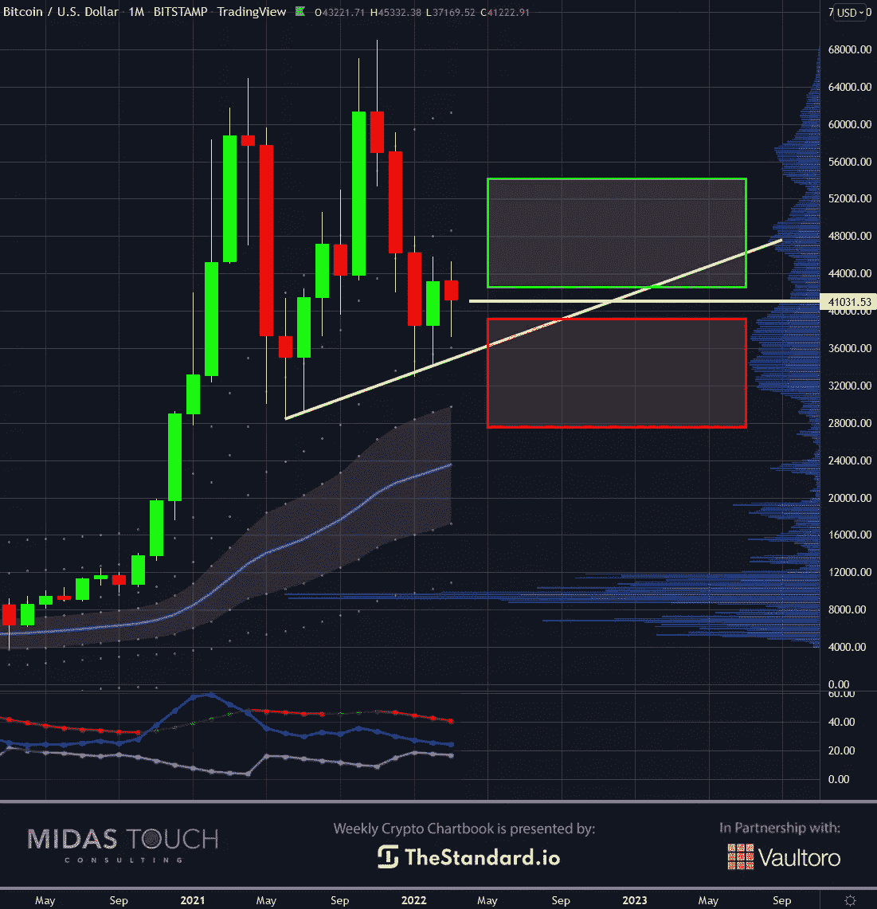

# 2022 年 3 月 22 日，密码本——比特币的时代到了

> 原文：<https://medium.com/coinmonks/march-22nd-2022-crypto-chartbook-bitcoin-s-time-to-go-c8c427b17308?source=collection_archive---------63----------------------->

当我们展望未来并试图预测时，我们越是不确定，越是最大化，我们就越渴望精确。在这种情况下，精确并不是成为持续赢家的方法。这是关于区域，而不是具体的价格。这是一个总体的建设过程，而不是确定一个特定的时间点，然后希望救济已经设置并忘记它。一个人需要重新调整和重新聚焦，永远不要违反纪律。比特币的时代到了。

试图选择顶部和底部是光荣的，也是一个令人向往的目标。然而，还需要有其他的保险和原则。如果一个理想的现货过去了，或者市场没有提供低风险的进入或足够的流动性退出，人们仍然需要替代工具来参与市场。我们的四方退出策略允许建立头寸和参与市场，持续从市场中获取资金。

## 比特币，日线图，保持冷静，继续交易:

*Bitcoin in USD, daily chart as of March 22nd, 2022.*

在战争时期，精确交易变得更加困难，因为频繁且相互矛盾的新闻事件会使价格上下波动。

上面的每日图表显示了战争最后三周的这些颠簸。我们可以识别三个低风险的多头交易机会(双底价格情景中的绿色向上箭头)和一个空头交易机会(双顶价格形态中的红色向下箭头)。

我们的[四方退出策略](https://www.midastouch-consulting.com/services/glossary)在这些交易中的每一笔交易中获取部分初始利润以减轻风险，这使得剩余的头寸规模仅为市场的风险资金。

## 比特币，周线图，推高:

*Bitcoin in USD, weekly chart as of March 22nd, 2022.*

缩小到更大的时间范围是避免噪音和更清楚地看到交易场景的另一种方法，因此，可以更准确地找到“运行时间”。

这个周线图说明了进场和出场是进场区(红色和绿色方框),而不是精确的价格水平。交易者的目标是在这样一个区域内，在一个较低的时间框架内，利用一个低风险的进场点来建仓。

关于比特币，我们发现在过去的 12 个月中，整体价格行为是向上倾斜的，这是一个看涨的概念。我们发现瞬间进入区域的可能性很高(图表右侧的绿框)。**换句话说，我们现在处于比特币该走的价格区。**

## 比特币，月图，3 月收盘价:

*Bitcoin in USD, monthly chart as of March 22nd, 2022.*

假设我们通过选择一个更高的时间框架来进一步消除噪音。在这种情况下，我们在月图上发现了一个 pat 的情况，pat 不是价格上涨的更重要的优势，而是进入市场的时机。

我们的统计数据显示，三月份将以什么样的价格水平收盘至关重要。收盘高于当前水平(白线)，我们将进入看涨买入区。然而，如果价格在本月的最后九天从这里下跌，价格立即上涨的可能性会迅速下降。

## 比特币/黄金比率，日线图，比特币的末日到了:

*Bitcoin/Gold-Ratio, daily chart as of March 22nd, 2022.*

在动荡时期，安静图表提供的另一个好处是跳出框框思考。虽然所有的噪音都指向最激烈的问题，但在其他地方寻找交易机会可能是最好的。

在我们[之前发布的图表书](https://www.midastouch-consulting.com/crypto-chartbook-15032022-bitcoin-is-needed-as-an-alternative)中，我们利用了**比特币的大好时机。**

上周，我们提供了将黄金转换成比特币的切入点(绿色向上箭头)。使用我们的[四联退出策略](https://www.midastouch-consulting.com/services/glossary)，那些不想让自己的钱暴露在不稳定的法定货币交易世界中的交易者可以在他的第一个 50%的仓位中获利近 10%。我们现在将剩余头寸的止损点设置在盈亏平衡的进场水平。

# 比特币的时代到了:

在战争中，第一个伤亡是真理。在压力下，我们的头脑坚持理性、清晰、准确的行动要求。不幸的是，在战争时期，即使是最有见识的最聪明的人也找不到可靠的数据，因为全世界媒体的扭曲领域处于谎言和宣传超过事实和真相的水平。

幸运的是，现在交易者可以更加依赖图表。图表总是包含观点的总和。图表一直是交易的可靠来源。

心理方面是非常有益的，因为新闻和每个人的观点的持续轰炸会很快让人疲惫不堪。

**在冷静和头脑清醒是创造和保存财富的最有力工具的时候，减少新闻数据的消耗,“行动时间”将几乎毫不费力地显现出来。**

*随时加入我们的* [*我们的免费电报频道*](https://www.midastouch-consulting.com/services/newsletter-telegram) *获取每日实时数据和一个伟大的社区。如果您喜欢获得贵金属和加密货币的定期更新，您还可以订阅我们的* [*免费简讯*](http://bit.ly/1EUdt2K) *。*

*声明:本文及其内容仅供参考，不包含投资建议或推荐。每一次投资和交易都有风险，读者在做决定时应该进行自己的研究。此处表达的观点、想法、看法，均为作者个人观点。*

> 加入 Coinmonks [电报频道](https://t.me/coincodecap)和 [Youtube 频道](https://www.youtube.com/c/coinmonks/videos)了解加密交易和投资

# 另外，阅读

*   [WazirX vs coin dcx vs bit bns](/coinmonks/wazirx-vs-coindcx-vs-bitbns-149f4f19a2f1)|[block fi vs coin loan vs Nexo](/coinmonks/blockfi-vs-coinloan-vs-nexo-cb624635230d)
*   [比斯勒评论](https://coincodecap.com/bitsler-review)|[WazirX vs coin switch vs coin dcx](https://coincodecap.com/wazirx-vs-coinswitch-vs-coindcx)
*   [7 大副本交易平台](https://coincodecap.com/copy-trading-platforms) | [BuyCoins 点评](https://coincodecap.com/buycoins-review)
*   XT.COM 评论[币安评论](https://coincodecap.com/profittradingapp-for-binance) |
*   [SmithBot 评论](https://coincodecap.com/smithbot-review) | [4 款最佳免费开源交易机器人](https://coincodecap.com/free-open-source-trading-bots)