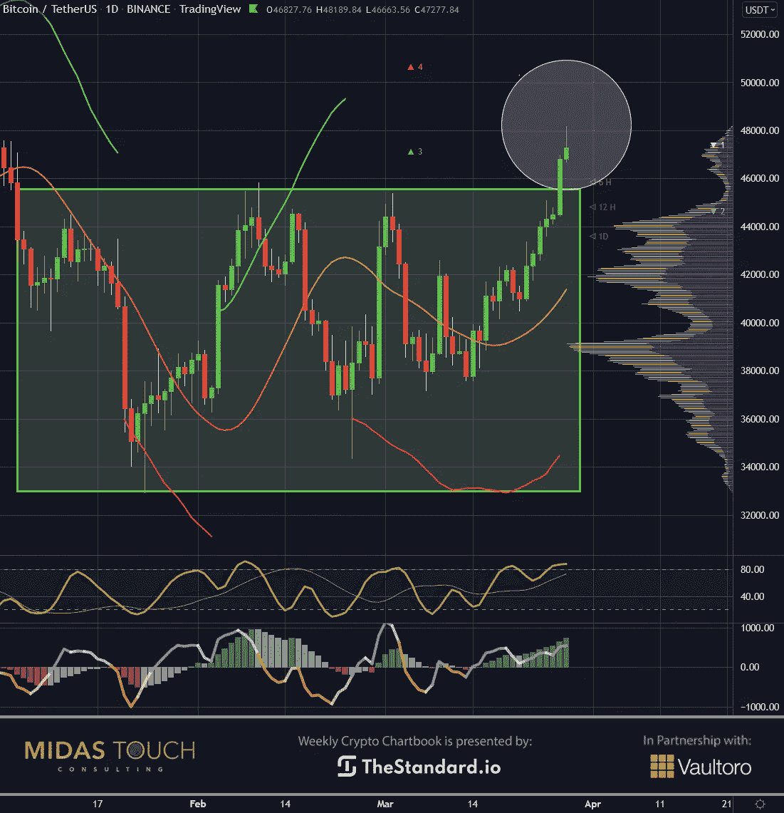
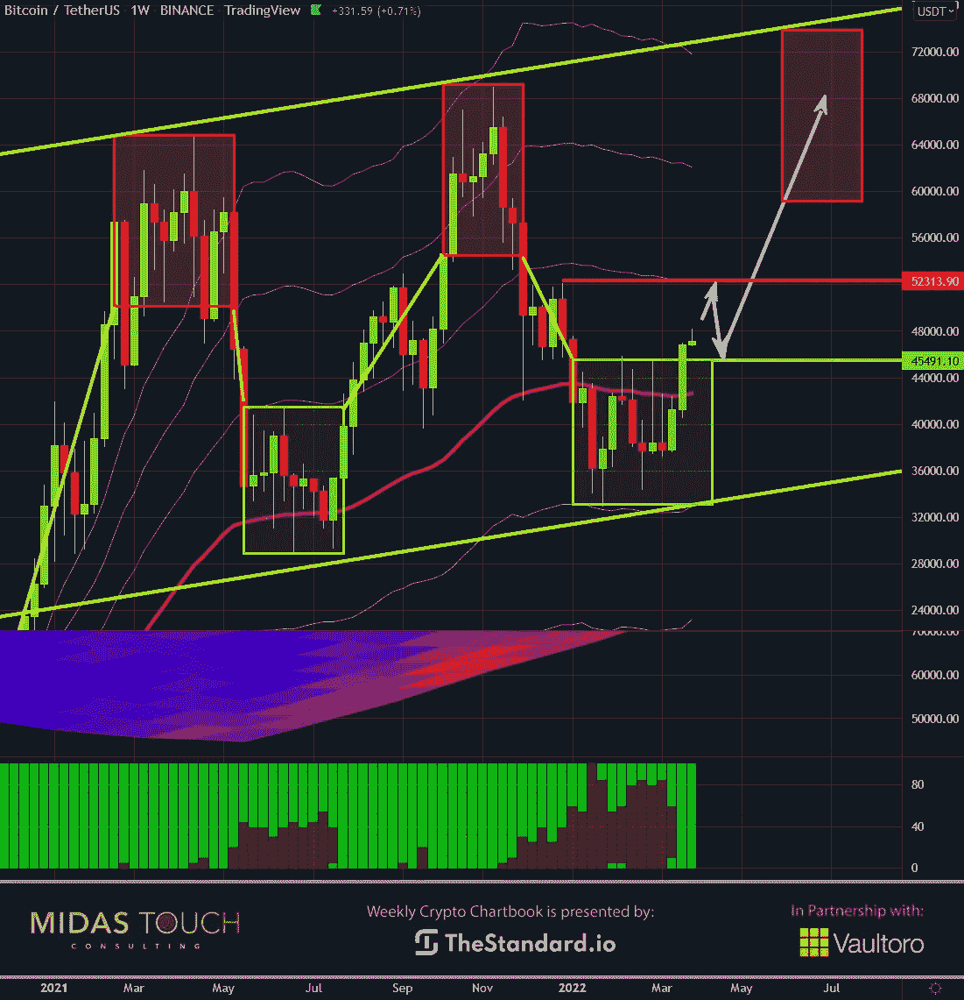
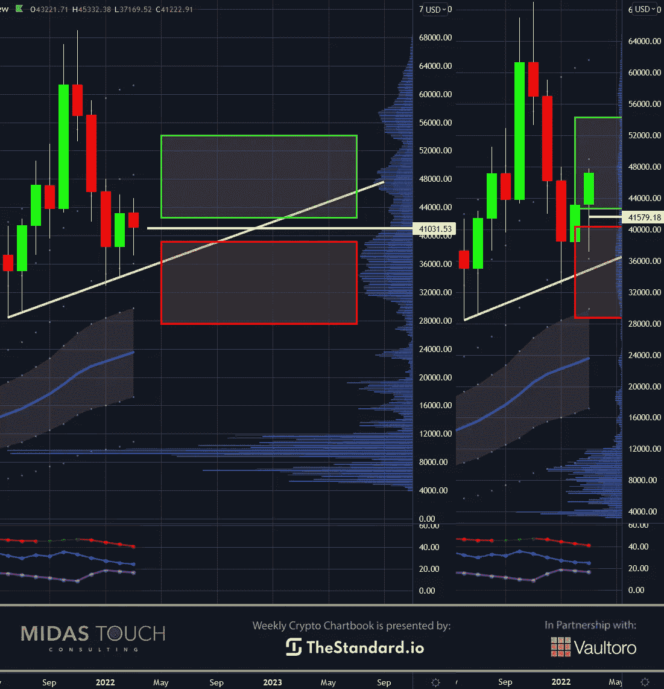
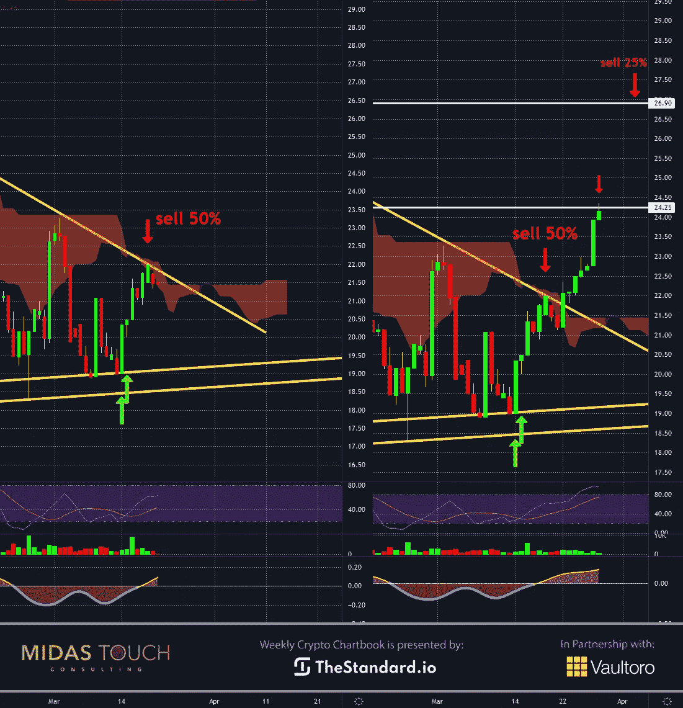

# 2022 年 3 月 29 日，密码本——比特币赢得比赛

> 原文：<https://medium.com/coinmonks/march-29th-2022-crypto-chartbook-bitcoin-wins-the-race-da79bdc32d99?source=collection_archive---------57----------------------->

全球化是一个相互联系的世界中的文化和贸易交流进程，但受到最近政治事件的威胁。因制裁而中断的商业活动会影响法定货币的价值以及国家间的联盟。随着各种可能的电子支付系统之间的竞赛，以及对石油和能源供应即时支付的需求，比特币最近成为了最热门的话题。俄罗斯政府高级官员帕维尔·扎瓦尔尼(Pavel Zavalny)宣布，俄罗斯将接受比特币支付石油，这是对被排除在 swift 系统之外的回应，该系统已使其他国家无法用美元支付石油。比特币赢得了这场竞赛。

虽然俄罗斯接受像黄金这样的硬通货，但这样的举动表明，比特币的高效属性在危机时期成为最重要的，并被接受用于国家之间的大型商业交易。

## 比特币，日线图，价格突破:

*Bitcoin in USD, daily chart as of March 29th, 2022.*

不久之后，普京总统确认了这种新的经营方式。此外，中国和俄罗斯同意签署一份为期 30 年的天然气合同，以欧元进行交易。我们可以看到，我们发现自己处于货币战争的时代，密切关注我们在哪里以及以什么形式储存我们的价值观是至关重要的。

上面的日线图反映了比特币价格从 37，567 美元上涨到 47，701 美元的最新消息。仅仅两周就上涨了 28%。比特币突破了横盘区间，本周将显示这一突破是否会成功。在这种情况下，多头比空头更有胜算。

## 比特币，周线图，价格离站:

*Bitcoin in USD, weekly chart as of March 29th, 2022.*

与[上周的图表集](https://www.midastouch-consulting.com/crypto-chartbook-22032022-bitcoins-time-to-go)和公布的周线图相比，我们现在已经离开了进入区(绿框)。当大众现在追逐交易，挣扎于波动突破的典型低效率(错误的填充，滑点，迟到)时，我们用 9 个累积的跑步者的总和建立了我们的定位。滑道是每个初始位置的最后 25%。一个完全无风险或者更准确地说是无风险的企业([见第四出口](https://www.midastouch-consulting.com/services/glossary))！查看周线图，我们发现阻力分布区域在 49，650 美元和 52，430 美元附近。

如果价格回到输入框顶部，我们将添加条目。

## 比特币，月图，如果 3 月强势收盘:

*Bitcoin in USD, monthly chart as of March 28th, 2022.*

从月度角度来看，价格已进入确认买入区。双图表显示了从上周的预期到本周的图表图书发布的进展。如果本周内价格保持在绿色方框内，那么所有时间框架都是一致的。一张已确认看涨比特币趋势的图片。对于大时间框架交易者来说，这是一种罕见的情况和确认，如果没有足够的风险敞口，呼吁寻找低风险的条目。

## 比特币/黄金比率，日线图，比特币赢得比赛:

*Bitcoin/Gold-Ratio, daily chart as of March 28th, 2022.*

另一个图表(比特币/黄金比率的日线图)的分屏视图显示了上周图表书籍出版的进展和目前的情况。上周我们有一个三角形突破，从那以后有了实质性的进展。从黄金转向比特币的建议是成功的。在短短两周内，整体涨幅为 30%。人们也可以利用这种关系来表明比特币最近在强度和方向上的增长。

## 比特币赢得了这场竞赛:

改变从来不会轻易被接受。作为人类，我们通常抵制改变，更喜欢现状。然而，我们发现自己处在一个低于平均水平的环境中，一个全球性的疫情，一场永无休止的战争，以及一个普遍的意见分歧。俄罗斯最近批准比特币的举动表明，当橡胶遇到道路时，在危机和需求时期有效和实用的东西将赢得比赛。当全球各国政府狂热地试图发展他们的电子支付系统时，比特币已经发现它的用途正在扩大，而且成功了。

*随时加入我们的* [*我们的免费电报频道*](https://www.midastouch-consulting.com/services/newsletter-telegram) *获取每日实时数据和一个伟大的社区。如果你喜欢获得贵金属和加密货币的定期更新，你也可以订阅我们的* [*免费简讯*](http://bit.ly/1EUdt2K) *。*

*声明:本文及内容仅供参考，不包含投资建议或推荐。每一次投资和交易都有风险，读者在做决定时应该进行自己的研究。此处表达的观点、想法、看法，均为作者个人观点。它们不一定反映或代表 Midas Touch Consulting 的观点和意见。*

> 加入 Coinmonks [电报频道](https://t.me/coincodecap)和 [Youtube 频道](https://www.youtube.com/c/coinmonks/videos)了解加密交易和投资

# 另外，阅读

*   [3 商业评论](/coinmonks/3commas-review-an-excellent-crypto-trading-bot-2020-1313a58bec92) | [Pionex 评论](https://coincodecap.com/pionex-review-exchange-with-crypto-trading-bot) | [Coinrule 评论](/coinmonks/coinrule-review-2021-a-beginner-friendly-crypto-trading-bot-daf0504848ba)
*   [莱杰 vs n rave](/coinmonks/ledger-vs-ngrave-zero-7e40f0c1d694)|[莱杰 nano s vs x](/coinmonks/ledger-nano-s-vs-x-battery-hardware-price-storage-59a6663fe3b0) | [币安评论](/coinmonks/binance-review-ee10d3bf3b6e)
*   [Bybit Exchange 审查](/coinmonks/bybit-exchange-review-dbd570019b71) | [Bityard 审查](https://coincodecap.com/bityard-reivew) | [Jet-Bot 审查](https://coincodecap.com/jet-bot-review)
*   [3 commas vs crypto hopper](/coinmonks/3commas-vs-pionex-vs-cryptohopper-best-crypto-bot-6a98d2baa203)|[赚取加密利息](/coinmonks/earn-crypto-interest-b10b810fdda3)
*   最好的比特币[硬件钱包](/coinmonks/hardware-wallets-dfa1211730c6) | [BitBox02 回顾](/coinmonks/bitbox02-review-your-swiss-bitcoin-hardware-wallet-c36c88fff29)