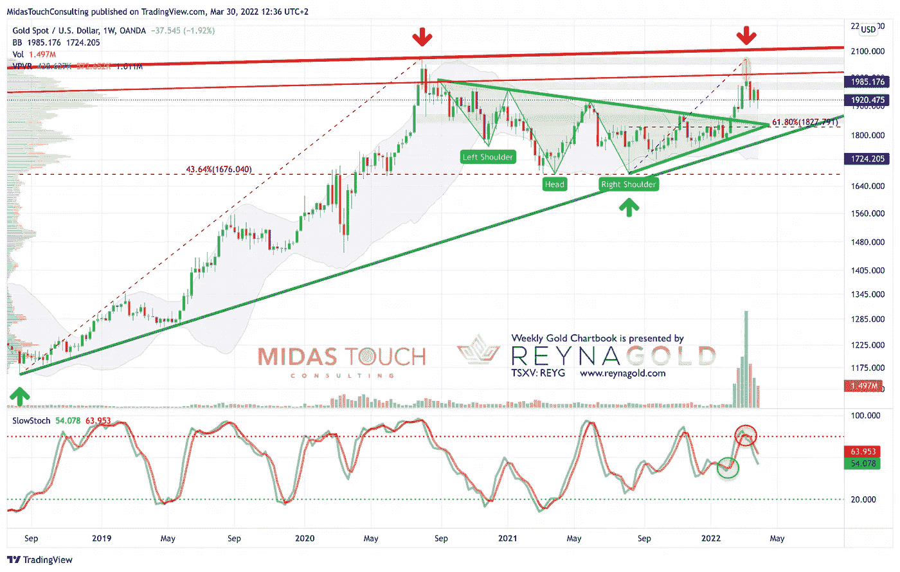
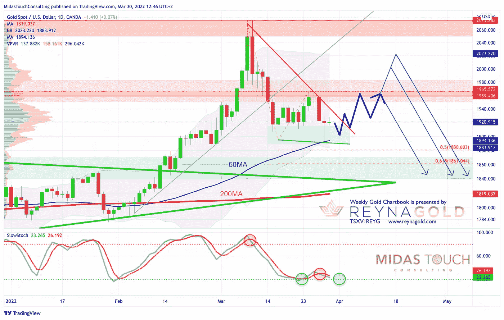

# 2022 年 3 月 30 日，黄金图表——大男孩们在玩溜溜球

> 原文：<https://medium.com/coinmonks/march-30th-2022-gold-chartbook-the-big-boys-are-playing-yoyo-4884eed28559?source=collection_archive---------30----------------------->

在我们 2021 年 3 月 19 日的最后一份黄金图表中，我们假设黄金可能已经在春季开始了其典型的调整。同时，我们认为，从 2070 美元到 1895 美元的第一轮下跌可能已经结束，随后会强劲反弹到 1960 美元，甚至可能超过 2000 美元。到目前为止，黄金在上周五回到了 1965 美元，但自那以后又一次强劲抛售。**黄金——大男孩们在玩溜溜球。**

昨天是黄金市场上又一个值得纪念的交易日，交易区间在 1，930 美元至 1，890 美元之间。随着周一金价跌至 1917 美元，本周交易的开始已经有了一种陈腐的味道。

## 周四是 COMEX 月期货的首次通知日

背景故事可能再次是机构在季度末装饰门面，加上 COMEX 月黄金期权到期以及 4 月期货合约到期的有害组合。接下来是 COMEX 月期货的首个通知日，3 月 31 日周四。因此，无论是谁在今天收盘时做多黄金 4 月合约，都必须将账户资金完全注入(合约的全价),以便进行实物交割。

几十年来，大公司和黄金银行一直在玩这个相当成功的游戏。他们的目标是阻止黄金长期合约持有者进行实物交割，并通过这些疯狂、波动的举动吓退散户资金购买黄金。最重要的是，由于对俄罗斯的制裁以及俄罗斯被排除在 Swift 系统之外，石油美元系统正面临严重压力，因此当前的宏观设置保证了对黄金的进一步攻击。俄罗斯的天然气和石油只接受卢布、石油和比特币。这是过去那些见不得人的独裁者用他们的权力和生命付出的代价。然而，俄罗斯是一个不同的口径，我们只能希望东西方的战争贩子会很快冷静下来。然而，现实地说，我们必须做最坏的打算！

在非常短的时间内，黄金可能会继续受压，即使昨天的 V 型复苏看起来很有希望。在第一个通知日及其后，黄金可能会被允许或多或少地自由交易。

## 美元计价黄金，截至 2022 年 3 月 30 日周线图。

*Gold in US-Dollar, weekly chart as of March 30th, 2022.*

在周线图上，大反转蜡烛线仍然支配着画面。因此，我们必须假设在某个时候，黄金将需要测试 1，820 美元至 1，850 美元附近的三角形突破区。然而，这可能需要数月时间。

过去两周，黄金一直在 1，890 美元至 1，965 美元之间波动。长灯芯显示，1，890 美元至 1，915 美元之间的价格可能会鼓励买家再次进场。显然，这种支持必须保持。否则会激活更多的下行。

由于随机振荡器是卖出信号，黄金在中期内仍然脆弱。这将需要更多的时间，直到振荡指标达到超卖区的反向买入信号。

总的来说，周线图是看跌的，继续建议谨慎和耐心。

## 美元计价的黄金，截至 2022 年 3 月 30 日的日线图。

*Gold in US-Dollar, daily chart as of March 30th, 2022.*

相当好的消息来自日线图，因为随机振荡器有点超卖，因此处于另一轮反弹的有利位置。反弹至上周五 1，965 美元的高点似乎是可能的。甚至进一步回升至 2，000 美元似乎仍有可能。

**总体而言，日线图再次轻微超卖，黄金可能很快开始另一轮反弹。**

## 结论:大男孩们在玩悠悠球

随着通胀率逼近两位数，全球能源和食品供应陷入危险，以及乌克兰爆发战争(不幸的是，这场战争还看不到结束的迹象)，每个人都应该将部分资产投资于实物贵金属的避风港。虽然黄金的基本面比以往任何时候都更乐观，但价格走势在过去几周一直是令人紧张的过山车。这似乎是阻止主流投资者涌入黄金的唯一方法。

然而，随着许多央行(尤其是中东国家)迫切需要多元化其美元指定资产，以及俄罗斯人现在用石油换黄金，金价暂时仍将受到良好支撑。与此同时，一个通货紧缩的螺旋不断潜伏在背后。就在两天前， [G7 国家拒绝了俄罗斯用卢布支付天然气和石油的要求。然而，德国工业迫切需要俄罗斯的天然气用于其工厂。巴斯夫公司的一名专家警告说，对这个化工巨头来说，立即停止进口将会带来严重后果。当然，由于能源短缺而导致的停产将是灾难性的，而且会导致严重的通货紧缩。](https://www.euronews.com/2022/03/28/g7-rejects-russia-s-demand-to-pay-for-gas-in-rubles)

此外，美国和欧盟以及中国和许多其他国家的央行行长无论如何都必须继续扩大货币供应，否则依赖流动性的市场以及所有资产价格都将出现严重的退出症状，并将大幅下跌。

然而，尽管技术上几乎一切都表明黄金市场正在突破多年的 cup & handle 模式，但这样的通缩浪潮也可能打击黄金。事实上，黄金是预测这种剧变的大师。

## 可能会出现另一轮反弹

目前，我们认为黄金应该在 1，880 美元和 1，915 美元附近保持支撑，并在未来几天内开始另一轮反弹。这种反弹可能会将价格带回到 1960 美元左右的著名阻力区。我们也看到了更大幅度反弹并略高于 2000 美元的机会。

**总而言之，金价应该很快会再次反弹至 1960 美元。然而，如果周收盘价低于 1，900 美元，将会给前景蒙上一层阴影，空头可能会加快步伐。从好的方面来看，多头需要一个令人信服的 2030 美元以上的收盘点位来重新控制所有重要的时间框架。**

> 加入 Coinmonks [电报频道](https://t.me/coincodecap)和 [Youtube 频道](https://www.youtube.com/c/coinmonks/videos)了解加密交易和投资

# 另外，阅读

*   [最佳免费加密信号](https://coincodecap.com/free-crypto-signals) | [YoBit 评论](/coinmonks/yobit-review-175464162c62) | [Bitbns 评论](/coinmonks/bitbns-review-38256a07e161)
*   [OKEx 回顾](/coinmonks/okex-review-6b369304110f) | [Kucoin 交易机器人](/coinmonks/kucoin-trading-bot-automate-your-trades-8cf0ca2138e0) | [期货交易机器人](/coinmonks/futures-trading-bots-5a282ccee3f5)
*   [AscendEx Staking](https://coincodecap.com/ascendex-staking)|[Bot Ocean Review](https://coincodecap.com/bot-ocean-review)|[最佳比特币钱包](https://coincodecap.com/bitcoin-wallets-india)
*   [霍比评论](https://coincodecap.com/huobi-review) | [OKEx 保证金交易](https://coincodecap.com/okex-margin-trading) | [期货交易](https://coincodecap.com/futures-trading)