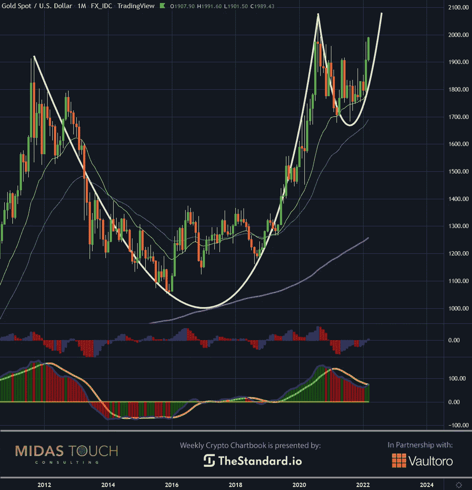
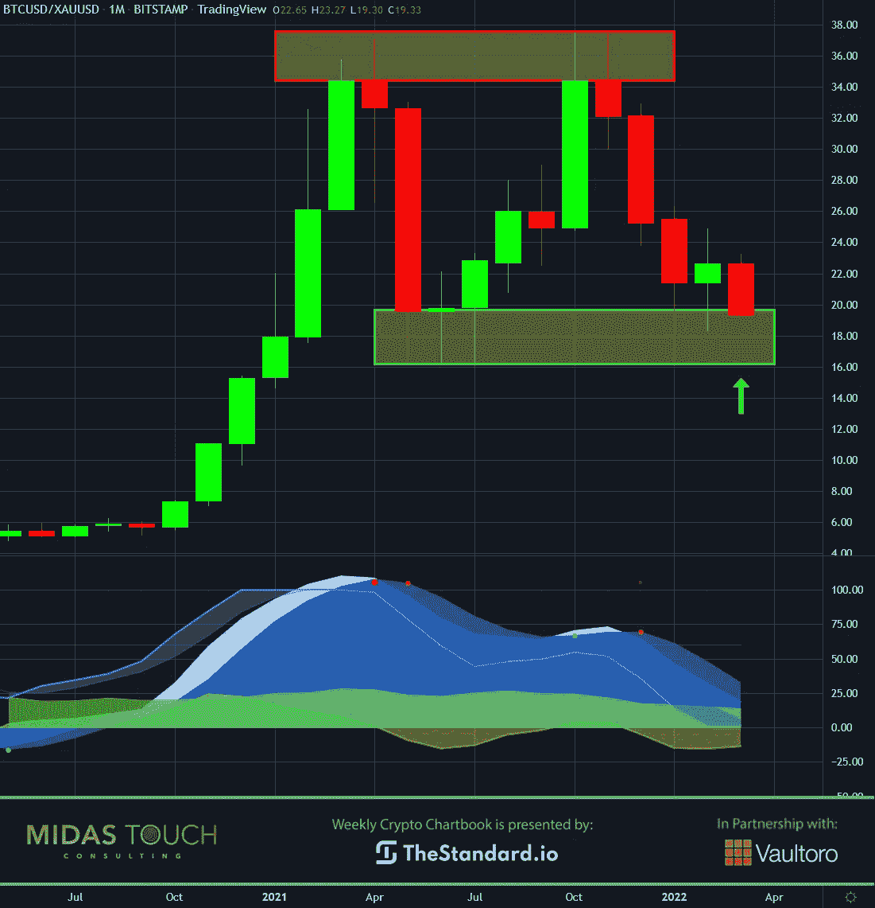
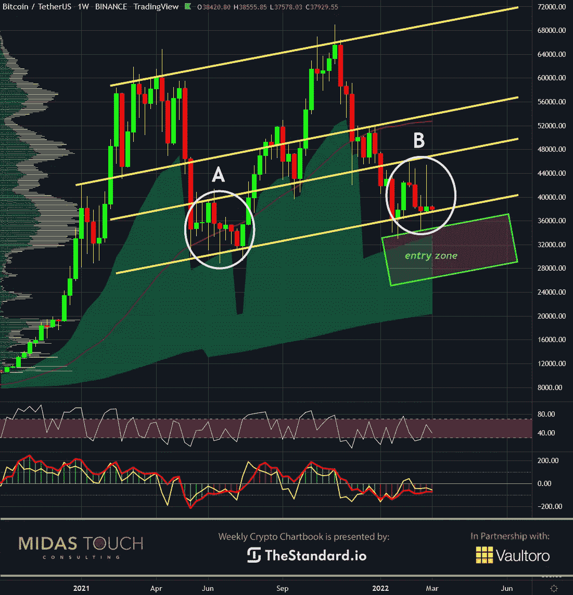

# 2022 年 3 月 8 日，加密账簿——比特币图像增强

> 原文：<https://medium.com/coinmonks/march-8th-2022-crypto-chartbook-bitcoins-image-boost-ddddec0c37db?source=collection_archive---------80----------------------->

瑞士在全世界代表中立、和平、财富和金融稳定。其中一个城市卢加诺刚刚宣布比特币将很快成为该州的法定货币。人们不仅可以在短期内用比特币和系绳支付税款，而且一整套基础设施已经到位，欢迎任何与比特币商业和发明有关的东西。**比特币形象提升。**

不幸的是，在战争时期，其他新闻会很快被暂时掩盖。

## 黄金，月表，杯和手柄:

*Gold in US Dollar, monthly chart as of March 7th, 2022.*

一个重要的因素是黄金看涨月图及其杯形和手柄价格形成。相关市场更大的时间框架在市场间分析中起着重要作用。黄金是通胀时期你的钱的主要财富保值“保险”，应该成为比特币交易者/投资者的关注对象。我们发现黄金的看涨基调支持比特币价格可能上涨。

## 比特币/黄金比，月图，比特币便宜:

*Bitcoin versus Gold in USD, monthly chart as of March 8th, 2022.*

在比特币与黄金关系的月度图表中，可以找到另一个受欢迎的因素。目前，大约 20 盎司买你一个比特币，而在去年最后一个季度，同样的比特币花费你 37 盎司的黄金。因此，那些退出法定货币体系的人或那些建设性地对冲其财富保值投资组合的人，目前可能更关注比特币，而不是黄金；它更便宜。

## 比特币，周线图，还有几周:

*Bitcoin in USD, weekly chart as of March 8th, 2022.*

看一下比特币的周线图，会发现在进入区附近，总体上升趋势出现了暂时的疲软。过去两周通过部分获利回吐提供了大量创收交易。比特币提供了 32%的价格区间，从 34，322 美元到 45，400 美元。不幸的是，在这一点之后没有方向性的跟进，比特币再次大幅回撤。

目前，比特币再次徘徊在低风险进入区的正上方，我们正在鹰派地寻找低风险进入区。回顾过去，我们发现在场景 a 中，比特币需要 10 周时间才能周转起来。**我们的时间预测是，在我们看到可能的快速发展之前，还需要两周时间。**

## 比特币图像增强:

**有些人一想到瑞士就会想到巧克力，这个消息对比特币社区来说的确很甜蜜。比特币获得动力的最后一步是广泛采用。像萨尔瓦多宣布比特币被接受为法定货币以来 GDP 增长 10%这样的消息令人印象深刻。然而，由于迄今为止采用比特币的国家的政治或经济形势，它仍然受到质疑。**

**随着中央货币圣地现在代表着比特币的进步使用，以及保守、强大的金融稳定形象支持这种行为的旧历史，广泛的大众怀疑可能会转向更多的比特币适应。**

*随时加入我们的* [*我们的免费电报频道*](https://www.midastouch-consulting.com/services/newsletter-telegram) *获取每日实时数据和一个伟大的社区。如果你喜欢获得贵金属和加密货币的定期更新，你也可以订阅我们的* [*免费简讯*](http://bit.ly/1EUdt2K) *。*

*声明:本文及内容仅供参考，不包含投资建议或推荐。每一次投资和交易都有风险，读者在做决定时应该进行自己的研究。*