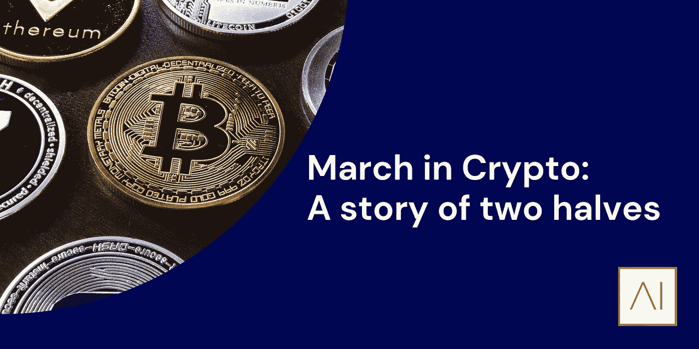

# 加密行军:两个半场的故事

> 原文：<https://medium.com/coinmonks/march-in-crypto-a-story-of-two-halves-f885ece80f6d?source=collection_archive---------81----------------------->

*由* [到*本德系*](https://www.linkedin.com/in/ACoAACdPcNQB7F5Bw32hpZknG9zIsbLob9fMIzs)

对于波动性来说，加密市场从来都是陌生的，但在过去的一个月里，它却像以往一样活跃。随着每个月的过去，这份时事通讯都在提醒我们这个行业发展的速度有多快。

如标题所示，三月是一个分成两半的故事。受持续战争和供应短缺的影响，本月上半年，加密市场略有下滑，该领域的招聘活动很少，这可能与顶级金融机构的奖金季节有关。然而，当我们似乎从世界在三月初所处的情况中爬出来时，这个月的下半月对太空来说是很棒的。

**调节器扣起来**

最引人注目的是英国监管机构金融行为监管局(FCA)宣布将推出一个新的加密货币部门[。据了解，新部门将监测不断增长的行业中的创新和复杂业务，以及处理涉及数字资产的诈骗和欺诈案件。欧洲另一个更广泛的支持加密的发展来自于加密公司最喜欢的首席执行官之一，山姆·班克曼-弗里德。这位 29 岁的交易平台 FTX 的创始人兼首席执行官宣布](https://www.cityam.com/fca-opens-search-for-head-of-new-crypto-division-as-crime-soars/) [FTX 已经获得塞浦路斯监管机构的批准，可以设立其欧洲分部](https://www.coindesk.com/business/2022/03/07/crypto-exchange-ftx-sets-up-european-unit/)。总部设在瑞士的这家美国交易所采取行动巩固自己作为领先交易所的地位，将客户群扩大到曾经无人涉足的欧洲。事实上，FTX 更进一步，成为第一家在迪拜获得加密许可证的加密交易所。被吹捧为区块链创新的领先城市之一，迪拜在未来几年作为一个加密城市的发展肯定会吸引一些世界顶级人才到这座城市。

**Web3 突破传统市场**

随着加密变得越来越主流，我们现在开始看到小行业在更大的行业中发展。以前被认为是相邻的更大生态系统中的产品；例如、GameFi 和 DAO，现在已经成为今年最大的几笔交易。就在[收购其最大竞争对手的主要品牌](https://www.larvalabs.com/blog/2022-3-11-18-0/yuga-labs-acquires-cryptopunks-and-meebits)几周后，著名的 Bored Ape 游艇俱乐部宇迦实验室背后的公司，宣布了一轮[4 . 5 亿美元的融资](https://www.protocol.com/bulletins/yuga-labs-bored-apes-metaverse)，使公司的估值达到 40 亿美元。这笔资金将投资于扩大到游戏产业和开发一个专有的元宇宙。此举似乎巩固了 crypto 在游戏和艺术领域的地位，未来几个月，NFT 最大的两个项目联合起来的发展将是一个有趣的事情。关于另一家估值达到数十亿美元的加密公司，Consensys 宣布了由软银、微软和淡马锡牵头的新一轮投资，该公司[的估值翻了一番，达到 70 亿美元](https://www.cnbc.com/2022/03/15/consensys-doubles-valuation-to-7-billion-with-microsoft-backing.html)。在最新一轮投资中筹集的 4.5 亿美元将用于哪些领域尚未公布，但世界第三大公司进入该领域的价值不可错过。随着空间的增长和精明资金的进入，我们阿姆斯特朗国际公司为该行业在合法化方面取得的进步感到高兴。

**在 Crypto 招聘**

最后，3 月份在招聘方面出现了一些有趣的进展。最引人注目的是，摩根大通 Onyx 部门的第一名员工 Christine Moy 宣布，在这家美国金融巨头工作了 18 年后，她将离开该公司。相反，莫伊将寻求在一家更本土的公司中发挥她的专长，但她尚未宣布具体位置。上个月，Meta 的数字货币公司 Diem(原名 Libra)的[也宣告破产。](https://www.ft.com/content/79376464-72b5-41fa-8f14-9f308acaf83b)业务的停止导致 Diem 吸引来的高素质员工遭到打击，随着这些人才的离开，最引人注目的举动莫过于 Diem 的前首席技术官 Dahlia Malkhi，她本月刚刚加入甲骨文区块链分权网络 Chainlink Labs，担任公司的首席收入官。我们 Armstrong 希望上述人员以及其他考虑离开金融服务行业、接受 crypto 旨在解决的挑战的人一切都好。如果你正在考虑加入数字资产行业，或者想了解更多相关信息，请随时联系[本](https://www.linkedin.com/in/ben-ashkenazi-384a55164/)。

要了解更多信息，请查看:[https://www.armstrongint.com/](https://www.armstrongint.com/)

关注我们的 LinkedIn 获取最新消息:[https://www.linkedin.com/company/armstrong-international/](https://www.linkedin.com/company/armstrong-international/)