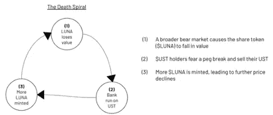

# 三月概览

> 原文：<https://medium.com/coinmonks/march-overview-9b4fdf207de?source=collection_archive---------23----------------------->

## *数字资产世界每月简报*

> 一篇的文章由 [Sixte C.](https://www.linkedin.com/in/sixte-c-a72b47173/) 编辑 [Lesia M.](https://twitter.com/LesiaMrch)

## 市场概述

*   *未平仓合约*

## 监管者

*   *拜登发布一项专注于加密货币的行政命令*
*   *欧盟投票支持新的加密货币监管框架*
*   *瑞士城市卢加诺将接受 BTC、UST 和 LVGA 为“事实上的”法定货币*

## **金融机构、DeFi、GameFi**

*   *为什么 LUNA 的价格在两个月内涨了 133%，为什么 Terra 在买比特币？*
*   *DeFi 先锋安德烈·克罗尼退出 DeFi 空间导致数十枚代币崩溃*
*   *Axie Infinity 的 Ronin sidechain 因私钥漏洞损失了 6.25 亿美元。*

# 市场概述

## **未平仓合约**

在我们的市场概述中，我们特别关注永续期货的未平仓合约，密切关注 BTC 作为整体加密行业的衡量标准。

当新的期货合约被创建时，未平仓合约增加，当这些头寸被平仓或清算时，未平仓合约减少。不断增长的 OI 表明新的资金流入市场，这最有可能支持正在进行的趋势(看涨或看跌)。OI 下降表明市场参与者平仓(或被强制平仓)，主要是因为预期趋势会逆转。

在长时间的 OI 下降和杠杆头寸被净-净平仓(1 月 10 日-3 月 2 日)后，未平仓头寸终于在 3 月开始增加，暗示价格趋势可能逆转。自 3 月初以来，我们见证了 BTC 杠杆率的净积累。

然而，尽管投资回报率是反映市场情绪的一个重要指标，但仅仅依赖它是错误的。事实上，只有当这三者一致时，我们才能断定健康牛市的开始:

*   BTC 看涨价格反转
*   开放 OI 头寸
*   对正区域的融资利率有信心。

目前，杠杆交易员对未来价格走势的方向没有达成共识。3 月份融资利率持平，在-0.043% / +0.036%区间(FTX 8h 融资利率)。

*Source: JKL Capital Research | app.intotheblock.com*

该领域即将发生一些乐观的事件，包括比特币 2022 迈阿密会议，当然，还有几个月后以太坊的 PoS 机发布。如果融资利率回升反映了市场的持续活跃，我们可能会看到另一个 ATH 在拐角处。

# 监管者

## **拜登发布一项专注于加密货币的行政命令**

拜登签署了一项期待已久的关于数字资产的行政命令。必须指出，这项行政命令不会立即引起任何直接行动。《E.O》更多的是为加密货币的监管打好基础。它提出了 7 个不同的目标:

1.  保护消费者、投资者和企业

*   隐私是重中之重

2.确保全球金融稳定

*   认识到数字资产可能需要量身定制的立法

3.通过美国政府机构合作解决非法融资问题

*   它涵盖制裁、洗钱、恐怖主义和网络犯罪

4.巩固美国的金融领导地位

*   显示对加密货币作为金融内含物和作为支付系统的潜力的认识

5.使人们能够获得安全和负担得起的金融服务

*   认识到它可以满足被传统银行体系边缘化的美国人的需求

6.支持技术进步

*   减少其对环境的影响，同时确保隐私和安全

7.促进建立一个符合“美国优先事项和民主价值观”的美国 CBDC

E.O .要求在 180 天内采取符合预期的行动。这份报告认为，非法融资问题应该在未来 3 个月内得到解决，原因可能是乌克兰战争以及人们担心通过加密货币放松制裁。

《E.O》表明，人们意识到了监管数字资产面临的风险，同时也明白了国家可以从中受益。尽管如此，在鼓励研究 CBDCs 的同时，它也遗漏了加密货币的两大特点:分散性和稀缺性。

O.E .还体现了政府将区块链技术应用于数字货币以外的许多领域的决心。然而，非法使用加密货币仍然是执行委员会的主要关注点，而且可能会导致不利的规则制定，从而给加密货币的有益使用蒙上阴影。因此，我们预计美国监管举措与加密货币市场之间的高度相关性至少将持续到 2022 年 11 月美国中期选举。

## **欧盟投票通过了加密货币新的监管框架**

就像上个月的俄罗斯和印度一样，3 月 15 日，欧盟议会的经济和货币事务委员会决定监管加密货币资产，而不是像最初计划的那样完全禁止它们。实际上，在 Markets in Crypto Assets (MiCA)的框架中，曾经包含一项最终会导致禁止比特币等 PoW 加密货币的规定。然而，在该行业做出强烈的负面反应后，草案进行了修改，以提供一份更温和的文件，要求欧盟委员会(European commission)将加密数据采矿公司纳入欧盟的分类体系。这是一个分类系统，旨在将资金集中用于气候友好型项目。

总体而言，MiCA 制定的规则主要涵盖加密资产的交易和发行。它的主要组成部分将是“通行证”许可证，一旦获得，该许可证将允许一家公司将其活动扩展到所有 27 个欧盟国家，而不需要当地的许可证。这一特性肯定会促进欧洲加密公司的发展。然而，根据白皮书的复杂程度和所需的法律咨询，令牌发行商的成本从 4500 美元到 87000 美元不等。加上撰写白皮书的平均成本 4500 美元，总成本可能会让欧洲以外的企业家望而却步。最后，MiCA 对稳定的硬币发行者也有很高的限制，特别是像 Tether 这样的大玩家。后者需要将资本基金(资产超过负债)保持在总储备资产的 3%。

总之，尽管解除禁令的担忧，MiCA 的结果有所缓解，这可能解释了为什么市场在调整到 38，700 美元左右的先前水平后反应积极。大约在 3 月中旬，交易持平已经是加密市场的表现，而恒指在 3 月 1 日至 14 日之间下跌了 33%。

## **瑞士城市卢加诺将接受 BTC、UST 和 LVGA 作为“事实上的”法定货币**

在非常动荡的三月，有一条新闻一直没有引起人们的注意，但却非常值得关注。瑞士城市卢加诺除了创造自己的代币 LVGA 外，还与 Tether 合作，接受 BTC、UST 和 LVGA 的加密支付，以支付税收、停车罚单、公共服务和学费。未来，卢加诺政府的目标是为城市内的所有商品和服务启用加密支付。此外，泰瑟正计划在拉古纳设立一只数百万美元的基金，以扶持区块链的企业。系绳合作也意味着通过使用照明网络来帮助城市克服可扩展性问题。

卢加诺市可能看起来很小(只有 64，000 名居民)，但是，它的实验将为加密货币提供一致的用例，以测试它们在小范围内的效率。卢加诺的战略举措是押注加密货币未来的成功，如果区块链大规模采用，它将领先于传统科技中心。总体而言，瑞士似乎看好以区块链为基础的货币，楚格州和采尔马特州都接受加密纳税。

## **进一步阅读**

> 美国弗吉尼亚州参议院允许州立银行提供加密保管服务([阅读更多](https://cointelegraph.com/news/us-senate-allows-virginia-banks-to-offer-crypto-custody-services))
> 
> 迪拜建立虚拟资产监管机构并宣布新的密码法([阅读更多](https://cointelegraph.com/news/dubai-establishes-virtual-asset-regulator-and-announces-new-crypto-law))
> 
> 专业加密候选人赢得韩国选举([阅读更多](https://www.coindesk.com/policy/2022/03/09/conservative-candidate-yoon-suk-yeol-wins-south-koreas-presidential-election/))
> 
> 阿根廷参议院投票表决国际货币基金组织不鼓励使用加密货币的协议([阅读更多](https://www.coindesk.com/policy/2022/03/18/argentine-senate-to-vote-on-imf-agreement-discouraging-use-of-cryptocurrencies/)
> 
> FCA 发布比特币 ATM 终止令([阅读更多](https://cointelegraph.com/news/fca-issues-termination-order-for-bitcoin-atms))
> 
> 加拿大银行目前正与麻省理工学院合作进行 CBDC 研究
> 
> 德克萨斯州奥斯汀市研究使用比特币作为支付选项的能力([阅读更多](https://cointelegraph.com/news/austin-mayor-embraces-web3-tech-and-crypto-payments?utm_source=Telegram&utm_medium=social))
> 
> 泰国证券交易委员会禁止加密支付，要求交易所披露系统故障
> 
> 俄罗斯立法者建议国家可以接受比特币支付石油
> 
> 奥斯汀市长拥抱 Web3 技术和加密支付([阅读更多](https://cointelegraph.com/news/austin-mayor-embraces-web3-tech-and-crypto-payments))
> 
> 乌克兰的泽伦斯基签署虚拟资产法案成为法律，使加密合法化
> 
> 萨尔瓦多将比特币债券延期至 9 月([阅读更多](https://cointelegraph.com/news/el-salvador-postpones-bitcoin-bonds-to-september-report))
> 
> 美国立法者引入“电子现金”法案，推动创造数字美元([阅读更多](https://www.coindesk.com/policy/2022/03/28/us-lawmakers-introduce-ecash-bill-in-new-push-to-create-a-digital-dollar/%60)

# 金融机构、DeFi、GameFi

## **为什么 LUNA 的价格两个月内涨了 133%，为什么 Terra 在买比特币？**

月神在月底达到了新的高度。自 2021 年初以来，其市值增长了 138 倍。超过 100 个项目目前正在 Terra 的生态系统中建设，Terra 的 DAO 宣布与华盛顿国民棒球队建立为期 5 年的合作伙伴关系。

*Source: Twitter @Terrians_*

但其代币 LUNA 屡创新高的真正原因是，Terra 的钱包现在是继 Micro Strategy 和特斯拉之后的第三大比特币金库。据首席执行官 Do Kwon 称，Terra 的目标是通过购买价值 100 亿美元的硬币成为最大的 BTC 持有者。

Terra 正在积累如此大量的 BTC，以加强其稳定的 UST 货币。Terra network 有两个本地令牌，露娜和 UST。UST 是一种算法稳定的货币，而卢娜是帮助它维持盯住汇率的一种象征。得益于套利激励和协议机制，UST 维持了人民币盯住美元的汇率制度。任何市场参与者都可以铸造价值 1 美元的卢纳，然后烧掉 1 个 UST(案例 1)，或者铸造 1 个 UST，然后烧掉价值 1 美元的卢纳(案例 2)。

*   案例 1:当 UST 处于钉住汇率(例如 0.98 美元)时，用户可以用 1 UST 兑换 1 美元的卢纳(套利机会= 1 美元的卢纳——1 UST 价值 0.98 美元= 2 美分)。然后，他将通过出售价值 1 美元的 LUNA 来套现。在这个过程中，用户每交换一个 UST 将获得 2 美分，该协议将燃烧 1 UST 和造币厂价值 1 美元的月神。UST 的供应量将减少，因此其价格将回升至 1 美元。
*   案例 2:当 UST 超过挂钩汇率(例如 1.02 美元)时，用户可以用价值 1 美元的卢纳兑换 1 UST(套利机会=价值 1.02 美元的 1 UST——价值 1 美元的卢纳= 2 美分)。然后，他将通过卖出 1 UST 套现。在这个过程中，用户每交换价值 1 美元的月神将获得 2 美分，协议将燃烧价值 1 美元的月神和薄荷 1 UST。UST 的供应量将增加，因此其价格将回落至 1 美元。

在熊市条件下，LUNA 的价格可能会贬值。如果 LUNA 被用来保持 UST 挂钩，用户自然可以推测挂钩可能失败，因此他们出售他们的 UST。如果 UST 的供给不能被充足的需求所满足，UST 将会被钉住。协议将继续铸造更多的卢娜来留住佩格。月神将失去更多的价值，一个“死亡螺旋”诞生了。

*Source: Twitter @Westie*

死亡螺旋是 Terra 增加其 BTC 储备的原因。用户将与 BTC 储备银行互动，而不是与铸造新月神来保持联系的协议互动。BTC 储备银行将向任何提供 1 UST 的用户赠送价值 0.98 美元的 BTC。因此，如果 UST 交易低于 0.98 美元，市场参与者将被激励使用 UST 折价购买 BTC。UST 需求的增加将使其价格恢复到与美元挂钩的水平。因此，BTC 不是用来铸造或焚烧 UST，而只是恢复其与美元的挂钩。

此外，为了增加 BTC 需求并推动其价格上涨，Terra 在算法稳定币生态系统中为 BTC 创建了一个新的用例。Terra 的举措增强了用户对其 stablecoin 的信任。使用 UST 的人越多，需要烧掉的月神令牌就越多，这给月神令牌的价格带来了上行压力。另一方面，购买 BTC 的部分资金来自 LUNA 的 OTC 销售，授予时间表为 4 年。目前还没有关于月神代币售价的信息，但它们肯定是打折出售的。因此，从长期来看，这可能会增加供应压力，降低价格表现。

## **DeFi 先锋 Andre Cronje 退出 DeFi 空间导致数十个代币崩溃**

3 月 6 日，Andre Cronje 退出 DeFi/crypto 空间的消息被他的合作者 Anton Nell [在 twitter](https://twitter.com/AntonNellCrypto/status/1500405473337565191?ref_src=twsrc%5Etfw%7Ctwcamp%5Etweetembed%7Ctwterm%5E1500405473337565191%7Ctwgr%5E%7Ctwcon%5Es1_&ref_url=https%3A%2F%2Fwww.coindesk.com%2Fbusiness%2F2022%2F03%2F06%2Fdozens-of-tokens-tumble-as-prolific-developer-andre-cronje-calls-it-quits%2F) 上公开。被认为是 DeFi“教父”的 Andre Cronje 是一位早期的区块链金融开发商，他通过为 Fantom 生态系统中的大约 25 个 Dapps 做出贡献而达到顶峰。他通过强调关于加密项目的可悲事实，不断表达他对空间的混乱:“好的营销比好的产品更有力量。”他的最新项目 Solidly 在营销失败后失败了，原因是其营销经理(Dani Sesta)因一个附属项目的危机而退出。这一事件可能是将 Andre Cronje 永远推离太空的最后一根稻草。

高度依赖 Cronje 的项目遭受了最大的打击，包括 Solidly，其 TVL 在安东内尔的推文后下降了 68%。最终，直接或间接与他挂钩的 25 个 Dapps 代币全部贬值。最值得注意的是渴望金融(YFI)下跌 10%，Fantom token FTM 下跌 20%。

这一事件揭示了分布式平台技术的核心价值:去中心化。在某种程度上，与一个中央政党密切相关的项目显示出缺乏声誉分散。想象一下，如果以太坊的布特林、的赵、卡尔达诺的霍金森、索拉纳的、雪崩的西勒或波尔卡多的加文·伍德离开这个空间。他们的项目会立即失去可信度，并看到他们的价值被撕碎(至少在宣布后的短期内)。我们可以在这里清楚地看到一个模式——前 20 大加密货币中的大多数都有一个失败点:它们的创始人。从技术上来说，这些项目的安全性并没有受到威胁，但是它们的功能和采用本质上取决于用户对系统的信任。

## Axie Infinity 的 Ronin sidechain 在一次私钥利用中损失了 6 . 25 亿美元

为支持 Axie infinity 游戏而构建的 Ronin 网络已被黑客攻击。ETH 和 USDC 被盗的 6 . 25 亿美元是加密史上最大的金额之一。黑客攻击发生在一个试图从 Ronin 桥接 ETH 的用户注意到之前的 6 天。黑客可能是权威证明 Ronin sidechain 缺乏分散性的原因。Ronin 只包含九个验证器节点，其中四个由 Ronin 的开发者 Sky Mavis 控制。黑客设法获得了所有 Sky Mavis 和 Axie DAO 的私人密钥。为了获得后者，黑客成功访问了 Sky Mavis 的系统，该系统自 11 月以来因新用户激增而被列入白名单，以代表 Axie DAO 签署交易。由于提取资金只需要五个节点，黑客就可以利用 Ronin 的高度集中化。

就像过去的 DeFi hacks 一样，所有的目光现在都集中在黑客身上，看他是否能够清洗这么多荒谬的钱。在接受 CoinDesk 采访时，区块链分析公司 Elliptic 的联合创始人汤姆·罗宾逊(Tom Robinson)解释说，这根本不可能，或者可能需要数年时间。由于黑客最初通过需要 KYC 的集中交易为他用于攻击的钱包提供资金，他的日子可能屈指可数了。

在黑客公开发布后的 24 小时内，Axie infinity 治理令牌 AXS 的价值损失了 11.5%，用于奖励玩家 SLP 的令牌减少了 12.7%。最大的输家是浪人侧链的治理令牌 RON，它从 2.3 美元跌至 1.7 美元，截至今日仅回升至 1.83 美元。

## **进一步阅读**

> 支付服务提供商 Shift4 以 5400 万美元收购 Giving Block([了解更多](https://cointelegraph.com/news/payment-services-provider-shift4-acquires-the-giving-block-for-54-million))
> 
> Visa，Mastercard 加入 PayPal 暂停俄罗斯业务([阅读更多](https://www.coindesk.com/policy/2022/03/05/visa-mastercard-join-paypal-in-suspending-russian-operations/))
> 
> 经 CySEC 批准，FTX 向欧洲扩张([阅读更多](https://cointelegraph.com/news/ftx-expands-to-europe-with-cysec-approval)
> 
> 追踪加密和金矿公司的新 ETF 的 VanEck 文件([阅读更多](https://cointelegraph.com/news/vaneck-files-for-new-etf-to-track-crypto-and-gold-mining-companies)
> 
> 贝恩资本风险投资公司为加密项目设立了 5 亿美元的基金
> 
> 汇丰进入沙盒提供教育金融游戏([阅读更多](https://cointelegraph.com/news/hsbc-enters-the-sandbox-to-offer-educational-finance-games))
> 
> Crypto.com 成为 2022 年卡塔尔世界杯官方赞助商
> 
> WisdomTree 在欧洲推出 Solana、Cardano、Polkadot 加密 etp([阅读更多](https://www.coindesk.com/business/2022/03/29/wisdomtree-launches-crypto-etps-for-solana-cardano-polkadot-in-europe/))
> 
> OpenSea 将增加对在 Solana 区块链上创建的 NFT 的支持
> 
> DeFi 部门 TVL 上升([阅读更多](https://cointelegraph.com/news/defi-sector-tvl-rises-as-investors-return-to-a-bullish-crypto-market))

## **其他读数**

> 据首席执行官马克·扎克伯格称，Instagram 将很快在平台中加入 NFTs
> 
> Spotify 计划在其平台上增加 NFTs 功能
> 
> 埃克森美孚公司正在利用过剩的天然气为加密采矿提供动力

**免责声明**

*本材料的内容未经任何监管机构审核。建议您对本材料的内容保持谨慎。虽然本材料中包含的信息是从据信可靠的来源汇编的，但 JKL 不代表或保证本材料中包含的信息的准确性、完整性或可靠性。如果您对本材料的任何内容有任何疑问，您应该获得独立的专业意见。JKL 或其任何关联公司，或其任何或其各自的董事、高级职员、员工和代表都不会对因使用或依赖本材料中包含的任何信息而导致的任何直接、间接或后果性损失承担任何责任或义务。本材料不构成认购或购买任何金融产品的要约或邀请。其目的不是提供任何信贷或其他评估的基础，也不应被视为购买任何金融产品的建议。*

> 加入 Coinmonks [电报频道](https://t.me/coincodecap)和 [Youtube 频道](https://www.youtube.com/c/coinmonks/videos)了解加密交易和投资

# 另外，阅读

*   [Bookmap 评论](https://coincodecap.com/bookmap-review-2021-best-trading-software) | [美国 5 大最佳加密交易所](https://coincodecap.com/crypto-exchange-usa)
*   最佳加密[硬件钱包](/coinmonks/hardware-wallets-dfa1211730c6) | [Bitbns 评论](/coinmonks/bitbns-review-38256a07e161)
*   [新加坡十大最佳加密交易所](https://coincodecap.com/crypto-exchange-in-singapore) | [购买 AXS](https://coincodecap.com/buy-axs-token)
*   [红狗赌场评论](https://coincodecap.com/red-dog-casino-review) | [Swyftx 评论](https://coincodecap.com/swyftx-review) | [CoinGate 评论](https://coincodecap.com/coingate-review)
*   [投资印度的最佳密码](https://coincodecap.com/best-crypto-to-invest-in-india-in-2021)|[WazirX P2P](https://coincodecap.com/wazirx-p2p)|[Hi Dollar Review](https://coincodecap.com/hi-dollar-review)