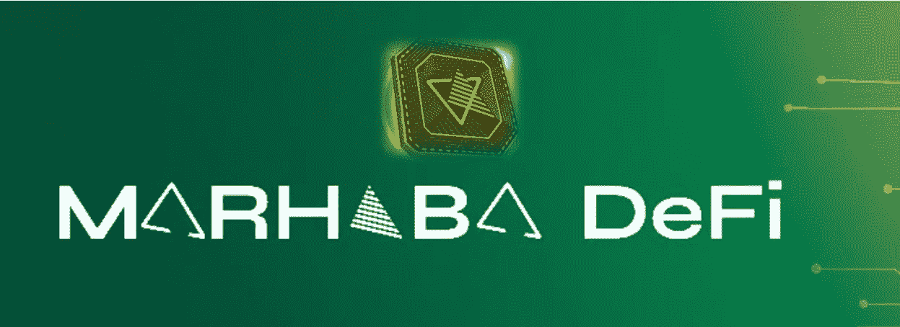
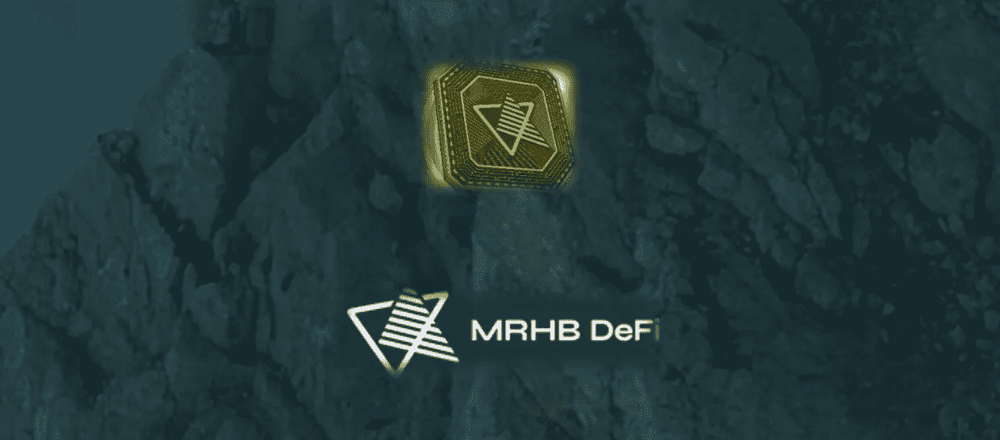
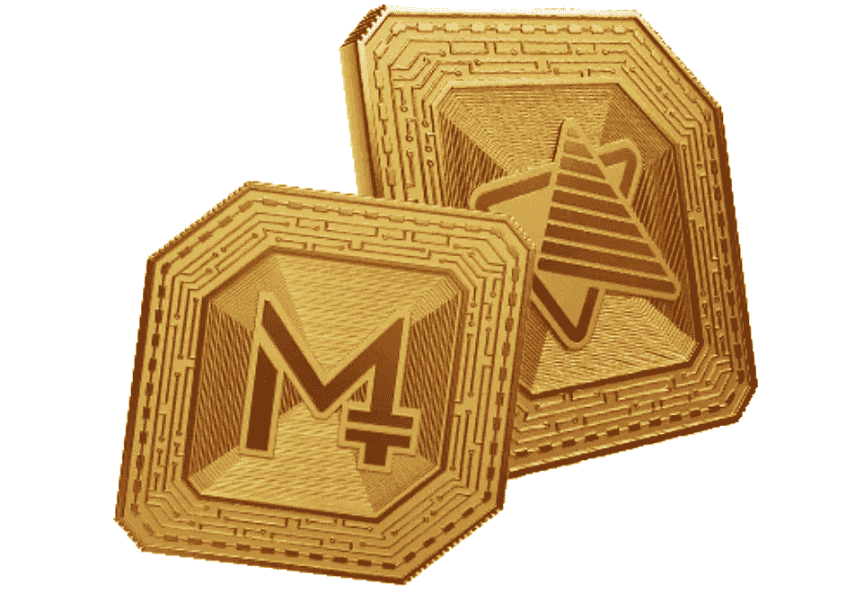
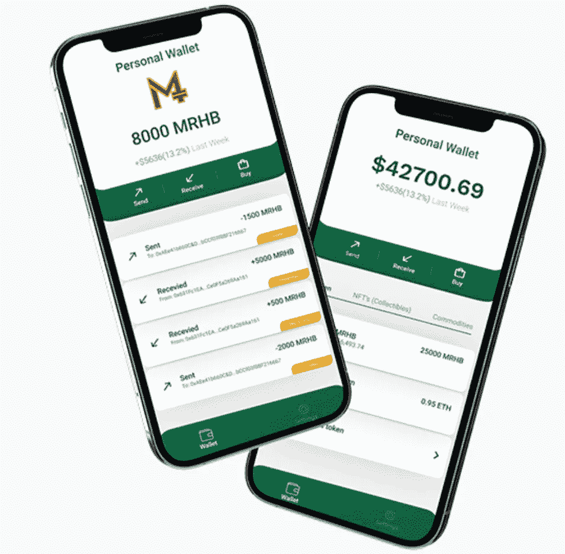

# Marhaba 穆斯林加密货币平台。

> 原文：<https://medium.com/coinmonks/marhaba-crypto-currency-platform-for-muslims-ee0966dc4223?source=collection_archive---------43----------------------->

在这篇文章中，我将详细解释 Marhaba 生态系统、Shariah 合规性、如何购买本国货币，包括一些与项目所有者和项目设计师联系的可能链接。但是在继续之前，我想让我们知道什么是“Marhaba”。

**马尔哈巴是什么？** [Marhaba](https://mrhb.network/) 是一个加密编排平台，旨在为分散金融(DeFi)、集中金融(CeFi)以及不可替代代币和其他加密资产存储的加密冒险提供稳定性和可持续性，旨在关注和扩大穆斯林(伊斯兰)对加密货币和数字化的广泛采用。这听起来不错吧？是的，这很有趣💋
此外，Marhaba 令牌(MRHB)是通过智能合约构建和配置的，然后部署到币安智能链(BSC)中，用户可以在连接到互联网的任何地方进行交易，并可以访问他或她的钱包密码。MRHB 也有他们的移动应用程序，可以在完全配置后从 playstore 或 iOS 安装，该应用程序用于存储和保存其他加密资产，如 MRHB，ETH，BNB，USDT 等，用户可以通过 MRHB 应用程序创建他们的 NFT 销售，购买，接收和发送。

**mar haba 生态系统是如何运作的？**
MRHB 是一种公用事业令牌，在 MRHB 生态系统中提供实际用途和好处，是 MRHB 生态系统中支付的主要功能，在不久的将来，这将成为他们的监管令牌。Shariah 治理委员会(SGB)记录 MRHB 的发行、生成、传播、特征，包括未来的优点以及将保持 Shariah 合规的义务。Marhaba 令牌(MRHB)是通过智能合约构建和配置的，然后部署到币安智能链(BSC)中，无论用户是否连接到互联网并有权访问他或她的钱包短语，都可以在任何地方进行交易。MRHB 也有他们的移动应用程序，可以从 [playstore](https://play.google.com/store/apps/details?id=sahal.wallet.app) 或 [iOS](https://apps.apple.com/tr/app/sahal-wallet/id1602366920?l) 安装。完全配置后，该应用程序用于存储和保存其他加密资产，如 MRHB、ETH、BNB、USDT 等，用户可以通过 MRHB 应用程序创建他们的 NFT 出售、购买、接收和发送。

**伊斯兰教法合规如何运作✔** 伊斯兰教法有自己的财富复制、复制和展示的方式和媒介，这意味着从清真食品中赚取财富。这字面上的意思是，伊斯兰教有以下几点创造财富的功能；要获利的财富或交易原则、广泛传播和接受的获利原则或活动执行者的指导性合同和行为或双方在其中发起交易的意图。这些都严格叙述了一些规则来对待每一节。为了有机会获得 Shariah 合规收入，用户需要确信他们遵守了管理 Shariah 投诉的规则和法规。这很有趣，对吧？所以[点击这里](https://docsend.com/view/yftbe5iwbkch4y24)了解更多更新和原则

**sahal wallet✔** sahal wallet 现已可供下载安装，目前可供使用 Android 和 iOS 的用户使用
[点击此处下载](https://play.google.com/store/apps/details?id=sahal.wallet.app)并安装 android ✔
[点击此处下载](https://apps.apple.com/tr/app/sahal-wallet/id1602366920?l)并安装 iOS ✔

**如何购买 MRHB 原生货币？**

这个视频将基本上解释如何轻松购买代币

MRHB 代币是从 Pancakeswap 购买的，目前与配对 [USDT/MRHB](https://pancakeswap.finance/swap?inputCurrency=0x55d398326f99059ff775485246999027b3197955&outputCurrency=0xd10332818d6a9b4b84bf5d87dbf9d80012fdf913) 进行交易，并且也在[coingeko](https://www.coingecko.com/en/coins/marhabadefi)上市，以使货币用户和持有者能够监控和跟踪他们的代币的价格变化和上涨。确保使用下面的令牌详细信息导入令牌以显示在您的钱包中。

**钱包用来装 MRHB**trust Wallet👌✔
超屏蔽👌✔
喏👌✔
MRHB 应用👌✔

**令牌信息** 令牌名称:马尔哈巴网络
令牌符号:MRHB
令牌小数:18
令牌总供应量:1，000，000，000
令牌合约地址:0xd 10332818d 6 a9 B4 b 84 BF 5d 87 DBF 9d 80012 fdf 913

这太棒了，对吧？是的，那就是💋基本上，我需要你访问该网站获取更多信息和更新，包括如何与团队成员保持联系以获得资金和合作。

[网站](https://mrhb.network/) | [推特](https://twitter.com/MarhabaDeFi) | [电报](https://t.me/mdf_official) | [Linkedin](https://www.linkedin.com/company/marhabadefi/) | [白皮书](https://docsend.com/view/4dwtrak9p5kjdw4s)|[# NFT](https://twitter.com/hashtag/NFT?src=hashtag_click)[# crypto](https://twitter.com/hashtag/crypto?src=hashtag_click)[# web 3](https://twitter.com/hashtag/Web3?src=hashtag_click)

平台用户名: **Rigmoney**
本项目为悬赏而写的赞助文章。

由霍普森·哈里森撰写

> 加入 Coinmonks [电报频道](https://t.me/coincodecap)和 [Youtube 频道](https://www.youtube.com/c/coinmonks/videos)了解加密交易和投资

# 另外，阅读

*   [Bookmap 评论](https://coincodecap.com/bookmap-review-2021-best-trading-software) | [美国 5 大最佳加密交易所](https://coincodecap.com/crypto-exchange-usa)
*   最佳加密[硬件钱包](/coinmonks/hardware-wallets-dfa1211730c6) | [Bitbns 评论](/coinmonks/bitbns-review-38256a07e161)
*   [新加坡十大最佳加密交易所](https://coincodecap.com/crypto-exchange-in-singapore) | [购买 AXS](https://coincodecap.com/buy-axs-token)
*   [红狗赌场评论](https://coincodecap.com/red-dog-casino-review) | [Swyftx 评论](https://coincodecap.com/swyftx-review) | [CoinGate 评论](https://coincodecap.com/coingate-review)
*   [投资印度的最佳密码](https://coincodecap.com/best-crypto-to-invest-in-india-in-2021)|[WazirX P2P](https://coincodecap.com/wazirx-p2p)|[Hi Dollar Review](https://coincodecap.com/hi-dollar-review)