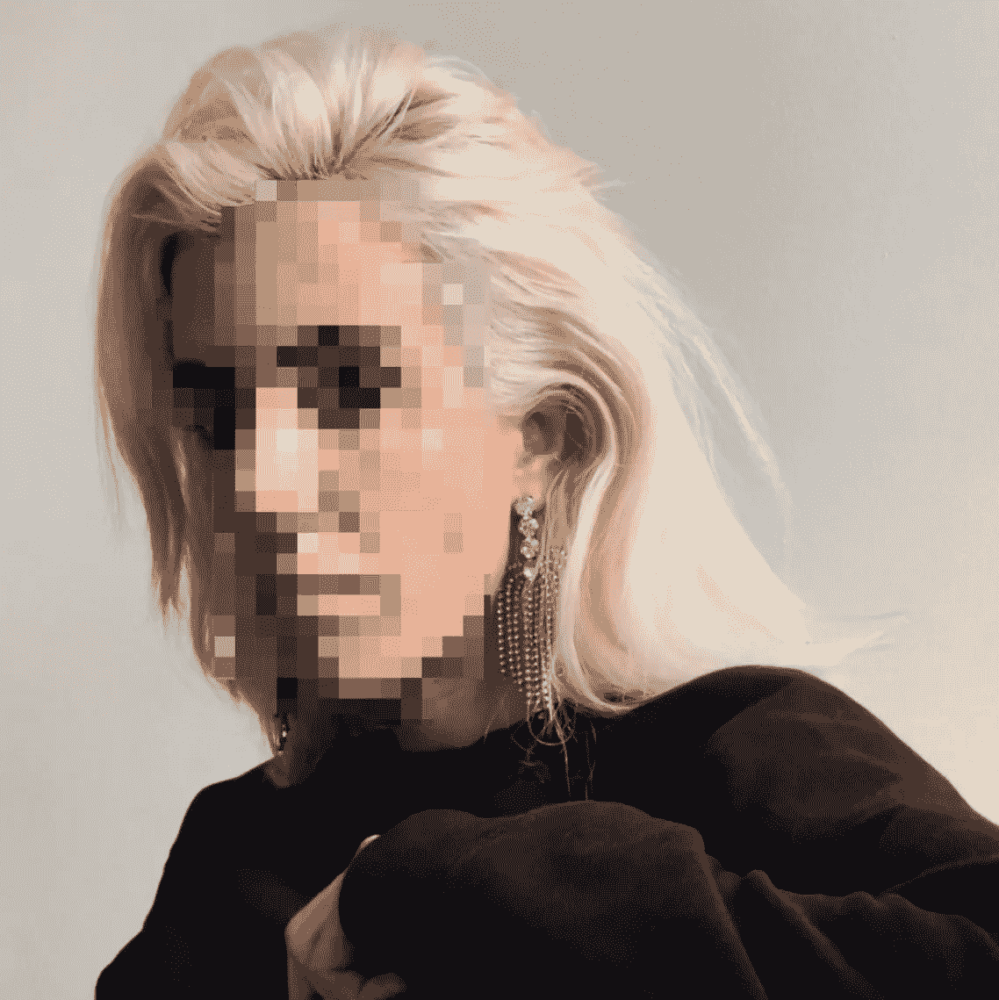
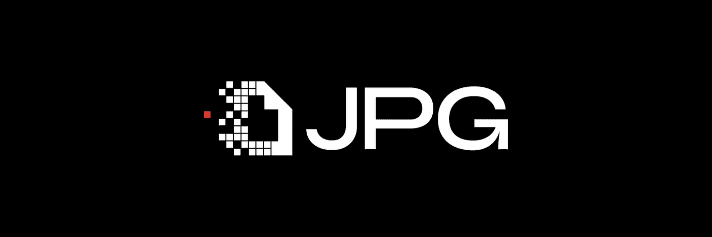
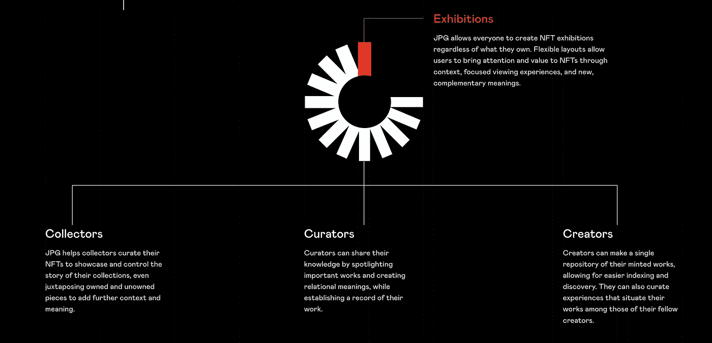
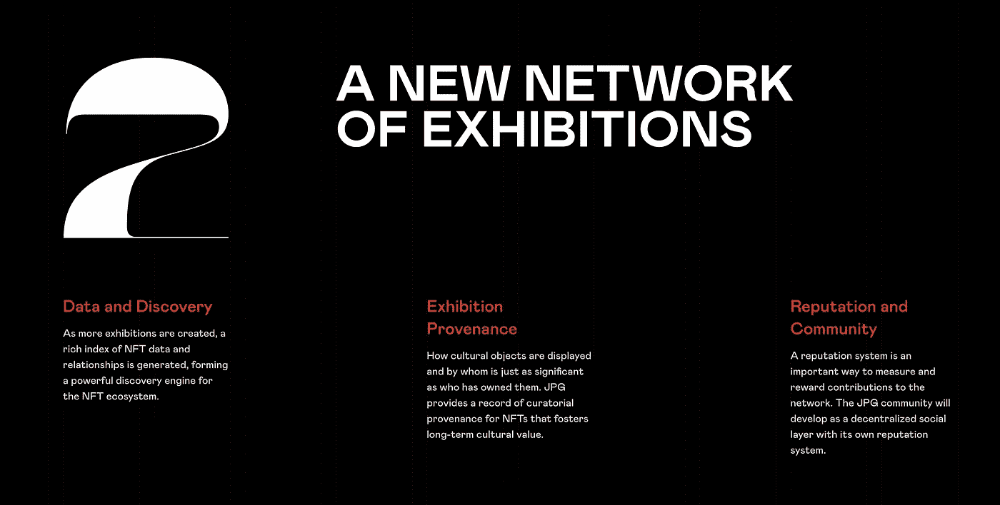
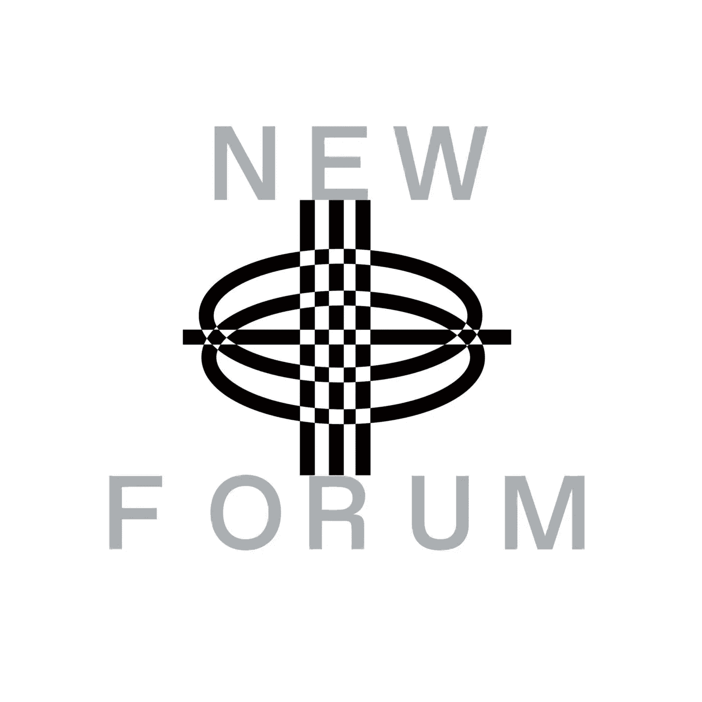

# JPG 协议的共同创始人玛利亚·宝拉分享了 JPG 对 NFT 艺术世界的创新构想

> 原文：<https://medium.com/coinmonks/maria-paula-co-founder-of-jpg-protocol-shares-jpgs-innovative-vision-for-the-crypto-nft-art-world-156501f65eeb?source=collection_archive---------21----------------------->

Maria Paula | Co-founder Of JPG Protocol | Founder & Managing Director of the Department of Decentralization

能邀请到独一无二的玛丽亚·葆拉是绝对的荣幸。她是《JPG 议定书》的共同创始人，也是权力下放部的创始人和常务董事。

自 2017 年以来，Maria 一直在 Web3 领域工作。

NEWFORUM 社区很高兴听到她对空间的见解，运行她自己的 Web3 协议，以及她对加密和 NFT 艺术世界的总体印象。

# 那么，玛利亚是如何涉足加密和 NFT 艺术世界的呢？

> “我是阿根廷人，但我住在柏林，因为一些显而易见的事情，我对区块链产生了兴趣；一种可以抵御全国范围内通货膨胀的货币，并且由于其可追溯性，可以减少某些事情，如腐败……”——玛丽亚

几年前，DAOs 的第一次迭代发生了，Maria 发现它令人耳目一新，因为它是关于无国界和在透明和扁平的组织中。

玛丽亚开始深入挖掘她的发现，大约在 2017 年年中，她终于在 Web3 找到了一份工作。

她开始与 Web3 基金会合作，管理区块链的互联网 Polkadot。这是一份入门级的工作，因为她之前没有区块链的经验。

> “我来自奢侈品行业，所以我需要学习一切，但我的目标是以此创造一个完整的职业生涯；从那以后我一直在学习和攀登。我非常致力于让这成为我的世界……”——玛丽亚

多年来，玛丽亚的奉献和努力得到了回报。她在这一领域已经颇有名气；她很成功，激励了许多人。

她共同创立了 JPG 协议和柏林的一个基层组织，名为权力下放部；东柏林黑客马拉松背后。玛丽亚解释说，他们写了关于区块链和艺术的论文，策划了展览，甚至制作了艺术品。她表示，她对这个领域发生的一切都感到兴奋。

> “我很早就开始使用 Web3，当时 Web3 是人们没有意识到的东西，它非常笨重，有些东西根本不存在；它们只是想法……”——玛丽亚

去年玛利亚出现在时代广场为 NFT。看到 Web3 已经成为主流。

作为一个从一开始就看到这个空间的人，这很令人兴奋，但同时也是一种奇怪的体验。

> “主流一直是我们的目标，很难预测它会如何实现，所以是的，现在是一种不同的体验……”—Maria

# **Maria 正在自豪地建设 JPG，我们的社区很想了解这个创新项目的所有情况，以及 Maria 希望在这个领域实现的使命、愿景和影响。**

Maria 和她的联合创始人是通过 DMs 在 Twitter 上认识的，因为他们对区块链和艺术的交集非常感兴趣。

玛利亚补充说，当时，NFT 正在蓬勃发展。

JPG 旨在通过一个专注于 NFT 策展的协议，将策展人、收藏家和创作者聚集在一起；用户可以创建任何基于以太坊的 NFT 展览，形成一个文化关系网络。

> “我注意到一切都在爆炸。我想，我怎样才能把我的知识变成生意呢？因为在那之前，它都是非盈利性的，而非盈利性组织很难运作。我也很兴奋 NFT 得到了认可……”——Maria

她澄清了自己关于 Web3 成为主流的说法。她解释说，她的意思是 NFTs 击中了主流，而 Web3 的基础设施还没有击中主流。它还有很长的路要走，但是 NFT 是入口。Maria 补充说，这些 NFT 用户或买家中的一些人最终会有心理转变，为他们的数据和财务考虑更好的替代方案。

> “JPG 来自联合创始人之间的共同心态，即理解非功能性团队是文化资产。Web3 有自己的世界和文化，我们应该创建基础设施来支持这种文化……”—Maria

玛丽亚提到，当一个人考虑在断裂中支持任何文化，例如，一个博物馆。人们不应该想到一个被炒作驱动的博物馆。

通过 JPG，她旨在创造持久的基础设施。他们不想成为博物馆或中间人。因为 Web3 相信去中心化，所以他们想建造 pipping。

> “因此，我们的长期心态和牢记非物质文化遗产正在成为文化资产。我们决定开始思考如何更好地为这个空间做贡献，我们的梦想是创建一个分散的、由社区管理的小型画廊。JPG 就是这样起步的..”—玛丽亚

Maria 提到，在更高的层面上，JPG 允许每个人创建自己的 NFT 展览。展览将被连锁，创建一个有趣的社交图。在较低的层面上，我们有一个注册管理机构系统，它是由不同的机构群体成员众包和提议的。所有这些结合起来，为实体创造了一个发现工具，以一种更少偏见的方式确定什么是文化价值。

# JPG 开放画廊生态系统

> “现在，谁的包更大，谁的权力就更大，他们也左右着 NFT 市场，决定着什么是文化上有趣的东西；所以我们希望，如果我们能够分散这个注册表创造口味制作工具，并通过众包给人们权力，那么我们将有一个更公平的欣赏文化的竞技场……”——Maria

请不要错过 Maria 在她的完整采访中充满激情地讲述 JPG 背后的愿景和使命。Maria 还分享了她对让更多艺术家加入 Web3 以启动他们成功的 NFT 项目所需的基本因素的想法。

她讨论了她与 JPG 各种背景的策展人、收藏家和创作者合作的经历，以及她在选择核心团队时所期待的。最后，Maria 谈到了她为项目选择区块链的标准。

[加入社区](https://twitter.com/newforum_nco)了解 [@MPtherealmvp](https://twitter.com/MPtherealmvp) 并在 web3 社区中发现其他创始人和远见者！

✨Follow 玛利亚保拉& JPG！推特:[@ MPtherealmvp](https://twitter.com/MPtherealmvp)|[@ _ _ _ _ _ _ jpg _ _ _ _ _ _ _ _](https://twitter.com/______jpg______)网址: [jpg.space](https://jpg.space/)

# newforum # web3 # nftartworld #策展#创造经济#加密#区块链#去中心化#社区

爱 x 新论坛

# Twitter @newforum_nco

不和谐[@加入](https://discord.gg/DHepA4WTkN)

# 新论坛

[NEWFORUM](https://newforum.notion.site/newforum/Welcome-to-NEWFORUM-48f9661398ec4ec6a1af37fcc96dc926) 由 [Newcoin Foundation](https://newcoin.org/) 提供支持，专注于促进分散化社交应用的扩展，也称为 Social 3.0，形成一个生态系统和一个由远见者、创造者和投资者组成的社区。它为思想者提供了一个安全的交流、传播和分享思想的空间，以确保一个新网络的自觉和道德发展，嵌入关怀、自由和创造力的价值观。✨每周新集！在 [Twitter](https://twitter.com/newforum_nco) 、 [Newlife](https://newlife.io/) 、 [Youtube](https://www.youtube.com/channel/UCWvHyau1nIJBffmaaj6FmbQ) 和 [LinkedIn](https://www.linkedin.com/showcase/newforum/) 上关注我们，了解 web3 的更多信息，认识生态系统！加入生态系统[不和](https://discord.gg/DHepA4WTkN)！

> 交易新手？尝试[加密交易机器人](/coinmonks/crypto-trading-bot-c2ffce8acb2a)或[复制交易](/coinmonks/top-10-crypto-copy-trading-platforms-for-beginners-d0c37c7d698c)