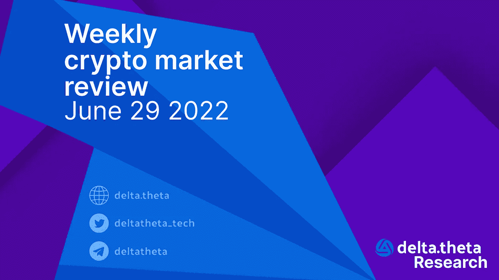
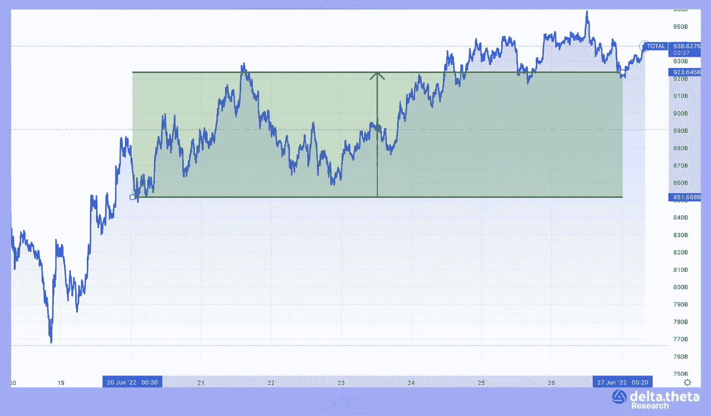
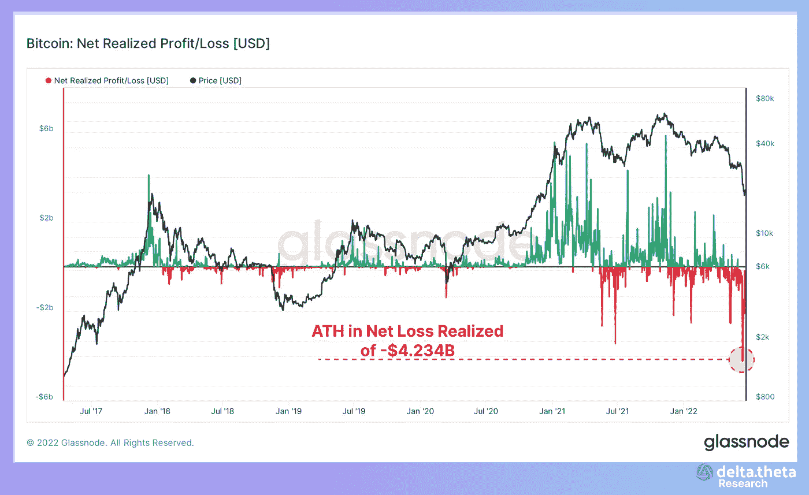
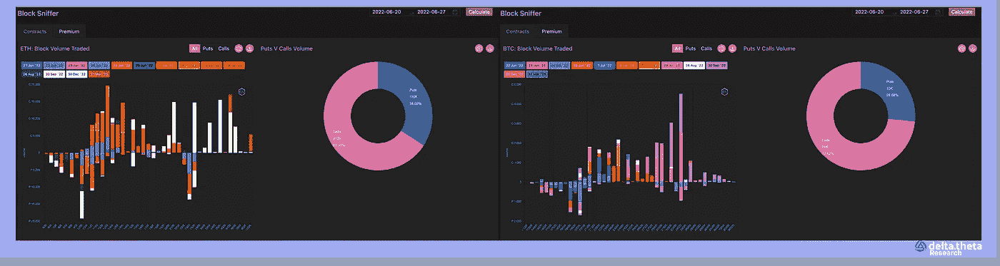
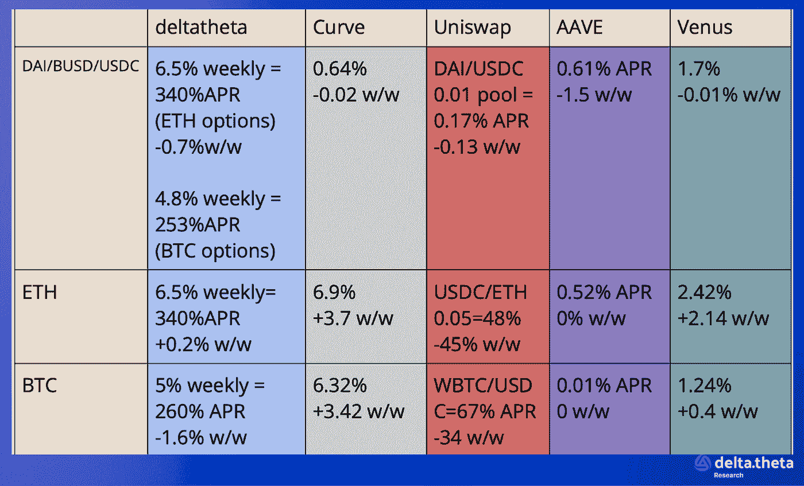

# 市场整合——派对会持续多久

> 原文：<https://medium.com/coinmonks/market-consolidation-how-long-will-the-party-last-a41aab9d852e?source=collection_archive---------33----------------------->

过去一周有很多理由让我们相信，市场已经找到底部，目前正处于盘整之中，之后将进入新的上行阶段。在 6 月 18 日达到低点后，一系列相对积极的消息接踵而至，一些宏观指标有所改善。

6 月 21 日至 6 月 28 日期间，市场实际上处于横盘整理。市值指数从 9092 亿美元开始，直到期末没有超出 8645-9519 亿美元的范围，期末达到 9268 亿美元。该指数的最终周变化幅度为+1.93%。

比特币虽然略有不同，但遵循了大体相似的范式。从 21 185 开始，“数字黄金”的价格基本上保持在 20 000-22000 的范围内(只有一个点略低于 20000)。截至报告期结束时，比特币价格稳定在 21 020 点。该期间的最终价格变化为 0.77%。

> 交易新手？试试[加密交易机器人](/coinmonks/crypto-trading-bot-c2ffce8acb2a)或者[复制交易](/coinmonks/top-10-crypto-copy-trading-platforms-for-beginners-d0c37c7d698c)

与比特币相反，以太坊价格图在审查期间略有上升(波动性更大)。从 1156 开始，首先触及 1056 的局部低点，然后触及 1269 的局部高点。到期末，它已经稳定在 1222 点。最终变化为+5.7%。值得注意的是，以太坊和其他替代硬币都表现出比比特币更好的动态。

# 新闻

索拉纳[计划发布一款手机](https://solana.com/news/solana-mobile-stack-saga-anatoly-yakovenko)，这是业界首次尝试将 Web3 技术超越电脑。SAGA 手机将包括一个分散的应用商店、Solana SDK 和一个带有私钥的硬件安全系统。这款 Saga 手机将采用 6.6 英寸显示屏，512GB 存储空间和 12GB 内存。虽然 Solana Labs 预计它要到 2023 年第一个财政季度才能上市，但用户已经可以以 100 USDC 的价格在线预订。

Dynamic 是一家为开发者开发 web3 认证和授权工具的初创公司，[已经在安德森·霍洛维茨(Andreessen Horowitz)领导的种子资金轮](https://www.theblock.co/post/154562/dynamic-web3-authentication-crypto-startup-raises-funding-a16z)中筹集了 750 万美元。该轮投资者包括 Castle Island Ventures、Solana Ventures、Circle Ventures、Breyer Capital、Hypersphere 和 Chapter One。Dynamic 是由伊泰·图尔班(Itay Turban)和约尼·戈德堡(Yoni Goldberg)于今年 1 月创立的，他们已经相识超过 15 年。他们第一次见面是在麻省理工学院(MIT ),过去曾在几个组织合作过，包括以色列国防军和朱尔实验室。

足球巨星之一克里斯蒂亚诺罗纳尔多(cristiano Ronaldo)[与币安加密货币交易所](https://www.binance.com/en/blog/markets/cristiano-ronaldo-and-binance-team-up-for-a-legendary-nft-partnership-421499824684904050)合作，成为最新一位与这家数字资产公司达成利润丰厚的合作关系的全球名人，尽管危机席卷了该行业。这位传奇的葡萄牙足球运动员多年来在曼联、尤文图斯和皇马等全球豪门展现了卓越的足球奇迹，他将与币安合作，创建一个 NFT 集合，专门在币安交易所交易。

周一下午，Robinhood 的股价上涨了 12%，原因是有消息称，加密公司 FTX 正在考虑可能收购该公司。[据彭博](https://www.bloomberg.com/news/articles/2022-06-27/bankman-fried-s-ftx-said-to-be-seeking-path-for-robinhood-deal#xj4y7vzkg)报道，这样的讨论正在 FTX 内部进行。报道强调罗宾汉还没有收到正式的报价，FTX 可能最终会拒绝这笔交易。彭博报告发布后，周一开盘价为 8.12 美元的 HOOD 股价上涨至 9.72 美元。在对媒体的声明中，公司首席执行官山姆·班克曼-弗里德说“没有与罗宾汉就可能的交易进行积极的谈判”。

# 市场情况

根据 Glassnode 的分析服务，已实现的损失达到 42.3 亿美元，成为观测历史上最大的损失。这种极端值强调了当前市场环境的独特性，并可能间接证实了比特币价格在 18000–20000 范围内形成了强有力的支撑位。BTC 和 ETH 最近的活跃走势导致了新的计算好的进场点和未来的得失。这一批新业主将拥有不同的持仓时间和价格基准，并能够通过减少现货订单的供应压力，在短期内支撑市场。

较低的波动性对交易员对比特币的情绪产生了积极影响。虽然在上周的大宗交易回顾中，我们注意到因市场崩溃可能持续而出现的看跌期权和对冲想法非常普遍，但在过去 7 天里，情况发生了截然不同的变化。缺乏负面消息，以及美国美联储官员对降息步伐的评论通常非常准确，导致传统股票市场出现短期复苏，这也反映在加密市场的预期中。大多数交易活动集中在 27000-34000 价格区间的买入期权，到期日在 7 月底和 9 月。

以太坊期权的交易动态强调了加密资产之间分散的估价。虽然比特币已经成为加密行业整体健康状况的代表，但有着自己新闻议程的瑞士联邦理工学院继续朝着不同的战略方向发展。从大宗交易中涉及的期权的主要到期日要么是短期(一周内)要么是长期(9 月或 12 月)这一事实来看，这一特定市场中的交易员没有交易宏观议程，也没有将该工具作为对冲全球风险的一种方式。

7 月份执行的期权是有利的，因为它们包括美国、欧盟和日本经济的重要统计数据，以及美联储会议，这将是今年夏天的最后一次会议。潜在的是，良好的经济数据可能会减轻甚至推迟监管机构严厉提高再融资利率的行动，这将意味着加密市场的相对稳定期。

因此，目前交易者正在等待经济统计数据的发布，以获得最终信息，从而形成中期投资组合，并在全球市场经历了一段极其动荡的时期后有机会短暂休假。

**货币市场——为有经验的加密用户提供的附加服务**

这些信息使我们能够比较不同方式产生“有机”回报的稳定债券收益，这些方式包括向分散的交易所、分散的存款提供流动性，或通过出售期权(一周期限、中央罢工、稳定债券的看跌期权、瑞士联邦理工学院/BTC 的看涨期权)进行流动性配置。

> 加入 Coinmonks [电报频道](https://t.me/coincodecap)和 [Youtube 频道](https://www.youtube.com/c/coinmonks/videos)了解加密交易和投资

# 另外，阅读

*   [CoinDCX 评论](/coinmonks/coindcx-review-8444db3621a2) | [加密保证金交易交易所](https://coincodecap.com/crypto-margin-trading-exchanges)
*   [红狗赌场评论](https://coincodecap.com/red-dog-casino-review) | [Swyftx 评论](https://coincodecap.com/swyftx-review) | [造币厂评论](https://coincodecap.com/coingate-review)
*   [Bookmap 评论](https://coincodecap.com/bookmap-review-2021-best-trading-software) | [美国 5 大最佳加密交易所](https://coincodecap.com/crypto-exchange-usa)
*   [如何在 FTX 交易所交易期货](https://coincodecap.com/ftx-futures-trading) | [OKEx vs 币安](https://coincodecap.com/okex-vs-binance)
*   [CoinLoan 审查](https://coincodecap.com/coinloan-review) | [YouHodler 审查](/coinmonks/youhodler-4-easy-ways-to-make-money-98969b9689f2) | [BlockFi 审查](https://coincodecap.com/blockfi-review)