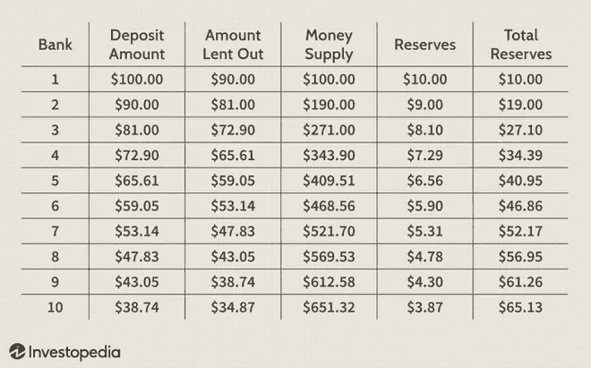
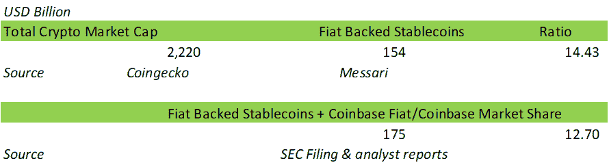
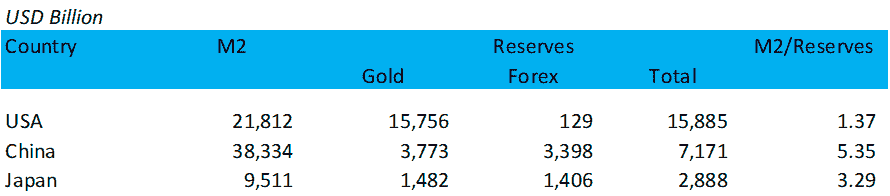

# [市场信息]信用——加密和真实世界货币系统的相似和差异

> 原文：<https://medium.com/coinmonks/market-info-credit-the-parallels-and-disparities-of-crypto-and-real-world-monetary-system-1b423edbfc52?source=collection_archive---------27----------------------->

加密货币市场在过去几年里蓬勃发展，它至少是我们现有的基于法定货币系统的可行替代方案。加密货币体系在许多方面与法定货币体系相似，我经常将加密货币体系比作新兴国家的金融体系:最近，我一直用澳门做类比。然而，它在信用创造方面也是不同的，因为加密系统是一个超额抵押的系统，没有信用创造过程。

## 加密货币系统中没有信用创造

在今天的大多数经济体中，中央银行通过调整货币供应量来管理经济(M2)。货币乘数是货币效应，它解释了信贷是如何在金融系统中产生的。

在上图中，当银行 A(第 1 行)借给个人 B 90 美元时，信贷就产生了，经济中的货币供应量从 100 美元的发行资本(m1)增加到 190 美元(m1+信贷，m2)。随着这种做法在多家银行和个人中重复出现，向金融体系注入的任何 1 美元基础货币供应都可能增加数倍。事实上，像美联储这样的中央银行通过购买或出售政府债券来调整利率水平，而不是注入现金，同样是为了管理货币供应水平。

在菲亚特系统中，当贷款发放给 B 人(以及其他人)时，信用就产生了。对可信度的评估是任何法定金融体系健康的关键。当信用评估失败时，就会发生金融危机。当信贷不足时，经济收缩就会发生；当信贷超过必要水平时，就会出现通货膨胀和潜在的金融危机。

加密货币系统在这个过程中不创造信用。当你为戴质押进马克道时，可取出的戴金额少于抵押物。在 Aave 中，你只能借比你存款少的钱。由于加密货币领域是基于匿名的，因此没有基于借款人记录的信用，至少目前还没有大规模的*信用。

这意味着加密货币系统不存在系统性风险。无论你是个人还是机构，你的风险只限于你的资产数量。在菲亚特系统中，你可以借比你的资产更多的钱，例如过多的抵押贷款。但是在密码系统中，这是不可能的。在加密系统中，如果雷曼兄弟(Lehman Brother)的一个 crypt 等价物失败，其损害仅局限于其自身资产，不会扩展到市场中的其他参与者。

## 不是所有的 Crytpocurrency 都能同时兑换成菲亚特。

你可能会说没有必要把任何密码赎回到菲亚特。BTC 和 ETH 的矿工确实支付电费。从更大的意义上来说，如果加密货币体系要融入现实世界的商品和服务流通体系，加密货币必须有现实世界的价值参考。如果一个巨无霸的价格是 4 美元，麦当劳不会接受低于这个价格的任何加密货币支付。

尽管如此，也确实不是所有的加密货币都会同时兑换成法定货币。就好比不是所有的美元都会兑换成黄金；或者所有的 CNY 持有者都将现金转移到外汇储备中。现代中央银行制度证明了这一点，即一个金融体系只需要保持一定水平的准备金就可以保证其稳定性。不需要完全抵押，即不需要金本位制。

因此，当系统中有足够的法定货币作为储备时，加密货币系统将稳定运行。那么，问题来了，现在加密货币体系中的法定准备金水平如何？理想的或必要的水平应该是什么？

很难回答，因为加密货币系统不是一个国家；虽然加密货币上的所有数据都在链上，因此是透明的，但平面部分不是。所以我们得做个估计。

我们估计，大多数与加密货币系统直接相关的法定储备是:1)法定支持的稳定货币抵押品；2)集中交易，其中法定交易对占多数。

截至 2022 年 3 月，约有 1540 亿美元的菲亚特 stablecoins 在流通。交易法定储备很难:比特币基地在其年度报告中宣布它有 105 亿美元，应用其在以法定货币计价的加密交易所中 50%的估计市场份额，我们估计所有法定交易交易所的法定储备总额为 210 亿美元。这使得今天加密货币系统的总价值达到 1750 亿美元。

下一步与我们在第一个主题中的观察有关。由于没有信用创造，我们可以将加密货币的市值作为加密货币的总供应量。根据 Coingecko 的数据，截至 2022 年 3 月，这一数字为 2.2 万亿美元。该比率为 12.7，将加密货币系统中的总加密货币供应量除以法定储备。也就是说，1 美元的加密货币可以兑换 12.7 美分。

虽然在 2.2 万亿美元的行业中不会发生大规模同时赎回，但如果我们将整个加密货币系统视为一个国家，我们可以与现实世界的国家进行一些比较。

上图显示了美国、中国和日本的 M2 供应和储备(黄金和外币)。世界主要经济体的 M2 超额准备金率在 1.37 到 5.35 之间。

## 结论

在主要经济体中，加密货币的供应准备金率高于 M2 准备金率，但这可能是几个原因造成的，包括，并非所有的 BTC 和 ETH 都仍在流通(私钥丢失或其他原因)，并非所有的加密货币都可以兑换为法定货币，加密货币的价格取决于交易量等。我们也没有深入研究加密货币领域的复杂工具，例如交叉链桥。

尽管有上述条件，如果加密货币的供应储备比率很高，那么该行业就处于繁荣期，这证明了资本和人力资源的流入以及该领域众多创新的出现。监测这一比例的变化是这个行业情绪的有效指标。

如果供应准备金率正常，我们应该对加密货币的效用有更高的信心。加密货币系统中没有信用创造，降低了系统风险，这是加密货币成为现有法定金融系统的替代或补充的有利因素。

(凯恩，宁静队，2022 年 3 月 29 日，推特:[https://twitter.com/SerenityFund](https://twitter.com/SerenityFund))

*注释和参考文献*

*   TrueFi 和 Maple Finance 使用法定信用评估指标创建了加密货币贷款，应获得信贷。Fei 方案试图创建抵押不足的稳定存款，但未能按设计发挥作用。
*   来源:黄金储备[https://worldpopulationreview . com/country-rankings/Gold-Reserves-by-country](https://worldpopulationreview.com/country-rankings/gold-reserves-by-country)；外汇储备[https://en . Wikipedia . org/wiki/List _ of _ countries _ by _ foreign-exchange _ Reserves](https://en.wikipedia.org/wiki/List_of_countries_by_foreign-exchange_reserves)；金价[https://www . Bloomberg . com/markets/commodities/futures/metals](https://www.bloomberg.com/markets/commodities/futures/metals)；https://tradingeconomics.com/country-list/money-supply-m2? M2[洲=美洲](https://tradingeconomics.com/country-list/money-supply-m2?continent=america)；汇率[https://www.bloomberg.com/markets/currencies/cross-rates](https://www.bloomberg.com/markets/currencies/cross-rates)

> 加入 Coinmonks [电报频道](https://t.me/coincodecap)和 [Youtube 频道](https://www.youtube.com/c/coinmonks/videos)了解加密交易和投资

# 另外，阅读

*   [CoinFLEX 评论](https://coincodecap.com/coinflex-review) | [AEX 交易所评论](https://coincodecap.com/aex-exchange-review) | [UPbit 评论](https://coincodecap.com/upbit-review)
*   [AscendEx 保证金交易](https://coincodecap.com/ascendex-margin-trading) | [Bitfinex 赌注](https://coincodecap.com/bitfinex-staking) | [bitFlyer 评论](https://coincodecap.com/bitflyer-review)
*   [麻雀交换评论](https://coincodecap.com/sparrow-exchange-review) | [纳什交换评论](https://coincodecap.com/nash-exchange-review)
*   [支持卡审核](https://coincodecap.com/uphold-card-review) | [信任钱包 vs 元掩码](https://coincodecap.com/trust-wallet-vs-metamask)
*   [Exness 点评](https://coincodecap.com/exness-review)|[moon xbt Vs bit get Vs Bingbon](https://coincodecap.com/bingbon-vs-bitget-vs-moonxbt)