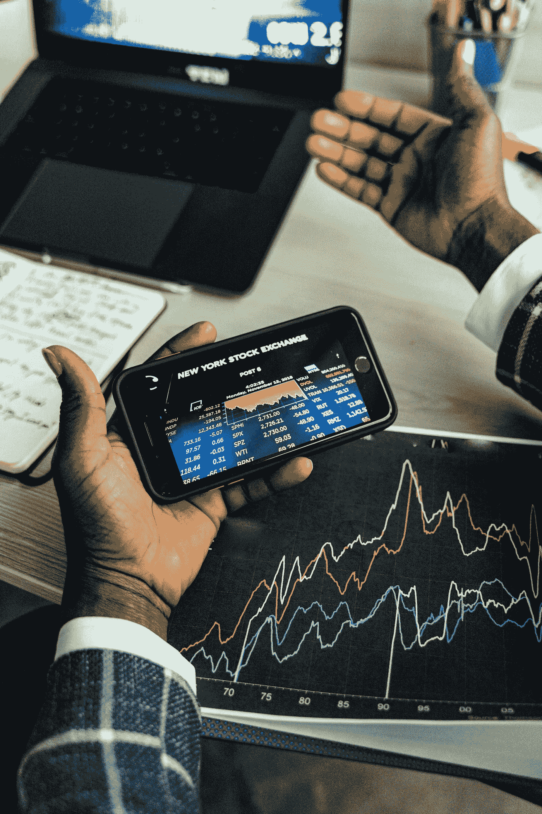

# 加密中的市场操纵:要注意什么

> 原文：<https://medium.com/coinmonks/market-manipulation-in-crypto-what-to-watch-for-5091822f7a84?source=collection_archive---------40----------------------->

[https://www.pexels.com/@shkrabaanthony/](https://www.pexels.com/@shkrabaanthony/)

由于加密货币社区不受监管、未经许可的性质，几乎任何人都可以创建自己的令牌，导致市场上出现了一系列迷因币。这些代币通常不提供任何效用，并且这些资产的市值表明缺乏基础支持。然而，天真的投资者仍然被宣传手段吸引到这些市场，通过展示一枚几乎不花什么钱的硬币的人为百分比收益(从 0.01 美元到 0.02 美元仍然被认为是 100%的回报，这就是初学者需要看到的 FOMO 开始发挥作用的全部内容)，让其他人相信代币确实是有利可图的。)

结果，大量不知情的储户涌入市场，导致价格飙升，这直接有利于假象背后的傀儡主人。一旦恶作剧的团体/实体得到满足，他们兑现利润，使股票价格暴跌，使其他投资者的钱比开始时少。

这个过程被称为**市场操纵**，有很多方法可以操作。理解投资者利用系统玩游戏的各种策略很重要，因为那些不知道恶意阴谋的人最终会成为受害者。我们将全面强调市场中常见的一些不道德行为。

**泵&转储**

如上所述的更常见的方法在加密货币市场中更常见，并且可以在几个小时甚至几个月的时间内发生。错误信息通过 Twitter、Reddit 和其他基于社区的平台传播。从虚假收益、虚假新闻，到现在的明星代言，这些宣传噱头吸引了不认识的参与者，承诺以如此低廉的价格获得巨额回报。随着时间的推移，随着人们继续加入，价格上升，百分比收益被炫耀，以吸引更多的参与者(这通常有利于方案背后的人)。)最终，操纵木偶的人决定他们已经受够了，并通过抛售订单淹没市场(被称为**欺骗**，我们将在本文稍后介绍)的方式撤回资金，导致代币价格大幅下降。股市专家一直强调要自己做研究，但在无国界的加密领域，这比以往任何时候都更重要。

**洗盘交易**

这一序列包括投资者出售和重新购买相同的资产，造成虚假的市场活动。它并不总是有意操纵价格，但拥有大量资本的市场参与者(被称为“鲸鱼”)往往对其头寸有更大的影响力。加密货币仍未被归类为受监管的证券，但在美国等国家，清洗交易是非法的，因此在出售和收购资产时，人们必须保持对其行为的认识。IRS 制定的清洗销售规则规定，如果亏损的股票在 30 天内被重新购买，亏损的交易不能用于税收目的(同样，这还不包括 crypto。)头寸的数量必须相同，才能算作卖出，但尽管如此，与自己交易可能会导致上涨或下跌。

**欺骗**

正如在第一个例子中提到的，**欺骗“包括用购买或出售订单来发送订单簿。这些订单通常包含大量的交易量，如果执行，可能会导致上涨或下跌。这种过多的订单被称为“墙”，可以在交易所提供的市场深度图上看到，该图提供了对未决买卖订单的可视化洞察。这些墙有能力改变价格运动的方向，所以人们必须对特定市场的订单活动保持警惕。欺骗不仅限于加密货币投资，它几乎可以发生在任何类型的市场(个人认为，它更有可能发生在交易活动更多的高市值市场。)**

****停止狩猎****

**随着时间的推移，证券市场不断发展，可供投资者使用的创新工具和指标比以往任何时候都多。在这些额外的资源中，交易者通常可以发现共同的支持区域、阻力区域和止损区域，在这个价格下，参与者可能会卖出他们的头寸。作为一种迫使他人离开其头寸的方式，证券的价格被驱动到这些区域(通过欺骗的方式),通常是为了有机会积累额外的代币/股票。**

**如何避免市场操纵？**

**以我的个人经验，我学到了最安全的交易方法，就是长期持有。投资确实伴随着自身的一系列风险，无论是有机的市场情绪还是外部力量，剧烈的价格波动都是不可避免的。然而，参与者应该始终保护自己，像 [NewsCrypto](https://newscrypto.io) 这样的平台提供了对市场的额外洞察，通常只有机构玩家才能获得这些洞察。正如我前面提到的，鲸鱼对市场有更大的影响，因为它们的资本利润率很高，有了 NewsCrypto 的**鲸鱼警报**，交易者可以及时了解大量的市场活动。保持最新的支持和阻力区域也容易得多，NewsCrypto 的**月线**工具利用人工智能根据先前的技术分析绘制出关键区域。随着越来越多的零售买家开始转向加密，记住技术分析之外的其他市场影响因素是很重要的；基本面和新闻情绪大有帮助，但人们必须能够从假新闻中解读出准确的信息。社交媒体上的社区是一个建立关系网和学习新事物的好地方，但在这些论坛上获得的任何信息都应该通过你自己的研究来验证(像 [Cointelegraph](https://cointelegraph.com) 、NewsCrypto 和 [Coinmarketcap](https://coinmarketcap.com) 这样的认证新闻媒体是极好的来源)。)**

> ***加入 Coinmonks* [*电报频道*](https://t.me/coincodecap) *和* [*Youtube 频道*](https://www.youtube.com/c/coinmonks/videos) *了解加密交易和投资***

# **另外，阅读**

*   **[Bookmap 评论](https://coincodecap.com/bookmap-review-2021-best-trading-software) | [美国 5 大最佳加密交易所](https://coincodecap.com/crypto-exchange-usa)**
*   **最佳加密[硬件钱包](/coinmonks/hardware-wallets-dfa1211730c6) | [Bitbns 评论](/coinmonks/bitbns-review-38256a07e161)**
*   **[新加坡十大最佳加密交易所](https://coincodecap.com/crypto-exchange-in-singapore) | [购买 AXS](https://coincodecap.com/buy-axs-token)**
*   **[红狗赌场评论](https://coincodecap.com/red-dog-casino-review) | [Swyftx 评论](https://coincodecap.com/swyftx-review) | [造币厂评论](https://coincodecap.com/coingate-review)**
*   **[投资印度的最佳密码](https://coincodecap.com/best-crypto-to-invest-in-india-in-2021)|[WazirX P2P](https://coincodecap.com/wazirx-p2p)|[Hi Dollar Review](https://coincodecap.com/hi-dollar-review)**
*   **[加拿大最佳加密交易机器人](https://coincodecap.com/5-best-crypto-trading-bots-in-canada) | [库币评论](https://coincodecap.com/kucoin-review)**