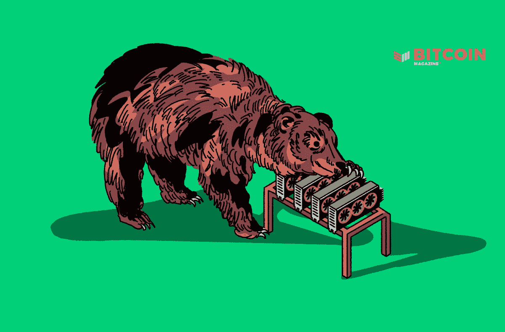
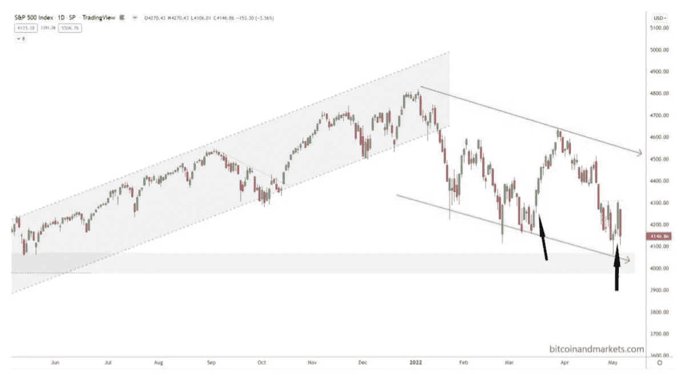
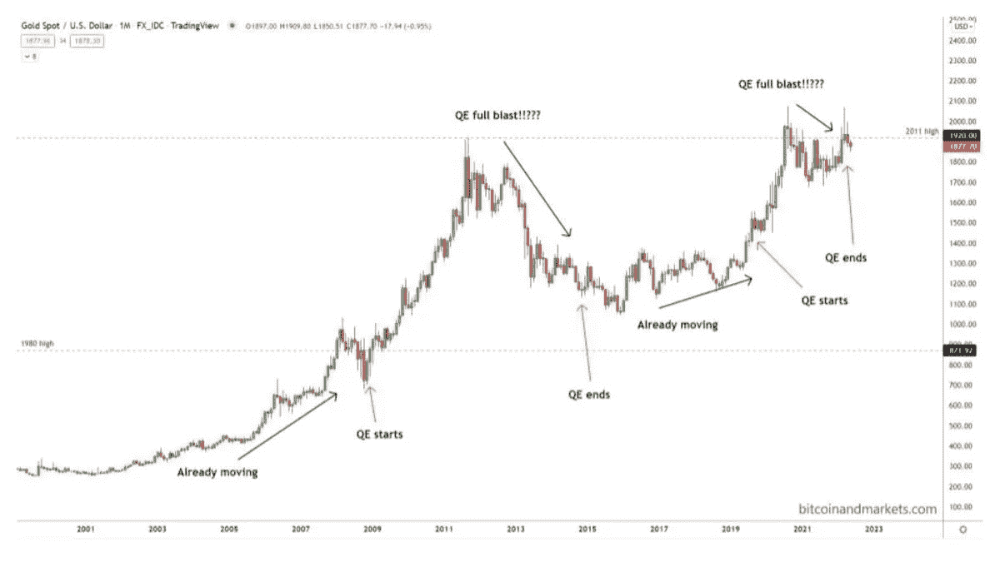
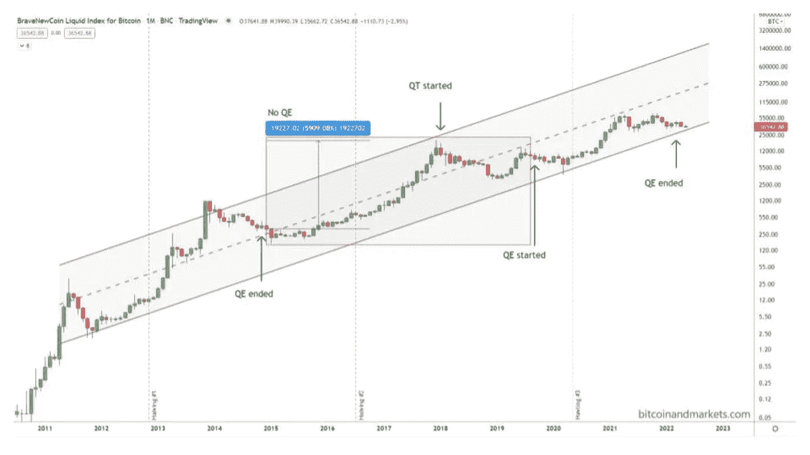
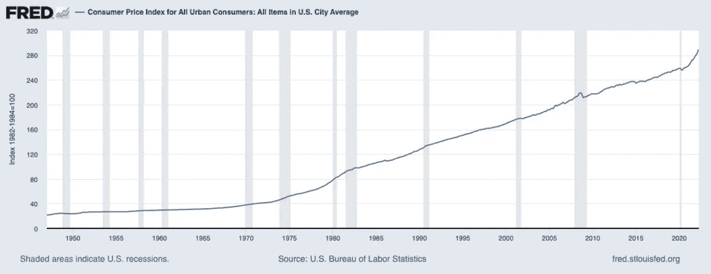
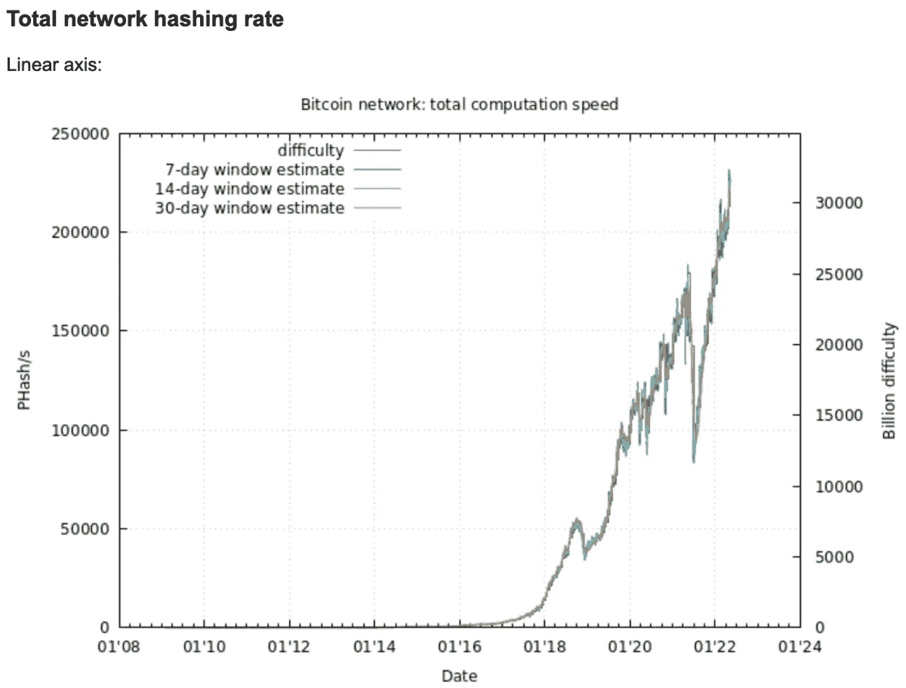
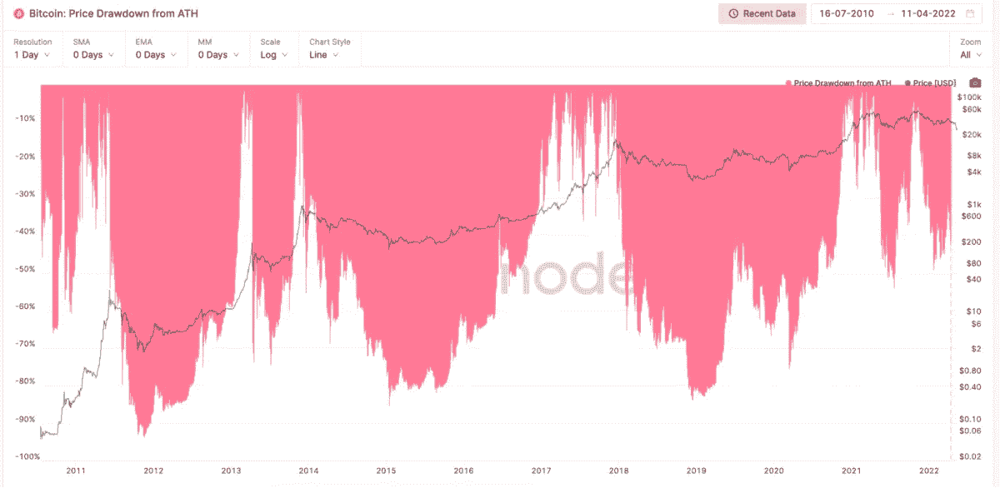
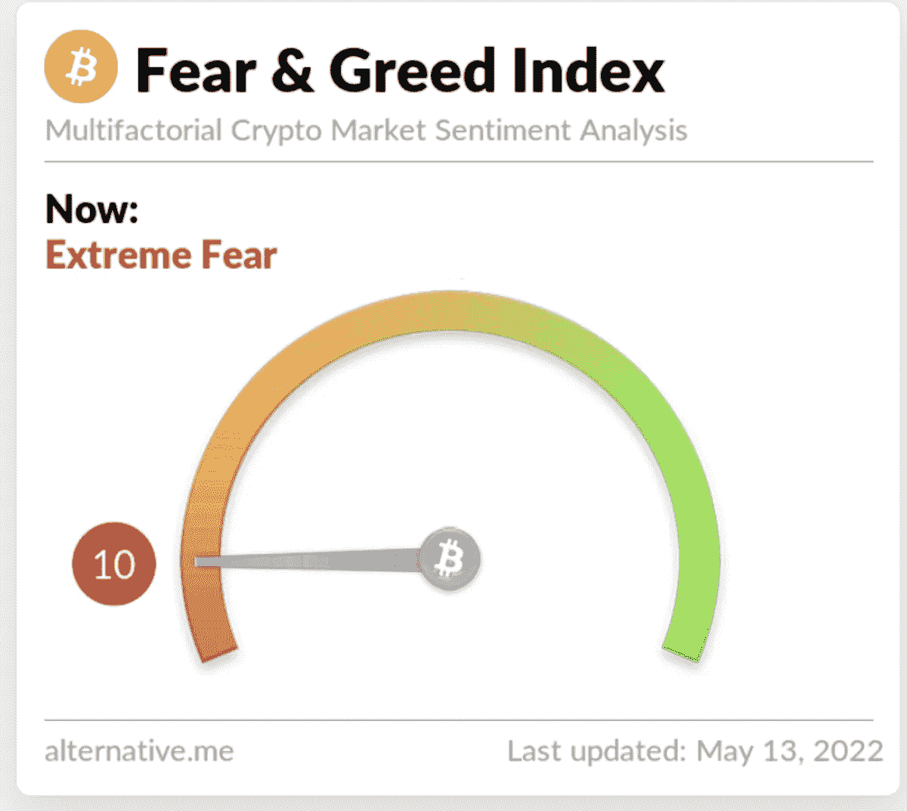

# 市场混乱和比特币价格触底

> 原文：<https://medium.com/coinmonks/market-mayhem-and-calling-the-bitcoin-price-bottom-fb57c016c2f4?source=collection_archive---------53----------------------->

对当前市场结构的逆向分析表明，比特币底部已经接近，美联储将逆转其鹰派路线。

**听这一集:**

*   [苹果](https://podcasts.apple.com/de/podcast/fed-watch-bitcoin-and-macro/id1543640492?i=1000560789642)
*   [Spotify](https://open.spotify.com/episode/6l9buHHdjCFYNtFPDdFbyH?si=317704971fc84fdc)
*   [谷歌](https://podcasts.google.com/feed/aHR0cHM6Ly9mZWR3YXRjaC5saWJzeW4uY29tL3Jzcw/episode/ZWYxOGJlMTUtNjYyNS00ZmIxLWE2OTUtNTljNDdhZDM4MDk4?sa=X&ved=0CAUQkfYCahcKEwjYo8mymNz3AhUAAAAAHQAAAAAQLA)
*   [Libsyn](https://fedwatch.libsyn.com/fed-watch-10th-may)
*   [阴天](https://overcast.fm/+m2acOXtYk)

在这一集的“美联储观察”播客中，我和 Christian Keroles 以及 livestream 的工作人员讨论了与比特币相关的宏观发展。话题包括美联储最近加息 50 个基点，消费者价格指数(CPI)预览——这一集是在 CPI 数据发布之前于周二现场录制的——以及关于为什么业主等价租金经常被误解的讨论。我们以一场关于比特币价格的史诗般的讨论结束。

这可能是“美联储观察”历史上的一个关键事件，因为我公开表示比特币“就在底部附近”。这与目前市场上主流的超级悲观形成了鲜明对比。在这一集里，我非常依赖那些在视频中并不总是排成一行的图表。下面是这些图表的基本解释。你可以看到我在这里使用的整个幻灯片。

“美联储观察”是一个播客，面向对央行时事以及比特币将如何整合或取代传统金融系统的各个方面感兴趣的人。为了理解比特币将如何成为全球货币，我们必须首先了解现在发生了什么。

# 美联储和美国的经济数据

在第一张图表上，我指出了美联储在标准普尔 500 图表上的最后两次加息。我在本周的一篇博客文章中写道，“我想表明的是，加息本身并不是美联储的主要工具。谈论加息是主要工具，同时培养对美联储魔力的信心。”去掉箭头，试着猜猜公告在哪里。

*(*[*Source*](https://bitcoinandmarkets.com/)*)*

下一个图表也是如此:黄金。

*(*[*Source*](https://bitcoinandmarkets.com/)*)*

最后，在本节中，我们看了比特币图表，其中绘制了量化宽松(QE)和量化紧缩(QT)。可以看到，在“没有 QE”的时代，2015 年到 2019 年，比特币经历了 6000%的牛市。这几乎与人们的预期完全相反。总结这一节，美联储的政策与市场的重大波动没有什么关系。波动来自于市场不可知的复杂涨落。美联储只是试图平滑边缘。

*(*[*Source*](https://bitcoinandmarkets.com/)*)*

# CPI 混乱

很难对播客的这一部分写一个好的总结，因为在数据丢失的前一天我们还在直播。在播客中，我报道了[欧元区 CPI 小幅走高](https://www.focus-economics.com/countries/euro-area/news/inflation/inflation-surges-to-new-record-high-in-april)，4 月份同比(YoY)达到 7.5%，环比变化率从 3 月份的 2.5%降至 4 月份的 0.6%。这就是大多数人在 CPI 中忽略的情况:4 月份环比变化迅速放缓。我还在播客上报道了美国的 CPI 预测，但现在，[我们有了 4 月份的硬数据。](https://www.fxstreet.com/news/us-cpi-preview-forecasts-from-12-major-banks-the-first-decelerating-print-in-a-long-time-202205101421)美国整体 CPI 从 3 月份的 8.5%降至 4 月份的 8.3%。月环比变化从 3 月份的 1.2%降至 4 月份的 0.3%。再次，CPI 涨幅大幅回落。当看同比数据时，CPI 可能非常令人困惑。

看起来 4 月份的通货膨胀率为 8.3%，而实际上仅为 0.3%。

*Year-over-year CPI, month-over-month CPI (*[*source*](https://fred.stlouisfed.org/series/CPIAUCSL#0)*)*

播客中的下一个话题是租金。我经常听到对 CPI 住房指数的误解，特别是对业主等价租金(OER)的误解。首先，很难衡量住房成本上涨对一般消费者的影响。大多数人不经常搬家。我们有 15 年或 30 年的固定利率抵押贷款，完全不受当前房价的影响。就连租房租约也不是每个月都续签的。合同通常持续一年，有时更长。所以，如果某个月有少数人支付了较高的房租，那并不影响一般人的住房支出或者一般房东的收入。

> 交易新手？试试[密码交易机器人](/coinmonks/crypto-trading-bot-c2ffce8acb2a)或[复制交易](/coinmonks/top-10-crypto-copy-trading-platforms-for-beginners-d0c37c7d698c)

用当前的市场价格来估算住房的平均成本是一种不诚实的方法，但不这样做是对 CPI 最常引用的批评。告诫:我不是说 CPI 衡量通胀(印钞)；它衡量的是维持你生活水平的物价指数。当然，这个统计数据有很多层主观性。OER 更准确地估计了普通美国人住房成本的变化，消除了波动性，并将纯粹的住房成本与投资价值分开。

# 比特币价格分析

剩下的一集讲的是目前的比特币价格行动。我开始我的看涨咆哮，展示散列率图，并谈论为什么它是一个滞后和确认指标。随着散列率达到历史最高水平并持续上升，这表明比特币在当前水平下的估值相当合理。

*Bitcoin hash rate (*[*source*](https://bitcoin.sipa.be/)*)*

*The history of bitcoin drawdowns (*[*source*](https://studio.glassnode.com/metrics?a=BTC&category=&chartStyle=line&contractExpiration=1680220800&ema=0&m=market.PriceDrawdownRelative&resolution=24h&zoom=all)*)*

最近几年，出现了时间更短、规模更小的上涨和时间更短、规模更小的下跌。这张图表表明，50%的提取率是新常态，而不是 85%。

现在，我们进入一些技术分析。我专注于相对强弱指数(RSI ),因为它是非常基本的，也是许多其他指标的基础。月 RSI 处于典型的周期底部信号水平。目前，月度指标显示，比特币比 2020 年科罗纳崩盘底部时更超卖。周线 RSI 同样超卖。低至 2020 年电晕崩盘的底部，在此之前，2018 年熊市的底部。

恐惧和贪婪指数也非常低。这一指标显示出“极度恐惧”，通常出现在相对底部，10 与 2020 年新冠肺炎崩盘以来的最低评级持平。

*(*[*Source*](https://alternative.me/crypto/fear-and-greed-index/)*)*

总之，我的反向(看涨)观点是:

1.  比特币已经处于历史低点，随时可能触底。
2.  全球经济正变得越来越糟糕，而比特币是无对手方的、可靠的货币，因此它的表现应该类似于 2015 年 QE 年末的情况。
3.  未来几个月，美联储将被迫改变说法，这可能会减轻股市的下行压力。
4.  在这一点上，比特币与美国经济密切相关，美国将比大多数其他地方更好地经受住即将到来的衰退。

这个星期到此为止。感谢读者和听众。如果你喜欢这个内容，请订阅，审查和分享！

*这是安塞尔·林德纳的客座博文。所表达的观点完全是他们自己的，不一定代表 BTC 公司或比特币杂志*的观点。**

*原载于 2022 年 5 月 16 日 https://bitcoinmagazine.com**[*。*](https://bitcoinmagazine.com/markets/market-mayhem-and-calling-the-bitcoin-price-bottom)*