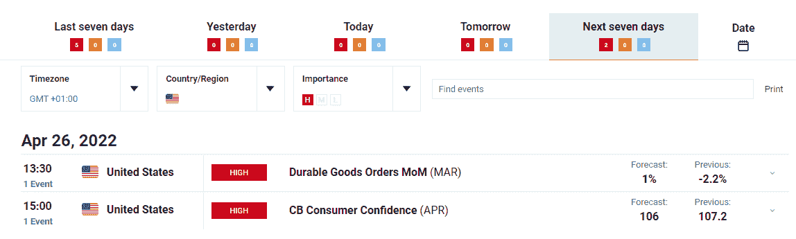

# 本周市场展望

> 原文：<https://medium.com/coinmonks/market-outlook-for-the-week-4985c1cd0cce?source=collection_archive---------16----------------------->

在我之前的[文章](/coinmonks/crypto-market-outlook-for-the-week-1c1bc67121ef)中，我是看空$btc 的。我给出了促使分析的各种因素。我从宏观、技术面、基本面的角度进行了解剖。

自我更新以来，BTC 下跌了 9.3%，并从我认为是潜在需求的区域反弹。由于总体市场状况，Near 的表现不佳。但是我没有在最近的交易中记录任何损失。在过去的一周里，在我的需求区间内交易很舒服，此后反弹到盈利状态。

本周，我会用同样的视角来看待市场价格。我会尝试给出我所看到的整体市场方向，给出数据支持，给出技术、宏观和基本面的观点。

让我们开始吧。

**$BTC:**

TA 方面，我们可以预计$btc 可能会上升到$42，400 区域。它从需求区反弹。如果顶置供应保持，我仍然预计$btc 会走得更低。

看看本周的经济日历，我们可以看到没有潜在的市场变动事件。

这应该给整个加密市场的回旋余地，以获得一些百分比。在接下来的几天里，我们可能会看到一些替代价格上涨 8-20%。

我已经概述了一些我认为根据它们的结构看起来很神奇的替代硬币。这里没有太多的评论，因为这些 alt 还没有什么重要的意义。(FA-wise)。

****

****$DYDX:****

****

****$TRX:****

****

****$SOL:****

****

****$CRV:****

****

****$AVAX:****

****

****值得注意的提及:$LOOKS 和$NEAR****

****结论:****

**像往常一样，记住这不是财务建议。总是努力进行进一步的个人研究，以进一步弄清楚诸如此类的事情。**

> **加入 Coinmonks [电报频道](https://t.me/coincodecap)和 [Youtube 频道](https://www.youtube.com/c/coinmonks/videos)了解加密交易和投资**

# **另外，阅读**

*   **[币安 vs FTX](https://coincodecap.com/binance-vs-ftx) | [最佳(索尔)索拉纳钱包](https://coincodecap.com/solana-wallets)**
*   **如何在 Uniswap 上交换加密？ | [A-Ads 评论](https://coincodecap.com/a-ads-review)**
*   **[加密货币储蓄账户](/coinmonks/cryptocurrency-savings-accounts-be3bc0feffbf) | [YoBit 审核](/coinmonks/yobit-review-175464162c62)**
*   **[Botsfolio vs nap bots vs Mudrex](/coinmonks/botsfolio-vs-napbots-vs-mudrex-c81344970c02)|[gate . io 交流回顾](/coinmonks/gate-io-exchange-review-61bf87b7078f)**
*   **[CoinFLEX 评论](https://coincodecap.com/coinflex-review) | [AEX 交易所评论](https://coincodecap.com/aex-exchange-review) | [UPbit 评论](https://coincodecap.com/upbit-review)**
*   **[AscendEx 保证金交易](https://coincodecap.com/ascendex-margin-trading) | [Bitfinex 赌注](https://coincodecap.com/bitfinex-staking) | [bitFlyer 审核](https://coincodecap.com/bitflyer-review)**