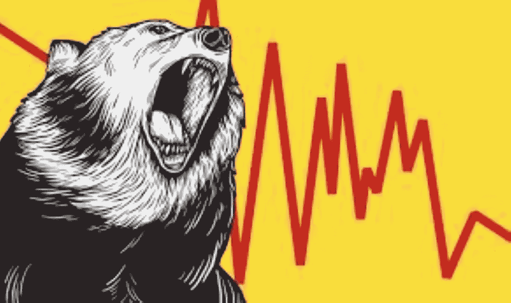
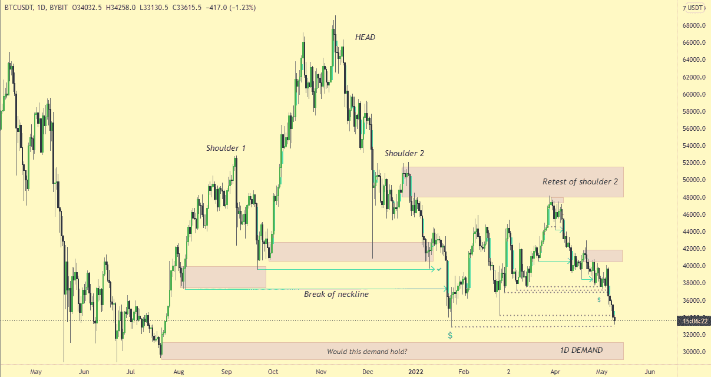
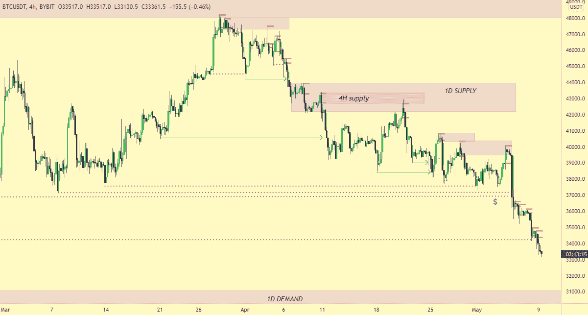
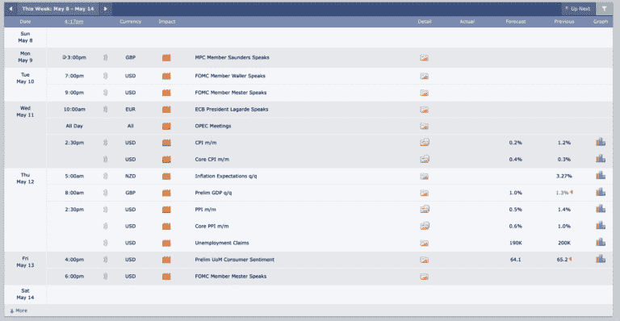
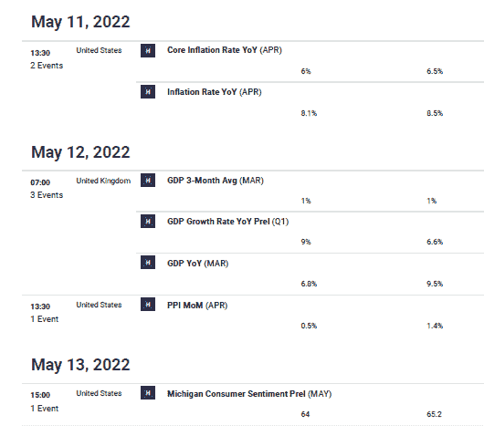
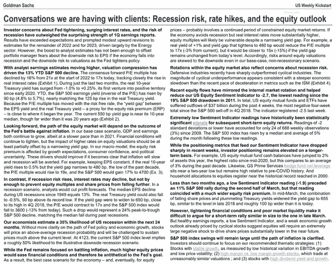

# 本周市场展望

> 原文：<https://medium.com/coinmonks/market-outlook-for-the-week-a4275115bccf?source=collection_archive---------9----------------------->

在我之前的[文章](/@alexanazodo/market-outlook-for-the-week-2ac7eddfe0c5)中，我非常看空$btc。虽然我的目标花了一些时间来实现，但我必须说，我对 t 是正确的。我仍然看跌$btc，尽管我在看我们是否能在周中 CPI 消息出来之前得到一些缓解。

本周，我将只看一眼$BTC。是 alts 动起来的主要催化剂。如果$btc 看跌，那就跟你的 altcoin 收益说再见吧。是的，有那么糟糕。

除此之外，今天，我将尝试从技术、宏观和基本面的角度给出总体市场方向。让我们开始吧。

**$BTC:**

FOMC 消息出来后，$Btc 未能守住日内需求。FOMC 会议结束后立即开始的上涨变成了一个很好的多头陷阱。正如你在上面的图表中看到的，没有什么能阻止$btc 现在达到$30k/$31k。任何集会肯定会被镇压。我们对可能会有一些盘中反弹的事实持开放态度。这将是明智的，以较低的时间框架捕捉这些举动。由于这些是低时间框架反弹，不要陷入流。$btc 仍然非常悲观。

**宏观展望:**

上周充斥着大量的经济数据。本周也充斥着同样的经济数据，但却不那么相关/繁忙。这可能意味着波动性影响较小。

正如我们所见，最重要的将是美国和欧洲央行的 CPI，然后是美国的 PPI。许多人一直在谈论衰退风险、加息和整体股市前景。

高盛估计，未来 24 个月内，美国经济衰退的可能性为 35%。在美联储政策和经济增长路径不更加明朗的情况下，股市将对高于平均水平的衰退概率进行定价，并将面临将价格维持在远高于当前水平的挑战。

这里有一个 Route2Fi 的推文链接，解释了整个情况。[https://twitter.com/Route2FI/status/1523569637446672384?s = 20&t = re 7 iye 7 XT 5a 2-RUSKSSoFA](https://twitter.com/Route2FI/status/1523569637446672384?s=20&t=re7iYE7xt5a2-RUSKSSoFA)

正如我几周来一直在说的那样，现在不是风险资产大放异彩的时候。美联储已经宣布了收缩资产负债表的意图。对于国债，FOMC 宣布，上限最初将设定为每月 300 亿美元，三个月后将增加到每月 600 亿美元。在此月度限额下，持有的美国国债的减少将包括美国国债息票证券，以及在息票到期日少于月度限额的范围内的美国国债。与此同时，对于机构债务和机构抵押贷款支持证券，FOMC 计划最初将上限设定为每月 175 亿美元，三个月后将增加到每月 350 亿美元。

一旦这种情况发生，市场上的流动性就会减少。加密技术会受到影响，股票也会受到影响。交易区间到区间。不要过度乐观或悲观。

**结论:**

像往常一样，记住这不是财务建议。总是努力进行进一步的个人研究和分析，以进一步弄清楚这些事情。

> 加入 Coinmonks [电报频道](https://t.me/coincodecap)和 [Youtube 频道](https://www.youtube.com/c/coinmonks/videos)了解加密交易和投资

# 另外，阅读

*   [5 款最佳加密交易终端](https://coincodecap.com/crypto-trading-terminals) | [最佳 DeFi 应用](https://coincodecap.com/best-defi-apps)
*   [最佳网上赌场](https://coincodecap.com/best-online-casinos) | [币安评论](/coinmonks/binance-review-ee10d3bf3b6e) | [BitMEX 评论](https://coincodecap.com/bitmex-review)
*   [麻雀交换评论](https://coincodecap.com/sparrow-exchange-review) | [纳什交换评论](https://coincodecap.com/nash-exchange-review)
*   [美国最佳加密交易机器人](https://coincodecap.com/crypto-trading-bots-in-the-us) | [经常性评论](https://coincodecap.com/changelly-review)
*   [在印度利用加密套利赚取被动收入](https://coincodecap.com/crypto-arbitrage-in-india)