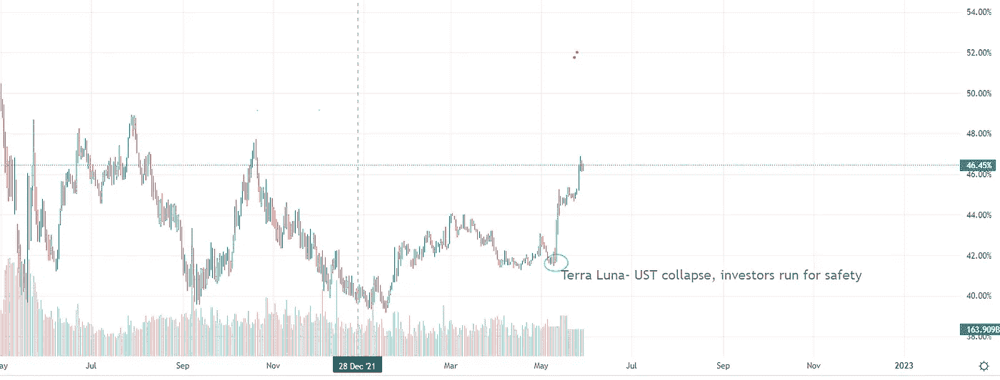
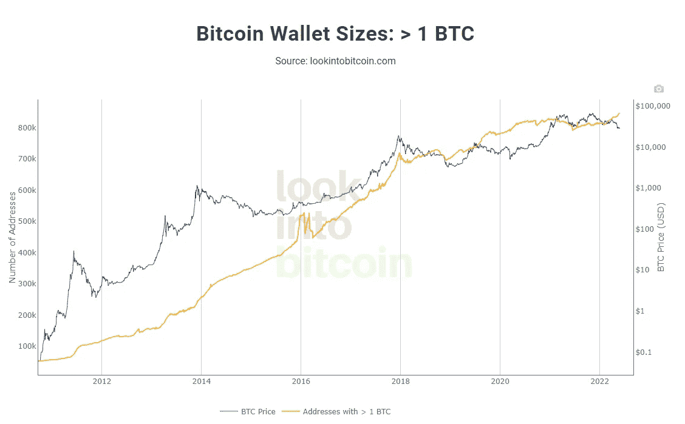

# 市场概述，以及一些熊市的实用技巧

> 原文：<https://medium.com/coinmonks/market-overview-and-some-practical-tips-for-bear-markets-a3c858cc1393?source=collection_archive---------22----------------------->

让我们从我们所处的位置开始。

**通货膨胀**

美国和英国的通胀率都处于 40 年来的最高水平。我不会深入探讨通胀达到这些水平的原因，但一些明显的原因有助于推动通胀，并放大生活成本危机，这就是美联储自 2020 年 3 月 15 日新冠肺炎袭击世界以来的零利率政策。随着经济的关闭，前所未有的财政刺激，央行的利率政策，随后是仍在持续的供应链问题，乌克兰-俄罗斯战争，然后你把所有这些因素混合在一起，你会得到一杯血腥玛丽通胀鸡尾酒。根据一些分析师的说法，在最糟糕的情况下，通胀将持续到 2022 年，并可能在 2023 年达到峰值。

为了稳定通货膨胀，美联储从他们的货币政策工具箱里拿出了一些工具。这是 5 月 4 日加息半个百分点，并表示将开始收缩其资产负债表，近 9 万亿美元。现在这些政策吓坏了市场。随着投资者规避风险，并预测市场流动性将减少，与成长股高度相关的加密市场大幅抛售。

在美联储采取了所有这些行动之后，一个大问题仍然存在。美联储能拯救经济，并策划软着陆吗？软着陆意味着不会通过所有措施将经济推入衰退？有些人可能会说是的，有些人可能会说他们不能。我倾向于后者，我预测美联储将在实现目标之前停止加息，并再次推出某种宽松政策。然而，如果他们会改变他们的政策，他们将不得不看看发生了什么，什么时候。

**密码**

正如我在之前的帖子中提到的，当市场风险远离所有市场(不仅仅是加密市场)时，**替代币**往往被视为更高风险的载体，具有更高的贝塔系数(与成长型股票相关)。结果，它们成了投资者的流动资金袋，替代硬币被大规模抛售，投资者寻找经过多年考验的更安全的选择。而那就是**比特币**，还有**以太坊**。其他一切都被视为风险更高的选择。

**Bitcoin dominance chart/ Uptrend since the beginnings of 2022**

尽管比特币价格下跌，但它的主导地位仍在增强，表明投资者对它的信任有所增加。另一个值得关注的重要图表是持有超过 1 BTC 的比特币钱包。我们可以清楚地看到持有 1 BTC 以上的钱包数量稳步增长。是的，价格比前几个月低，然而客观地看数据，不断增长的网络，宏观发展——这只是一个时间问题，比特币的价格将开始跟随。

**应对熊市的一些实用步骤**

我知道我们都想赚钱，然而生活不仅仅是快速的经济收益。我们都记得 2020 年至 2021 年的牛市，新投资者倾向于认为这是常态，但他们不明白那是非常时期，前所未有的流动性充斥着市场。有时，我们的信念会在某些领域或技术上受到考验。因此，我们需要几个月或几年的时间才能收获回报。

*   巩固的几个月是在你最喜欢的领域、兴趣方面进行自我教育的好时机。
*   美元成本平均在你的高信念项目经过仔细的预算分析，这意味着你只投资多少可以承受损失。
*   不要投资你的短期预算。永远不要想把你的抵押贷款、食物、钞票投入股票或密码。熊市可能具有破坏性，持续数月或数年。
*   不要每天都检查价格，或者更糟糕的是，一天检查几次。这将增加你的焦虑，当你看到你的投资下降时，你会感觉很糟糕。
*   拓宽你的时间视野。快钱结束了。当你决定投资时，无论是股票、密码还是商品，都要考虑年数。最好是 5 年或更长时间。
*   享受和家人、朋友在一起的时光。建立关系，超越财产。
*   享受生活，玩得开心。

**免责声明**:我必须警告你，有些观点可能是我个人的偏见，但是我会尽我所能为你提供关于特定主题的客观观点。我不是理财顾问，所有文章只会有严格的教育目的。

> 加入 Coinmonks [电报频道](https://t.me/coincodecap)和 [Youtube 频道](https://www.youtube.com/c/coinmonks/videos)了解加密交易和投资

# 另外，阅读

*   [3 商业评论](/coinmonks/3commas-review-an-excellent-crypto-trading-bot-2020-1313a58bec92) | [Pionex 评论](https://coincodecap.com/pionex-review-exchange-with-crypto-trading-bot) | [Coinrule 评论](/coinmonks/coinrule-review-2021-a-beginner-friendly-crypto-trading-bot-daf0504848ba)
*   [莱杰 vs n rave](/coinmonks/ledger-vs-ngrave-zero-7e40f0c1d694)|[莱杰 nano s vs x](/coinmonks/ledger-nano-s-vs-x-battery-hardware-price-storage-59a6663fe3b0) | [币安评论](/coinmonks/binance-review-ee10d3bf3b6e)
*   [Bybit 交易所评论](/coinmonks/bybit-exchange-review-dbd570019b71) | [Bityard 评论](https://coincodecap.com/bityard-reivew) | [Jet-Bot 评论](https://coincodecap.com/jet-bot-review)
*   [3 commas vs crypto hopper](/coinmonks/3commas-vs-pionex-vs-cryptohopper-best-crypto-bot-6a98d2baa203)|[赚取加密利息](/coinmonks/earn-crypto-interest-b10b810fdda3)
*   最好的比特币[硬件钱包](/coinmonks/hardware-wallets-dfa1211730c6) | [BitBox02 回顾](/coinmonks/bitbox02-review-your-swiss-bitcoin-hardware-wallet-c36c88fff29)
*   [block fi vs Celsius](/coinmonks/blockfi-vs-celsius-vs-hodlnaut-8a1cc8c26630)|[Hodlnaut 审核](/coinmonks/hodlnaut-review-best-way-to-hodl-is-to-earn-interest-on-your-bitcoin-6658a8c19edf) | [KuCoin 审核](https://coincodecap.com/kucoin-review)