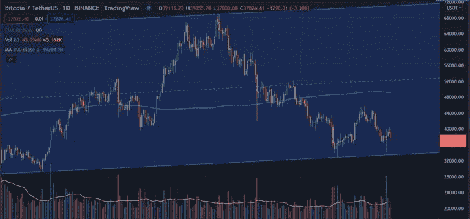
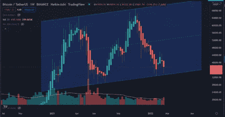

# 市场情绪#2

> 原文：<https://medium.com/coinmonks/market-sentiment-2-2a0455b6f672?source=collection_archive---------43----------------------->

BTC 价格:37548.28 美元
恐惧和贪婪指数:26

入侵乌克兰仍在继续，普京对核升级发出了模糊的威胁，某些俄罗斯银行已被从环球银行间金融电信协会(SWIFT)除名。

2 月 24 日，普京发动了对乌克兰的全面入侵，市场做出了相应的反应，所有传统的金融市场都以红色开盘:标准普尔 500、道琼斯工业平均指数、纳斯达克和富时 100 指数。

比特币最低触及 34352 美元。但当天随之而来的是一波反弹，比特币收盘在 38k 上方。成交量出现峰值，上一次出现如此高的日成交量是在 9 月 7 日，当时比特币从 52k 跌至 42k 的低点，最后收于 46k。

TradingView BTC/USDT Daily Candles

**为什么体积很重要？**

交易量是在给定的时间范围内，通常是一天内，一项资产被买卖的次数。成交量是一个指标，它显示了市场波动的重要性；价格变动期间的交易量越大，变动就越显著。

**这是什么意思？**

从表面上看，这意味着 34，000 美元是一个强有力的支撑位，比特币仍处于上升通道中——因此它仍在发挥作用——尽管持续小幅下跌，但中期前景乐观。必须跌破 33000 美元才能突破这个通道。

我的解释。目前交易比特币的人不愿意在 33，000 美元/34，000 美元以下出售，从这一点来看，我认为目前市场上没有太多散户参与。就在新的 ATH(历史高点)到来之前，散户投资者将会蜂拥而至，像往常一样被烧毁。我真诚地相信，目前市场上的大多数人都是长期投资者，他们已经对市场下跌有了坚定的信心。投资比特币的人现在相信比特币，我真的相信所有人都会因为他们的信仰而得到回报。

TradingView BTC/USDT Heikin Ashi Weekly Candle

**一个不同的视角** 用一根周线的 Heikin Ashi 蜡烛看比特币的价格走势。11 周的持续低迷，短暂的两周上涨，现在是进一步低迷的第二周。在这些时期，周成交量一直保持相对稳定。高成交量的最后一周是 5 月的第三周，比特币从 53，000 美元跌至 37，000 美元的低点。我认为，在我们看到另一个大的交易量高峰之前，比特币将继续横盘整理。另一个大的投降式下跌我会欢迎，因为这意味着我们会更快到达底部，另一方面，一个大的反弹我也会欢迎。但是我想看到交易量的上升，这给价格变动带来意义。

从实际应用的角度来看，乌克兰战争对比特币来说是一个非常有利的事件。乌克兰已经收到了数百万美元的秘密捐款，主要来自 BTC 和瑞士联邦理工学院。它显示了传统金融机构破产时密码的效用；它让来自世界各地的数百万人仅仅凭借一台电脑就能加入一场比他们更大的斗争。逃离该国的人可以随身携带现金，只需一部手机就可以在世界任何地方消费。让这一点的重要性深入人心。在人们生命中最大的危机期间，比特币已经成为他们的资产，你认为这些人会忘记比特币吗？

在不断变化的地缘政治格局中，对一种不受任何单一机构控制的货币的需求日益增长。购买比特币是为你未来的自由投票，我相信切入点会越来越难进入。我鼓励即使是最强烈的怀疑者也购买一些，作为他们未来的风险对冲。

**结论**

短期:横盘整理，直到成交量再次飙升。中期:看涨。长期:这可能是你做过的最好的投资。

> 加入 Coinmonks [电报频道](https://t.me/coincodecap)和 [Youtube 频道](https://www.youtube.com/c/coinmonks/videos)了解加密交易和投资

# 另外，阅读

*   [OKEx vs KuCoin](https://coincodecap.com/okex-kucoin) | [摄氏替代品](https://coincodecap.com/celsius-alternatives) | [如何购买 VeChain](https://coincodecap.com/buy-vechain)
*   [ProfitFarmers 回顾](https://coincodecap.com/profitfarmers-review) | [如何使用 Cornix Trading Bot](https://coincodecap.com/cornix-trading-bot)
*   [如何匿名购买比特币](https://coincodecap.com/buy-bitcoin-anonymously) | [比特币现金钱包](https://coincodecap.com/bitcoin-cash-wallets)
*   [瓦济里克斯 NFT 评论](https://coincodecap.com/wazirx-nft-review) | [比茨盖普 vs 皮奥克斯](https://coincodecap.com/bitsgap-vs-pionex) | [坦吉姆评论](https://coincodecap.com/tangem-wallet-review)
*   [如何使用 Solidity 在以太坊上创建 DApp？](https://coincodecap.com/create-a-dapp-on-ethereum-using-solidity)
*   [币安 vs FTX](https://coincodecap.com/binance-vs-ftx) | [最佳(SOL)索拉纳钱包](https://coincodecap.com/solana-wallets)