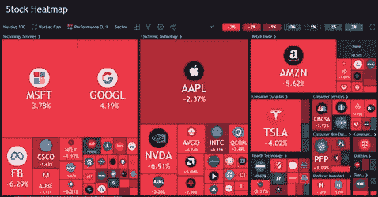
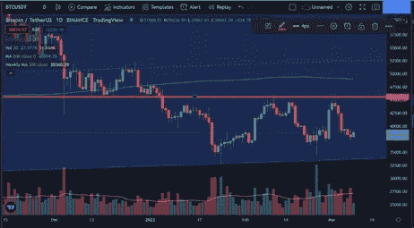

# 市场情绪#3

> 原文：<https://medium.com/coinmonks/market-sentiment-3-677dbb218b73?source=collection_archive---------87----------------------->

比特币价格:38919.23 美元
恐惧和贪婪指数:21

俄国对乌克兰的入侵仍在继续。到处都是俄罗斯炮击 Zaporizhzhia 核电站的镜头，最近俄罗斯人向哈尔科夫的一个物理研究所发射了火箭，里面有一个核反应堆。核升级的威胁弥漫在空气中。

石油价格急剧上涨，现已超过每桶 120 美元。杰罗姆·鲍威尔发言了；他已确认提议并支持加息 25 个基点(0.25%)，而不是大多数人预期的 50 个基点(0.5%)。这是由于俄罗斯入侵造成的不确定性，减缓了拟议中的解决通货膨胀的计划。这里必须指出，现在不断拒绝加息，将导致未来不可避免地出现更严重的经济衰退。

Nasdaq Heat Map

传统金融是红色的，这种结果在地缘政治大冲突时期是可以预见的；加密性能与传统市场相关，因此我预计会进一步下滑。对俄罗斯的制裁继续增加。最近的例子是:万事达和维萨取消了在俄罗斯的所有服务。对俄罗斯公民购买密码的影响可能会受到阻碍。

TradingView Daily Chart BTC/USDT

日线图上画的是阻力红线。比特币已经测试了这个阻力(45600 美元)，现在已经测试了三次，三次都被拒绝。这与比特币自 1 月底以来的低点形成了鲜明对比。我认为比特币在短期内很有可能跌入更低的低点，长期来看价格显然会上涨。我听说比特币可能会触及 200 周移动平均线(白线)，目前刚刚超过 20，000 美元，但会稳步上升。我觉得这很难相信，在 30，000 美元的如此强大的支持下，特斯拉的比特币平均美元成本为 31，700 美元，而 Microstratergy 的平均美元成本为 29，861 美元。

**进一步低迷会怎样？**

低盖硬币会流血最多。
中帽损失第二多。大盘股损失的价值最小，当市场再次看涨时，它们最先获利。然后收益转移到中盘和小盘。

因此，在低迷时期，你总是希望在大盘股中占据最大的位置。比特币是大额硬币之王，也是持续下跌的加密领域中最安全的资产。