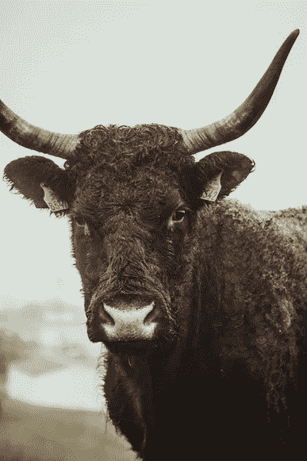
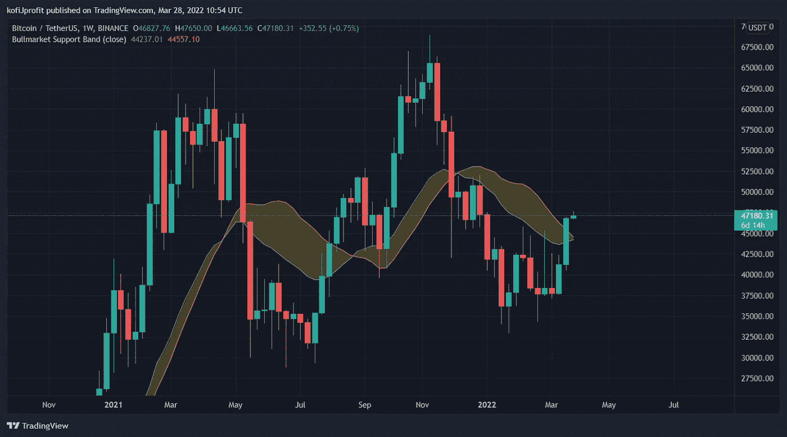
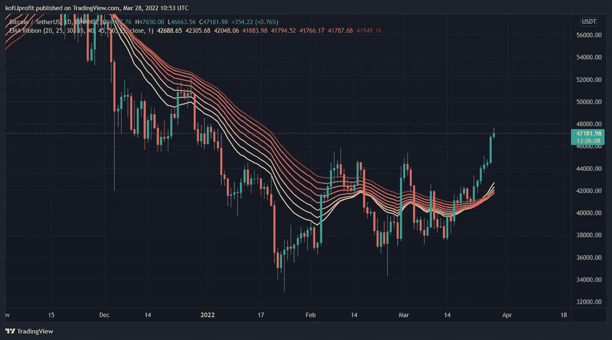

# 市场情绪#5

> 原文：<https://medium.com/coinmonks/market-sentiment-5-832ee5beeb87?source=collection_archive---------64----------------------->

比特币价格:47182.97 美元
恐惧和贪婪指数:60

**牛市开始？**

比特币再次亮出了自己的颜色，我们已经看到了六根日线绿蜡烛。它提醒我们，当比特币想往哪个方向移动时，它能以多快的速度往哪个方向移动。

**重大事件** 
管理着超过 10 万亿美元资产的全球最大资产管理公司贝莱德(BlackRock)正准备向其客户提供加密货币交易服务。首席执行官拉里·芬克证实，该公司正在寻找向客户提供加密投资的方法。
这是难以置信的看涨；现金和传统金融批准的涌入对比特币的价格走势来说是个好兆头。随着市场追随比特币，只要它一反弹，低价位也开始上涨。Terra 已经发布了大量的购买订单，其目标是在未来三个月内积累大约 1.25 亿美元的比特币，这被许多人视为下一轮牛市的开始。这些大额买入订单帮助推动比特币突破了 46，000 美元的重重阻力。一个级别的比特币反复挣扎才通过。

**比特币**

终于比特币突破了熊市阻力带，现在终于成为牛市支撑带。比特币成功突破 46000 美元是一个重大壮举，在过去几个月里多次面临该水平的严重阻力。下一个关键阻力位是 52000 美元。如果比特币能够突破这一水平，我毫不怀疑它将创下另一个历史新高(ATH)。

TradingView BTC/USDT Weekly Chart

我想看到的

当务之急是比特币回到牛市支撑带，触及它，并以它为支撑。在此之前，一切都无法确定。这一支持水平现在是 45，000 美元。如果比特币继续反弹，但没有触及支持带，这是一个不太安全的反弹，比特币通过这些带大幅下跌的可能性不能被低估——如果价格确实使用 45，000 美元作为支持，这种情况更有可能发生。当比特币在几天内有一个迷你回调时，这是我将关注的支持水平。如果能以此水平为支撑。系好安全带，该去月球了。

TradingView BTC/USDT Daily Chart

指数移动平均线(EMA)已经交叉。20 日均线(黄色)穿过了 55 日均线(红色)，这是买入机会的信号。基于不存在另一个黑天鹅事件的假设，所有指标都指向比特币爆发。但请记住，比特币变化无常，喜欢朝两个方向移动。但市场最强大的推动力是心理因素，而心理因素目前完全支持股市再次上涨。在经历了几个月的熊市趋势后，这个消息在社区里迅速传播，但我总是建议谨慎行事，等待证实。记住，如果我们进入牛市，看到抛物线运动，有你的退出策略，没有人会因为获利而破产。没有人能准确的知道顶峰的时间，但是接近顶峰已经足够了。

如果向上的运动开始，每个人都突然成了天才，而且似乎不可能赔钱。如果我们打破了一个新的 ATH，我强烈建议银行在这个阶段获得一些利润，不要卖掉所有的东西，而是一小部分。当散户资金开始回流时。知道聚会快结束了。

当你兴奋得头昏脑胀的时候——是时候卖出了。当你想吐的时候——是时候买了。

> 加入 Coinmonks [电报频道](https://t.me/coincodecap)和 [Youtube 频道](https://www.youtube.com/c/coinmonks/videos)了解加密交易和投资

# 另外，阅读

*   [有哪些交易信号？](https://coincodecap.com/trading-signal) | [比特斯坦普 vs 比特币基地](https://coincodecap.com/bitstamp-coinbase) | [买索拉纳](https://coincodecap.com/buy-solana)
*   [ProfitFarmers 点评](https://coincodecap.com/profitfarmers-review) | [如何使用 Cornix Trading Bot](https://coincodecap.com/cornix-trading-bot)
*   [十大最佳加密货币博客](https://coincodecap.com/best-cryptocurrency-blogs) | [YouHodler 评论](https://coincodecap.com/youhodler-review)
*   [my constant Review](https://coincodecap.com/myconstant-review)|[8 款最佳摇摆交易机器人](https://coincodecap.com/best-swing-trading-bots)
*   [MXC 交易所评论](/coinmonks/mxc-exchange-review-3af0ec1cba8c) | [Pionex vs 币安](https://coincodecap.com/pionex-vs-binance) | [Pionex 套利机器人](https://coincodecap.com/pionex-arbitrage-bot)