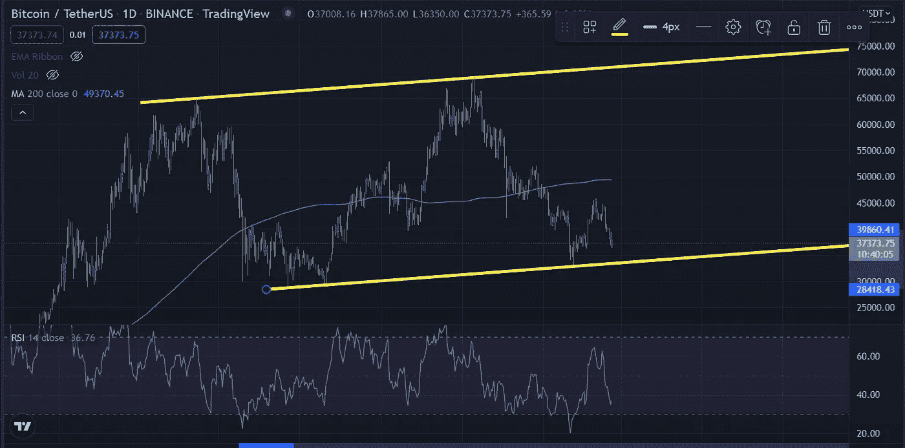

# 市场情绪

> 原文：<https://medium.com/coinmonks/market-sentiment-b50233c08fdc?source=collection_archive---------58----------------------->

BTC 价格:37603.21 美元
恐惧和贪婪指数:20

二月将会是一个有趣的月份。

标准普尔 500 指数和 DIJA 指数今天分别下跌了 0.72%和 0.68%。市场正在对俄罗斯入侵乌克兰的消息做出反应。加密现在是一个如此大的资产类别，以至于影响市场其他部分的宏观事件也能在加密领域感受到。

比特币仍远低于 200 天移动平均线，从图表来看，很明显市场情绪是悲观的。如果市场进一步下跌，我将关注的关键支撑位是 33k，如果该支撑位在 28k 和 30k 之间投降，这是机构投资者的一个很好的切入点。

Daily Chart BTC

自夏季平静期以来，比特币仍在上升通道内运行。如果它突破这个通道，并跌破 33k，我可以看到进一步下跌的真正机会。3 月 15 日和 16 日，美联储将再次开会讨论不断上升的通胀水平——预计到本季度末将达到 7.2%——如果他们决定提高利率水平，市场将做出相应的反应。有时被称为“缩减恐慌”(taper tantrum)，市场将下跌一个月，消化新的贷款利率，然后复苏。但这一消息可能会给一个已经高度过度杠杆化和过热的市场带来太大压力。

毫无疑问，BTC 是一个辉煌的长期持有，但对于那些投资于小盘股的人来说，要知道当市场出血时，他们受到的打击最大。如果这种情绪持续下去，我建议手头留有现金用于投资；在经济低迷时期，现金为王。如果你是平均成本，也许开始积累资本。除了静观事态如何发展，观察普京决定在乌克兰做什么，别无他法。Crypto 现在如此庞大，以至于它依附于传统的金融市场，这显示了它已经走了多远。

我不认为我们正处于熊市，也没有看到这种说法得到证实。但我会建议保留你的顶级项目:ETH、XRP、ADA、DOT、AVAX、MATIC、FTM。因为这些强劲的项目将是第一个因利好消息而反弹的——最糟糕的地方是在市场之外。
然而，对于那些持有大量 alt 币、市值排名前 100 位之外的人，我不会听从这个建议，可能值得考虑平仓再进场。但我会在接下来的几周内持有你的菲亚特，然后再下任何大的买入订单，在听那些叫嚣买入的人之前，我会三思而行；对于任何一个之前试图购买这种蘸酱的人来说，它很可能会再次蘸酱。

**结论**

宏观地缘政治因素导致短期看跌趋势。比特币的长期看涨趋势现在与加密货币资产类别一起得到认可，总体市场运动现在影响着比特币，显示出机构资金的数量，一家机构投资哪里，其余机构就不可避免地跟进。

> *加入 Coinmonks* [*电报频道*](https://t.me/coincodecap) *和* [*Youtube 频道*](https://www.youtube.com/c/coinmonks/videos) *了解加密交易和投资*

# 另外，阅读

*   [CBET 评论](https://coincodecap.com/cbet-casino-review) | [库科恩 vs 比特币基地](https://coincodecap.com/kucoin-vs-coinbase)
*   [折叠 App 审核](https://coincodecap.com/fold-app-review) | [Kucoin 交易机器人](/coinmonks/kucoin-trading-bot-automate-your-trades-8cf0ca2138e0) | [Probit 审核](https://coincodecap.com/probit-review)
*   [如何匿名购买比特币](https://coincodecap.com/buy-bitcoin-anonymously) | [比特币现金钱包](https://coincodecap.com/bitcoin-cash-wallets)
*   [币安 vs FTX](https://coincodecap.com/binance-vs-ftx) | [最佳(SOL)索拉纳钱包](https://coincodecap.com/solana-wallets)
*   [比诺莫评论](https://coincodecap.com/binomo-review) | [斯多葛派 vs 3Commas vs TradeSanta](https://coincodecap.com/stoic-vs-3commas-vs-tradesanta)
*   [Capital.com 评论](https://coincodecap.com/capital-com-review) | [香港的加密借贷平台](https://coincodecap.com/crypto-lending-hong-kong)
*   [如何在 Uniswap 上交换加密？](https://coincodecap.com/swap-crypto-on-uniswap) | [A-Ads 评论](https://coincodecap.com/a-ads-review)
*   [WazirX vs coin dcx vs bit bns](/coinmonks/wazirx-vs-coindcx-vs-bitbns-149f4f19a2f1)|[block fi vs coin loan vs Nexo](/coinmonks/blockfi-vs-coinloan-vs-nexo-cb624635230d)
*   [本地比特币审核](/coinmonks/localbitcoins-review-6cc001c6ed56) | [加密货币储蓄账户](https://coincodecap.com/cryptocurrency-savings-accounts)
*   [什么是融资融券交易](https://coincodecap.com/margin-trading) | [成本平均法](https://coincodecap.com/dca)