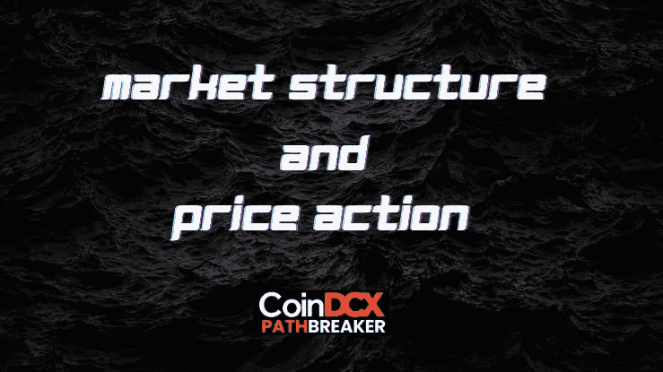
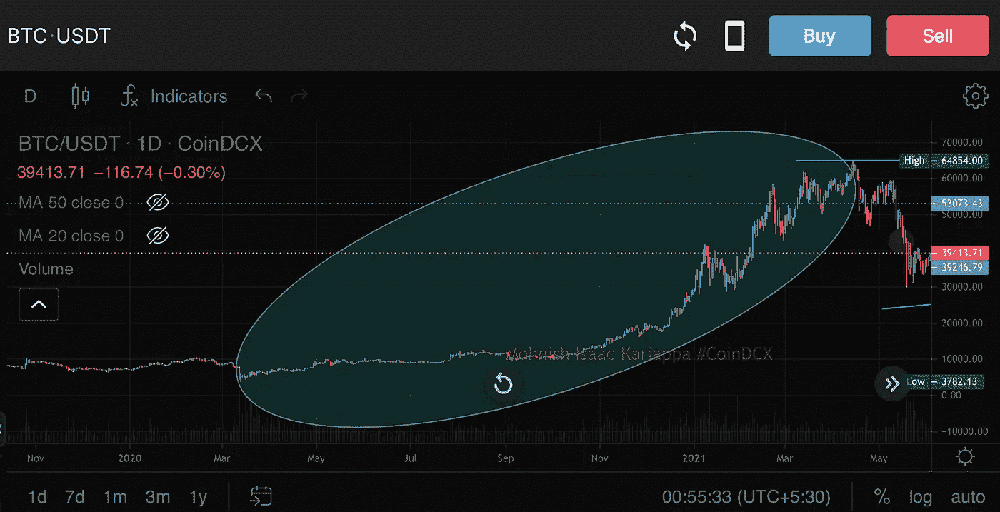
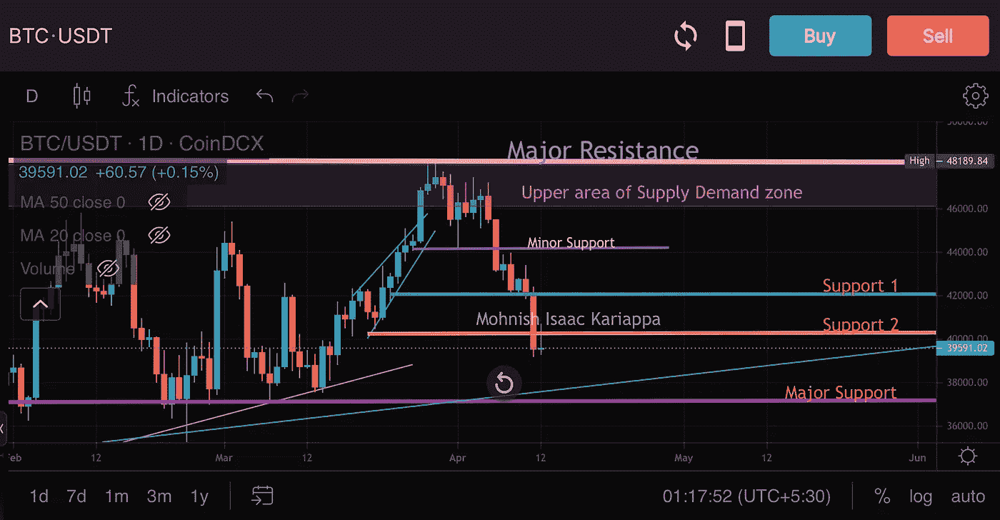
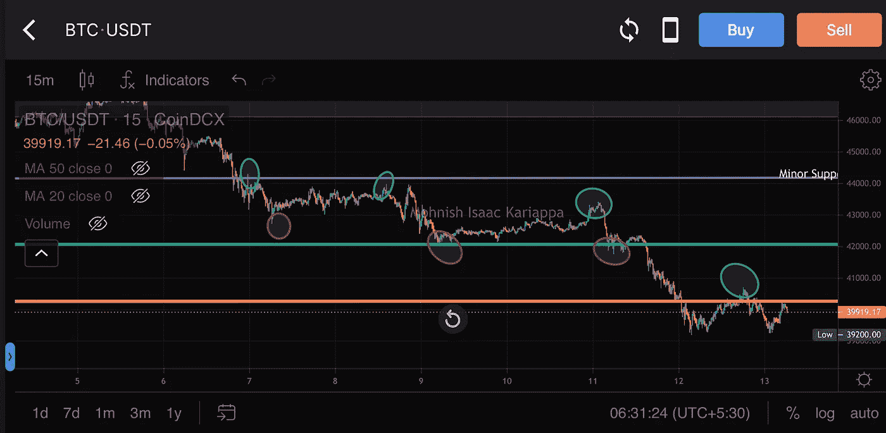
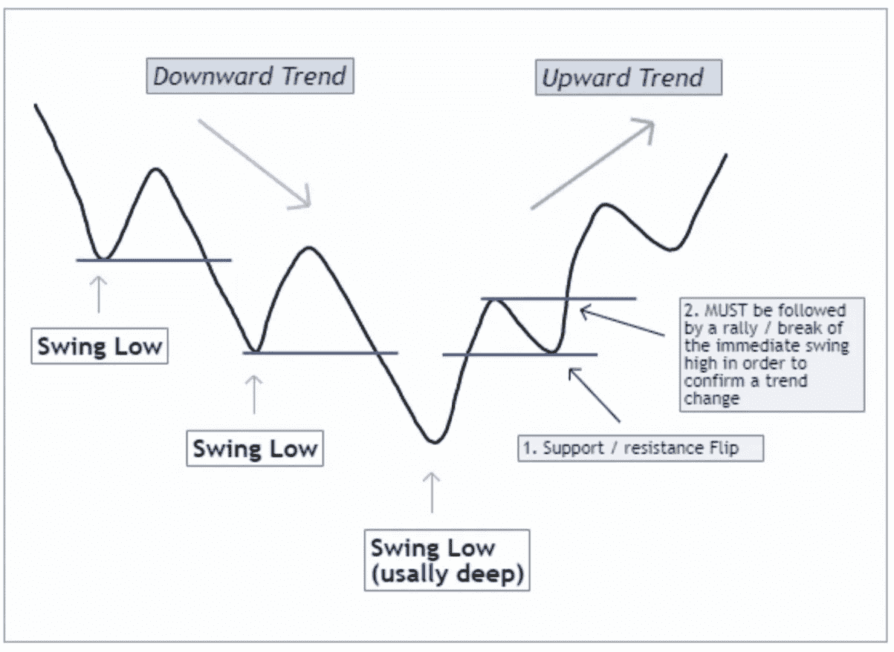
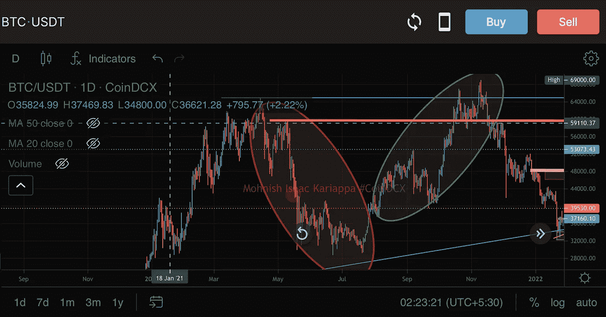
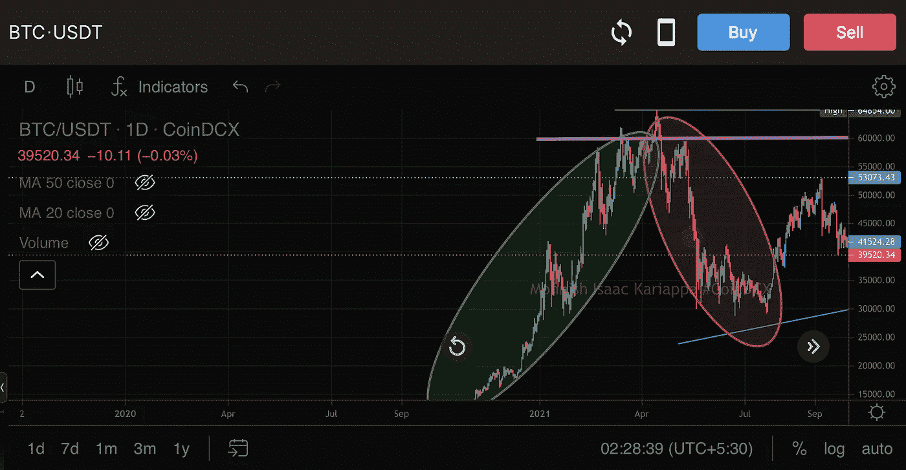

# 市场结构和价格-行动:第 1 卷

> 原文：<https://medium.com/coinmonks/market-structure-price-action-vol-1-f703c5d9620a?source=collection_archive---------30----------------------->

# CoinDCXpathbreaker

你可能会有很多交易者在谈论密码时多次提到术语“T0”、“市场结构”、“T1”、“T42”、“T2”、“价格行为”、“T3”，但是这些术语到底是什么意思呢？

在本教育内容的第一部分，我们将简要讨论以下主题:

*   **解释市场结构**
*   **摇摆高点&摇摆低点**
*   **破碎的市场结构**
*   **看涨/看跌反转**

## 什么是市场结构？

如果我们从技术分析师的角度谈论市场结构，我们可以把它描述为价格在图表上跟随和创造的趋势。我将参考下面的图表进一步解释…

BTC/USDT 1D Price-Structure

上图的**BTC/usdt**(exchange:[coin dcx](https://coindcx.com))是在 1D 时间框架上，整个绿色圆圈区域🟢向你展示了 **BTC** 随着时间的推移而建立的**价格-行动**的清晰结构。现在我们如何得出这个结论呢？

嗯，如果你仔细看烛台，你会发现价格一直呈上升趋势。这种价格的上涨建立了我们所说的**波动高点** & **波动低点。**

作为一个交易者，理解价格行为将帮助你绘制更高级的图表，例如:

*   **支撑:阻力水平**
*   **微观&宏观层次的结构**
*   **供应领域&需求领域**

上面的 **BTC/USDT** (兑换: [CoinDCX](https://coindcx.com) )的图表，我已经清楚的能够标注出来:

*   主要阻力区(粉红色水平线)
*   供应上部区域(红色方框)
*   次要支持级别(紫色线)
*   支架 1 和支架 2(绿线和黄线)
*   主要支撑位(青色线)

上述这些区域不能随机地绘制在图表上，但是资产价格建立的市场结构可以帮助我们进行技术分析，就像上面的图表一样。

## 摇摆高点和摇摆低点

Swing Highs & Swing Lows in play (chart: CoinDCX Pro app)

在上面关于 **BTC/USDT 的图表中，**我用绘制了代表波动高点的绿色圆圈&红色圆圈代表波动低点。

上面的图表是在 15 分钟的时间框架上绘制的，这样我们就有了更多的汇合点。

当我们看到价格被绿色圆圈拒绝时，我们称这个水平为波动高点。

同样的理论也适用于低水平摇摆。作为一个交易者，当这些波动水平在图表上清楚地显示出来时，你也可以清楚地设定你的无效水平。

以上面的图表为例，作为一个交易者，当价格接近紫色线时，我不会建立多头头寸，因为该区域显然是一个阻力，受到多次拒绝的打击。同样，当价格触及红色标记时，我不会建立空头头寸，因为这是一个潜在的反弹区域。这是理解市场结构的另一个主要好处。

## 市场结构的断裂

当价格突破波动高点并创下新高时，或者当价格突破波动低点并开始新的下跌趋势时，我会认为资产打破了市场结构。这种价格行为也将决定市场情绪的转变，并将成为我书中市场结构断裂的明显证据。

Market Structure Establishment

如果我们参考上图中的兴趣点(exchange: [CoinDCX](https://coindcx.com) )，绿色🟢的第一个圆圈显示价格运动有明显的上升趋势。红色圆圈🔴向我们展示了市场结构的打破，因为价格急剧下跌，创下了一系列的低点-高点&低点。你将同样的原则应用到红色圆圈后面的第二个绿色圆圈🟢🔴面积。

研究上图时要记住的要点:

*   市场结构的突破可以研究价格在上升趋势，下降趋势和横向整理运动。
*   市场结构的突破是通过简单地识别价格在上升趋势中何时设置了一系列的低-高，在下降趋势中何时设置了一系列的高-低来实现的
*   在上面的图表中，我们可以看到价格结构是如何跟随趋势而不是随机变化的。用这样的信息进行交易的关键。

## 看涨/看跌反转

## 确定看涨反转

*   在价格运动的持续下降趋势之后，出现了价格上涨
*   上述反弹应该受到价格从支撑反弹到上涨的支撑
*   在反弹之后，价格应该成功地突破之前的波动高点，并继续价格运动，而不是创造一个双顶

**在上面的图表中，我画了一条水平黄线，这是下跌趋势开始前的一个摆动高点，在创下新低后的冲动反弹中，价格突破了黄线，停留在黄线上，并继续高于前一个高点 65，000 美元**

## 确定熊市逆转

*   在价格上涨趋势中，经过一系列更高的高点和更高的低点后，价格出现向下反弹
*   反转蜡烛线通常伴随着大量的抛售，熊市吞没蜡烛线是以全身封闭形成的
*   价格也将朝着之前的高点向上移动，并确认该水平为阻力。在价格进一步下跌之前，这种价格行为也被称为看跌测试。

在上图中，我们可以看到绿色区域在整个市场结构中呈上升趋势。我用紫色线标出的水平是上升趋势中价格的第一次拒绝，这将该水平设定为波动高点。如果你放大，你会看到价格在第一次大幅下跌后再次回到这个特定水平，这就是我们所说的熊市再测试，随后是一系列更低的高点&更低的低点。

## 结论

在我们的市场结构和价格行为研究的第一卷中，我们已经介绍了一些非常重要的基础知识，这些知识将为具有中级知识和初级知识的交易者服务。

我将在我的分析的第二卷中更进一步，讨论我们如何在连锁分析的帮助下研究市场结构和价格分析。

非常感谢 [CoinDCX](https://medium.com/u/a30fa2b03c2f?source=post_page-----f703c5d9620a--------------------------------) 给我机会成为# CoinDCXpathbreaker 计划的一部分，并帮助我与加密社区分享上述知识。

通过 CoinDCX(印度最安全的加密交易所)以几个简单的步骤开始您的交易之旅:

*   用您的姓名、电子邮件和手机号码注册
*   接受 CoinDCX 的服务条款
*   完成您的 KYC 验证并添加您的银行帐户详细信息
*   一旦批准，存款菲亚特通过您批准的银行帐户或转移加密从您的其他加密钱包，你就完成了。

> 加入 Coinmonks [电报频道](https://t.me/coincodecap)和 [Youtube 频道](https://www.youtube.com/c/coinmonks/videos)了解加密交易和投资

# 另外，阅读

*   [3 商业评论](/coinmonks/3commas-review-an-excellent-crypto-trading-bot-2020-1313a58bec92) | [Pionex 评论](https://coincodecap.com/pionex-review-exchange-with-crypto-trading-bot) | [Coinrule 评论](/coinmonks/coinrule-review-2021-a-beginner-friendly-crypto-trading-bot-daf0504848ba)
*   [莱杰 vs n rave](/coinmonks/ledger-vs-ngrave-zero-7e40f0c1d694)|[莱杰 nano s vs x](/coinmonks/ledger-nano-s-vs-x-battery-hardware-price-storage-59a6663fe3b0) | [币安评论](/coinmonks/binance-review-ee10d3bf3b6e)
*   [Bybit 交易所评论](/coinmonks/bybit-exchange-review-dbd570019b71) | [Bityard 评论](https://coincodecap.com/bityard-reivew) | [Jet-Bot 评论](https://coincodecap.com/jet-bot-review)
*   [3 commas vs crypto hopper](/coinmonks/3commas-vs-pionex-vs-cryptohopper-best-crypto-bot-6a98d2baa203)|[赚取加密利息](/coinmonks/earn-crypto-interest-b10b810fdda3)
*   最好的比特币[硬件钱包](/coinmonks/hardware-wallets-dfa1211730c6) | [BitBox02 回顾](/coinmonks/bitbox02-review-your-swiss-bitcoin-hardware-wallet-c36c88fff29)