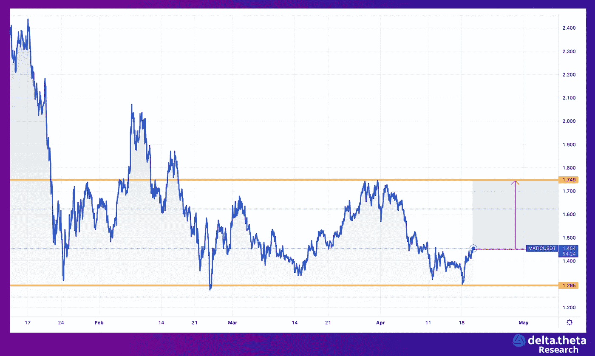

# 市场优势——多边形隐藏的增长动力和行业领导者的前景。

> 原文：<https://medium.com/coinmonks/market-superiority-polygon-hidden-growth-drivers-and-prospects-of-the-industry-leader-c4697d0dbbac?source=collection_archive---------17----------------------->

# **宏观形势**

Polygon (MATIC)是用于扩展以太坊核心区块链的第 2 层利益验证解决方案。它目前是零知识开发和乐观汇总的密码行业领导者。该团队有一个长期发展计划，并专注于执行该计划——雇佣市场上最好的工程师和有才华的团队。该项目目前在最大项目中排名第 18 位，资本超过 114 亿美元。

# **局部趋势**

MATIC 令牌是实用的，并且广泛用于网络操作以及新应用的启动。目前，stack 上的日活跃用户超过 35 万。最受欢迎的应用是去中心化的 exchange QuickSwap 和游戏应用《疯狂防御英雄》。

与大多数大型加密公司一样，Polygon 充分利用了过去两年的市场反弹。在触及 2.85 美元的历史高点后，MATIC 进行了修正，并触及 1.30 美元的本地低点。

同样值得注意的是，最近在 2022 年 2 月，该公司达成了一笔巨额交易，其中[从一个主要投资基金财团筹集了 4.5 亿美元](https://twitter.com/0xpolygon/status/1490739661656178688?s=21)。

本周还会看到一份秘密的正式声明，新闻办公室承诺这份声明是 Polygon 近期活动的关键。

# **投资理念**

尽管加密货币市场与比特币以及股票市场的整体相关性很高，但 MATIC 具有领导者的特征，能够跑赢市场。鉴于新闻在决定价格方面的重要性，波动性的激增很可能会推高代币的价值。

投资理念是押注于当前价格的 15%左右的局部(最多一个月)升值——暂定为 1.65 美元(当前为 1.43 美元)。

**录入选项:**

1.现货市场(或期货市场)的多头头寸。预期收益率为每月 15%起。

2.**买入行使价为 1.4 美元、执行日期在一周至一个月之间的看涨期权**(交易参数的[示例)。潜在地，可以通过出售具有相同执行日期的看跌期权(使用风险逆转策略)来为买入看涨期权融资，但是价格低于当前价格(](https://app.deltatheta.tech/deeplink/BG6FJET5YFEU4V)[示例交易参数#2](https://app.deltatheta.tech/deeplink/4GASPILVBXYHBO) )。

在使用期权组合的情况下，回报将是复杂的，并且具有不同的风险水平。总价值将由购买期权的预期回报组成，并取决于退出点。

# 近似计算期权策略的盈利能力。

日期 4 月 29 日(9 天)/ IV=80% / 1 批量= 10 MATIC

**Strike/CALL/_ _ Link _ _/PUT/Link**

1.3 $/0.15/_ _ _ _ _ _ _ _ _ _ _ _/0.03/[**例**](https://app.deltatheta.tech/deeplink/M7A4PX23P11C4V)

1.4$ / 0.08 / [**例**](https://app.deltatheta.tech/deeplink/HTHKPLMOV6WCZP) _ / 0.07 / [**例**](https://app.deltatheta.tech/deeplink/ORRLW15YU3WKJB)

1.5$ / 0.04 / [**例**](https://app.deltatheta.tech/deeplink/I3VTLO1ODVF6NY) _ / 0.12 / [**例**](https://app.deltatheta.tech/deeplink/ZPAZ7VHXNN1QXA)

例如，交易者的资本是 150 美元。关于如何利用期权来实现一个投资想法，有几种选择。

**选项 1。** 以 1.3 元的行使价卖出看跌期权。我们将得到 11 个完整的手+ 6 美元。对于收到的溢价(11*10*0.03)=3.3 美元，您可以购买 4 手执行价格为 1.4 美元的看涨期权。如果达到 1.65 美元的目标价格，9 天的利润将为 4*10*0.25=10 美元=每年 150%。

**选项 2。** 以 1.4 美元卖出看跌期权。这将是 10 个完整的手+ 10 美元。对于收到的奖金(10*10*0.07)=7 美元，您可以以 1.5 美元的执行价格购买 17 手看涨期权。如果目标价达到 1.65 美元，9 天的利润将是 17*10*0.15=25.5 美元=每年 340%。

**对新用户有用的链接:**

1️⃣ [加密货币期权交易终端 PRO 版指南](https://pr-99418.medium.com/%D0%B3%D0%B0%D0%B9%D0%B4-%D0%BF%D0%BE-pro-%D0%B2%D0%B5%D1%80%D1%81%D0%B8%D0%B8-60c3cdc76d3d)

2️⃣ [加密期权交易终端](https://app.deltatheta.tech/r/investidei)

电报聊天请求报价。

> *加入 Coinmonks* [*电报频道*](https://t.me/coincodecap) *和* [*Youtube 频道*](https://www.youtube.com/c/coinmonks/videos) *了解加密交易和投资*

# 另外，阅读

*   [3 商业评论](/coinmonks/3commas-review-an-excellent-crypto-trading-bot-2020-1313a58bec92) | [Pionex 评论](https://coincodecap.com/pionex-review-exchange-with-crypto-trading-bot) | [Coinrule 评论](/coinmonks/coinrule-review-2021-a-beginner-friendly-crypto-trading-bot-daf0504848ba)
*   [莱杰 vs n rave](/coinmonks/ledger-vs-ngrave-zero-7e40f0c1d694)|[莱杰 nano s vs x](/coinmonks/ledger-nano-s-vs-x-battery-hardware-price-storage-59a6663fe3b0) | [币安评论](/coinmonks/binance-review-ee10d3bf3b6e)
*   [Bybit Exchange 审查](/coinmonks/bybit-exchange-review-dbd570019b71) | [Bityard 审查](https://coincodecap.com/bityard-reivew) | [Jet-Bot 审查](https://coincodecap.com/jet-bot-review)
*   [3 commas vs crypto hopper](/coinmonks/3commas-vs-pionex-vs-cryptohopper-best-crypto-bot-6a98d2baa203)|[赚取加密利息](/coinmonks/earn-crypto-interest-b10b810fdda3)
*   最好的比特币[硬件钱包](/coinmonks/hardware-wallets-dfa1211730c6) | [BitBox02 回顾](/coinmonks/bitbox02-review-your-swiss-bitcoin-hardware-wallet-c36c88fff29)