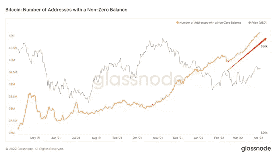
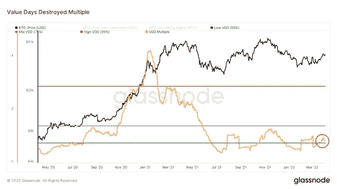
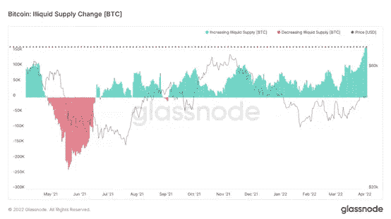

# 行情涨涨跌跌，哪些勇士是自由冲浪？| WTR 独家 4.4

> 原文：<https://medium.com/coinmonks/market-went-up-and-down-which-warriors-are-free-surfing-wtr-exclusive-4-4-ce632020d48f?source=collection_archive---------52----------------------->

“我们的目标是帮助拥有专业技能和更大关注度的市场参与者更好地了解市场，做出更明智的决策。”

**本周回顾**

本周从 3 月 28 日到 4 月 3 日，BTC 最高点到达 48200 点附近，最低点接近 44250 点，震荡幅度达到 8.41%左右。

观察近期筹码分布图，大约在 45900~47360 附近筹码交易密集，会有一定的支撑或压力。

**每周重要新闻**

**宏观新闻:**

**俄乌冲突:**

3 月 29 日，俄罗斯和乌克兰开启新一轮谈判。到 4 月 3 日，美国情报官员表示，俄罗斯已经修改了作战战略，将重点放在控制顿巴斯和乌克兰东部其他地区。俄罗斯表示，将向乌克兰东南部开放人道主义通道。

俄罗斯表示，乌克兰直升机袭击了俄罗斯城市别尔哥罗德的一个燃料储存设施。

德国国防军表示，北约永远不会在乌克兰领土上部署军队。

本周，俄罗斯要求用卢布向其不友好的国家支付天然气费用。G7 国家拒绝了这一提议。

拜登政府宣布将援引冷战时期的权力来促进电动汽车的生产和向可再生能源的转变；

并启动了紧急石油储备释放计划，在 6 个月内释放 1.8 亿桶石油，以降低汽油价格。

l **分析:**

战争仍在继续，但有缓和的迹象；如果欧洲不介入，美国表示不会派兵，战争升级的可能性很小。德国人预测俄罗斯和乌克兰的冲突会变成游击战。

美国近 6 亿桶石油相当于美国一个月的石油消耗量；1.8 亿英镑的发行将为一周多的时间带来隐患。

这很可能只是拜登为应对 11 月中期选举而采取的举措。

要判断经济战争对全球经济的影响，我们必须看看美国和欧洲是否会放松经济制裁。

**美国经济指标:**

l **非农就业**

4 月 1 日公布的 3 月就业人数为 43.1 万，略低于市场预期的 49 万。

失业率从 3.8%降至好于预期的 3.6%；小时工资同比增长 5.56%，好于预期。

l **第一季度 GDP 预测**

4 月 1 日 GDP——现在预测美国第一季度 GDP 为 1.5%

(下图:美国 Q1 GDP 预测，来源:亚特兰大联储)

l **制造业、服务业 PMI**

制造业和服务业 PMI 指数均继续回升，均创下 8 个月高点

(下图:美国制造业/服务业 PMI，来源:贸易经济)

l **美国企业存货销售比率**

3 月中旬公布的企业库存与销售之比是 1 月的 1.25，而前一个月是 1.29。

(美国库存销售比率。通过宏观和微观)

l **PCE**

3 月 31 日公布的 2 月 PCE 数据显示，2 月美国 PCE 物价指数同比上涨 6.4%，符合 6.4%的预期。

此前的读数为 6.1%，继续创下历史新高，是美联储 2%目标的 3 倍多。

核心 PCE 指数同比上涨 5.4%，也创下新高，低于预期的 5.5%，去年为 5.2%。

(下图:PCE 个人消费支出价格指数，来源:宏观微观)

l **能量**

根据 CICC 研究部的计算，在最极端的情况下，如果油价飙升至 140 美元/ BBL，但随后保持在 100 美元附近，通胀趋势将保持不变，但步伐将放缓，年底 CPI 同比将在 5%左右。

如果油价停止飙升，通胀会更快下降，在更乐观的情况下，到 8 月份可能会降至 5%左右。

(下图:美国 CPI 通胀，来源:宏观微观)

l **租金**

除了能源价格之外，值得注意的是，包括租金和业主占用成本在内的核心租金 CPI 处于 1991 年以来的最高水平，而且没有放缓的迹象。

(下图:美国房租价格指数，来源:宏观微观)

l **消费者信心指数**

根据 3 月 29 日的报告，美国消费者信心指数从 2 月份的 105.7 升至 3 月份的 107.2。

(蓝色:标准普尔 500，红色:密西根消费者信心指数，美国消费者信心指数)

l **保存**

美国家庭仍有 2.5 万亿美元的超额储蓄来支持消费。

(下图:美国可支配收入，来源彭博，CICC 研究)

l **分析:**

就业率保持健康。美国的长期均衡失业率在 4%左右。目前 3.6%的失业率是正常的。

第一季度 GDP 预测也很乐观；

根据 GDP 预测，在 2 月底和 3 月初，情绪处于最低点，当时冲突的风险较高。

除了去年的极端情况，过去十年第一季度 GDP 增长一直在 0.7 至 3.0 之间，1.5%的实际增长被认为是健康的。

制造业和服务业继续复苏，库存与销售比率较低，表明目前的市场需求也很健康。

通货膨胀指数 PCE 继续上升，但根据 CICC 的预测，只要宏观上没有黑天鹅，通货膨胀在下半年自然会下降。

那么我们应该更加关注租金价格趋势。

消费者信心指数没有再破新低，可能是居民还有很多过剩储蓄造成的。

我们需要持续关注消费者信心的修复。

**主要市场表现:**

道琼斯指数本周下跌 0.12%，收于 34818.27 点，三周来首次下跌；

纳斯达克本周上涨 0.65%，收于 4545.86 点；

标准普尔 500 本周上涨 0.06%，至 4545.86 点。

在大宗商品方面，COMEX 月交割的黄金期货收盘下跌近 1.6%，至每盎司 1923.70 美元。

*   WTI 5 月原油期货下跌 12.84%，至每桶 99.27 美元；

l **分析:**

正如我们上周预测的那样，由于本季度末，市场在周中出现了回调，并在周五回升。

美国股市已经消化了美联储的一些政策。

除非美联储更加强硬，比如说提高 75 个基点，否则很难看到股市再创新低。

**美国国债收益率**

截至 4 月 1 日，2 年期国债收益率升至 2.452%；

10 年期美国国债上涨 2.44%。

更高的短期利率意味着更低的长期回报(预期)和更高的短期融资成本，这反过来侵蚀长期增长预期，随着时间的推移，给经济带来下行压力，甚至陷入衰退。

(下图:美国期限利差:10-2 年，10-3 个月，来源:CICC 研究)

l **分析**

3M10s 个月和 10 年期国债收益率)在衡量衰退的准确性方面更为重要，美联储也更加关注它们。现在两者走向相反的方向。

此外，2s10s 名义利率几乎倒挂，但 2s10s 实际利率(减去预期通胀率)仍在扩大。

(下图:10 年至 2 年名义和实际利差，来源:CICC 研究)

此外，五次反转中有四次都伴随着衰退，但平均间隔时间为 17 个月，而且差异很大。

反转和下降之间的相关性也未经检验。

综上所述，我们认为仅 2s10s 收益率倒挂并不能单独证明未来的衰退。

**首都新闻:**

1.MetaMask 的移动应用程序支持借记卡和 Visa Master 购买加密货币

2.高盛在第二季度开始向资产超过 2500 万美元的客户提供加密货币投资服务。

3.Tether 在 30 日增加了 10 亿美元的稳定资本。

4.令人羡慕的三箭资本:增持 71311 ETH，价值超过 2.42 亿美元。

5.Terra 增持了 2943 股 BTC，价值约 1.4 亿美元，目前持有 30，727 股 BTC

6.SBF 上周末在交易所稳定存入超过 11 亿美元。(推特)

l **分析:**

短期和中期资本相对充裕。

可以看出，在密码行业内部，人们对后续市场充满信心，仍然倾向于以目前的价格增持。

**其他新闻**

1.CME 宣布推出迷你 BTC 以太坊期权。

2.SEHK 计划今年建立一个名为 Diamond 的数字资产交易平台，以及一个钱包管理平台。

3.西班牙零售商 EI Corte Ingles 与审计公司 Deloitte 合作推出了一种加密货币交易所。

4.亚利桑那州钱德勒市接受公用事业账单加密货币。

5.欧洲授权 KYC 开发私人数字货币钱包

**长期洞察力:**看看我们长期做得怎么样；牛市/熊市/结构变化/中性

**中期探查:**分析我们现在在哪里，我们在这个阶段多久，会发生什么

**短线观察:**用于分析短期行情；以及特定方向和特定事件在特定条件下发生的可能性

**长期见解**

*   闪电网络通道尺寸
*   LTH 市场通货膨胀
*   稳定的硬币市场规模/比特币市场规模
*   数量/市场规模

蛰伏已久的闪电网渠道终于在一定程度上得到拓展。

这意味着在越来越频繁和其他活跃的生态系统方面，应用程序开发有一定的增长。

要观察宏观的链上状态模型:

对长期投资者而言，上述正值表明通货膨胀；

对于长期投资者来说，负值代表通货紧缩。

细节已在之前的报告中显示，目前的情况是，市场中的长期投资者正处于通缩状态。

这是从链条左侧看多。

(稳定资本市场价值与 BTC 市场价值的比率)

这个可以用来观察稳定币的存量，主要提取两个重要的关键值；USDC 和 USDT

当紫色线处于斜坡的顶点时，证明观望资金较高。

然后市场会开始上升趋势，因为观望者害怕做空，所以他们会买入，加速市场效应。

*   当 stablesoin 市值徘徊在较低水平且未被使用时，可能代表有少量资金在存量，剩余的观察者并未加入市场，会造成一定的风险。

这是长期趋势中的高级量之一。

现在暂时有点停顿，但长期趋势仍在上升。

# **中期调查**

*   非零余额的地址数量活动地址的数量
*   第三次硬币成熟浪潮
*   储备风险
*   钱币年毁
*   28 天市场实现梯度
*   卖方消耗常数
*   价值天数销毁倍数
*   非流动性供给变化
*   长期持有人净头寸变化
*   霍德勒净头寸变化
*   矿工净位置变化

我们来看看非零余额地址的数量。

非零余额地址的数量仍在强劲增长。

可能是以下几种情况

1.BTC 的更多新用户

2.大地址分割会增加数量

3.加密交易所的注册门槛已经降低，将法币兑换成加密货币的渠道也逐渐变得更加便捷。

排除大地址拆分，用户数为正。

结合市场活跃度。

最近活跃度的上升间接说明了加密世界的温度在上升，比特币将引领整个加密生态系统转向。

紫色线是指示器。

从图表中可以看出，市场上判断的 3 个月以下的交易者，在过去的 5 年中，并没有改变操作习惯。

1.当市场价格出现上涨或下跌趋势时，年龄增长到三个月以上的币会减少，起到市场加速的作用。

2.当它们反转时，币价可能会企稳或震荡上行，这意味着短线交易者可以更安心地持有币，成长为年纪较大的交易者，间接降低了市场的抛售压力。

3.当前指标的小幅反转可能表明 3 个月以下的交易者对货币持有的耐心较高。

看看目前市场上的风险。

这个指数主要衡量持有货币的风险。是当前 BTC 价格和硬币日毁灭累计值的乘积。

从目前情况看，该货币仍处于低风险区域，可作为中长期参考。

看长期交易者持有情况。

该指数以年度为基础计算比特币的毁灭(移动)情况，并为其分配一个加权权重。

目前的成交量处于徘徊区间，长期交易者近期没有太大的卖出意愿。

让我们看看未来 28 天的市场梯度。

该指标衡量 28 天内实际资本流动势头的变化。目前处于红色趋势线上方。

最近连续两次动量上攻，说明目前中期势能比较强。

有一个挥之不去的情况，如果持续下去，市场可能仍然需要动力。

然后再看卖家目前的宏观情况。

原则是供应利润百分比乘以 30 天的价格波动。

30 天内的低价格波动，或供应的低利润百分比，表明利润抛售压力较小。

适合捕捉低波动低点。

小幅上涨表明，获利者可能有抛售压力。

让我们看看宏观抛压的情况。

高年龄和高容量地址的决策成本非常高。

这类有经验的交易者可能会分割他们的销售。

我们只看到一定量的抛售，整体抛售强度较低。

最后，看看各组最近的净头寸变化。

总的来说，所有群体的持有量都出现了良好的增长。

流动性不足的供应群体创下新高。

但长期交易者正变得保守。

**短期观察**

*   perp OI/市值
*   杠杆作用
*   选项-未来卷
*   30 天比特币世界价格变化
*   稳定加入净头寸变化
*   交易所的稳定资本
*   利润/损失转移
*   供应冲击
*   消耗的输出寿命为 1m-3m
*   消耗的输出寿命为 3m-6m
*   消耗的输出寿命为 1-2 年
*   短期持有者 SOPR
*   短期持有者 NUPL

回顾衍生品市场。

衍生品市场的整体风险回到了警戒线以下，现在略有上升。目前参与衍生品的交易者整体情绪有一定程度的下降，使得市场的主导地位暂时从衍生品转移到现货。

具体呈现在环比上，期货预估杠杆率有所下降，杠杆风险有所释放，市场上的衍生品有所下降。

期权和期货的日交易量进一步下降至较低水平。目前衍生品日交易量又呈上升趋势。当达到一定量时，很可能会放大对市场的影响。

回顾一下现货市场。

整个亚洲地区处于亏损，逐渐减少，处于边缘，有盈利迹象。西部地区的总体贸易商仍在盈利，略有下降。

随着市场的复苏，大多数交易者开始获利了结，这有助于进一步恢复交易者的信心。

稳定的外汇净头寸显示出净流入的趋势。

与稳定硬币兑换天平结合

目前，USDC 已经有所上涨，USDT 已经进入震荡，普遍显示有相对充足的资金存量，有大量资金在观望。

当市场购买力出现时，充裕的货币存量将有助于推动市场上行。

注意“潜在的”抛售压力。

目前仍有较高的损转量，意味着市场的损卖压力仍在进一步释放，需要继续关注损卖压力是否会持续。

市场上有一小部分成熟的交易者在适当的价位开始获利抛售，这部分交易者在市场下跌时往往会更加谨慎地持有。

盈利震荡持续走低，意味着整体市场盈利抛压相对较小。

结合以上情况，“潜在的”亏损抛售压力仍在释放，仍需进一步观察。利润抛售压力暂时有所缓解。

这其中的主要部分可能是抛售压力。

对于 1~3 个月的交易者，6~12 个月的交易者，有较大概率承受市场的震荡，随着市场的回暖卖出。

1~2 年的交易者，随着市场回升卖出获利。

短期内市场需要进一步跟进来消化这部分压力。

最后，关注短线交易者的市场情绪变化很重要。

随着市场的复苏，短线交易者大多获利卖出，并以适当的价格大量出售，但过度出售也是市场压力的一个来源。

短线交易者整体情绪在牛熊临界点附近徘徊，但整体情绪在好转，需要进一步跟踪观察。

基于以上充足的存量资金，如果在好心情下有强烈的购买意向，这些变量更容易引领市场向上。

然后留意这些变量。

**每周总结**

**新闻摘要**

**长期:**

如果 SEHK 在今年年底推出“数字资产交易平台”，就相当于亚洲多了一个数字资产交易场所，这对 BTC 来说是好事。

资金管理巨头 VanEck 周五表示，如果 BTC 成为全球储备资产，其隐含价格将在 130 万美元至 480 万美元之间。

这两个价格分别以 BTC 为 M0 和 M2 进行预测。

俄乌冲突后，BTC 作为全球储备货币有了新的前景。

在这种预期下，BTC 的估值可能会进一步提高。

在美国、俄罗斯、阿联酋和其他国家政府政策的鼓励下，加密市场的采用率可能会在全球范围内飙升，BTC 达到更高估值所需的时间可能会缩短。

**中期:**

美国整体经济状况仍然良好。

美联储在去年 11 月开始转鹰，美联储降息已经被市场消化了一段时间。

因此，除非下一次加息超出预期，或者出现比 2 月份更严重的俄乌恐慌，否则市场对加息和收缩资产负债表的反应不会比以前更大。

**短期:**

宏观层面依然中性，资本健康。

请特别关注美联储 4 月 6 日的会议纪要，以便更深入地了解美联储的后续行动。

**长期上链:**

1.闪电网络渠道扩张到一定程度。

2.对长期投资者来说，通货紧缩是一条锁链。

3.stablecoin 的市值相对于目前整体宏观股票来说还是足够的。

4.链上交易量与市值之比略有停顿，但仍呈现长期上升趋势。

**市场基调设置:**

积累；从长期链式结构来看，偏于看涨。

**链上中期:**

1.宏观来看，用户数量仍然呈现比较强劲的增长，活跃地址数量增加，对比特币到其他 crpyto 的生态圈建设是利好。

2.年龄增长到 3 个月以上的硬币呈现下降趋势，现在略有反转。如果这些交易者现阶段有较高的耐心持币，中期可能会减少抛压。

3.非流动性供应集团、长期交易商、霍德勒、矿商仍保持大幅增持。流动性不足的供应群体增持打破新高，长期交易者在增持上更加保守。

4.28 天内，市场梯度已经突破红线区域，真正的买方资本已经进场。

5.波动指数仍在上升，市场面临一些获利抛压。宏观抛压释放了一定量。

**·市场基调设定:**

从中立到积极。从中期来看，我们需要关注 3 个月以下交易者的交易状况，他们对货币的态度具有加速效应。

每个群体都有明显的增持现象，目前的买家有较大的潜在能量。如果目前的情况持续下去，继续消化可能上升的宏观抛压，中期有上行的可能。

**短期连锁:**

1.衍生品市场整体风险已经释放，目前略有上升。

2.衍生品的日交易量已经下降，现在又在上升，杠杆将可能放大对市场的影响，并导致更高的波动性。

3.亚洲地区的交易员显示出亏损收窄并走向盈利的迹象，而西部地区的交易员则继续显示出盈利。大多数交易者开始获利了结，这有助于进一步恢复信心。

4.稳定的货币以相对充足的资金存量流入交易所。

5.目前仍有较高的亏损转亏量，但市场整体盈利抛售程度仍在逐步收窄。“潜在的”亏损抛售压力仍在释放，盈利抛售压力有所缓解。

6.主要抛压的是那些持有 1 到 3 个月，3 到 6 个月，1 到 2 年的。

7.短线交易者整体情绪不错，目前徘徊在调整的临界点。

**市场基调设置:**

衍生品市场风险有所缓和，现货市场资金存量相对充足，但需要调整和修复。

在整体市场情绪良好的情况下，如果有足够的购买意愿，市场更倾向于震荡上行。

**免责声明:**

以上均为市场讨论和探索，不包含定向投资指导；请谨慎，防范市场黑天鹅风险。

该报告由“瞭望塔”研究机构提供:

金蛋日记；拾年 ； Leah；elk crypto

推特:@Wtrcrypto

> 加入 Coinmonks [电报频道](https://t.me/coincodecap)和 [Youtube 频道](https://www.youtube.com/c/coinmonks/videos)了解加密交易和投资

# 另外，阅读

*   [币安交易机器人](/coinmonks/binance-trading-bots-d0d57bb62c4c) | [OKEx 评论](/coinmonks/okex-review-6b369304110f) | [阿塔尼评论](https://coincodecap.com/atani-review)
*   [最佳加密交易信号电报](/coinmonks/best-crypto-signals-telegram-5785cdbc4b2b) | [MoonXBT 评论](/coinmonks/moonxbt-review-6e4ab26d037)
*   [如何在 Bitbns 上购买柴犬(SHIB)币？](https://coincodecap.com/buy-shiba-bitbns) | [购买弗洛基](https://coincodecap.com/buy-floki-inu-token)
*   [CoinFLEX 评论](https://coincodecap.com/coinflex-review) | [AEX 交易所评论](https://coincodecap.com/aex-exchange-review) | [UPbit 评论](https://coincodecap.com/upbit-review)
*   [十大最佳加密货币博客](https://coincodecap.com/best-cryptocurrency-blogs) | [YouHodler 评论](https://coincodecap.com/youhodler-review)
*   [AscendEx 保证金交易](https://coincodecap.com/ascendex-margin-trading) | [Bitfinex 赌注](https://coincodecap.com/bitfinex-staking)