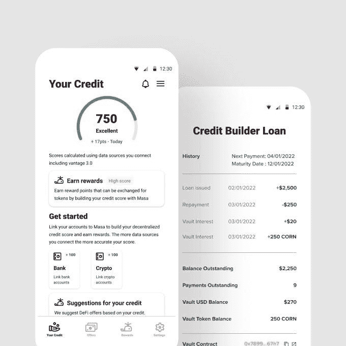

# Masa Finance，建立世界上第一个混合信用协议&分散信用局

> 原文：<https://medium.com/coinmonks/masa-finance-building-the-worlds-first-hybrid-credit-protocol-decentralized-credit-bureau-50b3fcd72513?source=collection_archive---------19----------------------->

Source: Masa Finance

## *Masa 的分散信用协议将链外数据与链内数据连接起来，创建了世界上第一个混合信用协议&分散信用局*

【2022 年 5 月

*在我们投资 PngMe 之后，我们继续加倍投资于正在构建的生态系统，向*[*【Masa Finance】*](https://medium.com/u/5c1189037256?source=post_page-----50b3fcd72513--------------------------------)*(一种首创的混合信贷协议)出资，与* [*无约束风险投资*](https://www.unshackledvc.com/) *、来自* [*GoldenTree 资产管理*](https://www.goldentree.com/) *的高管一起获得了 350 万美元的种子前融资(2021 年 11 月结束)* [*GSR*](https://www.gsr.io/)*，***，* [*相交 VC*](https://www.intersectvc.com/) *，* [*横向资金*](https://lateralcapital.com/) *，* [*同行 VC**，*](https://www.peer.vc/) [*阿尔维斯 一位高调的 NFT 艺术家，他将推出未来的 NFT 抵押贷款产品。*](https://alvesventures.com/)*

*Masa 已经为 Web3 开发了一个关键的基础设施组件，使全球数十亿人的链上信用评分成为可能。通过将链外和链内数据整合到一份不可替代的信用报告中，Masa 让贷款人和[开发商](https://developers.masa.finance/docs)能够轻松获得评估借款人风险和在全球范围内推出个人和企业贷款产品所需的工具。Masa 通过与征信机构、银行数据聚合器的集成，以及通过其合作伙伴 [Pngme](https://medium.com/u/57a8df882a1b?source=post_page-----50b3fcd72513--------------------------------) 的替代数据，聚合了来自 [78 个国家](https://developers.masa.finance/docs/supported-countries)的 10，000 多个链外数据源(银行、征信机构和替代数据)。此外，Masa 通过与交易所和钱包的 [26 个集成](https://developers.masa.finance/docs/cryptocurrency-integrations)实现了链上数据的全球覆盖——通过其分散的信用基础设施**打开了一个拥有 49.5 亿人口的市场**。*

*Source: YouTube*

*通过 Masa，个人和企业可以链接、管理和**跟踪链外和链上数据，以利用其完整的财务状况作为混合信用评分** —通过完全的链上服务获得信贷。流动性提供者可以按评级份额为贷款池提供资金，从而获得优于传统市场的回报。*

> *“当前的金融体系未能公平公正地服务于个人，让他们平等地获得教育、工具和定制金融产品，包括投资、储蓄和负责任的信贷，”Masa 的创始人布伦丹·普莱福德(Brendan Playford)说。“Masa 认为，每个人都应该有平等的机会通过利用信贷来积累财富。通过将集中和分散的金融元素结合起来，Masa 的平台将在建立包容性的信贷系统和搭载首批 10 亿 DeFi 用户方面发挥至关重要的作用。”*

**

*Source: TechCrunch / Masa Finance*

*Masa 建立在 Celo 和 Ethereum 的基础上，有 36，000 人注册了该平台，在其支持零知识私人交易和智能合同的 live testnet 上有 2，100 多个节点运营商。随着他们开始在不同的市场推出他们的平台，Masa 每个月都有两位数的增长。根据该协议推出的首批信贷产品包括信用建筑贷款、无抵押贷款和通过其应用程序提供的中小企业信贷额度。Masa 被选中参加 [CoinList Seed Fall 21](/masa-finance/masa-finance-selected-as-a-coinlist-seed-startup-29ed5aec9154) ，是 [CeloCamp Batch 4](/celoorg/announcing-the-grand-prize-winners-and-awardees-of-celo-camp-batch-4-64379c2e254a) 的获胜者。*

****关于 Masa Finance:***[*Masa Finance*](https://cts.businesswire.com/ct/CT?id=smartlink&url=https%3A%2F%2Fmasa.finance%2F&esheet=52707284&newsitemid=20220504005342&lan=en-US&anchor=Masa+Finance&index=24&md5=6a10ee497e76458f35f1ee20443407e1)*旨在通过为个人、企业和开发者提供获得信贷的工具，打破传统的集中式信贷基础设施，并为全球 49.5 亿人创造尚未开发的财富。Masa 是一种混合信用协议，它将传统的金融账户和资产(征信机构记录和银行数据)与加密资产联系起来，以确定一份无所不包的不可替代的信用报告，从而实现对各种金融工具和手段的访问。Masa 平台使个人和企业能够创建一个分散的信用报告，增加他们的投资和购买力，并打开传统金融无法进入的市场和资本。**

***相关阅读:***

* [## 非洲金融科技 Pngme 为其金融数据基础设施平台融资 1500 万美元

### 在非洲，通过 API 对金融数据进行分类，并利用增值产品推动数据驱动的洞察力，这种趋势越来越明显…

techcrunch.com](https://techcrunch.com/2021/08/17/african-fintech-pngme-raises-15m-for-its-financial-data-infrastructure-platform/) 

> 加入 Coinmonks [电报频道](https://t.me/coincodecap)和 [Youtube 频道](https://www.youtube.com/c/coinmonks/videos)了解加密交易和投资

# 另外，阅读

*   [有哪些交易信号？](https://coincodecap.com/trading-signal) | [Bitstamp vs 比特币基地](https://coincodecap.com/bitstamp-coinbase) | [买索拉纳](https://coincodecap.com/buy-solana)
*   [ProfitFarmers 回顾](https://coincodecap.com/profitfarmers-review) | [如何使用 Cornix 交易机器人](https://coincodecap.com/cornix-trading-bot)
*   [西班牙 5 大最佳文案交易平台](https://coincodecap.com/copy-trading-spain)
*   [Pionex 双重投资](https://coincodecap.com/pionex-dual-investment) | [AdvCash 审查](https://coincodecap.com/advcash-review) | [支持审查](https://coincodecap.com/uphold-review)
*   [面向开发者的 8 个最佳加密货币 API](https://coincodecap.com/best-cryptocurrency-apis)
*   [十大最佳加密货币博客](https://coincodecap.com/best-cryptocurrency-blogs) | [YouHodler 评论](https://coincodecap.com/youhodler-review)*